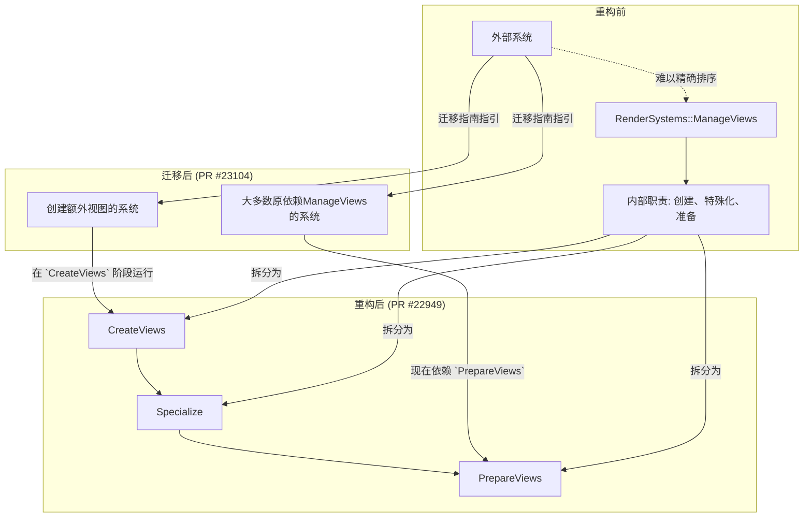

+++
title = "#23104 ManageViews migration guide"
date = "2026-02-22T00:00:00"
draft = false
template = "pull_request_page.html"
in_search_index = false

[extra]
current_language = "zh-cn"
available_languages = {"en" = { name = "English", url = "/pull_request/bevy/2026-02/pr-23104-en-20260222" }, "zh-cn" = { name = "中文", url = "/pull_request/bevy/2026-02/pr-23104-zh-cn-20260222" }}
labels = ["C-Docs", "A-Rendering", "M-Migration-Guide"]
+++

# Title
`ManageViews`迁移指南

## Basic Information
- **Title**: ManageViews migration guide
- **PR Link**: https://github.com/bevyengine/bevy/pull/23104
- **Author**: atlv24
- **Status**: MERGED
- **Labels**: C-Docs, A-Rendering, S-Ready-For-Final-Review, M-Migration-Guide
- **Created**: 2026-02-22T03:39:05Z
- **Merged**: 2026-02-22T04:37:37Z
- **Merged By**: alice-i-cecile

## Description Translation
### 目标 (Objective)
- #22949 引入了破坏性变更，但没有提供迁移指南

### 解决方案 (Solution)
- 添加一个迁移指南

### 测试 (Testing)
- 我真希望这不会破坏任何东西

## The Story of This Pull Request

在软件开发中，尤其是像Bevy这样的游戏引擎，引入破坏性变更(breaking changes)是框架演进过程中的常见部分。然而，一个负责任的变更不仅仅在于修改代码，更在于如何清晰地引导用户完成过渡。这就是PR #23104的故事核心：它本身不修改任何功能代码，而是为一个之前被遗漏的环节补上了关键的一块拼图——文档。

故事的起因是PR #22949。该PR对Bevy渲染系统的`RenderSystems::ManageViews`系统集(system set)进行了重构。这个系统集原本承担了创建视图(views)、特殊化(specialize)视图和准备(prepare)视图的多重职责。这种职责过载(overloaded with responsibility)的情况在复杂系统中很常见，它会导致一个直接问题：当其他开发者试图通过系统排序(system ordering)来确保他们的系统在特定阶段运行（例如，在视图创建之后但在视图准备之前）时，会产生顺序歧义(order ambiguities)。因为`ManageViews`作为一个整体单元，其内部执行流对外部系统来说是不透明的，难以精确定位插入点。

PR #22949的解决方案是将`ManageViews`拆分成三个更细粒度的、具有明确语义的阶段(phases)：
1.  `CreateViews`: 负责视图的初始创建。
2.  `Specialize`: 负责视图的特殊化处理。
3.  `PrepareViews`: 负责视图的最终准备工作。

这是一个典型的“关注点分离”(Separation of Concerns)和“单一职责原则”(Single Responsibility Principle)的应用。拆分后，每个阶段的职责清晰，外部系统可以更精确地指定执行顺序，从而解决了原有的排序歧义问题。

但是，PR #22949在实现这一架构改进后，遗漏了一个对用户至关重要的一环：它没有更新文档来指导用户如何迁移他们的现有代码。对于依赖了`ManageViews`系统集进行排序的用户来说，他们的代码在新版本中会因找不到`ManageViews`而编译失败，或者行为变得不确定。缺乏迁移指南会让升级过程变得困难和令人沮丧。

因此，PR #23104的作者atlv24创建了这个PR。其目的非常明确：为PR #22949引入的破坏性变更编写一份简洁而有效的迁移指南。整个PR只做了一件事：在`release-content/migration-guides/`目录下创建了一个名为`manage-views.md`的新文件。

这份指南的撰写体现了良好的技术文档实践。它首先用一行标题点明了核心变更：`RenderSystems::ManageViews`已被拆分为三个系统集。然后，通过`pull_requests: [22949]`元数据建立了与源头PR的直接链接，方便追溯。正文部分，它用两句话解释了变更的原因（职责过载、难以解决顺序歧义）和解决方案（拆分为三个阶段）。最重要的是，它提供了清晰的、可操作的迁移建议：
1.  **对于大多数情况**：如果你之前是将系统排序在`ManageViews`周围，那么现在很可能应该排序在`PrepareViews`周围，这将获得与之前相同的行为。这是一个直接、省心的替换建议。
2.  **对于特定情况**：如果你正在创建额外的视图（例如用于立方体贴图渲染），那么现在应该在`CreateViews`阶段进行。这为用户在新架构下进行特定开发指明了方向。

这份文档虽然简短，但直接命中要害，回答了用户升级时最可能遇到的两个问题：“我的旧代码怎么改？”和“我以后该怎么写新代码？”。它为一次成功的架构重构画上了圆满的句号，确保用户社区能够平滑过渡，从而真正发挥出架构改进的价值。

从工程实践来看，这个PR强调了文档作为软件交付物不可分割的一部分的重要性。代码的改进如果没有相应的文档支持，其价值会大打折扣，甚至可能因为用户的抵触或误用而带来负面效果。将“添加迁移指南”作为一个独立的PR提交，也符合代码审查和版本管理的良好习惯，使变更历史更加清晰。

## Visual Representation

此PR主要为文档变更。下图展示了`ManageViews`系统集拆分前后的职责变化，以及新的三个阶段为外部系统提供的更清晰的排序锚点。



## Key Files Changed

**唯一更改的文件**:
- `release-content/migration-guides/manage-views.md` (+9/-0)

这是一个新建的文件，因此没有“之前”的代码。文件内容完整地构成了本次PR的全部变更。

**文件内容与目的分析**:
```markdown
---
title: "`RenderSystems::ManageViews` has been split into three system sets"
pull_requests: [22949]
---

`ManageViews` was previously somewhat overloaded with responsibility, and made resolving render system order ambiguities difficult.
To amend this, it has been split into three phases: `CreateViews`, `Specialize`, and `PrepareViews`.
It is very likely whatever you were ordering against `ManageViews` can now be ordered against `PrepareViews` and have identical behavior.
If you are creating additional views, for example for cubemap rendering, please do so in `CreateViews`.
```
1.  **YAML Front Matter**:
    *   `title`: 清晰说明了变更内容。
    *   `pull_requests`: 链接到引入该变更的源PR #22949，提供了重要的上下文和追溯依据。

2.  **正文**:
    *   **第一句**：解释了变更的**原因**。`ManageViews`之前“职责过载”，导致渲染系统顺序歧义难以解决。这是对技术债务的承认。
    *   **第二句**：说明了变更的**解决方案**。将其拆分为三个明确的阶段。
    *   **第三句**：提供了**通用迁移路径**。这是对大多数用户最直接的指导，将旧的排序依赖`ManageViews`替换为`PrepareViews`，并保证行为一致。
    *   **第四句**：提供了**特定场景的迁移路径**。对于需要在渲染管线中创建新视图（如立方体贴图）的高级用户，明确指出了应在`CreateViews`阶段进行。这体现了文档对不同层次用户需求的考虑。

这个文件虽然只有9行，但它精准地填补了PR #22949留下的信息缺口，是确保该架构重构成功被用户采纳的关键一环。

## Further Reading

*   **Bevy官方文档 - 系统与系统集 (Systems and System Sets)**: 深入理解Bevy ECS中系统的执行、排序以及系统集的概念，是理解本次迁移背景的基础。
*   **PR #22949**: 直接阅读引入此次破坏性变更的原始PR，可以了解`ManageViews`被拆分的具体技术实现、讨论过程和决策理由。
*   **软件架构原则 - 单一职责原则 (Single Responsibility Principle)**: 了解这一原则有助于理解为何要将过载的`ManageViews`进行拆分，以及这种拆分在复杂软件系统中带来的长期好处。
*   **语义化版本控制 (SemVer) 与破坏性变更**: 了解SemVer规范下，主版本号升级与破坏性变更的关系，以及为何提供清晰的迁移指南是维护者的一项重要责任。

# Full Code Diff
diff --git a/release-content/migration-guides/manage-views.md b/release-content/migration-guides/manage-views.md
new file mode 100644
index 0000000000000..7f7b1c0c8cbb4
--- /dev/null
+++ b/release-content/migration-guides/manage-views.md
@@ -0,0 +1,9 @@
+---
+title: "`RenderSystems::ManageViews` has been split into three system sets"
+pull_requests: [22949]
+---
+
+`ManageViews` was previously somewhat overloaded with responsibility, and made resolving render system order ambiguities difficult.
+To amend this, it has been split into three phases: `CreateViews`, `Specialize`, and `PrepareViews`.
+It is very likely whatever you were ordering against `ManageViews` can now be ordered against `PrepareViews` and have identical behavior.
+If you are creating additional views, for example for cubemap rendering, please do so in `CreateViews`.