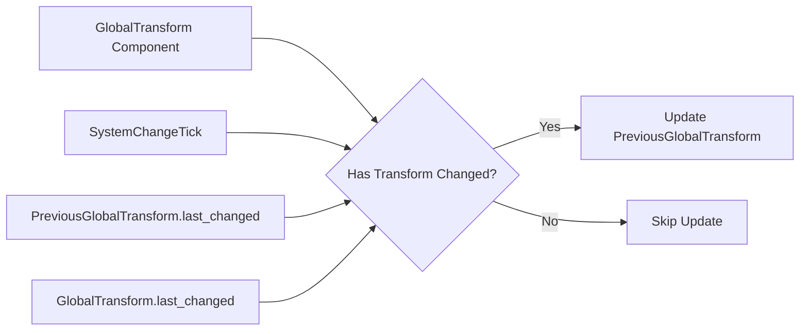

+++
title = "#23106 Only copy the current transform to the previous transform component if the latter is out of date."
date = "2026-02-24T00:00:00"
draft = false
template = "pull_request_page.html"
in_search_index = true

[taxonomies]
list_display = ["show"]

[extra]
current_language = "en"
available_languages = {"en" = { name = "English", url = "/pull_request/bevy/2026-02/pr-23106-en-20260224" }, "zh-cn" = { name = "中文", url = "/pull_request/bevy/2026-02/pr-23106-zh-cn-20260224" }}
labels = ["A-Rendering", "C-Performance", "D-Modest"]
+++

# Title

## Basic Information
- **Title**: Only copy the current transform to the previous transform component if the latter is out of date.
- **PR Link**: https://github.com/bevyengine/bevy/pull/23106
- **Author**: pcwalton
- **Status**: MERGED
- **Labels**: A-Rendering, C-Performance, S-Ready-For-Final-Review, D-Modest
- **Created**: 2026-02-22T05:11:05Z
- **Merged**: 2026-02-24T17:43:57Z
- **Merged By**: alice-i-cecile

## Description Translation
The `update_mesh_previous_global_transforms` system currently loops through every mesh and copies the current transform to the previous transform component. This becomes a bottleneck when scaling to large numbers of static entities. This PR changes the logic to instead only copy if the change tick of the transform is newer than the change tick of the previous transform.

On `many_cubes`, this commit improves the time spent in `update_mesh_previous_global_transforms` from 615 μs to 58.0 μs, a 10.6x speedup of that system.


## The Story of This Pull Request

This PR addresses a performance bottleneck in Bevy's rendering pipeline specifically affecting scenes with large numbers of static entities. The issue was in the `update_mesh_previous_global_transforms` system, which is part of the pre-pass processing for motion vectors and temporal anti-aliasing.

The problem stemmed from how the system handled previous transform updates. For every mesh entity with a `GlobalTransform` component, the system would unconditionally copy the current transform to the `PreviousGlobalTransform` component each frame. This operation occurred regardless of whether the transform had actually changed since the last frame. For static entities that never move, this resulted in unnecessary memory writes and CPU cycles being wasted on data that wasn't actually changing.

The original implementation used a simple approach: iterate through all qualifying meshes and update their previous transforms. This became problematic at scale because every static entity in the scene was processed every frame, even though their transforms remained constant. In large scenes with thousands of static objects, this system became a significant performance drain.

The solution leverages Bevy's change detection system, which tracks when components are modified. By using `Ref<GlobalTransform>` in the query instead of `&GlobalTransform`, we gain access to change tick information. The key insight is that we only need to update the previous transform when the current transform has actually changed since the previous frame.

The implementation introduces a conditional check based on change ticks. For each mesh, we compare:
- When the `GlobalTransform` was last changed
- When the `PreviousGlobalTransform` was last changed
- The current system change tick

If the transform's change tick is newer than the previous transform's change tick (accounting for system execution order), we perform the update. Otherwise, we skip it.

This approach has several advantages. First, it dramatically reduces CPU overhead for static entities since they're only processed once (when initially inserted) rather than every frame. Second, it maintains correctness for dynamic entities that actually need their previous transforms updated. Third, it integrates cleanly with Bevy's existing change detection infrastructure.

The performance improvement is substantial: a 10.6x speedup in the `update_mesh_previous_global_transforms` system on the `many_cubes` benchmark, reducing execution time from 615 μs to 58.0 μs. This improvement scales with the number of static entities in a scene, making it particularly valuable for large, complex environments.

The implementation also simplifies the early exit condition by directly checking if any camera is active and returning early if not, removing the intermediate `should_run` variable.

## Visual Representation



## Key Files Changed

### `crates/bevy_pbr/src/prepass/mod.rs` (+16/-10)

This file contains the `update_mesh_previous_global_transforms` system, which was modified to optimize previous transform updates. The changes implement conditional copying based on change detection ticks.

**Key modifications:**

1. **Query signature change**: The meshes query now uses `Ref<GlobalTransform>` instead of `&GlobalTransform` to access change detection information.

```rust
// Before:
mut meshes: Query<(&GlobalTransform, &mut PreviousGlobalTransform), PreviousMeshFilter>,

// After:
mut meshes: Query<(Ref<GlobalTransform>, &mut PreviousGlobalTransform), PreviousMeshFilter>,
```

2. **System parameter addition**: Added `SystemChangeTick` parameter to get the current system execution tick for comparison.

```rust
// Before:
pub fn update_mesh_previous_global_transforms(
    mut commands: Commands,
    views: Query<&Camera, With<Camera3d>>,
    new_meshes: Query<
        (Entity, &GlobalTransform),
        (PreviousMeshFilter, Without<PreviousGlobalTransform>),
    >,
    mut meshes: Query<(&GlobalTransform, &mut PreviousGlobalTransform), PreviousMeshFilter>,
) {

// After:
pub fn update_mesh_previous_global_transforms(
    mut commands: Commands,
    views: Query<&Camera, With<Camera3d>>,
    new_meshes: Query<
        (Entity, &GlobalTransform),
        (PreviousMeshFilter, Without<PreviousGlobalTransform>),
    >,
    mut meshes: Query<(Ref<GlobalTransform>, &mut PreviousGlobalTransform), PreviousMeshFilter>,
    system_change_tick: SystemChangeTick,
) {
```

3. **Update logic change**: Replaced unconditional updating with conditional updating based on change ticks.

```rust
// Before:
meshes.par_iter_mut().for_each(|(transform, mut previous)| {
    previous.set_if_neq(PreviousGlobalTransform(transform.affine()));
});

// After:
meshes.par_iter_mut().for_each(|(transform, mut previous)| {
    if transform
        .last_changed()
        .is_newer_than(previous.last_changed(), system_change_tick.this_run())
    {
        *previous = PreviousGlobalTransform(transform.affine());
    }
});
```

4. **Early return simplification**: Simplified the early exit condition when no camera is active.

```rust
// Before:
let should_run = views.iter().any(|camera| camera.is_active);

if should_run {
    // ... rest of function
}

// After:
if !views.iter().any(|camera| camera.is_active) {
    return;
}
// ... rest of function
```

These changes work together to significantly reduce CPU overhead by skipping unnecessary updates for static entities while maintaining correct behavior for dynamic ones.

## Further Reading

1. **Bevy Change Detection Documentation**: Understanding how Bevy tracks component changes is fundamental to this optimization.
2. **Bevy ECS System Scheduling**: The relationship between system change ticks and component change tracking.
3. **Temporal Anti-Aliasing (TAA)**: The rendering technique that uses previous frame data, which is why previous transforms are needed.
4. **Motion Vectors in Computer Graphics**: How previous and current transforms are used to calculate per-pixel motion.
5. **Performance Optimization Patterns**: The broader category of techniques for avoiding unnecessary work in game engines.