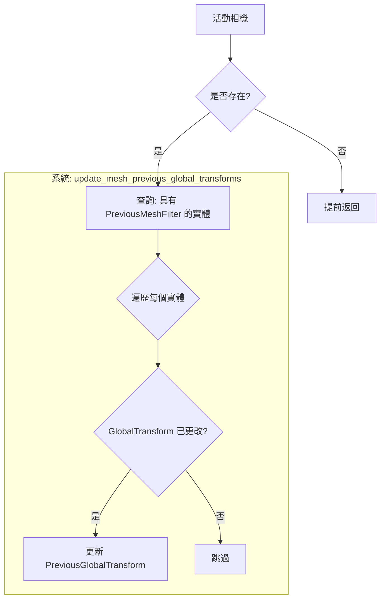

+++
title = "#23106"
date = "2026-02-24T00:00:00"
draft = false
template = "pull_request_page.html"
in_search_index = false

[extra]
current_language = "zh-cn"
available_languages = {"en" = { name = "English", url = "/pull_request/bevy/2026-02/pr-23106-en-20260224" }, "zh-cn" = { name = "中文", url = "/pull_request/bevy/2026-02/pr-23106-zh-cn-20260224" }}
+++

# Title
**仅在上一个变换组件过期时才将当前变换复制到上一个变换组件**

## 基本資訊
- **標題**: Only copy the current transform to the previous transform component if the latter is out of date.
- **PR 連結**: https://github.com/bevyengine/bevy/pull/23106
- **作者**: pcwalton
- **狀態**: 已合併
- **標籤**: A-Rendering, C-Performance, S-Ready-For-Final-Review, D-Modest
- **創建時間**: 2026-02-22T05:11:05Z
- **合併時間**: 2026-02-24T17:43:57Z
- **合併者**: alice-i-cecile

## 描述翻譯
`update_mesh_previous_global_transforms` 系統目前會遍歷每個網格，並將當前變換複製到上一個變換組件。當擴展到大量靜態實體時，這會成為效能瓶頸。這個 PR 將邏輯更改為僅在變換的更改標記比上一個變換的更改標記更新時才進行複製。

在 `many_cubes` 場景中，這個提交將 `update_mesh_previous_global_transforms` 中花費的時間從 615 微秒改進到 58.0 微秒，該系統的速度提升了 10.6 倍。


## 這個 Pull Request 的故事

這個 PR 的核心是一個直接的效能最佳化。在 Bevy 的渲染管線中，有一個系統負責維護每個網格實體的上一個全域變換（`PreviousGlobalTransform`）。這個資料對於需要運動向量（motion vectors）的效果（例如時間性反鋸齒、運動模糊）至關重要，因為它需要知道物體在上一幀的位置來計算其運動。

**問題的根源**在於，原來的實現無論變換是否實際發生變化，都會為每個帶有 `PreviousMeshFilter` 標記的實體複製變換。這在許多實體保持靜態（即它們的變換不改變）的場景中會造成不必要的開銷。系統會對每個靜態實體執行相同的複製操作，每一幀都是如此，這浪費了 CPU 週期。

**解決方案**利用了 Bevy 的 ECS（實體組件系統）架構中內建的更改檢測機制。每個組件都帶有一個「更改標記」（change tick），它會記錄該組件最後一次被修改的時間。關鍵的洞察是：只有在當前 `GlobalTransform` 的更改標記比 `PreviousGlobalTransform` 的更改標記更新時，我們才需要更新 `PreviousGlobalTransform`。如果 `GlobalTransform` 自從上一次複製後沒有改變，那麼 `PreviousGlobalTransform` 已經持有正確的值（即上一幀的變換，也就是與當前幀相同的靜態變換）。

**實現細節**體現在對 `update_mesh_previous_global_transforms` 系統的修改中。查詢從 `(&GlobalTransform, &mut PreviousGlobalTransform)` 更改為 `(Ref<GlobalTransform>, &mut PreviousGlobalTransform)`。`Ref<T>` 是一個 wrapper，它允許存取組件的更改標記。然後，在平行迭代中，系統會進行檢查：

```rust
if transform
    .last_changed()
    .is_newer_than(previous.last_changed(), system_change_tick.this_run())
{
    *previous = PreviousGlobalTransform(transform.affine());
}
```

這段邏輯的意思是：如果 `GlobalTransform` 的上次更改時間在 `PreviousGlobalTransform` 的上次更改時間之後（同時考慮到系統當前的運行標記），則進行更新。否則，跳過這個實體。

這是一個典型的最佳化模式：將一個「無條件寫入」的操作轉換為一個「條件寫入」的操作，從而避免冗餘工作。在 `many_cubes` 這樣的基準測試中，大部分立方體都是靜態的，這導致了大幅的效能提升（從 615 微秒降至 58 微秒）。效能提升的確切倍數取決於場景中靜態實體與動態實體的比例。

此外，PR 還進行了一個小的重構：將原先使用布林變數 `should_run` 並在條件內執行循環的邏輯，改為在沒有活動相機時提前返回。這是一個更清晰的程式碼組織方式。

**技術要點**在於理解 `Ref<T>` 和更改標記的用法。`system_change_tick.this_run()` 提供了當前系統執行的「時間點」，用於在跨幀比較更改標記時處理 wrap-around 問題。`is_newer_than` 方法會安全地處理這些比較。

總的來說，這是一個針對特定瓶頸的精確、高效的效能最佳化。它沒有改變系統的行為，只是讓它在靜態實體佔多數的常見情況下執行得更快。這種模式——利用 ECS 的更改檢測來避免冗餘工作——在 Bevy 和其他遊戲引擎的系統程式設計中是一個有用的技巧。

## 視覺化表示



## 關鍵檔案變更

### `crates/bevy_pbr/src/prepass/mod.rs` (+16/-10)

這個檔案包含了 `update_mesh_previous_global_transforms` 系統的實現，這是本 PR 唯一修改的函式。

**變更摘要**：修改了該系統，僅在當前變換自上次複製後發生更改時，才將當前 `GlobalTransform` 複製到 `PreviousGlobalTransform` 組件中，從而避免了對靜態實體的冗餘複製操作。

**關鍵程式碼變更**：

```rust
// 修改前:
pub fn update_mesh_previous_global_transforms(
    // ...
    mut meshes: Query<(&GlobalTransform, &mut PreviousGlobalTransform), PreviousMeshFilter>,
) {
    let should_run = views.iter().any(|camera| camera.is_active);

    if should_run {
        // ... 新增網格的邏輯 ...
        meshes.par_iter_mut().for_each(|(transform, mut previous)| {
            previous.set_if_neq(PreviousGlobalTransform(transform.affine()));
        });
    }
}

// 修改後:
pub fn update_mesh_previous_global_transforms(
    // ...
    mut meshes: Query<(Ref<GlobalTransform>, &mut PreviousGlobalTransform), PreviousMeshFilter>,
    system_change_tick: SystemChangeTick,
) {
    if !views.iter().any(|camera| camera.is_active) {
        return;
    }

    // ... 新增網格的邏輯 ...
    meshes.par_iter_mut().for_each(|(transform, mut previous)| {
        if transform
            .last_changed()
            .is_newer_than(previous.last_changed(), system_change_tick.this_run())
        {
            *previous = PreviousGlobalTransform(transform.affine());
        }
    });
}
```

**關聯性**：這個變更直接實現了 PR 描述中的最佳化。將查詢改為使用 `Ref<GlobalTransform>` 以啟用更改檢測，並添加條件判斷，這些是提升效能的關鍵。

## 延伸閱讀

1.  **Bevy 官方文件 - 更改檢測**：
    - https://bevyengine.org/learn/quick-start/change-detection/
    - 解釋了 Bevy 中 `Res<T>`、`Ref<T>` 和更改標記的工作原理。

2.  **運動向量與時間性渲染**：
    - 《Real-Time Rendering, 4th Edition》中關於時間性反鋸齒和運動模糊的章節。
    - 理解為何需要 `PreviousGlobalTransform` 來計算像素在上一幀中的位置。

3.  **ECS 模式與效能**：
    - 關於資料導向設計和實體組件系統模式的資料，可以幫助理解為何這種條件更新在 ECS 架構中特別有效。

4.  **Rust 與平行迭代**：
    - `par_iter_mut()` 是 Rayon crate 提供的平行迭代器。了解平行迭代可以幫助理解系統如何高效地處理大量實體。