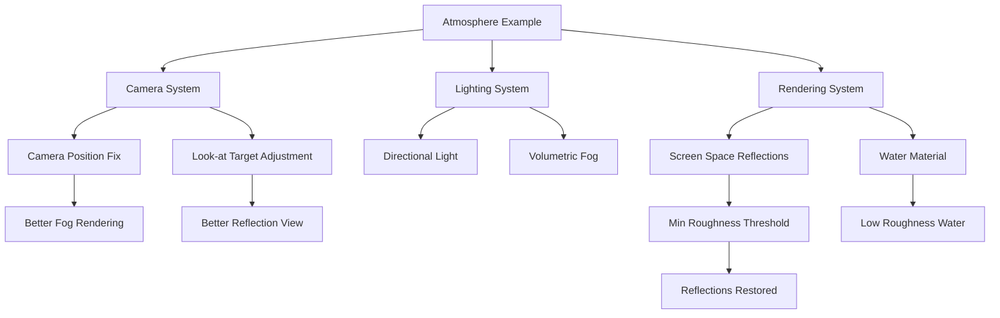

+++
title = "#23121 Update atmosphere example fix reflection"
date = "2026-02-24T00:00:00"
draft = false
template = "pull_request_page.html"
in_search_index = true

[taxonomies]
list_display = ["show"]

[extra]
current_language = "en"
available_languages = {"en" = { name = "English", url = "/pull_request/bevy/2026-02/pr-23121-en-20260224" }, "zh-cn" = { name = "中文", url = "/pull_request/bevy/2026-02/pr-23121-zh-cn-20260224" }}
labels = ["D-Trivial", "A-Rendering", "C-Examples", "M-Deliberate-Rendering-Change"]
+++

# Title
Update atmosphere example fix reflection

## Basic Information
- **Title**: Update atmosphere example fix reflection
- **PR Link**: https://github.com/bevyengine/bevy/pull/23121
- **Author**: mate-h
- **Status**: MERGED
- **Labels**: D-Trivial, A-Rendering, C-Examples, S-Ready-For-Final-Review, M-Deliberate-Rendering-Change
- **Created**: 2026-02-23T18:42:30Z
- **Merged**: 2026-02-24T03:08:28Z
- **Merged By**: alice-i-cecile

## Description Translation

# Objective

- The atmosphere example had no reflections since PR #22379 , I wanted to fix this
- Got feedback from pcwalton@ that the spheres need to be removed. These are no longer needed to test generated environment map lighting since that also shows up in the water. 
- Placed the camera lower such that the volumetric lighting renders correctly and you can see more of the reflection.

## Solution

- Updated atmosphere example. 

## Testing

- Ran atmosphere example with the proper feature flags (bluenoise_texture)

---

## Showcase

Before: no reflection, spheres, no "orange glow" in the volumetric fog towards the top face of the fog volume cuboid. This is likely a bug in the fog volume rendering depending on the camera angle.


After


## The Story of This Pull Request

This PR addresses a regression in the atmosphere example that occurred after PR #22379. The main issue was that screen-space reflections were no longer visible, making the example less effective at demonstrating the rendering system's capabilities.

The developer identified that the default `ScreenSpaceReflections` configuration was preventing reflections from appearing. Specifically, the `min_perceptual_roughness` setting was filtering out reflections on surfaces with low roughness values. The water material in this example has a very low roughness to create realistic water reflections, but the default minimum perceptual roughness of 0.089 prevented these reflections from rendering.

The solution involved two key changes. First, the developer modified the `ScreenSpaceReflections` component to set `min_perceptual_roughness: 0.0..0.0`, ensuring that even perfectly smooth surfaces would show reflections. This restored the visual feedback that demonstrates how environment map lighting interacts with reflective surfaces.

Second, the developer removed two demonstration spheres that were previously used to test generated environment map lighting. After receiving feedback that these spheres were redundant (since the water surface already demonstrates environment map lighting), they were removed to simplify the example. This cleanup also involved removing the `CascadeShadowConfigBuilder` import and related configuration since cascade shadow maps weren't critical for demonstrating the atmosphere system.

The camera positioning was also adjusted from `(-2.4, 0.04, 0.0)` to `(-2.8, 0.045, 0.0)` and changed to look at `Vec3::ZERO` instead of `Vec3::Y * 0.1`. This positioning change addresses two issues: it improves the volumetric fog rendering (fixing a bug where the orange glow was missing from certain camera angles) and provides a better view of the water reflections.

The changes demonstrate practical understanding of Bevy's rendering system, specifically how screen-space reflections interact with material properties. The fix is minimal and targeted, addressing the specific regression without introducing unnecessary complexity. By removing the redundant spheres, the example becomes more focused on demonstrating the atmosphere and volumetric lighting systems rather than serving multiple demonstration purposes.

## Technical Insights

The key technical insight here relates to how Bevy's screen-space reflections system works with material roughness. Screen-space reflections use a roughness threshold to determine which surfaces should receive reflections - this optimization prevents computing reflections for surfaces that are too rough to show clear reflections. However, when this threshold is set too high (like the default 0.089), it can filter out legitimate reflections on smooth surfaces.

The water material in this example uses an extension material with a low perceptual roughness, which was being filtered out by the default SSR settings. By explicitly setting `min_perceptual_roughness: 0.0..0.0`, the developer ensures that all surfaces, regardless of roughness, are considered for screen-space reflections.

This change also highlights an important consideration for example code: examples should demonstrate features effectively, even if that means using non-default configurations. The default SSR settings might be appropriate for most games, but for a technical demonstration of atmospheric rendering with reflective water, the stricter reflection criteria are necessary.

## Visual Representation



## Key Files Changed

- `examples/3d/atmosphere.rs` (+6/-38)

### Changes Overview

The PR makes several targeted changes to restore functionality and improve the example's focus:

1. **Camera positioning and SSR configuration**: The camera was repositioned to fix volumetric fog rendering and improve the reflection view. The SSR component was configured to allow reflections on smooth surfaces.

2. **Removal of redundant demonstration elements**: The light probe spheres and cascade shadow configuration were removed since they were no longer needed to demonstrate the core atmospheric rendering features.

### Key Code Changes

```rust
// File: examples/3d/atmosphere.rs
// Before camera setup:
Transform::from_xyz(-2.4, 0.04, 0.0).looking_at(Vec3::Y * 0.1, Vec3::Y),

// After camera setup:
Transform::from_xyz(-2.8, 0.045, 0.0).looking_at(Vec3::ZERO, Vec3::Y),

// Before SSR configuration:
ScreenSpaceReflections::default(),

// After SSR configuration:
ScreenSpaceReflections {
    min_perceptual_roughness: 0.0..0.0,
    ..default()
},
```

```rust
// Removed code (spheres and cascade shadow config):
// The entire section creating two demonstration spheres was removed:
let sphere_mesh = meshes.add(Mesh::from(Sphere { radius: 1.0 }));

// light probe spheres
commands.spawn((
    Mesh3d(sphere_mesh.clone()),
    // ... material and transform setup
));

// Also removed from directional light:
cascade_shadow_config,
```

## Further Reading

1. Bevy Screen Space Reflections Documentation: https://docs.rs/bevy/latest/bevy/core_pipeline/prepass/struct.ScreenSpaceReflections.html
2. Bevy Atmosphere System: https://docs.rs/bevy/latest/bevy/pbr/struct.Atmosphere.html
3. PR #22379 (the change that introduced the regression): Link to the PR that affected reflections
4. Bevy Material System: https://docs.rs/bevy/latest/bevy/pbr/struct.StandardMaterial.html
5. Volumetric Lighting in Bevy: https://docs.rs/bevy/latest/bevy/pbr/struct.VolumetricFog.html

# Full Code Diff
```
diff --git a/examples/3d/atmosphere.rs b/examples/3d/atmosphere.rs
index c392b983aa5e4..6cf920aa3907b 100644
--- a/examples/3d/atmosphere.rs
+++ b/examples/3d/atmosphere.rs
@@ -15,7 +15,7 @@ use bevy::{
     input::keyboard::KeyCode,
     light::{
         atmosphere::ScatteringMedium, light_consts::lux, Atmosphere, AtmosphereEnvironmentMapLight,
-        CascadeShadowConfigBuilder, FogVolume, VolumetricFog, VolumetricLight,
+        FogVolume, VolumetricFog, VolumetricLight,
     },
     pbr::{
         AtmosphereMode, AtmosphereSettings, DefaultOpaqueRendererMethod, ExtendedMaterial,
@@ -104,7 +104,7 @@ fn setup_camera_fog(
 ) {
     commands.spawn((
         Camera3d::default(),
-        Transform::from_xyz(-2.4, 0.04, 0.0).looking_at(Vec3::Y * 0.1, Vec3::Y),
+        Transform::from_xyz(-2.8, 0.045, 0.0).looking_at(Vec3::ZERO, Vec3::Y),
         // Earthlike atmosphere
         Atmosphere::earthlike(scattering_mediums.add(ScatteringMedium::default())),
         // Can be adjusted to change the scene scale and rendering quality
@@ -129,7 +129,10 @@ fn setup_camera_fog(
         },
         Msaa::Off,
         TemporalAntiAliasing::default(),
-        ScreenSpaceReflections::default(),
+        ScreenSpaceReflections {
+            min_perceptual_roughness: 0.0..0.0,
+            ..default()
+        },
     ));
 }
 
@@ -172,18 +175,9 @@ impl MaterialExtension for Water {
 fn setup_terrain_scene(
     mut commands: Commands,
     mut meshes: ResMut<Assets<Mesh>>,
-    mut materials: ResMut<Assets<StandardMaterial>>,
     mut water_materials: ResMut<Assets<ExtendedMaterial<StandardMaterial, Water>>>,
     asset_server: Res<AssetServer>,
 ) {
-    // Configure a properly scaled cascade shadow map for this scene (defaults are too large, mesh units are in km)
-    let cascade_shadow_config = CascadeShadowConfigBuilder {
-        first_cascade_far_bound: 0.3,
-        maximum_distance: 15.0,
-        ..default()
-    }
-    .build();
-
     // Sun
     commands.spawn((
         DirectionalLight {
@@ -198,7 +192,6 @@ fn setup_terrain_scene(
         },
         Transform::from_xyz(1.0, 0.4, 0.0).looking_at(Vec3::ZERO, Vec3::Y),
         VolumetricLight,
-        cascade_shadow_config,
     ));
 
     // spawn the fog volume
@@ -207,31 +200,6 @@ fn setup_terrain_scene(
         Transform::from_scale(Vec3::new(10.0, 1.0, 10.0)).with_translation(Vec3::Y * 0.5),
     ));
 
-    let sphere_mesh = meshes.add(Mesh::from(Sphere { radius: 1.0 }));
-
-    // light probe spheres
-    commands.spawn((
-        Mesh3d(sphere_mesh.clone()),
-        MeshMaterial3d(materials.add(StandardMaterial {
-            base_color: Color::WHITE,
-            metallic: 1.0,
-            perceptual_roughness: 0.0,
-            ..default()
-        })),
-        Transform::from_xyz(-1.0, 0.1, -0.1).with_scale(Vec3::splat(0.05)),
-    ));
-
-    commands.spawn((
-        Mesh3d(sphere_mesh.clone()),
-        MeshMaterial3d(materials.add(StandardMaterial {
-            base_color: Color::WHITE,
-            metallic: 0.0,
-            perceptual_roughness: 1.0,
-            ..default()
-        })),
-        Transform::from_xyz(-1.0, 0.1, 0.1).with_scale(Vec3::splat(0.05)),
-    ));
-
     // Terrain
     commands.spawn((
         Terrain,
```