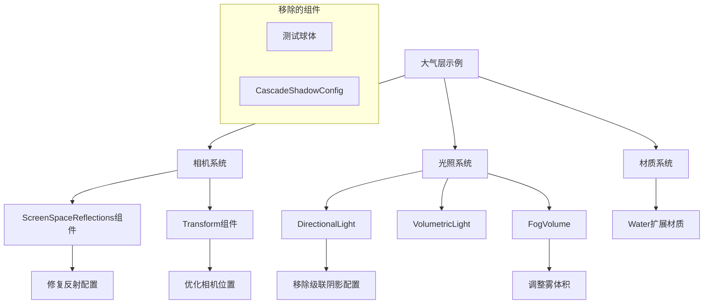

+++
title = "#23121 Update atmosphere example fix reflection"
date = "2026-02-24T00:00:00"
draft = false
template = "pull_request_page.html"
in_search_index = false

[extra]
current_language = "zh-cn"
available_languages = {"en" = { name = "English", url = "/pull_request/bevy/2026-02/pr-23121-en-20260224" }, "zh-cn" = { name = "中文", url = "/pull_request/bevy/2026-02/pr-23121-zh-cn-20260224" }}
+++

# Update atmosphere example fix reflection

## 基本信息
- **标题**: Update atmosphere example fix reflection
- **PR链接**: https://github.com/bevyengine/bevy/pull/23121
- **作者**: mate-h
- **状态**: 已合并
- **标签**: D-Trivial, A-Rendering, C-Examples, S-Ready-For-Final-Review, M-Deliberate-Rendering-Change
- **创建时间**: 2026-02-23T18:42:30Z
- **合并时间**: 2026-02-24T03:08:28Z
- **合并者**: alice-i-cecile

## 描述翻译

### 目标
- 自从 PR #22379 之后，大气层（atmosphere）示例就没有反射效果了，我需要修复这个问题。
- 收到 pcwalton@ 的反馈，需要移除球体（spheres）。这些球体原本用于测试生成的环境贴图光照，但由于环境光照也会显示在水中，所以不再需要。
- 降低相机位置，使体积光照（volumetric lighting）正确渲染，并且能看到更多反射。

### 解决方案
- 更新大气层示例。

### 测试
- 使用正确的特性标志（bluenoise_texture）运行大气层示例。

---

### 展示

之前：没有反射，有球体，雾体积立方体顶部朝向没有"橙色辉光"（orange glow）。这可能是雾体积渲染中依赖相机角度的一个bug。


之后


## 此Pull Request的故事

这个PR修复了Bevy引擎中大气层示例的一个回归问题。问题出现在之前的PR #22379之后，示例中的反射效果完全消失。作者mate-h不仅修复了反射问题，还根据社区反馈对示例进行了优化。

### 问题与上下文
问题的核心是大气层示例的反射系统失效。在之前的PR中，可能是渲染系统的改动意外影响了示例的屏幕空间反射（Screen Space Reflections, SSR）配置。此外，示例中还保留了一些不再必要的测试对象（两个金属球体），这些球体原本用于展示环境贴图光照，但在当前实现中，环境光照同样会作用于水面，使得这些球体变得多余。

从技术角度看，这个问题影响了示例的教育价值。大气层示例旨在展示Bevy的体积大气、体积雾和高级渲染特性，缺少反射效果会减弱展示效果。反射是演示水面材质和环境交互的重要部分。

### 解决方案方法
作者采取了多重方法来解决这个问题：

1. **修复反射配置**：调整了`ScreenSpaceReflections`组件的参数，确保最小感知粗糙度（min_perceptual_roughness）设置为0，这样即使是完全光滑的表面（如水）也能产生反射。

2. **移除冗余对象**：删除了两个用于环境贴图测试的球体，简化了场景，同时保持了示例的展示价值。

3. **优化相机位置**：调整了相机位置和朝向，使体积光照效果更加明显，并提供了更好的视角来观察反射效果。

4. **清理代码**：移除了不再需要的级联阴影配置（cascade shadow config）代码。

### 实现细节
关键的改动集中在相机设置和场景构建上。最显著的改变是`ScreenSpaceReflections`的配置：

```rust
// 之前：
ScreenSpaceReflections::default(),

// 之后：
ScreenSpaceReflections {
    min_perceptual_roughness: 0.0..0.0,
    ..default()
},
```

这个改动确保了反射系统不会因为材质粗糙度阈值而过滤掉水面的反射。在默认配置中，可能存在一个非零的最小粗糙度阈值，这会导致完全光滑的表面无法产生屏幕空间反射。

相机位置的调整也很重要：
```rust
// 之前：
Transform::from_xyz(-2.4, 0.04, 0.0).looking_at(Vec3::Y * 0.1, Vec3::Y),

// 之后：
Transform::from_xyz(-2.8, 0.045, 0.0).looking_at(Vec3::ZERO, Vec3::Y),
```

这个调整将相机稍微后移并升高了一点，同时调整了观察目标。这样做有两个效果：提供了更广的视野来观察整个场景，并且优化了体积雾的渲染角度，避免了之前可能存在的渲染伪影（即描述中提到的"橙色辉光"问题）。

### 技术洞察
这个PR展示了几个重要的渲染概念：

1. **屏幕空间反射的粗糙度控制**：在基于物理的渲染（PBR）系统中，粗糙度（roughness）决定了表面的微观细节程度。完全光滑的表面（粗糙度为0）会产生清晰的镜面反射。通过设置`min_perceptual_roughness`为0..0，我们确保即使是完全光滑的表面也能参与屏幕空间反射计算。

2. **示例的演进化**：随着渲染系统的改进，示例代码也需要相应更新。这里移除的球体原本是为了展示环境贴图（environment map）光照，但随着渲染管线的改进，同样的效果现在可以通过水面材质更好地展示，体现了代码演进的典型模式。

3. **体积渲染的视角依赖**：体积效果（如体积雾）的渲染质量可能依赖于视角和相机位置。调整相机位置不仅改善了视觉效果，还可能解决了特定角度的渲染bug。

### 影响
这些改动虽然不大，但对示例的质量有明显提升：

1. **恢复了核心功能**：反射效果重新出现在示例中，完整展示了Bevy的渲染能力。

2. **简化了示例代码**：移除了38行代码，只增加了6行，使示例更加简洁、聚焦。

3. **改善了视觉效果**：调整后的相机位置提供了更好的展示视角，体积雾的效果更加自然。

4. **保持了向后兼容**：所有改动都是示例层面的，不影响引擎核心功能。

这个PR也是一个很好的例子，展示了如何维护示例代码：不仅要修复bug，还要考虑示例的教育目的和代码的简洁性。

## 可视化表示



## 关键文件更改

### `examples/3d/atmosphere.rs` (+6/-38)

这是本次PR中唯一修改的文件，包含了大气层示例的所有改动。

**主要更改和原因：**
1. **修复屏幕空间反射配置** - 确保水面能正确反射
2. **移除测试球体和级联阴影配置** - 简化示例，移除冗余代码
3. **调整相机位置** - 改善视觉效果和体积雾渲染
4. **调整雾体积** - 优化场景布局

**关键代码片段：**

```rust
// 相机设置的变化
// 之前：
Transform::from_xyz(-2.4, 0.04, 0.0).looking_at(Vec3::Y * 0.1, Vec3::Y),
// 屏幕空间反射使用默认配置
ScreenSpaceReflections::default(),

// 之后：
Transform::from_xyz(-2.8, 0.045, 0.0).looking_at(Vec3::ZERO, Vec3::Y),
// 显式配置最小粗糙度范围
ScreenSpaceReflections {
    min_perceptual_roughness: 0.0..0.0,
    ..default()
},
```

```rust
// 移除的测试球体代码（之前存在）
let sphere_mesh = meshes.add(Mesh::from(Sphere { radius: 1.0 }));

// light probe spheres
commands.spawn((
    Mesh3d(sphere_mesh.clone()),
    MeshMaterial3d(materials.add(StandardMaterial {
        base_color: Color::WHITE,
        metallic: 1.0,
        perceptual_roughness: 0.0,
        ..default()
    })),
    Transform::from_xyz(-1.0, 0.1, -0.1).with_scale(Vec3::splat(0.05)),
));

commands.spawn((
    Mesh3d(sphere_mesh.clone()),
    MeshMaterial3d(materials.add(StandardMaterial {
        base_color: Color::WHITE,
        metallic: 0.0,
        perceptual_roughness: 1.0,
        ..default()
    })),
    Transform::from_xyz(-1.0, 0.1, 0.1).with_scale(Vec3::splat(0.05)),
));
```

```rust
// 移除的级联阴影配置代码（之前存在）
// Configure a properly scaled cascade shadow map for this scene (defaults are too large, mesh units are in km)
let cascade_shadow_config = CascadeShadowConfigBuilder {
    first_cascade_far_bound: 0.3,
    maximum_distance: 15.0,
    ..default()
}
.build();

// 以及在DirectionalLight中移除了：
cascade_shadow_config,
```

这些更改共同作用，修复了示例的反射问题，同时简化了代码结构，使示例更加清晰和专注。

## 延伸阅读

对于想要深入了解相关概念的开发者：

1. **Bevy屏幕空间反射文档**：
   - https://docs.rs/bevy/latest/bevy/core_pipeline/prepass/struct.ScreenSpaceReflections.html

2. **体积渲染技术**：
   - Bevy中的体积雾（Volumetric Fog）和体积光（Volumetric Light）实现
   - 大气散射（Atmospheric Scattering）原理

3. **基于物理的渲染（PBR）**：
   - 粗糙度（Roughness）和金属度（Metallic）在PBR中的作用
   - 环境光遮蔽和反射的重要性

4. **示例代码维护最佳实践**：
   - 保持示例简洁、专注
   - 及时移除过时的演示代码
   - 确保示例反映当前引擎的最佳实践

# Full Code Diff
diff --git a/examples/3d/atmosphere.rs b/examples/3d/atmosphere.rs
index c392b983aa5e4..6cf920aa3907b 100644
--- a/examples/3d/atmosphere.rs
+++ b/examples/3d/atmosphere.rs
@@ -15,7 +15,7 @@ use bevy::{
     input::keyboard::KeyCode,
     light::{
         atmosphere::ScatteringMedium, light_consts::lux, Atmosphere, AtmosphereEnvironmentMapLight,
-        CascadeShadowConfigBuilder, FogVolume, VolumetricFog, VolumetricLight,
+        FogVolume, VolumetricFog, VolumetricLight,
     },
     pbr::{
         AtmosphereMode, AtmosphereSettings, DefaultOpaqueRendererMethod, ExtendedMaterial,
@@ -104,7 +104,7 @@ fn setup_camera_fog(
 ) {
     commands.spawn((
         Camera3d::default(),
-        Transform::from_xyz(-2.4, 0.04, 0.0).looking_at(Vec3::Y * 0.1, Vec3::Y),
+        Transform::from_xyz(-2.8, 0.045, 0.0).looking_at(Vec3::ZERO, Vec3::Y),
         // Earthlike atmosphere
         Atmosphere::earthlike(scattering_mediums.add(ScatteringMedium::default())),
         // Can be adjusted to change the scene scale and rendering quality
@@ -129,7 +129,10 @@ fn setup_camera_fog(
         },
         Msaa::Off,
         TemporalAntiAliasing::default(),
-        ScreenSpaceReflections::default(),
+        ScreenSpaceReflections {
+            min_perceptual_roughness: 0.0..0.0,
+            ..default()
+        },
     ));
 }
 
@@ -172,18 +175,9 @@ impl MaterialExtension for Water {
 fn setup_terrain_scene(
     mut commands: Commands,
     mut meshes: ResMut<Assets<Mesh>>,
-    mut materials: ResMut<Assets<StandardMaterial>>,
     mut water_materials: ResMut<Assets<ExtendedMaterial<StandardMaterial, Water>>>,
     asset_server: Res<AssetServer>,
 ) {
-    // Configure a properly scaled cascade shadow map for this scene (defaults are too large, mesh units are in km)
-    let cascade_shadow_config = CascadeShadowConfigBuilder {
-        first_cascade_far_bound: 0.3,
-        maximum_distance: 15.0,
-        ..default()
-    }
-    .build();
-
     // Sun
     commands.spawn((
         DirectionalLight {
@@ -198,7 +192,6 @@ fn setup_terrain_scene(
         },
         Transform::from_xyz(1.0, 0.4, 0.0).looking_at(Vec3::ZERO, Vec3::Y),
         VolumetricLight,
-        cascade_shadow_config,
     ));
 
     // spawn the fog volume
@@ -207,31 +200,6 @@ fn setup_terrain_scene(
         Transform::from_scale(Vec3::new(10.0, 1.0, 10.0)).with_translation(Vec3::Y * 0.5),
     ));
 
-    let sphere_mesh = meshes.add(Mesh::from(Sphere { radius: 1.0 }));
-
-    // light probe spheres
-    commands.spawn((
-        Mesh3d(sphere_mesh.clone()),
-        MeshMaterial3d(materials.add(StandardMaterial {
-            base_color: Color::WHITE,
-            metallic: 1.0,
-            perceptual_roughness: 0.0,
-            ..default()
-        })),
-        Transform::from_xyz(-1.0, 0.1, -0.1).with_scale(Vec3::splat(0.05)),
-    ));
-
-    commands.spawn((
-        Mesh3d(sphere_mesh.clone()),
-        MeshMaterial3d(materials.add(StandardMaterial {
-            base_color: Color::WHITE,
-            metallic: 0.0,
-            perceptual_roughness: 1.0,
-            ..default()
-        })),
-        Transform::from_xyz(-1.0, 0.1, 0.1).with_scale(Vec3::splat(0.05)),
-    ));
-
     // Terrain
     commands.spawn((
         Terrain,