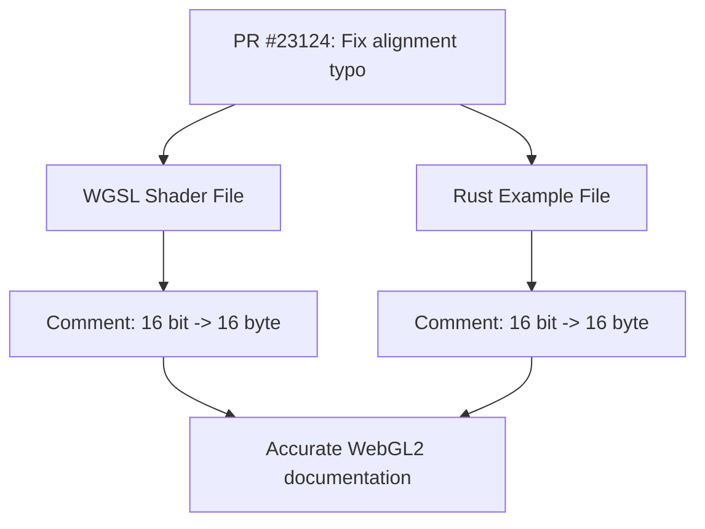

+++
title = "#23124 Fix 16 byte alignment typo (WebGL 2: 16 bit -> 16 byte)"
date = "2026-02-24T00:00:00"
draft = false
template = "pull_request_page.html"
in_search_index = true

[taxonomies]
list_display = ["show"]

[extra]
current_language = "en"
available_languages = {"en" = { name = "English", url = "/pull_request/bevy/2026-02/pr-23124-en-20260224" }, "zh-cn" = { name = "中文", url = "/pull_request/bevy/2026-02/pr-23124-zh-cn-20260224" }}
labels = ["C-Docs", "D-Trivial", "A-Rendering", "O-WebGL2"]
+++

# Title

## Basic Information
- **Title**: Fix 16 byte alignment typo (WebGL 2: 16 bit -> 16 byte)
- **PR Link**: https://github.com/bevyengine/bevy/pull/23124
- **Author**: jordanhalase
- **Status**: MERGED
- **Labels**: C-Docs, D-Trivial, A-Rendering, S-Ready-For-Final-Review, O-WebGL2
- **Created**: 2026-02-23T23:04:26Z
- **Merged**: 2026-02-24T01:29:58Z
- **Merged By**: mockersf

## Description Translation
# Objective

WebGL 2 requires 16 **byte** UBO alignment. Some comments incorrectly state 16 **bits**.

## Solution

Fix comment typos.

## Testing

N/A

---

## Showcase

N/A

## The Story of This Pull Request

This pull request addresses a small but important documentation error in the Bevy game engine. The issue is straightforward: there were incorrect comments in the codebase that referenced 16-bit alignment requirements for WebGL 2, when the actual requirement is 16-byte alignment. While this doesn't affect runtime behavior (it's just a comment), it could mislead developers who are reading the code or working with WebGL 2's uniform buffer object (UBO) alignment constraints.

The problem was identified in two locations: a WebGPU Shading Language (WGSL) shader file and a Rust example file. Both contained comments that incorrectly used "bit" instead of "byte" when describing the alignment requirements for WebGL 2.

The solution is simple and mechanical: replace "bit" with "byte" in the relevant comments. This ensures that developers who reference these comments will get accurate information about WebGL 2's UBO alignment requirements. The WebGL 2 specification requires that uniform buffer bindings have a minimum alignment of 16 bytes (not bits), which is an important constraint when designing data structures that will be uploaded to the GPU.

The implementation consists of two minimal changes. In the WGSL shader file, the comment on a struct field is corrected. In the Rust example, the comment on a `Vec4` uniform field is similarly fixed. Both changes are confined to comments only, so there's no risk of breaking any functionality.

This type of documentation fix is important because accurate comments help prevent subtle bugs. If a developer were to misinterpret the alignment requirement as 16 bits (2 bytes) instead of 16 bytes, they might incorrectly pad their data structures, potentially causing alignment issues on WebGL 2 backends. While the actual struct definitions in the code were already correctly padded (using `Vec4` which is 16 bytes), the misleading comments could still cause confusion during maintenance or when adapting similar patterns to other use cases.

The PR was quickly reviewed and merged, reflecting its straightforward nature and the value of maintaining accurate documentation in a complex rendering codebase where alignment and memory layout details are critical for cross-platform compatibility.

## Visual Representation



## Key Files Changed

### 1. `assets/shaders/custom_material.wesl`
This is a WGSL shader file that defines a custom material. The change fixes a comment in a struct definition that describes why a `vec4<f32>` field is needed.

**Change:**
```rust
// Before:
struct CustomMaterial {
    // Needed for 16-bit alignment on WebGL2
    time: vec4<f32>,
}

// After:
struct CustomMaterial {
    // Needed for 16 byte alignment on WebGL2
    time: vec4<f32>,
}
```

The comment now correctly states that the `vec4<f32>` (which is 16 bytes) is needed for 16-byte alignment on WebGL 2, not 16-bit alignment.

### 2. `examples/shader/shader_material_wesl.rs`
This is a Rust example demonstrating custom shader materials. The change fixes a similar comment on a `Vec4` uniform field.

**Change:**
```rust
// Before:
struct CustomMaterial {
    // Needed for 16 bit alignment in WebGL2
    #[uniform(0)]
    time: Vec4,
    party_mode: bool,
}

// After:
struct CustomMaterial {
    // Needed for 16 byte alignment on WebGL2
    #[uniform(0)]
    time: Vec4,
    party_mode: bool,
}
```

The comment now accurately describes the 16-byte alignment requirement. Note that the comment also standardizes the phrasing slightly ("in WebGL2" becomes "on WebGL2" to match the shader file).

## Further Reading

1. **WebGL 2 Specification**: The WebGL 2 specification defines uniform buffer object alignment requirements. Section 5.14 covers uniform buffer layout and alignment constraints.

2. **WGSL Specification**: The WebGPU Shading Language specification details memory layout and alignment rules for structs and uniforms.

3. **Bevy Rendering Documentation**: Bevy's rendering documentation covers how to work with uniforms and custom materials, including alignment considerations for different graphics backends.

4. **OpenGL/WebGL Uniform Buffer Alignment**: Resources on std140 and std430 layout rules help understand why 16-byte alignment is required for certain data types in uniform buffers.