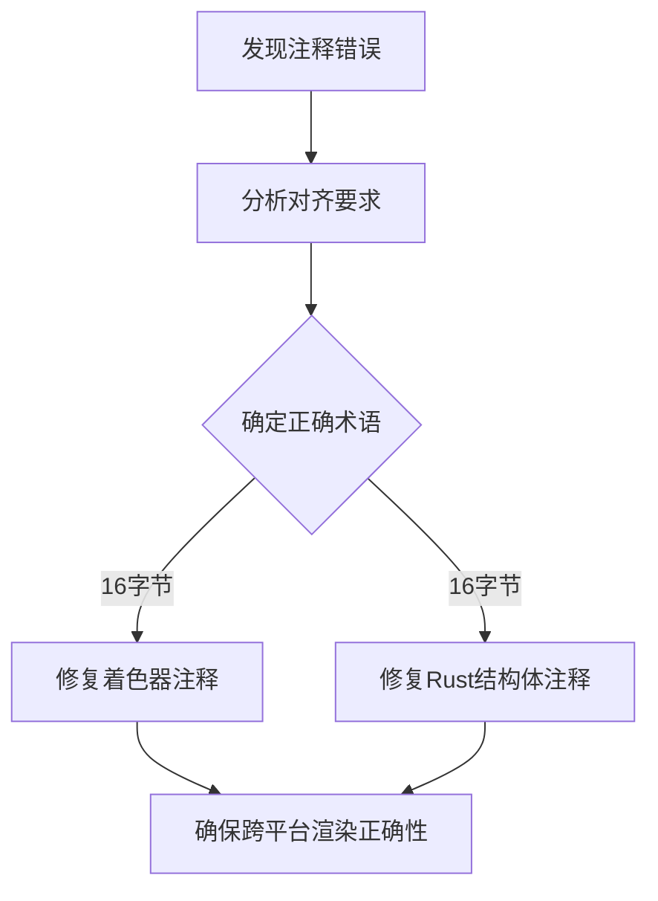

+++
title = "#23124 Fix 16 byte alignment typo (WebGL 2: 16 bit -> 16 byte)"
date = "2026-02-24T00:00:00"
draft = false
template = "pull_request_page.html"
in_search_index = false

[extra]
current_language = "zh-cn"
available_languages = {"en" = { name = "English", url = "/pull_request/bevy/2026-02/pr-23124-en-20260224" }, "zh-cn" = { name = "中文", url = "/pull_request/bevy/2026-02/pr-23124-zh-cn-20260224" }}
labels = ["C-Docs", "D-Trivial", "A-Rendering", "O-WebGL2"]
+++

# Title

## Basic Information
- **Title**: Fix 16 byte alignment typo (WebGL 2: 16 bit -> 16 byte)
- **PR Link**: https://github.com/bevyengine/bevy/pull/23124
- **Author**: jordanhalase
- **Status**: MERGED
- **Labels**: C-Docs, D-Trivial, A-Rendering, S-Ready-For-Final-Review, O-WebGL2
- **Created**: 2026-02-23T23:04:26Z
- **Merged**: 2026-02-24T01:29:58Z
- **Merged By**: mockersf

## Description Translation

# 目标

WebGL 2 要求 16 **字节** 的 UBO 对齐。某些注释错误地写成了 16 **位**。

## 解决方案

修复注释中的拼写错误。

## 测试

不适用

---

## 展示

不适用

## The Story of This Pull Request

这个 PR 的核心是一个简单的文档修复，但背后涉及对 WebGL 2 统一缓冲区对象 (Uniform Buffer Object, UBO) 对齐要求的正确理解。

问题起源于代码注释中的一个笔误。在 Bevy 渲染系统中，着色器材质通过统一缓冲区与 CPU 端数据进行通信。WebGL 2 规范对 UBO 的内存布局有特定要求，其中最基础的一条是要求 16 字节对齐。然而，在相关的着色器文件 (`custom_material.wesl`) 和对应的 Rust 结构体定义 (`shader_material_wesl.rs`) 中，注释错误地将对齐要求写成了 "16 bit"（16 位）。

从工程角度来看，虽然这只是一个注释错误，不会影响代码的实际运行，但它可能对开发者造成误导。对齐要求是跨平台渲染开发中的一个重要概念，尤其是在处理 WebGL 2 这样的严格环境时。16 位对齐（2 字节）和 16 字节对齐（16 字节）之间存在巨大差异，错误的注释可能会让开发者在调试内存布局问题时走弯路。

开发者 jordanhalase 发现了这个不一致之处并提交了修复。修复方案直接明了：将两处注释中的 "16 bit" 更正为 "16 byte"，同时在 Rust 文件中将 "in WebGL2" 的表述优化为更清晰的 "on WebGL2"，以保持一致性。

这个 PR 的工程价值在于它维护了代码文档的准确性。在图形编程中，内存对齐是一个关键的性能和正确性因素。WebGL 2 继承自 OpenGL ES 3.0，其 UBO 对齐要求确实是 16 字节（对于 `std140` 布局）。正确的文档可以帮助开发者理解为什么某些结构体字段需要特定的填充或布局，例如示例中 `time: Vec4` 字段的使用。

从代码变更来看，这次修改只影响了注释，没有改变任何实际代码逻辑。但正是这种对细节的关注体现了成熟开源项目的质量标准。准确的文档减少了新贡献者的认知负担，也避免了在代码审查中因注释错误而产生的 confusion。

## Visual Representation



## Key Files Changed

### 1. `assets/shaders/custom_material.wesl`
- **变更描述**: 修正了 WebGL 2 对齐要求的注释，从 "16-bit" 改为 "16 byte"
- **代码片段**:
```wgsl
// Before:
// Needed for 16-bit alignment on WebGL2

// After:
// Needed for 16 byte alignment on WebGL2
```
- **关联性**: 这是着色器代码中的注释，解释了 `CustomMaterial` 结构体中 `time: vec4<f32>` 字段存在的部分原因。正确的对齐要求说明有助于开发者理解 WebGL 2 平台的约束。

### 2. `examples/shader/shader_material_wesl.rs`
- **变更描述**: 同样修正了对齐要求注释，并微调了措辞使其更清晰
- **代码片段**:
```rust
// Before:
// Needed for 16 bit alignment in WebGL2

// After:
// Needed for 16 byte alignment on WebGL2
```
- **关联性**: 这是 Rust 端对应的材质结构体定义。注释的修正确保了与着色器代码的一致性，为开发者提供了准确的跨平台开发信息。

## Further Reading

1. **WebGL 2 规范中的 UBO 对齐要求**: WebGL 2 基于 OpenGL ES 3.0，其 `std140` 布局规则规定了统一缓冲区的内存对齐方式。了解这些规则对于编写跨平台渲染代码至关重要。

2. **WGSL 着色语言规范**: 了解 WGSL (WebGPU Shading Language) 的内存布局和结构体对齐规则，这是 Bevy 渲染系统使用的现代着色语言。

3. **Bevy 渲染架构文档**: 学习 Bevy 引擎如何管理着色器材质和统一缓冲区，特别是跨 WebGL 2 和其他图形 API 的兼容性处理。

4. **OpenGL ES 3.0 编程指南**: 深入了解 OpenGL ES 3.0 的 UBO 实现细节，这是 WebGL 2 的基础规范。

# Full Code Diff
diff --git a/assets/shaders/custom_material.wesl b/assets/shaders/custom_material.wesl
index ca946687845ab..2d4ba69171766 100644
--- a/assets/shaders/custom_material.wesl
+++ b/assets/shaders/custom_material.wesl
@@ -6,7 +6,7 @@ struct VertexOutput {
 }
 
 struct CustomMaterial {
-    // Needed for 16-bit alignment on WebGL2
+    // Needed for 16 byte alignment on WebGL2
     time: vec4<f32>,
 }
 
diff --git a/examples/shader/shader_material_wesl.rs b/examples/shader/shader_material_wesl.rs
index 4cade8f42700e..b36e8dd12ae1e 100644
--- a/examples/shader/shader_material_wesl.rs
+++ b/examples/shader/shader_material_wesl.rs
@@ -93,7 +93,7 @@ fn update(
 #[derive(Asset, TypePath, AsBindGroup, Clone)]
 #[bind_group_data(CustomMaterialKey)]
 struct CustomMaterial {
-    // Needed for 16 bit alignment in WebGL2
+    // Needed for 16 byte alignment on WebGL2
     #[uniform(0)]
     time: Vec4,
     party_mode: bool,