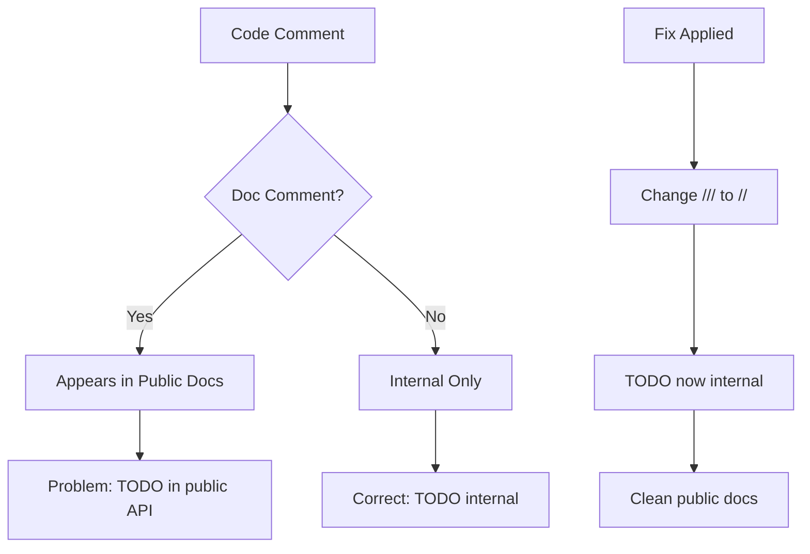

+++
title = "#23125 TODO should not be a doc comment"
date = "2026-02-24T00:00:00"
draft = false
template = "pull_request_page.html"
in_search_index = true

[taxonomies]
list_display = ["show"]

[extra]
current_language = "en"
available_languages = {"en" = { name = "English", url = "/pull_request/bevy/2026-02/pr-23125-en-20260224" }, "zh-cn" = { name = "中文", url = "/pull_request/bevy/2026-02/pr-23125-zh-cn-20260224" }}
labels = ["C-Docs", "D-Trivial"]
+++

# Title

## Basic Information
- **Title**: TODO should not be a doc comment
- **PR Link**: https://github.com/bevyengine/bevy/pull/23125
- **Author**: micttyoid
- **Status**: MERGED
- **Labels**: C-Docs, D-Trivial, S-Ready-For-Final-Review
- **Created**: 2026-02-24T01:42:18Z
- **Merged**: 2026-02-24T03:28:19Z
- **Merged By**: alice-i-cecile

## Description Translation
# Objective

- `TODO` should not appear in docs.rs generated documentation

## Solution

- `///` -> `//`

## Testing

- Untested, pushed with faith

## The Story of This Pull Request

This PR addresses a straightforward documentation hygiene issue in the Bevy game engine codebase. The problem was that a `TODO` comment was incorrectly formatted as a doc comment (using `///`), which caused it to appear in the public API documentation generated by Rustdoc and published on docs.rs.

The issue centers around a function called `get_current_videomode` in the winit integration module. This function has a temporary implementation that should be replaced once Winit 0.31 releases. The developer originally wrote the TODO comment as a doc comment, which is appropriate for documenting public API behavior but inappropriate for internal notes about future implementation changes.

When Rustdoc processes the code, it includes all doc comments (`///`) in the generated documentation. This means that the TODO comment was appearing in the public documentation at docs.rs, which creates two problems. First, it exposes internal implementation details that aren't relevant to users of the API. Second, it creates noise in the documentation that distracts from actual API documentation. For users reading the documentation, seeing TODO comments can create confusion about the stability and completeness of the API.

The fix is simple but important for maintaining clean public documentation. By changing the comment from `///` to `//`, the TODO note becomes a regular code comment that Rustdoc ignores during documentation generation. This keeps internal development notes internal while still preserving the important context for developers working on the codebase.

The PR demonstrates good documentation hygiene practices. In Rust, doc comments serve a specific purpose: to document public API behavior for users of the library. Internal notes, implementation details, and development todos should use regular comments (`//` or `/* */`) to avoid polluting the public documentation. This distinction helps maintain clean, focused documentation that serves its intended audience without exposing internal development artifacts.

The change is minimal but significant for documentation quality. The developer recognized that even small issues like this affect the professionalism and clarity of the project's public documentation. By fixing it, they ensure that users reading the Bevy documentation see only relevant API information, not internal development notes.

## Visual Representation



## Key Files Changed

**crates/bevy_winit/src/winit_windows.rs** (+2/-3)

This file contains the winit window system integration for Bevy. The change modifies a single TODO comment in a helper function.

**What changed and why:**
The `get_current_videomode` function has a TODO comment explaining that it should be replaced with `MonitorHandle::current_video_mode()` when Winit 0.31 releases. This comment was incorrectly formatted as a doc comment, causing it to appear in public documentation. The fix changes it to a regular comment to keep it internal.

**Code modification:**

```rust
// Before:
/// Gets a monitor's current video-mode.
///
/// TODO: When Winit 0.31 releases this function can be removed and replaced with
/// `MonitorHandle::current_video_mode()`
fn get_current_videomode(monitor: &MonitorHandle) -> Option<VideoModeHandle> {

// After:
/// Gets a monitor's current video-mode.
// TODO: When Winit 0.31 releases this function can be removed and replaced with
// `MonitorHandle::current_video_mode()`
fn get_current_videomode(monitor: &MonitorHandle) -> Option<VideoModeHandle> {
```

The key change is the comment prefix for the TODO line and its continuation. The function's actual documentation (`/// Gets a monitor's current video-mode.`) correctly remains a doc comment since it describes what the function does for API users. Only the internal TODO note is changed to a regular comment.

**Relation to PR purpose:**
This change directly implements the PR's objective: preventing TODO comments from appearing in public documentation by converting doc comments to regular comments for internal notes.

## Further Reading

1. **Rust Documentation Comments**: The Rust Book chapter on documentation explains the difference between doc comments (`///`) and regular comments, and when to use each: https://doc.rust-lang.org/book/ch14-02-publishing-to-crates-io.html#making-useful-documentation-comments

2. **Rustdoc Documentation**: Official Rustdoc documentation explains how comments are processed and what appears in generated documentation: https://doc.rust-lang.org/rustdoc/what-is-rustdoc.html

3. **Bevy Documentation Guide**: Bevy's own documentation guidelines would provide project-specific conventions for comments and documentation: https://github.com/bevyengine/bevy/blob/main/docs/DEVELOPMENT.md

4. **Semantic Versioning and Documentation**: How documentation quality affects library usability and version stability: https://semver.org/

# Full Code Diff
```diff
diff --git a/crates/bevy_winit/src/winit_windows.rs b/crates/bevy_winit/src/winit_windows.rs
index 3afc49bac85cb..9e3b6f345ce54 100644
--- a/crates/bevy_winit/src/winit_windows.rs
+++ b/crates/bevy_winit/src/winit_windows.rs
@@ -385,9 +385,8 @@ pub fn get_selected_videomode(
 }
 
 /// Gets a monitor's current video-mode.
-///
-/// TODO: When Winit 0.31 releases this function can be removed and replaced with
-/// `MonitorHandle::current_video_mode()`
+// TODO: When Winit 0.31 releases this function can be removed and replaced with
+// `MonitorHandle::current_video_mode()`
 fn get_current_videomode(monitor: &MonitorHandle) -> Option<VideoModeHandle> {
     monitor
         .video_modes()
```