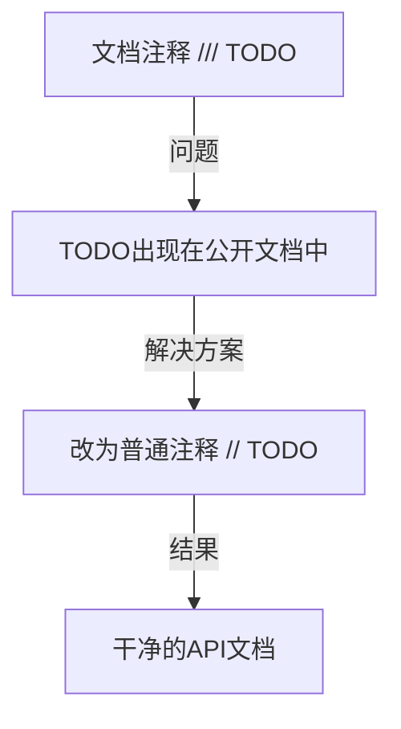

+++
title = "#23125 TODO should not be a doc comment"
date = "2026-02-24T00:00:00"
draft = false
template = "pull_request_page.html"
in_search_index = false

[extra]
current_language = "zh-cn"
available_languages = {"en" = { name = "English", url = "/pull_request/bevy/2026-02/pr-23125-en-20260224" }, "zh-cn" = { name = "中文", url = "/pull_request/bevy/2026-02/pr-23125-zh-cn-20260224" }}
+++

# TODO should not be a doc comment

## 基本信息
- **标题**: TODO should not be a doc comment
- **PR链接**: https://github.com/bevyengine/bevy/pull/23125
- **作者**: micttyoid
- **状态**: 已合并
- **标签**: C-Docs, D-Trivial, S-Ready-For-Final-Review
- **创建时间**: 2026-02-24T01:42:18Z
- **合并时间**: 2026-02-24T03:28:19Z
- **合并者**: alice-i-cecile

## 描述翻译

### 目标
- `TODO`不应出现在docs.rs生成的文档中

### 解决方案
- `///` -> `//`

### 测试
- 未测试，凭信心推送

## 本次PR的故事

这是一个关于代码注释规范的简单修复。开发者发现`crates/bevy_winit/src/winit_windows.rs`文件中存在一个`TODO`注释，但它被错误地标记为文档注释（使用`///`前缀）。这意味着这个临时性的、内部使用的注释会出现在最终生成的公开API文档中。

问题很明确：文档注释（`///`）会被Rust的文档工具`rustdoc`处理并包含在生成的文档中，而普通注释（`//`）则不会。将内部开发用的`TODO`注释暴露给API使用者是不合适的，这会让最终用户看到不完整的实现细节，影响文档的专业性和清晰度。

解决方案直接而有效：只需将注释前缀从`///`改为`//`。这样`TODO`注释仍然存在于代码中，提醒开发者将来需要更新这段代码（当Winit 0.31发布时），但不会污染公共API文档。这种修改遵循了良好的代码注释实践：文档注释应该只描述公共API的行为和使用方法，而实现细节、待办事项和内部笔记应该使用普通注释。

从技术角度来看，这个修复虽然微小，但体现了对代码质量细节的关注。它确保公开文档只包含对最终用户有用的信息，而不是开发过程中的临时备注。这个更改不会影响任何功能，只影响文档生成过程。

## 视觉表示



## 关键文件更改

### `crates/bevy_winit/src/winit_windows.rs` (+2/-3)

这个文件中的`get_current_videomode`函数上方有一个`TODO`注释。原始版本使用文档注释格式，这意味着它会出现在生成的API文档中。修复后改为普通注释，使`TODO`只对代码阅读者可见，而不出现在公开文档中。

#### 修改前：
```rust
/// Gets a monitor's current video-mode.
///
/// TODO: When Winit 0.31 releases this function can be removed and replaced with
/// `MonitorHandle::current_video_mode()`
fn get_current_videomode(monitor: &MonitorHandle) -> Option<VideoModeHandle> {
```

#### 修改后：
```rust
/// Gets a monitor's current video-mode.
// TODO: When Winit 0.31 releases this function can be removed and replaced with
// `MonitorHandle::current_video_mode()`
fn get_current_videomode(monitor: &MonitorHandle) -> Option<VideoModeHandle> {
```

**关键变化**：
1. 第1行的文档注释保持不变，因为它正确描述了函数的功能
2. 第3-4行的`TODO`注释从`///`改为`//`，使其成为普通注释
3. 这样修改后，`TODO`注释仍然存在于代码中，提醒开发者未来需要更新此函数，但不会出现在公开的API文档中

## 进一步阅读

1. [Rust文档注释指南](https://doc.rust-lang.org/rustdoc/how-to-write-documentation.html)
2. [Rust代码注释最佳实践](https://rust-lang.github.io/api-guidelines/documentation.html)
3. [Bevy引擎代码贡献指南](https://github.com/bevyengine/bevy/blob/main/CONTRIBUTING.md)
4. [docs.rs文档生成服务](https://docs.rs/)

# 完整代码差异

```diff
diff --git a/crates/bevy_winit/src/winit_windows.rs b/crates/bevy_winit/src/winit_windows.rs
index 3afc49bac85cb..9e3b6f345ce54 100644
--- a/crates/bevy_winit/src/winit_windows.rs
+++ b/crates/bevy_winit/src/winit_windows.rs
@@ -385,9 +385,8 @@ pub fn get_selected_videomode(
 }
 
 /// Gets a monitor's current video-mode.
-///
-/// TODO: When Winit 0.31 releases this function can be removed and replaced with
-/// `MonitorHandle::current_video_mode()`
+// TODO: When Winit 0.31 releases this function can be removed and replaced with
+// `MonitorHandle::current_video_mode()`
 fn get_current_videomode(monitor: &MonitorHandle) -> Option<VideoModeHandle> {
     monitor
         .video_modes()
```