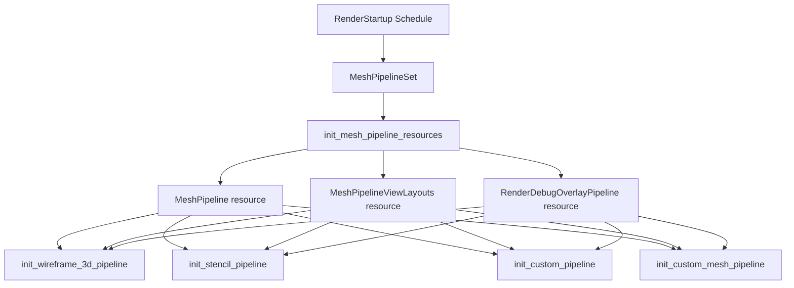

+++
title = "#23147 Fix wireframe and examples with mesh pipeline set"
date = "2026-02-25T00:00:00"
draft = false
template = "pull_request_page.html"
in_search_index = true

[taxonomies]
list_display = ["show"]

[extra]
current_language = "en"
available_languages = {"en" = { name = "English", url = "/pull_request/bevy/2026-02/pr-23147-en-20260225" }, "zh-cn" = { name = "中文", url = "/pull_request/bevy/2026-02/pr-23147-zh-cn-20260225" }}
labels = ["C-Bug", "A-Rendering", "P-Regression"]
+++

# Title: Fix wireframe and examples with mesh pipeline set

## Basic Information
- **Title**: Fix wireframe and examples with mesh pipeline set
- **PR Link**: https://github.com/bevyengine/bevy/pull/23147
- **Author**: mockersf
- **Status**: MERGED
- **Labels**: C-Bug, A-Rendering, S-Ready-For-Final-Review, P-Regression
- **Created**: 2026-02-25T11:17:43Z
- **Merged**: 2026-02-25T19:39:09Z
- **Merged By**: alice-i-cecile

## Description Translation

# Objective

- #22443 broke wireframe and some examples

## Solution

- Fix them by having the systems run after `MeshPipelineSet`
- Also add a migration guide

## Testing

- run the examples modified or anything using wireframe

## The Story of This Pull Request

This PR addresses a regression introduced by PR #22443, which broke wireframe rendering and several advanced shader examples. The root cause was a scheduling issue where systems that depend on certain mesh pipeline resources were running before those resources had been initialized.

PR #22443 introduced the `MeshPipelineSet` system set and moved the creation of several critical rendering resources (`MeshPipelineViewLayouts`, `MeshPipeline`, and `RenderDebugOverlayPipeline`) into systems that run within this set during the `RenderStartup` schedule. This change was part of a broader refactoring to improve the organization and initialization order of rendering systems.

The problem occurred because several systems that depend on these mesh pipeline resources were still scheduled to run in `RenderStartup` without explicit ordering constraints. These systems would execute before the `MeshPipelineSet` systems, leading to panics when they tried to access uninitialized resources.

The solution was straightforward: add explicit ordering constraints using `.after(MeshPipelineSet)` to ensure these dependent systems run only after the mesh pipeline resources have been created. This approach maintains the architectural improvements from PR #22443 while fixing the initialization order issue.

The fix was applied to four key areas:
1. The wireframe rendering system in `bevy_pbr`
2. Three advanced shader examples that implement custom rendering pipelines

Additionally, a migration guide was created to document this change for users who have custom rendering systems that might be affected by the same issue. The guide explains that any systems using `MeshPipelineViewLayouts`, `MeshPipeline`, or `RenderDebugOverlayPipeline` resources in the `RenderStartup` schedule now need to run after the `MeshPipelineSet` system set.

This fix demonstrates the importance of proper system ordering in Bevy's ECS architecture, especially for resource initialization. When resources are created by systems, any systems that depend on them must be explicitly ordered to run afterward. The regression occurred because the dependency wasn't made explicit when the resource creation was moved to a different system set.

The implementation approach is minimal and focused: only the scheduling constraints were modified, not the actual system logic. This minimizes the risk of introducing new bugs while ensuring the systems work correctly with the new resource initialization order.

## Visual Representation



## Key Files Changed

### `crates/bevy_pbr/src/wireframe.rs` (+7/-4)
This file contains the wireframe rendering plugin. The change ensures the wireframe pipeline initialization system runs after the mesh pipeline resources are created.

**Key change:**
```rust
// Before:
.add_systems(RenderStartup, init_wireframe_3d_pipeline)

// After:
.add_systems(
    RenderStartup,
    init_wireframe_3d_pipeline.after(MeshPipelineSet),
)
```

### `examples/shader_advanced/specialized_mesh_pipeline.rs` (+7/-3)
This example demonstrates a specialized mesh pipeline. The fix ensures the custom pipeline initialization runs after mesh pipeline resources are available.

**Key change:**
```rust
// Before:
.add_systems(RenderStartup, init_custom_mesh_pipeline)

// After:
.add_systems(
    RenderStartup,
    init_custom_mesh_pipeline.after(MeshPipelineSet),
)
```

### `release-content/migration-guides/meshpipelineset-renderstartup-systems.md` (+6/-0)
A new migration guide was added to document the change and help users update their own code.

**Content:**
```markdown
---
title: Resources `MeshPipelineViewLayouts`, `MeshPipeline` and `RenderDebugOverlayPipeline` are now created in `RenderStartup` systems
pull_requests: [22443]
---

Systems using the `MeshPipelineViewLayouts`, `MeshPipeline` and `RenderDebugOverlayPipeline` resources in the `RenderStartup` schedule now need to be run after the `MeshPipelineSet` system set.
```

### `examples/shader_advanced/custom_render_phase.rs` (+2/-2)
This example shows how to create a custom render phase. The fix ensures proper initialization ordering.

**Key change:**
```rust
// Before:
.add_systems(RenderStartup, init_stencil_pipeline)

// After:
.add_systems(RenderStartup, init_stencil_pipeline.after(MeshPipelineSet))
```

### `examples/shader_advanced/custom_shader_instancing.rs` (+2/-2)
This example demonstrates custom shader instancing. The fix ensures the custom pipeline initializes after mesh pipeline resources.

**Key change:**
```rust
// Before:
.add_systems(RenderStartup, init_custom_pipeline)

// After:
.add_systems(RenderStartup, init_custom_pipeline.after(MeshPipelineSet))
```

## Further Reading

1. **Bevy ECS System Ordering**: Understanding system scheduling and ordering is crucial for working with Bevy's ECS. The official Bevy Book covers this in detail.
2. **Render Pipeline Architecture**: The Bevy rendering architecture documentation explains how render pipelines are structured and initialized.
3. **Migration Guides**: The Bevy migration guides provide valuable context for breaking changes and how to adapt code.
4. **System Sets in Bevy**: System sets provide a way to organize and order groups of systems, which is essential for complex initialization sequences.
5. **PR #22443**: Reviewing the original PR that introduced the `MeshPipelineSet` provides context for why these changes were necessary.