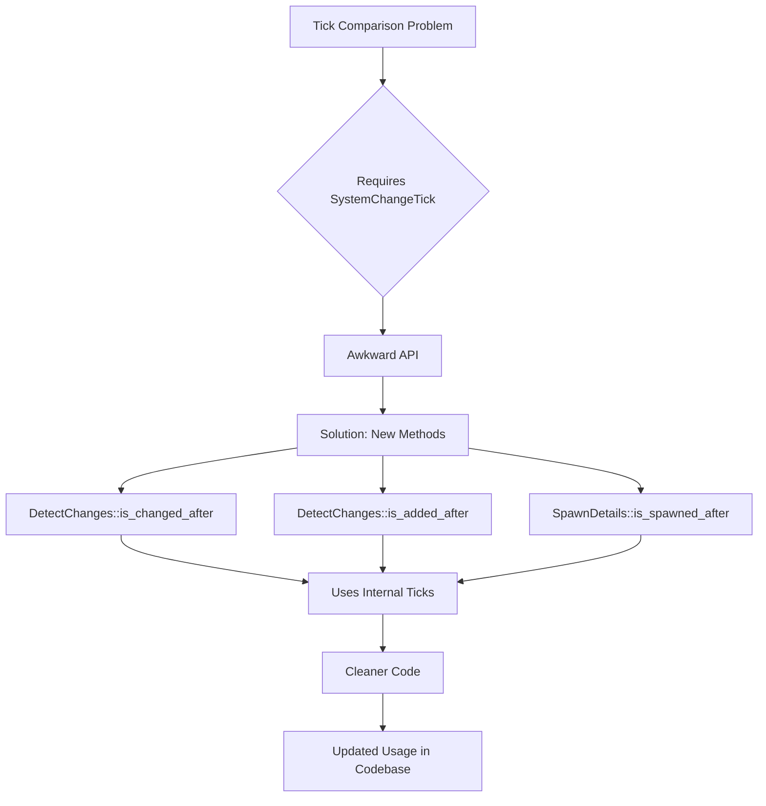

+++
title = "#23149 DetectChanges::is_changed_after"
date = "2026-02-26T00:00:00"
draft = false
template = "pull_request_page.html"
in_search_index = true

[taxonomies]
list_display = ["show"]

[extra]
current_language = "en"
available_languages = {"en" = { name = "English", url = "/pull_request/bevy/2026-02/pr-23149-en-20260226" }, "zh-cn" = { name = "中文", url = "/pull_request/bevy/2026-02/pr-23149-zh-cn-20260226" }}
labels = ["C-Bug", "A-ECS", "C-Usability"]
+++

# Title: DetectChanges::is_changed_after

## Basic Information
- **Title**: `DetectChanges::is_changed_after`
- **PR Link**: https://github.com/bevyengine/bevy/pull/23149
- **Author**: chescock
- **Status**: MERGED
- **Labels**: C-Bug, A-ECS, C-Usability, S-Ready-For-Final-Review
- **Created**: 2026-02-25T16:17:01Z
- **Merged**: 2026-02-26T00:34:18Z
- **Merged By**: alice-i-cecile

## Description Translation

# Objective

Make it easier to compare ticks between `Ref`s.  

The pattern used in #23106 to compare changed ticks seems very powerful!  But the second `Tick` parameter in `Tick::is_newer_than` makes it awkward to use, and requires the developer know about the `SystemChangeTick` system parameter.  Which is silly, because the `Ref` *already has* those ticks.  

## Solution

Introduce `DetectChanges::is_changed_after`, `DetectChanges::is_added_after`, and `SpawnDetails::is_spawned_after` methods.  These call `Tick::is_newer_than` on the appropriate tick, using the `last_run` tick that is already stored.  

## Showcase

```diff
-        if transform
-            .last_changed()
-            .is_newer_than(previous.last_changed(), system_change_tick.this_run())
-        {
+        if transform.is_changed_after(previous.last_changed()) {
```

## The Story of This Pull Request

The issue that prompted this PR was a usability problem in Bevy's ECS change detection system. When developers needed to compare change ticks between different components or resources, they had to use the low-level `Tick::is_newer_than` method with an awkward API. This method required two tick parameters: the tick to compare against, and the current system's change tick. The problem was that the system change tick wasn't naturally available in the context where these comparisons were typically made.

Consider the common scenario where you have a `Ref<T>` (a reference to a component with change detection) and you want to know if it changed after some other tick. Previously, you'd need to write:

```rust
if component.last_changed().is_newer_than(other_tick, system_change_tick.this_run())
```

This required the developer to have access to a `SystemChangeTick` parameter, which isn't always convenient or obvious. More importantly, the `Ref` type already contains the necessary `last_run` and `this_run` ticks internally - it was redundant to require the developer to pass them again.

The solution implemented in this PR is straightforward: add new methods to the `DetectChanges` trait that encapsulate the tick comparison logic using the ticks already stored in the change detection types. The new methods are `is_changed_after()` and `is_added_after()`, which take a single `Tick` parameter and compare against the internal state.

This change follows good API design principles by providing a higher-level abstraction over the low-level tick comparison. It reduces boilerplate, eliminates the need for developers to understand the internal `SystemChangeTick` parameter, and makes the code more readable.

The implementation was consistent across the codebase. The `DetectChanges` trait gained the two new methods, and existing implementations (through a macro and manual implementations) were updated to provide them. The existing `is_changed()` and `is_added()` methods were refactored to use the new `is_changed_after()` and `is_added_after()` methods, passing `self.ticks.last_run` as the comparison tick.

A similar change was made to `SpawnDetails` in the query system, adding an `is_spawned_after()` method for consistency. This follows the same pattern: encapsulating the tick comparison logic that was previously exposed directly.

The PR also includes updates to existing code that used the old pattern. In the observer runner and system registry, code was simplified by using the new methods. The most significant simplification is in the `bevy_pbr` module, where the `update_mesh_previous_global_transforms` system no longer needs the `SystemChangeTick` parameter and uses the cleaner `is_changed_after()` method.

This change is particularly valuable because it makes a common pattern much easier to use. The documentation example shows a practical use case: comparing a source component's change tick with a target component's change tick to decide whether to update the target. With the new API, this becomes a simple one-line comparison instead of a more complex expression involving system parameters.

From a technical perspective, the implementation is efficient. All methods are marked `#[inline]`, so there's no performance penalty for the abstraction. The code generation should be identical to what was written manually before. The change maintains backward compatibility while providing a much cleaner API for new code.

## Visual Representation



## Key Files Changed

### `crates/bevy_ecs/src/change_detection/traits.rs` (+47/-3)
This file contains the `DetectChanges` trait definition and the macro that implements it for various types. The key changes:
- Added two new methods to the trait: `is_added_after()` and `is_changed_after()`
- Updated the macro implementation to provide these methods
- Refactored existing `is_added()` and `is_changed()` to use the new methods

```rust
// Before in the trait:
pub trait DetectChanges {
    fn is_added(&self) -> bool;
    fn is_changed(&self) -> bool;
    // No methods for comparing with arbitrary ticks
}

// After in the trait:
pub trait DetectChanges {
    fn is_added(&self) -> bool;
    fn is_changed(&self) -> bool;
    fn is_added_after(&self, other: Tick) -> bool;  // New
    fn is_changed_after(&self, other: Tick) -> bool;  // New
}

// Before in macro implementation:
fn is_added(&self) -> bool {
    self.ticks
        .added
        .is_newer_than(self.ticks.last_run, self.ticks.this_run)
}

// After in macro implementation:
fn is_added(&self) -> bool {
    self.is_added_after(self.ticks.last_run)
}

fn is_added_after(&self, other: Tick) -> bool {
    self.ticks
        .added
        .is_newer_than(other, self.ticks.this_run)
}
```

### `crates/bevy_ecs/src/change_detection/params.rs` (+12/-6)
Updated the manual implementation of `DetectChanges` for `MutUntyped` to match the new trait methods.

```rust
// Before:
fn is_added(&self) -> bool {
    self.ticks
        .added
        .is_newer_than(self.ticks.last_run, self.ticks.this_run)
}

// After:
fn is_added(&self) -> bool {
    self.is_added_after(self.ticks.last_run)
}

fn is_added_after(&self, other: Tick) -> bool {
    self.ticks.added.is_newer_than(other, self.ticks.this_run)
}
```

### `crates/bevy_ecs/src/query/fetch.rs` (+8/-1)
Added `is_spawned_after()` method to `SpawnDetails` for consistency with the change detection API.

```rust
// Before:
pub fn is_spawned(self) -> bool {
    self.spawn_tick.is_newer_than(self.last_run, self.this_run)
}

// After:
pub fn is_spawned(self) -> bool {
    self.is_spawned_after(self.last_run)
}

pub fn is_spawned_after(self, other: Tick) -> bool {
    self.spawn_tick.is_newer_than(other, self.this_run)
}
```

### `crates/bevy_pbr/src/prepass/mod.rs` (+1/-5)
Simplified code by using the new `is_changed_after()` method and removing the `SystemChangeTick` parameter.

```rust
// Before:
pub fn update_mesh_previous_global_transforms(
    // ... other parameters
    system_change_tick: SystemChangeTick,  // Needed for comparison
) {
    // ... 
    if transform
        .last_changed()
        .is_newer_than(previous.last_changed(), system_change_tick.this_run())
    {
        // Update logic
    }
}

// After:
pub fn update_mesh_previous_global_transforms(
    // ... other parameters (no system_change_tick)
) {
    // ...
    if transform.is_changed_after(previous.last_changed()) {
        // Update logic
    }
}
```

### `crates/bevy_ecs/src/observer/runner.rs` (+1/-5) and `crates/bevy_ecs/src/system/system_registry.rs` (+8/-1)
Updated hotpatching logic to use the new methods with `is_none_or()` for cleaner code.

## Further Reading

1. **Bevy ECS Change Detection Documentation**: For understanding how change detection works in Bevy's ECS
2. **Tick-based Change Detection**: The underlying mechanism that enables efficient change detection without expensive comparisons
3. **API Design Patterns**: For learning about creating ergonomic APIs that hide implementation details
4. **Rust Trait System**: Understanding how traits allow for consistent APIs across different types
5. **System Parameters in Bevy**: How system parameters like `SystemChangeTick` work in Bevy's ECS