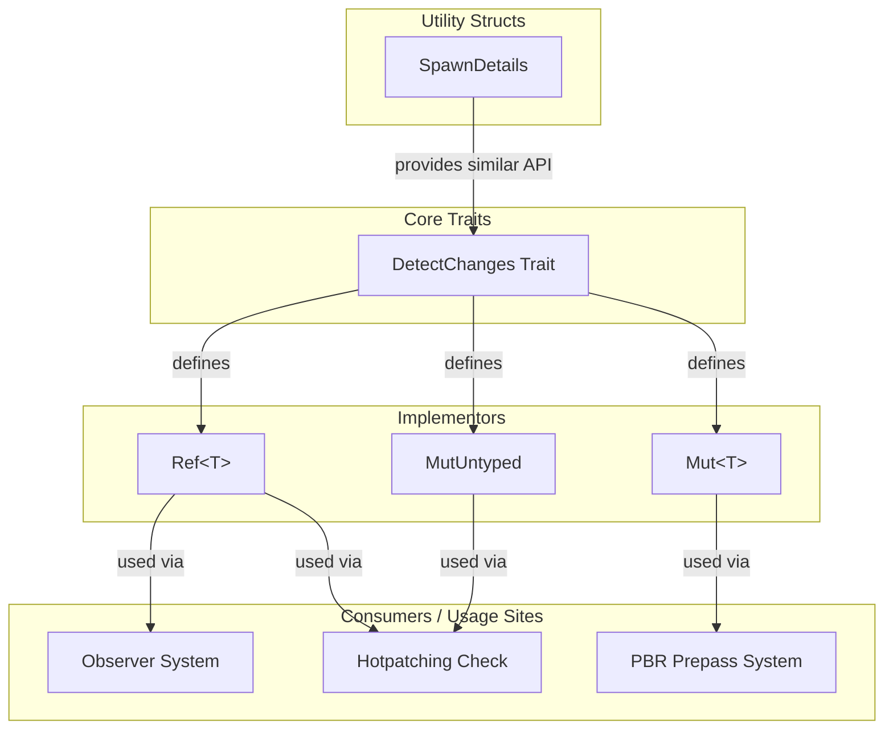

+++
title = "#23149 `DetectChanges::is_changed_after`"
date = "2026-02-26T00:00:00"
draft = false
template = "pull_request_page.html"
in_search_index = false

[extra]
current_language = "zh-cn"
available_languages = {"en" = { name = "English", url = "/pull_request/bevy/2026-02/pr-23149-en-20260226" }, "zh-cn" = { name = "中文", url = "/pull_request/bevy/2026-02/pr-23149-zh-cn-20260226" }}
labels = ["C-Bug", "A-ECS", "C-Usability"]
+++

# Title

## Basic Information
- **Title**: `DetectChanges::is_changed_after`
- **PR Link**: https://github.com/bevyengine/bevy/pull/23149
- **Author**: chescock
- **Status**: MERGED
- **Labels**: C-Bug, A-ECS, C-Usability, S-Ready-For-Final-Review
- **Created**: 2026-02-25T16:17:01Z
- **Merged**: 2026-02-26T00:34:18Z
- **Merged By**: alice-i-cecile

## Description Translation
### 目标
让比较 `Ref` 之间的 ticks 变得更加容易。

在 #23106 中使用的比较 changed ticks 的模式看起来非常强大！但是 `Tick::is_newer_than` 的第二个 `Tick` 参数使得使用起来很别扭，并且要求开发者了解 `SystemChangeTick` 这个系统参数。这很傻，因为 `Ref` *已经拥有* 这些 ticks。

### 解决方案
引入 `DetectChanges::is_changed_after`、`DetectChanges::is_added_after` 和 `SpawnDetails::is_spawned_after` 方法。这些方法在适当的 tick 上调用 `Tick::is_newer_than`，并使用已经存储的 `last_run` tick。

### 示例展示
```diff
-        if transform
-            .last_changed()
-            .is_newer_than(previous.last_changed(), system_change_tick.this_run())
-        {
+        if transform.is_changed_after(previous.last_changed()) {
```

## The Story of This Pull Request

这个 PR 始于一个具体的开发者体验问题。在 Bevy 的 ECS 系统中，变更检测（change detection）是一个核心机制，它允许系统（system）高效地检查组件或资源自上次运行以来是否被修改。系统通过比较 ticks（一种单调递增的计数器）来实现这一点。每个变更都会被标记一个 tick，而每个系统也会跟踪它上次运行的 tick（`last_run`）和当前的 world tick（`this_run`）。

问题出现在开发者需要比较两个不同实体的变更时间点时。例如，一个系统可能想要检查 `Source` 组件是否在 `Target` 组件之后被修改，以决定是否需要更新 `Target`。在 PR #23106 中展示的模式，即使用 `Tick::is_newer_than` 方法，虽然功能强大，但 API 使用起来很繁琐。

原有的方法调用如下：
```rust
transform.last_changed().is_newer_than(previous.last_changed(), system_change_tick.this_run())
```
开发者必须：
1.  从两个 `Ref` 中分别获取 `last_changed()` tick。
2.  显式传入 `system_change_tick.this_run()` 作为第三个参数。

这里的关键洞察是：对于一个已经存在的 `Ref`（例如 `transform: Ref<Transform>`），它内部已经包含了进行比较所需的所有状态信息。`Ref` 结构体内部存储了 `Ticks`，其中就包括 `last_run` 和 `this_run`。强迫开发者从外部传入 `system_change_tick` 是多余且容易出错的。开发者甚至需要知道 `SystemChangeTick` 这个系统参数的存在。

因此，解决方案很直接：在 `DetectChanges` trait 上提供一个新的方法，利用 `Ref` 自身已有的信息来完成比较。这就是 `is_changed_after` 和 `is_added_after` 方法的由来。

从技术实现上看，这个 PR 采取了最小化且一致的方法。核心改动发生在 `crates/bevy_ecs/src/change_detection/traits.rs` 文件。开发者首先在 `DetectChanges` trait 的定义中增加了两个新的方法签名：
```rust
fn is_added_after(&self, other: Tick) -> bool;
fn is_changed_after(&self, other: Tick) -> bool;
```
并且为 `is_changed_after` 编写了详细的文档和示例，展示了其典型用例：仅在源组件比目标组件更新时才进行转换。

接下来，需要为所有实现了 `DetectChanges` trait 的类型提供这两个方法的默认实现。这里运用了 Bevy ECS 代码库中已有的一个宏模式 `change_detection_impl!`。这个宏原本用于为 `Ref`、`Mut` 等类型生成 `is_added` 和 `is_changed` 的实现。PR 巧妙地修改了这个宏，使其也生成新的 `is_added_after` 和 `is_changed_after` 方法。

更重要的是，修改将原有的 `is_added` 和 `is_changed` 的实现重构为基于新方法：
```rust
#[inline]
fn is_added(&self) -> bool {
    self.is_added_after(self.ticks.last_run) // 之前是直接调用 is_newer_than
}
```
这是一种良好的重构实践：让高层 API (`is_added`) 建立在更基础、更灵活的 API (`is_added_after`) 之上，避免了代码重复，并保证了行为的一致性。

同样的逻辑也应用到了 `MutUntyped` 类型（在 `params.rs` 中）和 `SpawnDetails` 类型（在 `fetch.rs` 中），为后者新增了 `is_spawned_after` 方法。

完成核心 API 的添加后，PR 的作者进一步展示了新 API 的优势：清理代码库中已有的、使用旧模式的地方。这包括：
1.  `observer/runner.rs` 和 `system/system_registry.rs` 中关于热重载（hotpatching）的检查逻辑。原本冗长的 `map` 和 `is_newer_than` 调用被简洁的 `is_none_or` 和 `is_changed_after` 组合所替代。这显著提高了代码的可读性。
2.  `bevy_pbr/src/prepass/mod.rs` 中的一个具体系统函数 `update_mesh_previous_global_transforms`。这正是 PR 描述中展示的 diff 所对应的代码。这个改动移除了对 `system_change_tick` 参数的依赖，并使函数签名和函数体都更加清晰。

从工程角度看，这个 PR 是一个典型的“开发者体验”优化。它没有改变系统的核心行为或性能特征（所有方法都是 `#[inline]` 的，编译后应该与直接调用 `is_newer_than` 等效），但极大地改善了 API 的易用性和代码的简洁性。它遵循了“让简单的事情简单，让复杂的事情可能”的原则。现在，比较两个变更 tick 变成了一行直观的代码，开发者无需再关心底层的 tick 比较机制。

这个改动也体现了良好的软件设计原则：封装。`Ref` 现在提供了一个更高级别的抽象，隐藏了 `last_run` 和 `this_run` 的内部细节，使得调用代码不再依赖于这些实现细节。这使得未来的内部重构（如果需要调整 tick 比较逻辑）变得更加容易，因为影响范围被限制在了 `DetectChanges` trait 的实现内部。

## Visual Representation


*图示说明：`DetectChanges` trait 是新增 API 的源头。多个类型（`Ref`, `Mut`, `MutUntyped`）实现了它。`SpawnDetails` 虽然不是该 trait 的实现者，但提供了语义相同的 `is_spawned_after` 方法。代码库中的多个使用点（消费者）更新为使用这些新方法，简化了逻辑。*

## Key Files Changed

1.  **`crates/bevy_ecs/src/change_detection/traits.rs` (+47/-3)**
    *   **目的**: 这是 PR 的核心。在此定义了新的 trait 方法，并更新了宏来为所有相关类型生成实现。
    *   **关键改动**:
        *   在 `DetectChanges` trait 中新增 `is_added_after` 和 `is_changed_after` 方法声明及文档。
        *   修改 `change_detection_impl!` 宏，使其生成新方法的实现，并重构现有 `is_added`/`is_changed` 方法以调用新方法。
    *   **代码示例 (核心新增部分)**:
        ```rust
        /// Returns `true` if this value was added after the `other` tick.
        fn is_added_after(&self, other: Tick) -> bool;

        /// Returns `true` if this value was added or mutably dereferenced
        /// after the `other` tick.
        fn is_changed_after(&self, other: Tick) -> bool;
        ```
    *   **与整体的关系**: 建立了新的、更易用的公共 API。

2.  **`crates/bevy_ecs/src/change_detection/params.rs` (+12/-6)**
    *   **目的**: 为 `MutUntyped` 类型实现新的 `DetectChanges` 方法。
    *   **关键改动**: 为 `MutUntyped` 手动实现了 `is_added_after` 和 `is_changed_after`，并同样重构了 `is_added` 和 `is_changed` 来调用它们。
    *   **代码示例 (实现逻辑)**:
        ```rust
        #[inline]
        fn is_added_after(&self, other: Tick) -> bool {
            self.ticks.added.is_newer_than(other, self.ticks.this_run)
        }
        ```
    *   **与整体的关系**: 确保所有实现了 `DetectChanges` 的类型都有一致的新 API。

3.  **`crates/bevy_ecs/src/query/fetch.rs` (+8/-1)**
    *   **目的**: 为 `SpawnDetails` 增加对称的 `is_spawned_after` 方法，保持 API 一致性。
    *   **关键改动**: 新增 `is_spawned_after` 方法，并重构 `is_spawned` 来调用它。
    *   **代码示例**:
        ```rust
        #[inline]
        pub fn is_spawned_after(self, other: Tick) -> bool {
            self.spawn_tick.is_newer_than(other, self.this_run)
        }
        ```
    *   **与整体的关系**: 将“比较 tick”的便利性扩展到了实体生成（spawning）的检测场景。

4.  **`crates/bevy_ecs/src/observer/runner.rs` (+1/-5) & `crates/bevy_ecs/src/system/system_registry.rs` (+1/-5)**
    *   **目的**: 利用新 API 简化现有代码，展示其优势。
    *   **关键改动**: 将复杂的 `map` + `is_newer_than` 链式调用替换为更简洁的 `is_none_or` + `is_changed_after`。
    *   **代码示例 (之前 vs 之后)**:
        ```rust
        // 之前:
        .map(|r| r.last_changed().is_newer_than((*system).get_last_run(), world.change_tick()))
        .unwrap_or(true)

        // 之后:
        .is_none_or(|r| r.is_changed_after((*system).get_last_run()))
        ```
    *   **与整体的关系**: 证明了新 API 的实际价值，使代码更清晰、更易读。

5.  **`crates/bevy_pbr/src/prepass/mod.rs` (+1/-5)**
    *   **目的**: 在真实的使用场景中应用新 API，并移除不必要的系统参数。
    *   **关键改动**: 使用 `is_changed_after` 替换原有的 tick 比较逻辑，并因此可以从函数签名中删除 `system_change_tick: SystemChangeTick` 参数。
    *   **代码示例 (PR描述中的diff)**:
        ```rust
        // 这个改动直接来自PR描述，是最直观的示例。
        if transform.is_changed_after(previous.last_changed()) {
        ```
    *   **与整体的关系**: 提供了新 API 在游戏引擎具体子系统（这里是渲染预处理）中提升代码质量的典型案例。

## Further Reading
1.  **Bevy 官方文档 - Change Detection**:
    *   链接: [https://bevyengine.org/learn/book/change-detection/](https://bevyengine.org/learn/book/change-detection/)
    *   说明: 了解 Bevy 变更检测机制的基础概念和工作原理。

2.  **Rust 语言 Trait 系统**:
    *   链接: [The Rust Programming Language - Traits](https://doc.rust-lang.org/book/ch10-02-traits.html)
    *   说明: 理解 trait 如何作为 Rust 中定义共享行为的关键机制，这是本 PR 扩展 API 的基础。

3.  **软件设计 - 封装与抽象**:
    *   说明: 学习如何通过提供更高级别的 API 来隐藏实现细节，改善开发者体验并降低耦合度。本 PR 是实践这一原则的很好例子。

4.  **PR #23106**:
    *   链接: [https://github.com/bevyengine/bevy/pull/23106](https://github.com/bevyengine/bevy/pull/23106)
    *   说明: 本 PR 所引用的先前工作，其中展示了使用底层 `Tick::is_newer_than` 的模式，是本次 API 改进的灵感来源。