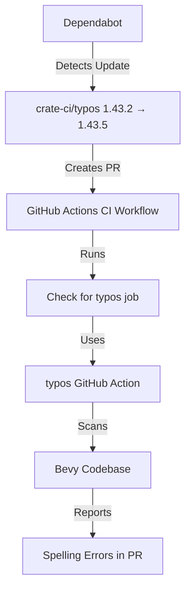

+++
title = "#23164 Bump crate-ci/typos from 1.43.2 to 1.43.5"
date = "2026-02-27T00:00:00"
draft = false
template = "pull_request_page.html"
in_search_index = true

[taxonomies]
list_display = ["show"]

[extra]
current_language = "en"
available_languages = {"en" = { name = "English", url = "/pull_request/bevy/2026-02/pr-23164-en-20260227" }, "zh-cn" = { name = "中文", url = "/pull_request/bevy/2026-02/pr-23164-zh-cn-20260227" }}
labels = ["C-Dependencies"]
+++

# Title
Bump crate-ci/typos from 1.43.2 to 1.43.5

## Basic Information
- **Title**: Bump crate-ci/typos from 1.43.2 to 1.43.5
- **PR Link**: https://github.com/bevyengine/bevy/pull/23164
- **Author**: app/dependabot
- **Status**: MERGED
- **Labels**: C-Dependencies
- **Created**: 2026-02-27T06:54:09Z
- **Merged**: 2026-02-27T08:31:40Z
- **Merged By**: mockersf

## Description Translation
Bumps [crate-ci/typos](https://github.com/crate-ci/typos) from 1.43.2 to 1.43.5.
<details>
<summary>Release notes</summary>
<p><em>Sourced from <a href="https://github.com/crate-ci/typos/releases">crate-ci/typos's releases</a>.</em></p>
<blockquote>
<h2>v1.43.5</h2>
<h2>[1.43.5] - 2026-02-16</h2>
<h3>Fixes</h3>
<ul>
<li><em>(pypi)</em> Hopefully fix the sdist build</li>
</ul>
<h2>v1.43.4</h2>
<h2>[1.43.4] - 2026-02-09</h2>
<h3>Fixes</h3>
<ul>
<li>Don't correct <code>pincher</code></li>
</ul>
<h2>v1.43.3</h2>
<h2>[1.43.3] - 2026-02-06</h2>
<h3>Fixes</h3>
<ul>
<li><em>(action)</em> Adjust how typos are reported to github</li>
</ul>
</blockquote>
</details>
<details>
<summary>Changelog</summary>
<p><em>Sourced from <a href="https://github.com/crate-ci/typos/blob/master/CHANGELOG.md">crate-ci/typos's changelog</a>.</em></p>
<blockquote>
<h1>Change Log</h1>
<p>All notable changes to this project will be documented in this file.</p>
<p>The format is based on <a href="https://keepachangelog.com/">Keep a Changelog</a>
and this project adheres to <a href="https://semver.org/">Semantic Versioning</a>.</p>
<!-- raw HTML omitted -->
<h2>[Unreleased] - ReleaseDate</h2>
<h2>[1.43.5] - 2026-02-16</h2>
<h3>Fixes</h3>
<ul>
<li><em>(pypi)</em> Hopefully fix the sdist build</li>
</ul>
<h2>[1.43.4] - 2026-02-09</h2>
<h3>Fixes</h3>
<ul>
<li>Don't correct <code>pincher</code></li>
</ul>
<h2>[1.43.3] - 2026-02-06</h2>
<h3>Fixes</h3>
<ul>
<li><em>(action)</em> Adjust how typos are reported to github</li>
</ul>
<h2>[1.43.2] - 2026-02-05</h2>
<h3>Fixes</h3>
<ul>
<li>Don't correct <code>certifi</code> in Python</li>
</ul>
<h2>[1.43.1] - 2026-02-03</h2>
<h3>Fixes</h3>
<ul>
<li>Don't correct <code>consts</code></li>
</ul>
<h2>[1.43.0] - 2026-02-02</h2>
<h3>Compatibility</h3>
<ul>
<li>Bumped MSRV to 1.91</li>
</ul>
<h3>Features</h3>
<ul>
<li>Updated the dictionary with the <a href="https://redirect.github.com/crate-ci/typos/issues/1453">January 2026</a> changes</li>
</ul>
<h2>[1.42.3] - 2026-01-27</h2>
<!-- raw HTML omitted -->
</blockquote>
<p>... (truncated)</p>
</details>
<details>
<summary>Commits</summary>
<ul>
<li><a href="https://github.com/crate-ci/typos/commit/57b11c6b7e54c402ccd9cda953f1072ec4f78e33"><code>57b11c6</code></a> chore: Release</li>
<li><a href="https://github.com/crate-ci/typos/commit/105ced22a5a7fedc36cbef6e5dec31b708e9ec5b"><code>105ced2</code></a> docs: Update changelog</li>
<li><a href="https://github.com/crate-ci/typos/commit/4f89be7e4a7933f8d9693a9da7a9e9258a8671ba"><code>4f89be7</code></a> Merge pull request <a href="https://redirect.github.com/crate-ci/typos/issues/1504">#1504</a> from schnellerhase/bump-maturin</li>
<li><a href="https://github.com/crate-ci/typos/commit/d8547ad9c141d0e2c568b2344f0804a446ff25ab"><code>d8547ad</code></a> Merge pull request <a href="https://redirect.github.com/crate-ci/typos/issues/1503">#1503</a> from 1195343015/patch-1</li>
<li><a href="https://github.com/crate-ci/typos/commit/60527f035022b26d0bef93eb0fb200d7695cea2c"><code>60527f0</code></a> Bump maturin to 1.12</li>
<li><a href="https://github.com/crate-ci/typos/commit/3a925adab9a1c7f22a3de3d0022beb8f5aa805d6"><code>3a925ad</code></a> [Bugfix] Fix whitespace in unicode setting</li>
<li><a href="https://github.com/crate-ci/typos/commit/78bc6fb2c0d734235d57a2d6b9de923cc325ebdd"><code>78bc6fb</code></a> chore: Release</li>
<li><a href="https://github.com/crate-ci/typos/commit/c3402c65ca9b75eeb384e273897a1e1bf6253c8c"><code>c3402c6</code></a> docs: Update changelog</li>
<li><a href="https://github.com/crate-ci/typos/commit/5ad68cd6764508d8bf2d9db7fafb9fbbe58427ec"><code>5ad68cd</code></a> Merge pull request <a href="https://redirect.github.com/crate-ci/typos/issues/1500">#1500</a> from epage/pincher</li>
<li><a href="https://github.com/crate-ci/typos/commit/390736476ea5a958a42dbc5b838c037813cfdab4"><code>3907364</code></a> fix(dict): Allow pincher</li>
<li>Additional commits viewable in <a href="https://github.com/crate-ci/typos/compare/ad3053d3adbcce7f2e3c60fd4ddfc239787d1eff...57b11c6b7e54c402ccd9cda953f1072ec4f78e33">compare view</a></li>
</ul>
</details>
<br />


[](https://docs.github.com/en/github/managing-security-vulnerabilities/about-dependabot-security-updates#about-compatibility-scores)

Dependabot will resolve any conflicts with this PR as long as you don't alter it yourself. You can also trigger a rebase manually by commenting `@dependabot rebase`.

[//]: # (dependabot-automerge-start)
[//]: # (dependabot-automerge-end)

---

<details>
<summary>Dependabot commands and options</summary>
<br />

You can trigger Dependabot actions by commenting on this PR:
- `@dependabot rebase` will rebase this PR
- `@dependabot recreate` will recreate this PR, overwriting any edits that have been made to it
- `@dependabot show <dependency name> ignore conditions` will show all of the ignore conditions of the specified dependency
- `@dependabot ignore this major version` will close this PR and stop Dependabot creating any more for this major version (unless you reopen the PR or upgrade to it yourself)
- `@dependabot ignore this minor version` will close this PR and stop Dependabot creating any more for this minor version (unless you reopen the PR or upgrade to it yourself)
- `@dependabot ignore this dependency` will close this PR and stop Dependabot creating any more for this dependency (unless you reopen the PR or upgrade to it yourself)


</details>

## The Story of This Pull Request

This pull request is a straightforward dependency update for the Bevy project's CI workflow. The repository uses Dependabot, GitHub's automated dependency management tool, to keep external dependencies current. Dependabot detected that the crate-ci/typos GitHub Action used in the CI pipeline had newer versions available and automatically created this PR to update from version 1.43.2 to 1.43.5.

The typos tool is a spell checker specifically designed for source code, documentation, and other text files in software projects. It's integrated into Bevy's CI pipeline to catch spelling errors before they reach production. This helps maintain code quality and ensures documentation clarity. The update from 1.43.2 to 1.43.5 includes several bug fixes and improvements that make the tool more reliable and accurate.

Looking at the release notes, version 1.43.3 included an important fix for how typos are reported to GitHub. This is particularly relevant for CI workflows because it affects how error messages and annotations appear in pull request reviews. Version 1.43.4 addressed a false positive where the tool was incorrectly flagging "pincher" as a typo. Version 1.43.5 attempted to fix the sdist (source distribution) build for PyPI, though this particular fix might not directly impact Bevy since they're using the GitHub Action rather than the Python package.

The decision to merge this update follows standard dependency management practices. The compatibility score shown in the PR indicates high backward compatibility, reducing the risk of breaking changes. Since the updates are all bug fixes (following semantic versioning where 1.43.2 to 1.43.5 represents patch version increments), they should be safe to integrate without requiring code changes in the Bevy codebase itself.

Maintaining updated dependencies in CI workflows is important for several reasons. First, it ensures the project benefits from bug fixes and improvements. Second, it reduces the risk of using deprecated or unsupported versions. Third, it keeps the security posture current, as dependencies can sometimes contain security vulnerabilities. Finally, it helps avoid "dependency drift" where projects fall significantly behind current versions, making future updates more difficult.

The PR was merged by a maintainer about 1.5 hours after creation, indicating this was a routine update that didn't require extensive review or testing beyond verifying the compatibility score and checking the release notes for any breaking changes.

## Visual Representation



## Key Files Changed

**.github/workflows/ci.yml** (+1/-1)

This is the only file modified in this PR. The change updates the version of the crate-ci/typos GitHub Action used in the CI workflow.

Before the change:
```yaml
- name: Check for typos
  uses: crate-ci/typos@ad3053d3adbcce7f2e3c60fd4ddfc239787d1eff # v1.43.2
```

After the change:
```yaml
- name: Check for typos
  uses: crate-ci/typos@57b11c6b7e54c402ccd9cda953f1072ec4f78e33 # v1.43.5
```

The change is minimal but important. The GitHub Actions workflow pins dependencies using specific commit SHAs rather than version tags for security and reproducibility. The update changes both the commit SHA reference and the comment indicating the version. This ensures that the CI pipeline uses the latest bug-fixed version of the typos tool while maintaining the security benefits of pinning to exact commits.

## Further Reading

1. [GitHub Actions: Using actions from the GitHub Marketplace](https://docs.github.com/en/actions/using-workflows/using-github-marketplace-actions-in-github)
2. [Dependabot: Keeping your dependencies updated automatically](https://docs.github.com/en/code-security/dependabot/dependabot-version-updates/about-dependabot-version-updates)
3. [crate-ci/typos: Source code spell checker](https://github.com/crate-ci/typos)
4. [Semantic Versioning: How version numbers communicate changes](https://semver.org/)
5. [GitHub Actions Security: Pinning actions by commit SHA](https://docs.github.com/en/actions/security-guides/security-hardening-for-github-actions#using-third-party-actions)

# Full Code Diff
```diff
diff --git a/.github/workflows/ci.yml b/.github/workflows/ci.yml
index 1c467e9c4bd42..7149a3850d234 100644
--- a/.github/workflows/ci.yml
+++ b/.github/workflows/ci.yml
@@ -374,7 +374,7 @@ jobs:
         with:
           persist-credentials: false
       - name: Check for typos
-        uses: crate-ci/typos@ad3053d3adbcce7f2e3c60fd4ddfc239787d1eff # v1.43.2
+        uses: crate-ci/typos@57b11c6b7e54c402ccd9cda953f1072ec4f78e33 # v1.43.5
       - name: Typos info
         if: failure()
         run: |
```