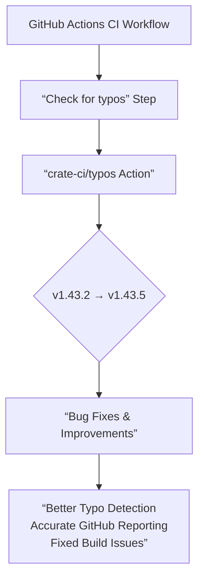

+++
title = "#23164 Bump crate-ci/typos from 1.43.2 to 1.43.5"
date = "2026-02-27T00:00:00"
draft = false
template = "pull_request_page.html"
in_search_index = false

[extra]
current_language = "zh-cn"
available_languages = {"en" = { name = "English", url = "/pull_request/bevy/2026-02/pr-23164-en-20260227" }, "zh-cn" = { name = "中文", url = "/pull_request/bevy/2026-02/pr-23164-zh-cn-20260227" }}
labels = ["C-Dependencies"]
+++

# Title

## Basic Information
- **Title**: Bump crate-ci/typos from 1.43.2 to 1.43.5
- **PR Link**: https://github.com/bevyengine/bevy/pull/23164
- **Author**: app/dependabot
- **Status**: MERGED
- **Labels**: C-Dependencies
- **Created**: 2026-02-27T06:54:09Z
- **Merged**: 2026-02-27T08:31:40Z
- **Merged By**: mockersf

## Description Translation
Bumps [crate-ci/typos](https://github.com/crate-ci/typos) from 1.43.2 to 1.43.5.
<details>
<summary>Release notes</summary>
<p><em>Sourced from <a href="https://github.com/crate-ci/typos/releases">crate-ci/typos's releases</a>.</em></p>
<blockquote>
<h2>v1.43.5</h2>
<h2>[1.43.5] - 2026-02-16</h2>
<h3>Fixes</h3>
<ul>
<li><em>(pypi)</em> Hopefully fix the sdist build</li>
</ul>
<h2>v1.43.4</h2>
<h2>[1.43.4] - 2026-02-09</h2>
<h3>Fixes</h3>
<ul>
<li>Don't correct <code>pincher</code></li>
</ul>
<h2>v1.43.3</h2>
<h2>[1.43.3] - 2026-02-06</h2>
<h3>Fixes</h3>
<ul>
<li><em>(action)</em> Adjust how typos are reported to github</li>
</ul>
</blockquote>
</details>
<details>
<summary>Changelog</summary>
<p><em>Sourced from <a href="https://github.com/crate-ci/typos/blob/master/CHANGELOG.md">crate-ci/typos's changelog</a>.</em></p>
<blockquote>
<h1>Change Log</h1>
<p>All notable changes to this project will be documented in this file.</p>
<p>The format is based on <a href="https://keepachangelog.com/">Keep a Changelog</a>
and this project adheres to <a href="https://semver.org/">Semantic Versioning</a>.</p>
<!-- raw HTML omitted -->
<h2>[Unreleased] - ReleaseDate</h2>
<h2>[1.43.5] - 2026-02-16</h2>
<h3>Fixes</h3>
<ul>
<li><em>(pypi)</em> Hopefully fix the sdist build</li>
</ul>
<h2>[1.43.4] - 2026-02-09</h2>
<h3>Fixes</h3>
<ul>
<li>Don't correct <code>pincher</code></li>
</ul>
<h2>[1.43.3] - 2026-02-06</h2>
<h3>Fixes</h3>
<ul>
<li><em>(action)</em> Adjust how typos are reported to github</li>
</ul>
<h2>[1.43.2] - 2026-02-05</h2>
<h3>Fixes</h3>
<ul>
<li>Don't correct <code>certifi</code> in Python</li>
</ul>
<h2>[1.43.1] - 2026-02-03</h2>
<h3>Fixes</h3>
<ul>
<li>Don't correct <code>consts</code></li>
</ul>
<h2>[1.43.0] - 2026-02-02</h2>
<h3>Compatibility</h3>
<ul>
<li>Bumped MSRV to 1.91</li>
</ul>
<h3>Features</h3>
<ul>
<li>Updated the dictionary with the <a href="https://redirect.github.com/crate-ci/typos/issues/1453">January 2026</a> changes</li>
</ul>
<h2>[1.42.3] - 2026-01-27</h2>
<!-- raw HTML omitted -->
</blockquote>
<p>... (truncated)</p>
</details>
<details>
<summary>Commits</summary>
<ul>
<li><a href="https://github.com/crate-ci/typos/commit/57b11c6b7e54c402ccd9cda953f1072ec4f78e33"><code>57b11c6</code></a> chore: Release</li>
<li><a href="https://github.com/crate-ci/typos/commit/105ced22a5a7fedc36cbef6e5dec31b708e9ec5b"><code>105ced2</code></a> docs: Update changelog</li>
<li><a href="https://github.com/crate-ci/typos/commit/4f89be7e4a7933f8d9693a9da7a9e9258a8671ba"><code>4f89be7</code></a> Merge pull request <a href="https://redirect.github.com/crate-ci/typos/issues/1504">#1504</a> from schnellerhase/bump-maturin</li>
<li><a href="https://github.com/crate-ci/typos/commit/d8547ad9c141d0e2c568b2344f0804a446ff25ab"><code>d8547ad</code></a> Merge pull request <a href="https://redirect.github.com/crate-ci/typos/issues/1503">#1503</a> from 1195343015/patch-1</li>
<li><a href="https://github.com/crate-ci/typos/commit/60527f035022b26d0bef93eb0fb200d7695cea2c"><code>60527f0</code></a> Bump maturin to 1.12</li>
<li><a href="https://github.com/crate-ci/typos/commit/3a925adab9a1c7f22a3de3d0022beb8f5aa805d6"><code>3a925ad</code></a> [Bugfix] Fix whitespace in unicode setting</li>
<li><a href="https://github.com/crate-ci/typos/commit/78bc6fb2c0d734235d57a2d6b9de923cc325ebdd"><code>78bc6fb</code></a> chore: Release</li>
<li><a href="https://github.com/crate-ci/typos/commit/c3402c65ca9b75eeb384e273897a1e1bf6253c8c"><code>c3402c6</code></a> docs: Update changelog</li>
<li><a href="https://github.com/crate-ci/typos/commit/5ad68cd6764508d8bf2d9db7fafb9fbbe58427ec"><code>5ad68cd</code></a> Merge pull request <a href="https://redirect.github.com/crate-ci/typos/issues/1500">#1500</a> from epage/pincher</li>
<li><a href="https://github.com/crate-ci/typos/commit/390736476ea5a958a42dbc5b838c037813cfdab4"><code>3907364</code></a> fix(dict): Allow pincher</li>
<li>Additional commits viewable in <a href="https://github.com/crate-ci/typos/compare/ad3053d3adbcce7f2e3c60fd4ddfc239787d1eff...57b11c6b7e54c402ccd9cda953f1072ec4f78e33">compare view</a></li>
</ul>
</details>
<br />


[](https://docs.github.com/en/github/managing-security-vulnerabilities/about-dependabot-security-updates#about-compatibility-scores)

Dependabot will resolve any conflicts with this PR as long as you don't alter it yourself. You can also trigger a rebase manually by commenting `@dependabot rebase`.

[//]: # (dependabot-automerge-start)
[//]: # (dependabot-automerge-end)

---

<details>
<summary>Dependabot commands and options</summary>
<br />

You can trigger Dependabot actions by commenting on this PR:
- `@dependabot rebase` will rebase this PR
- `@dependabot recreate` will recreate this PR, overwriting any edits that have been made to it
- `@dependabot show <dependency name> ignore conditions` will show all of the ignore conditions of the specified dependency
- `@dependabot ignore this major version` will close this PR and stop Dependabot creating any more for this major version (unless you reopen the PR or upgrade to it yourself)
- `@dependabot ignore this minor version` will close this PR and stop Dependabot creating any more for this minor version (unless you reopen the PR or upgrade to it yourself)
- `@dependabot ignore this dependency` will close this PR and stop Dependabot creating any more for this dependency (unless you reopen the PR or upgrade to it yourself)


</details>

## The Story of This Pull Request

这个PR由Dependabot自动创建，目的是更新项目CI工作流中使用的一个代码质量工具。项目在`.github/workflows/ci.yml`中使用了`crate-ci/typos`这个GitHub Action来检查代码和文档中的拼写错误。

从v1.43.2更新到v1.43.5是一个小版本升级，包含了三个补丁版本的修复。根据变更日志，新版本解决了几个具体问题：在v1.43.3中，修复了typos如何向GitHub报告错误的机制；在v1.43.4中，将"pincher"一词加入白名单，避免将其误判为拼写错误；在v1.43.5中，尝试修复了Python包分发包(sdist)的构建问题。

虽然这个PR的变更看似微小，只修改了一行代码，但它反映了现代软件开发中依赖管理的最佳实践。`typos`作为一个静态分析工具，其准确性直接影响到开发体验。例如，将有效的技术术语（如`pincher`）误报为拼写错误，可能会干扰正常的代码审查流程。同样，修复向GitHub报告问题的机制，能确保在CI失败时，开发者能获得更清晰、更有用的错误信息，从而快速定位并修复真正的拼写问题。

这个PR的合并过程非常标准：Dependabot检测到新版本并自动创建PR，维护者确认变更内容后将其合并。兼容性评分(compatibility score)显示为高分，表明此次升级风险较低。PR描述中详细列出了版本发布说明、完整的变更日志和相关提交，为代码审查提供了充分的上下文信息，使得维护者能够基于透明信息做出合并决策。

在工程实践上，这种依赖更新策略有几个优点：首先，它帮助项目保持安全性和稳定性，因为依赖更新通常包含错误修复；其次，它通过自动化减少了维护者的手动工作；最后，它确保代码质量工具本身保持最新，从而能以最佳状态工作。

## Visual Representation



## Key Files Changed

- `.github/workflows/ci.yml` (+1/-1)

这个文件是GitHub Actions的持续集成(Continuous Integration， CI)工作流配置文件。它定义了在代码推送或拉取请求(Pull Request)时自动运行的测试、构建和检查任务。

此次变更将`typos`工具的版本从`v1.43.2`的特定提交哈希更新到了`v1.43.5`的提交哈希。在GitHub Actions中，使用`uses:`字段来引用一个Action时，可以指定一个标签（如`@v1.43.2`）或一个具体的提交SHA。这里使用了提交SHA的方式，这通常被认为是一种更精确、更安全的引用方式，因为它锁定了Action的确切版本，避免了标签被移动所带来的潜在风险。

**代码修改：**
```yaml
# File: .github/workflows/ci.yml
# Before:
      - name: Check for typos
        uses: crate-ci/typos@ad3053d3adbcce7f2e3c60fd4ddfc239787d1eff # v1.43.2

# After:
      - name: Check for typos
        uses: crate-ci/typos@57b11c6b7e54c402ccd9cda953f1072ec4f78e33 # v1.43.5
```

这个修改确保了CI流程中的拼写检查步骤使用了最新稳定版本的`typos`工具，从而应用了上述提到的所有错误修复和功能改进。

## Further Reading

1.  **GitHub Actions Documentation**: https://docs.github.com/en/actions
    - 了解如何配置和使用GitHub Actions进行持续集成和持续部署(CI/CD)。

2.  **crate-ci/typos 项目仓库**: https://github.com/crate-ci/typos
    - 深入了解`typos`工具的功能、配置选项及其词典更新机制。

3.  **Dependabot Documentation**: https://docs.github.com/en/code-security/dependabot
    - 学习如何配置和使用Dependabot来自动化依赖项更新，包括对GitHub Actions的更新。

4.  **关于语义化版本控制(Semantic Versioning)**: https://semver.org/
    - 理解版本号（主版本号.次版本号.修订号）变化的含义，这有助于评估依赖更新的影响和风险。

# Full Code Diff
diff --git a/.github/workflows/ci.yml b/.github/workflows/ci.yml
index 1c467e9c4bd42..7149a3850d234 100644
--- a/.github/workflows/ci.yml
+++ b/.github/workflows/ci.yml
@@ -374,7 +374,7 @@ jobs:
         with:
           persist-credentials: false
       - name: Check for typos
-        uses: crate-ci/typos@ad3053d3adbcce7f2e3c60fd4ddfc239787d1eff # v1.43.2
+        uses: crate-ci/typos@57b11c6b7e54c402ccd9cda953f1072ec4f78e33 # v1.43.5
       - name: Typos info
         if: failure()
         run: |