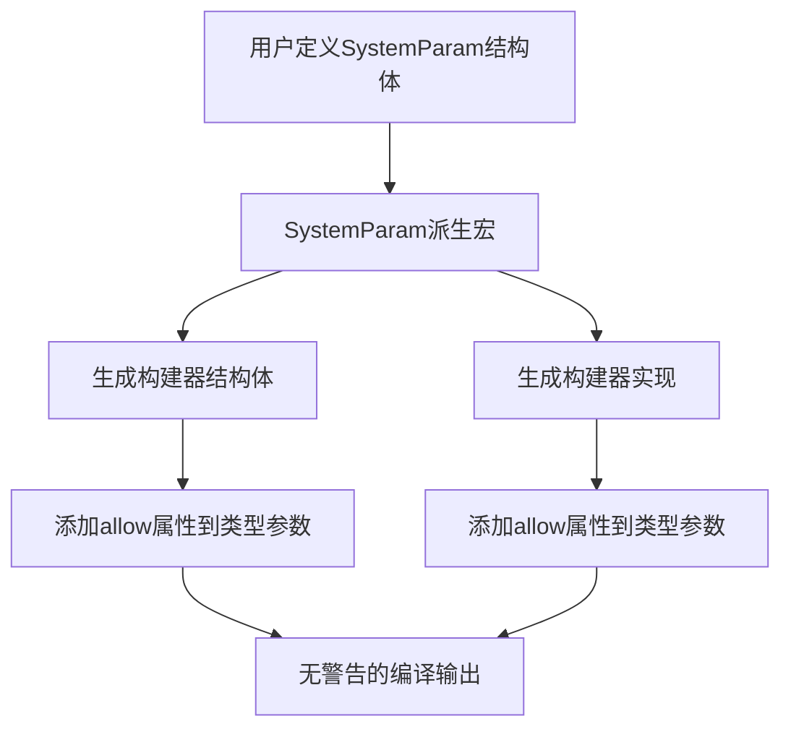

+++
title = "#22324 Fix: Allow non_camel_case_types on derived SystemParamBuilder generics"
date = "2026-03-05T00:00:00"
draft = false
template = "pull_request_page.html"
in_search_index = false

[extra]
current_language = "zh-cn"
available_languages = {"en" = { name = "English", url = "/pull_request/bevy/2026-03/pr-22324-en-20260305" }, "zh-cn" = { name = "中文", url = "/pull_request/bevy/2026-03/pr-22324-zh-cn-20260305" }}
+++

# Title

## 基本信息
- **标题**: Fix: Allow non_camel_case_types on derived SystemParamBuilder generics
- **PR链接**: https://github.com/bevyengine/bevy/pull/22324
- **作者**: Fachep
- **状态**: 已合并
- **标签**: C-Bug, A-ECS, S-Ready-For-Final-Review, X-Uncontroversial, D-Straightforward, D-Macros
- **创建时间**: 2025-12-31T14:36:03Z
- **合并时间**: 2026-03-04T23:07:31Z
- **合并者**: alice-i-cecile

## 描述翻译
### 目标
修复由 `#[system_param(builder)]` 生成的泛型类型参数引发的 `non_camel_case_types` 警告。

```rust
#[derive(SystemParam)]
#[system_param(builder)]
struct MySystemParam<'w, 's> {
    query_field: Query<'w, 's ,Entity>,
}
```

```
> cargo check
...
warning: type parameter `Bquery_field` should have an upper camel case name
   --> src\lib.rs:171:9
    |
171 |         query_field: Query<'w, 's ,Entity>,
    |         ^^^^^^^^^^^ help: convert the identifier to upper camel case: `BqueryField`
...
```

### 解决方案
在声明每个生成的类型参数时，在 `SystemParam` 派生宏中添加 `#[allow(non_camel_case_types)]`。

### 测试
通过在 Cargo.toml 中引用此分支，运行 `cargo check` 时，上述用法不再产生警告。

## PR的技术分析

这个PR解决了一个特定但重要的问题：当使用Bevy ECS中的`#[system_param(builder)]`属性时，如果结构体字段使用蛇形命名法（snake_case），生成的构建器类型参数会触发Rust的命名规范警告。

问题的核心在于派生宏的实现细节。当为`SystemParam`派生构建器时，宏会为每个字段生成对应的类型参数。这些类型参数的名称是通过在字段名前添加前缀"B"来构建的，例如字段`query_field`会生成类型参数`Bquery_field`。这个名称保持了字段的蛇形命名，但这违反了Rust的类型命名规范——类型应该使用大驼峰命名法（UpperCamelCase）。

开发者面临的选择有限：要么将生成的类型参数转换为大驼峰命名（例如`Bquery_field`变为`BqueryField`），要么抑制这个警告。选择抑制警告有以下几个原因：

1. **保持一致性**：生成的类型参数名称直接映射到原始字段名，使调试和理解生成的代码更容易
2. **避免破坏性变更**：改变命名规则可能会影响现有的使用模式
3. **最小化影响**：`#[allow]`属性只针对生成的代码，不会影响用户代码的其他部分

实现方案非常直接。在`bevy_ecs/macros`模块的`derive_system_param_impl`函数中，修改了两处代码生成逻辑：

首先，在构建器结构体的定义中，为每个类型参数添加了`#[allow(non_camel_case_types)]`属性。这不仅抑制了警告，还通过`reason`参数提供了清晰的解释，说明这些名称是从蛇形命名的字段名生成的。

其次，在对应的`unsafe impl`块中，同样为每个类型参数添加了相同的属性。这是必要的，因为实现中也会引用这些类型参数。

这种解决方案体现了Rust宏开发中的一个常见模式：当宏生成不符合常规命名约定的代码时，应该添加适当的`#[allow]`属性，避免将宏内部的实现细节暴露为用户的编译警告。

从架构角度看，这个修复保持了Bevy ECS宏系统的用户体验。用户可以使用任何符合Rust标识符规则的字段名，而不会受到不必要的警告干扰。同时，它也没有改变生成的API或类型系统特性，只是影响了代码的静态检查。

这个PR的技术价值在于展示了如何处理宏生成代码中的规范冲突问题。在复杂的元编程场景中，宏作者需要仔细考虑生成的代码与语言规范的交互方式。这里的解决方案既实用又符合最小侵入原则——只在必要的地方抑制警告，而不是全局禁用。

## 视觉表示



## 关键文件更改

### `crates/bevy_ecs/macros/src/lib.rs`

**更改描述**：在`SystemParam`派生宏的实现中，为生成的构建器类型参数添加`#[allow(non_camel_case_types)]`属性，以抑制因从蛇形命名字段生成类型参数而引发的警告。

**关键代码片段**：
```rust
// 修改前（第387行）:
struct #builder_name<#(#builder_type_parameters,)*> {
    #(#field_members: #builder_type_parameters,)*
}

// 修改后:
struct #builder_name<#(#[allow(non_camel_case_types, reason = "generated from snake-case field name")] #builder_type_parameters,)*> {
    #(#field_members: #builder_type_parameters,)*
}
```

```rust
// 修改前（第397行）:
#(#builder_type_parameters: #path::system::SystemParamBuilder<#field_types>,)*

// 修改后:
#(#[allow(non_camel_case_types, reason = "generated from snake-case field name")] #builder_type_parameters: #path::system::SystemParamBuilder<#field_types>,)*
```

**与PR目的的关系**：这两处修改直接解决了问题。第一处修改确保构建器结构体的定义不会触发警告，第二处修改确保实现块也不会触发警告。通过添加`reason`参数，代码还提供了清晰的文档说明为什么需要抑制这个警告。

## 延伸阅读

- [Rust命名规范（RFC 430）](https://rust-lang.github.io/rfcs/0430-finalizing-naming-conventions.html) - 了解Rust的命名约定
- [Bevy ECS系统参数文档](https://docs.rs/bevy_ecs/latest/bevy_ecs/system/trait.SystemParam.html) - 了解SystemParam的工作原理
- [Rust属性语法](https://doc.rust-lang.org/reference/attributes.html) - 了解`#[allow]`等属性的使用
- [过程宏开发指南](https://doc.rust-lang.org/reference/procedural-macros.html) - 了解如何编写类似`SystemParam`的派生宏