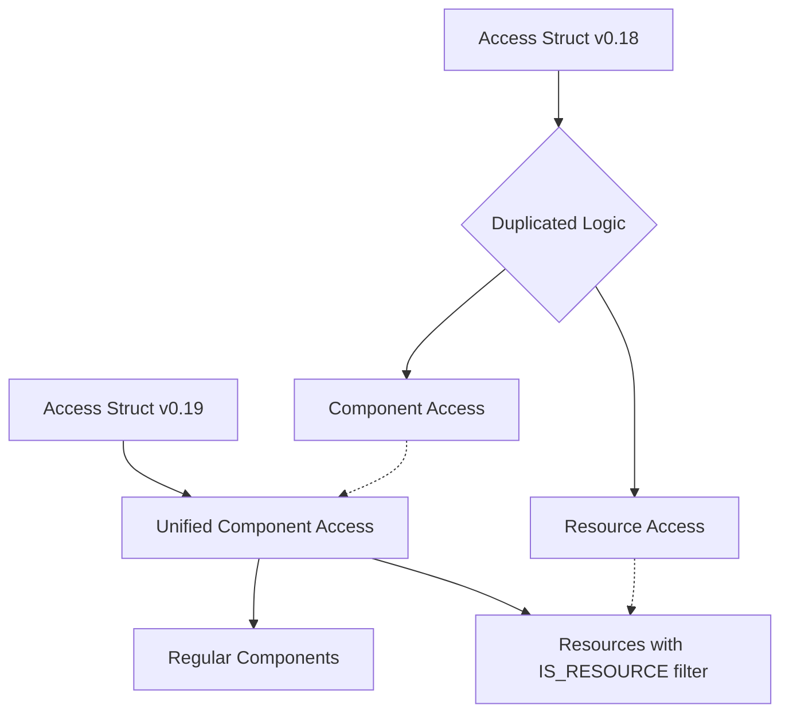

+++
title = "#22910 Remove resources from `Access`"
date = "2026-03-03T00:00:00"
draft = false
template = "pull_request_page.html"
in_search_index = true

[taxonomies]
list_display = ["show"]

[extra]
current_language = "en"
available_languages = {"en" = { name = "English", url = "/pull_request/bevy/2026-03/pr-22910-en-20260303" }, "zh-cn" = { name = "中文", url = "/pull_request/bevy/2026-03/pr-22910-zh-cn-20260303" }}
labels = ["A-ECS", "C-Code-Quality", "M-Migration-Guide", "D-Unsafe"]
+++

# Title

## Basic Information
- **Title**: Remove resources from `Access`
- **PR Link**: https://github.com/bevyengine/bevy/pull/22910
- **Author**: Trashtalk217
- **Status**: MERGED
- **Labels**: A-ECS, C-Code-Quality, S-Ready-For-Final-Review, M-Migration-Guide, D-Unsafe
- **Created**: 2026-02-11T15:33:15Z
- **Merged**: 2026-03-03T00:17:04Z
- **Merged By**: alice-i-cecile

## Description Translation

# Objective

There's a lot of code duplication in `access.rs`. The same logic is duplicated between components and resources. This also takes up unnecessary memory in `Access`, as it relies on bitsets spanning the entire `ComponentId` range.

## Solution

Since resources are now a special kind of component, this can be removed.

## Limitations

Since `!Send` data queries used `Access` resources, `!Send` data queries now conflict with broad queries.
```rust
// 0.18
fn system(q1_: Query<EntityMut>, q2_: NonSend<R>) {} // valid, does not conflict

// 0.19
fn system(q1_: Query<EntityMut>, q2_: NonSend<R>) {} // invalid, does conflict
```
Given how rarely non-send data is used, I recommend using
```
// 0.19
fn system(q1_: Query<EntityMut, Without<R>>, q2_: NonSend<R>) {} // works again
```

If this is also unacceptable, this PR is blocked on the `!Send` data removal from the ECS (or some hacky workaround).

## Extra Attention

@chescock  brought `AssetChanged` to my attention. It has a weird access pattern. See the following example:
```rust
fn system(c: Query<&mut AssetChanges<Mesh>>, r: Query<(), AssetChanged<Mesh>>) {}
```
System `c` registers access with `add_write` for `AssetChanges<Mesh>`, while `r` registers access with `add_read` for both `Mesh` and `AssetChanges<Mesh>`. This system is invalid, and I've added a test to reflect that. However, since this stuff is tricky, I would like some extra eyes on it. Currently, it looks *fine*.

## The Story of This Pull Request

This PR addresses a long-standing architectural issue in Bevy's Entity Component System (ECS). The core problem was that the `Access` struct maintained separate tracking for components and resources, despite resources being implemented as a special type of component since PR #20934. This duplication created both code bloat and unnecessary memory overhead.

The `Access` struct previously contained four separate bitsets:
- `component_read_and_writes`: Tracked which components were accessed
- `component_writes`: Tracked which components were written
- `resource_read_and_writes`: Tracked which resources were accessed  
- `resource_writes`: Tracked which resources were written

Additionally, there were separate boolean flags for resource access: `reads_all_resources` and `writes_all_resources`. This structure meant that every `Access` instance allocated bitsets covering the entire `ComponentId` range for both components and resources, even when tracking only one type.

The implementation followed logically from Bevy's architectural evolution. Initially, resources and components were distinct concepts with separate storage. PR #20934 unified them by making resources a special case of components, but the access tracking system wasn't updated to reflect this unification. The result was duplicate code paths for nearly identical logic.

The solution was straightforward in concept but required careful implementation. Since resources are now components, we could eliminate the resource-specific fields and methods, treating all access as component access. This meant:

1. Removing `resource_read_and_writes`, `resource_writes`, `reads_all_resources`, and `writes_all_resources` from the `Access` struct
2. Consolidating all access methods to work with a single unified bitset system
3. Updating all downstream code that used the now-removed resource-specific methods

The key implementation insight was that resource access could be distinguished from regular component access using the `IS_RESOURCE` marker component. When a system needs to access a resource, it adds the `IS_RESOURCE` filter to its `FilteredAccess`. This maintains the semantic distinction while using the same underlying machinery.

Here's the simplified `Access` struct after the changes:

```rust
pub struct Access {
    /// All accessed components, or forbidden components if
    /// `Self::read_and_writes_inverted` is set.
    read_and_writes: FixedBitSet,
    /// All exclusively-accessed components, or components that may not be
    /// exclusively accessed if `Self::writes_inverted` is set.
    writes: FixedBitSet,
    /// Is `true` if this component can read all components *except* those
    /// present in `Self::read_and_writes`.
    read_and_writes_inverted: bool,
    /// Is `true` if this can write to all components *except* those
    /// present in `Self::writes`.
    writes_inverted: bool,
    // Components that are not accessed, but whose presence in an archetype affect query results.
    archetypal: FixedBitSet,
}
```

The migration wasn't without trade-offs. The most significant change affects `!Send` data queries (now called non-send data). Previously, these used resource-specific access methods and didn't conflict with broad component queries. Now that all access is unified, a `NonSend<R>` parameter conflicts with queries like `Query<EntityMut>` that access all components. The PR author acknowledges this limitation but considers it acceptable given the rarity of non-send data usage. The workaround is to add `Without<R>` filters to broad queries.

The `AssetChanged` system parameter presented a special case. It has an unusual access pattern where it reads both the asset type and the `AssetChanges` resource. The implementation needed careful adjustment to handle this correctly within the new unified access system.

From a performance perspective, this change reduces memory usage for each `Access` instance by eliminating two bitsets and two boolean flags. It also simplifies conflict detection logic, which should improve cache locality and reduce branching. The codebase sees a net reduction of ~130 lines despite adding comprehensive deprecation warnings for the old API.

This refactoring exemplifies good technical debt management. It removes duplicate code, simplifies the architecture, and prepares the foundation for future ECS optimizations. The comprehensive migration guide and deprecation warnings ensure a smooth transition for users.

## Visual Representation



## Key Files Changed

### `crates/bevy_ecs/src/query/access.rs` (+341/-470)

This is the core file where the `Access` struct is defined. The changes completely redesign the struct to remove resource-specific tracking:

```rust
// Before:
pub struct Access {
    component_read_and_writes: FixedBitSet,
    component_writes: FixedBitSet,
    resource_read_and_writes: FixedBitSet,
    resource_writes: FixedBitSet,
    component_read_and_writes_inverted: bool,
    component_writes_inverted: bool,
    reads_all_resources: bool,
    writes_all_resources: bool,
    archetypal: FixedBitSet,
}

// After:
pub struct Access {
    read_and_writes: FixedBitSet,
    writes: FixedBitSet,
    read_and_writes_inverted: bool,
    writes_inverted: bool,
    archetypal: FixedBitSet,
}
```

All resource-specific methods were deprecated or removed, and component methods were renamed to more generic names (e.g., `add_component_read` → `add_read`).

### `crates/bevy_ecs/src/system/system_param.rs` (+80/-68)

This file contains system parameter implementations like `Res`, `ResMut`, `NonSend`, and `NonSendMut`. These needed updating to use the new unified access methods:

```rust
// Before in Res::init_access:
filter.add_component_read(component_id);
filter.add_resource_read(component_id);

// After in Res::init_access:
filter.add_read(component_id);
filter.and_with(IS_RESOURCE);
```

The conflict detection logic was also simplified since resources no longer have separate access tracking.

### `crates/bevy_ecs/src/query/mod.rs` (+6/-119)

Removed test code that specifically tested resource access compatibility. Since resources are now components, these tests are covered by existing component access tests.

### `crates/bevy_ecs/src/query/access_iter.rs` (+8/-66)

Simplified the `EcsAccessType` enum by removing the `Resource` variant since all access is now component access. The conflict detection logic was updated accordingly.

### `release-content/migration-guides/resources_as_components.md` (+67/-2)

Expanded the migration guide to cover the changes from this PR. Added detailed explanations about:
- Broad queries conflicting with resource access
- Updated API signatures for access methods
- How to fix systems that query all entities while also accessing resources

## Further Reading

1. [Bevy ECS Architecture](https://bevyengine.org/learn/advanced-topics/ecs/) - Official documentation on Bevy's ECS design
2. [PR #20934: Resources as Components](https://github.com/bevyengine/bevy/pull/20934) - The foundational PR that made resources a special case of components
3. [BitSet Data Structures](https://doc.rust-lang.org/std/collections/struct.BitSet.html) - Understanding the underlying data structure used for access tracking
4. [System Ordering and Parallelism](https://bevyengine.org/learn/advanced-topics/system-order/) - How access conflicts affect system scheduling