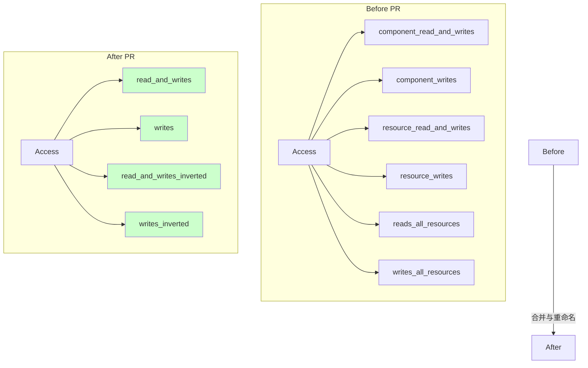

+++
title = "#22910 Remove resources from `Access`"
date = "2026-03-03T00:00:00"
draft = false
template = "pull_request_page.html"
in_search_index = false

[extra]
current_language = "zh-cn"
available_languages = {"en" = { name = "English", url = "/pull_request/bevy/2026-03/pr-22910-en-20260303" }, "zh-cn" = { name = "中文", url = "/pull_request/bevy/2026-03/pr-22910-zh-cn-20260303" }}
labels = ["A-ECS", "C-Code-Quality", "M-Migration-Guide", "D-Unsafe"]
+++

# Title

## Basic Information
- **Title**: Remove resources from `Access`
- **PR Link**: https://github.com/bevyengine/bevy/pull/22910
- **Author**: Trashtalk217
- **Status**: MERGED
- **Labels**: A-ECS, C-Code-Quality, S-Ready-For-Final-Review, M-Migration-Guide, D-Unsafe
- **Created**: 2026-02-11T15:33:15Z
- **Merged**: 2026-03-03T00:17:04Z
- **Merged By**: alice-i-cecile

## Description Translation

# Objective

`access.rs` 中存在大量代码重复。相同的逻辑在组件和资源之间被重复编写。这还会在 `Access` 中占用不必要的内存，因为它依赖于横跨整个 `ComponentId` 范围的位集。

## Solution

由于资源现在是一种特殊的组件，可以移除这种重复。

## Limitations

由于 `!Send` 数据查询使用 `Access` 资源，`!Send` 数据查询现在会与广泛查询冲突。
```rust
// 0.18
fn system(q1_: Query<EntityMut>, q2_: NonSend<R>) {} // 有效，不冲突

// 0.19
fn system(q1_: Query<EntityMut>, q2_: NonSend<R>) {} // 无效，会冲突
```
考虑到非发送数据的使用频率很低，我建议使用
```
// 0.19
fn system(q1_: Query<EntityMut, Without<R>>, q2_: NonSend<R>) {} // 再次有效
```

如果这也无法接受，此 PR 将被阻止，直到 ECS 移除 `!Send` 数据（或找到一些变通方案）。

## Extra Attention

@chescock 让我注意到 `AssetChanged`。它有一个奇怪的访问模式。请看下面的例子：
```rust
fn system(c: Query<&mut AssetChanges<Mesh>>, r: Query<(), AssetChanged<Mesh>>) {}
```
系统 `c` 使用 `add_write` 为 `AssetChanges<Mesh>` 注册访问，而 `r` 使用 `add_read` 为 `Mesh` 和 `AssetChanges<Mesh>` 注册访问。这个系统是无效的，我已经添加了一个测试来反映这一点。然而，由于这部分内容比较复杂，我希望能有更多的人关注。目前来看，它*应该没问题*。

## The Story of This Pull Request

这个 PR 的核心是简化 Bevy ECS 中访问控制 (`Access`) 的实现。在 Bevy 0.18 及更早版本中，资源和组件在底层虽然都是组件，但在 `Access` 结构体中被分开管理。这导致了代码重复和内存浪费。

**问题与背景**
`Access` 结构体负责跟踪查询或系统对哪些数据（组件和资源）拥有读写权限，用于检测和防止数据竞争。在旧实现中，`Access` 内部为组件和资源维护了独立的位集 (`FixedBitSet`) 和标志位：
- `component_read_and_writes`, `component_writes`: 用于组件访问。
- `resource_read_and_writes`, `resource_writes`: 用于资源访问。
- `reads_all_resources`, `writes_all_resources`: 用于标记访问所有资源。

由于资源本质上也是存储在特殊实体上的组件，这种分离是人为的。它导致了 `access.rs` 中几乎所有方法（如 `add_read`, `has_write`, `is_compatible`）都需要为组件和资源提供两个几乎相同的版本，造成了显著的代码重复。此外，资源位集需要覆盖所有可能的 `ComponentId`，即使大多数 ID 并不对应资源，这也造成了内存浪费。

**解决方案**
该 PR 的根本解决方案是统一组件和资源的访问逻辑。既然资源是组件，那么对它们的访问控制也应该使用同一套机制。因此，移除了 `Access` 中所有与资源相关的专用字段和方法，将组件的逻辑提升为通用逻辑。

**实现细节**
实现过程涉及对 `Access` 结构体及其相关类型（`FilteredAccess`, `FilteredAccessSet`）进行大规模重构：
1.  **字段合并**：删除了 `resource_read_and_writes`, `resource_writes`, `reads_all_resources`, `writes_all_resources`。将 `component_read_and_writes` 重命名为 `read_and_writes`，`component_writes` 重命名为 `writes`，并将对应的 `_inverted` 标志也重命名。
2.  **方法统一**：将所有 `add_component_read/write` 和 `add_resource_read/write` 方法合并为通用的 `add_read/write` 方法。旧方法被标记为弃用 (`deprecated`)。`has_*`, `remove_*`, `read_all_components/resources`, `write_all_components/resources` 等方法也进行了类似的合并和重命名。
3.  **逻辑简化**：删除了专门处理资源兼容性 (`is_resources_compatible`) 和资源子集检查 (`is_subset_resources`) 的方法，因为现在通用的 `is_compatible` 和 `is_subset` 方法已经足够。
4.  **冲突检测更新**：在 `access_iter.rs` 中，移除了 `ResourceAccessLevel` 枚举以及相关冲突检测路径，因为现在资源访问被表示为通用的组件访问。
5.  **系统参数适配**：更新了 `Res<T>`, `ResMut<T>`, `NonSend<T>`, `NonSendMut<T>` 等系统参数的初始化逻辑。它们不再调用专门的资源访问添加方法，而是使用通用的 `add_read/write` 方法，并附加 `IS_RESOURCE` 过滤器以标记这是对资源实体的访问。
6.  **错误处理改进**：为 `Res` 和 `ResMut` 的初始化逻辑改进了冲突错误信息。当检测到冲突时，现在会尝试格式化冲突列表，提供更清晰的错误信息。
7.  **测试与迁移**：更新了大量测试以使用新的 API。同时，更新了迁移指南 (`resources_as_components.md`)，详细说明了这一变化以及可能引起的系统冲突问题。

**技术洞察与影响**
1.  **代码简化与维护性**：这是最直接的收益。移除了约130行代码（+341/-470），消除了大量重复逻辑，使代码库更易于理解和维护。
2.  **内存使用**：理论上减少了内存占用，因为不再需要单独的资源位集。但更重要的影响可能是缓存局部性的潜在改善。
3.  **行为变化与迁移**：
    - **主要突破性变化**：由于资源现在通过通用的组件访问路径处理，任何试图“广泛”访问所有实体（例如 `Query<EntityMut>`, `Query<()>`, `Query<Option<&T>>`）的系统，现在都会与访问资源的系统（`Res<T>`, `NonSend<T>` 等）冲突。因为广泛查询隐含地会访问资源实体。PR描述和迁移指南明确指出了这一点，并建议使用 `Without<IsResource>` 或 `Without<R>` 过滤器来限制广泛查询，以解决冲突。
    - **API 清理**：大量旧方法被标记为弃用，引导用户转向更统一、简洁的新 API。
4.  **`AssetChanged` 的特殊性**：正如 PR 描述中指出的，`AssetChanged` 查询的访问模式比较特殊，它需要读取资源本身和对应的 `AssetChanges` 组件。重构后，其初始化逻辑 (`init_nested_access`) 也需要相应调整，使用新的 `add_read` 方法并添加 `IS_RESOURCE` 过滤器。PR 作者为此添加了测试以确保正确性。
5.  **架构一致性**：此更改是 Bevy 将资源完全视为组件这一长期架构方向的关键一步。它使 ECS 核心的内部模型更加统一和纯净。

总而言之，这个 PR 是一次成功的底层重构，它通过消除历史遗留的冗余设计，简化了 ECS 核心的访问控制逻辑，提高了代码质量，并为未来进一步的优化和功能开发奠定了更清晰的基础。代价是引入了一个需要开发者注意的突破性变化，但提供了明确的迁移路径。

## Visual Representation

此图展示了 PR 对 `Access` 结构体内部数据结构的主要变更：从分离的组件和资源字段合并为统一的字段。



## Key Files Changed

### 1. `crates/bevy_ecs/src/query/access.rs` (+341/-470)
**变化原因与概述**：这是本次重构的核心文件。移除了资源和组件访问的分离逻辑，统一了数据结构和方法。大量方法被重命名或合并，旧方法被标记为弃用。

**关键代码片段 - 结构体定义变更**：
```rust
// 之前:
pub struct Access {
    component_read_and_writes: FixedBitSet,
    component_writes: FixedBitSet,
    resource_read_and_writes: FixedBitSet,
    resource_writes: FixedBitSet,
    component_read_and_writes_inverted: bool,
    component_writes_inverted: bool,
    reads_all_resources: bool,
    writes_all_resources: bool,
    archetypal: FixedBitSet,
}

// 之后:
pub struct Access {
    read_and_writes: FixedBitSet,
    writes: FixedBitSet,
    read_and_writes_inverted: bool,
    writes_inverted: bool,
    archetypal: FixedBitSet,
}
```

**关键代码片段 - 方法合并示例**：
```rust
// 之前有多个独立的方法
pub fn add_component_read(&mut self, index: ComponentId) { ... }
pub fn add_resource_read(&mut self, index: ComponentId) { ... }

// 之后合并为一个通用方法，旧方法标记为弃用并转发调用
#[deprecated(since = "0.19.0", note = "use Access::add_read")]
pub fn add_component_read(&mut self, index: ComponentId) {
    self.add_read(index);
}
pub fn add_read(&mut self, index: ComponentId) { ... } // 通用实现
```

**与整体目标的关系**：此文件的变更是实现“从 Access 中移除资源”这一目标的最直接体现，通过数据结构合并消除了代码重复和内存浪费。

### 2. `crates/bevy_ecs/src/system/system_param.rs` (+80/-68)
**变化原因与概述**：更新了系统参数（如 `Res`, `ResMut`, `NonSend`, `NonSendMut`）的访问初始化逻辑，使其使用新的统一访问方法，并改进了错误信息。

**关键代码片段 - ResMut<T> 的初始化逻辑变更**：
```rust
// 之前：检查 resource_write 等专用方法，添加 resource_write
if combined_access.has_resource_write(component_id) { ... }
let mut filter = FilteredAccess::default();
filter.add_component_write(component_id);
filter.add_resource_write(component_id);
filter.and_with(IS_RESOURCE);

// 之后：使用通用方法，逻辑更简洁
let mut filter = FilteredAccess::default();
filter.add_write(component_id); // 使用统一的 add_write
filter.and_with(IS_RESOURCE);

let conflicts = component_access_set.get_conflicts_single(&filter);
if conflicts.is_empty() {
    component_access_set.add(filter);
    return;
}
// 改进的错误信息生成...
panic!("error[B0002]: ResMut<{}> in system {} conflicts...");
```

**与整体目标的关系**：确保系统参数与新的、统一的 `Access` API 协同工作，是重构得以生效的必要环节。

### 3. `crates/bevy_ecs/src/query/mod.rs` (+6/-119)
**变化原因与概述**：移除了一个专门用于测试资源访问的 `WorldQuery` 实现 (`ReadsRData`)。因为资源访问现在完全通过通用组件路径处理，不再需要这个特定的测试实现。

**与整体目标的关系**：清理了因架构变更而过时的测试代码，反映了资源访问不再是一个特殊路径。

### 4. `crates/bevy_ecs/src/query/access_iter.rs` (+8/-66)
**变化原因与概述**：简化了访问迭代和冲突检测逻辑。移除了 `ResourceAccessLevel` 枚举以及所有处理资源-组件、资源-资源、资源-访问之间冲突的代码分支。

**关键代码片段**：
```rust
// 之前：
pub enum EcsAccessType<'a> {
    Component(EcsAccessLevel),
    Resource(ResourceAccessLevel), // 被移除
    Access(&'a Access),
    Empty,
}
// `is_compatible` 方法中有大量处理 Resource 变体的匹配分支。

// 之后：
pub enum EcsAccessType<'a> {
    Component(EcsAccessLevel),
    Access(&'a Access), // Resource 变体被移除
    Empty,
}
// `is_compatible` 方法大大简化。
```

**与整体目标的关系**：访问迭代器是冲突检测的核心组件。移除资源专用类型使冲突检测逻辑与统一的 `Access` 模型保持一致，进一步简化了代码。

### 5. `release-content/migration-guides/resources_as_components.md` (+67/-2)
**变化原因与概述**：扩展了迁移指南，增加了关于“广泛查询与系统冲突”的新章节，详细解释了由于资源变为组件而可能引起的查询冲突，并提供了解决方案（使用 `Without` 过滤器）。

**关键内容**：
- 解释了为何 `Query<EntityMut>` 会与 `Res<MyResource>` 冲突。
- 提供了使用 `Without<IsResource>` 或 `Without<MyResource>` 的修复示例。
- 列出了所有可能引起冲突的“广泛查询”类型。
- 更新了 API 弃用列表，反映了 `access.rs` 中的大量方法重命名和移除。

**与整体目标的关系**：这是本次重构面向用户的最重要文档。它明确记录了突破性变化，并指导用户如何顺利迁移他们的代码，是保证变更平稳落地不可或缺的部分。

## Further Reading
1.  **Bevy ECS 官方文档**：关于调度器、系统与查询的章节，有助于理解访问控制的作用。
    - https://bevyengine.org/learn/quick-start/ecs-intro/
2.  **实体组件系统 (ECS) 模式**：了解 ECS 的基本设计理念，有助于理解为何将资源统一为组件是合理的。
    - 维基百科：Entity-component-system
3.  **数据导向设计**：Bevy ECS 深受此理念影响，访问控制的优化（如位集操作）是数据导向设计的典型实践。
    - 相关演讲或文章，如 Mike Acton 的 "Data-Oriented Design and C++"。
4.  **GitHub PR #20934**: 最初的“资源作为组件”变更，为本次 PR 奠定了基础。
    - https://github.com/bevyengine/bevy/pull/20934
5.  **Bevy 错误代码 B0002**：本次重构后，与访问冲突相关的错误信息会引导至此页面。
    - https://bevy.org/learn/errors/b0002 （链接已在 PR 描述的代码中使用）