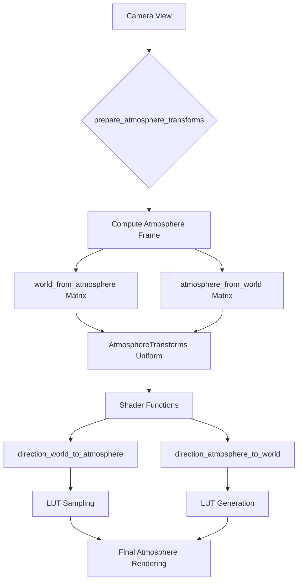

+++
title = "#22938 Fix atmosphere space view for LUT rendering"
date = "2026-03-04T00:00:00"
draft = false
template = "pull_request_page.html"
in_search_index = true

[taxonomies]
list_display = ["show"]

[extra]
current_language = "en"
available_languages = {"en" = { name = "English", url = "/pull_request/bevy/2026-03/pr-22938-en-20260304" }, "zh-cn" = { name = "中文", url = "/pull_request/bevy/2026-03/pr-22938-zh-cn-20260304" }}
labels = ["C-Bug", "A-Rendering"]
+++

# Title
## Basic Information
- **Title**: Fix atmosphere space view for LUT rendering
- **PR Link**: https://github.com/bevyengine/bevy/pull/22938
- **Author**: mate-h
- **Status**: MERGED
- **Labels**: C-Bug, A-Rendering, S-Ready-For-Final-Review
- **Created**: 2026-02-13T07:49:39Z
- **Merged**: 2026-03-04T22:49:13Z
- **Merged By**: alice-i-cecile

## Description Translation
**Objective**

Since introducing spherical coordinate systems and space views for Bevy's atmosphere in PR #20766, the LUT-based rendering had a remaining bug: when tilting the camera and viewing Earth from space, the lit/dark terminator rotated with the view instead of staying fixed. Raymarched rendering was correct, only the LUT path was affected. This PR fixes that by using an atmosphere frame that keeps the terminator stable while still concentrating texel density toward the horizon as in the Hillaire paper.

This is what the bug reproduction looks like on main: 

https://github.com/user-attachments/assets/e3488e41-d663-4b19-90c5-65b1fdb77b4c

With this change, the atmosphere rendering from space is officially supported using the LUT based method. That can be taken advantage of in lower end devices, or on a tight performance budget.

**Solution**

- Compute the atmosphere frame with local up for zenith and a world-fixed azimuth
- Use the atmosphere transform for both LUT generation and sampling via `direction_world_to_atmosphere`, effectively reverting this code block to the previous state before PR #20766
- Raymarch the sky view LUT from the actual camera position.

**Testing**

- Ran the atmosphere example by increasing the scene's scale
```rs
AtmosphereSettings {
    scene_units_to_m: 10e4,
    aerial_view_lut_max_distance: 3.2e4 * 128.0,
    ..default()
},
```

---

**Showcase**

new LUT based rendering:


raymarched rendering for reference "ground truth":


## The Story of This Pull Request

This PR addresses a specific bug in Bevy's atmosphere rendering system that affected the Look-Up Table (LUT) based rendering path when viewing the atmosphere from space. The issue was introduced in PR #20766, which added spherical coordinate systems and space view support. While the raymarched rendering path worked correctly, the LUT-based method had an incorrect coordinate transformation that caused visual artifacts when tilting the camera.

The core problem was in how the atmosphere coordinate frame (called "atmosphere space") was being constructed. In the buggy implementation, the atmosphere frame was tied to the camera's orientation, which meant that when the camera tilted, the entire coordinate system rotated with it. This caused the day-night terminator line (the boundary between lit and dark sides of the planet) to rotate with the camera view instead of remaining fixed relative to the world, which is physically incorrect.

The solution required revisiting the mathematical foundation of the atmosphere coordinate system. The atmosphere space needs to balance two competing requirements:
1. **Horizon detail concentration**: Following the Hillaire paper's approach, texel density should be concentrated toward the horizon for optimal visual quality
2. **World stability**: The coordinate system should maintain a consistent orientation relative to the world so atmospheric effects like the terminator remain stable

The implementation addresses this by creating an atmosphere frame where:
- The zenith (up vector) is the local planet surface normal at the camera's position
- The azimuth reference is fixed to a world direction (`Vec3A::NEG_Z`), projected orthogonal to the local up
- This creates a coordinate system that's locally aligned with the planet surface (for horizon detail) but globally stable (for terminator consistency)

The fix involved coordinated changes across multiple shader files and the Rust code that generates transformation matrices. The key insight was that the atmosphere transforms needed to include both `world_from_atmosphere` and `atmosphere_from_world` matrices, allowing shaders to convert directions in both directions efficiently.

In the shaders, the `direction_world_to_atmosphere` function was simplified to use the precomputed transformation matrix instead of reconstructing the coordinate frame from scratch each time. This not only fixed the bug but also made the code cleaner and more consistent with how transformations are typically handled in graphics programming.

The `sky_view_lut.wgsl` shader also needed updating to use the actual camera position for LUT generation instead of assuming a position at `(0, r, 0)`. This ensures that the LUT is generated from the correct viewpoint in space, maintaining consistency between LUT-based and raymarched rendering.

From an engineering perspective, this fix demonstrates the importance of careful coordinate system design in graphics programming. The subtle interaction between local coordinate frames (for optimization) and global consistency (for physical correctness) requires precise mathematical formulation. The solution also shows good practice in maintaining backward compatibility - by reverting parts of the code to their pre-#20766 state while preserving the improvements from that PR.

The impact is significant for performance-sensitive applications: LUT-based atmosphere rendering is now fully functional for space views, providing a viable alternative to the more computationally expensive raymarching method. This enables developers to use atmosphere effects on lower-end hardware or in performance-critical scenarios without sacrificing visual quality from space perspectives.

## Visual Representation



## Key Files Changed

### `crates/bevy_pbr/src/atmosphere/resources.rs` (+40/-13)
This file handles the CPU-side computation of atmosphere transformation matrices. The main changes involve:
1. Adding the `atmosphere_from_world` matrix to the `AtmosphereTransform` struct
2. Updating the coordinate frame calculation to use a world-fixed azimuth reference
3. Modifying the system query to include necessary components for proper calculation

**Key Code Changes:**
```rust
// Before PR #20766 (simplified):
// The atmosphere frame was built differently

// After PR #20766 (buggy version):
let world_from_view = view.world_from_view.affine();
let camera_z = world_from_view.matrix3.z_axis;
let camera_y = world_from_view.matrix3.y_axis;
let atmo_z = camera_z
    .with_y(0.0)
    .try_normalize()
    .unwrap_or_else(|| camera_y.with_y(0.0).normalize());
let atmo_y = Vec3A::Y;

// After this fix:
// Camera position in atmosphere space
let cam_pos = Vec3A::from(
    view.world_from_view.translation() * settings.scene_units_to_m
        + Vec3::new(0.0, atmosphere.bottom_radius, 0.0),
);

// Up is the local planet surface normal.
let atmo_y = cam_pos.try_normalize().unwrap_or(Vec3A::Y);

// World-horizontal reference for back, projected orthogonal to atmo_y.
let world_ref = Vec3A::NEG_Z;
let ref_horizontal = world_ref - atmo_y * atmo_y.dot(world_ref);
let atmo_z = ref_horizontal.normalize();
let atmo_x = atmo_y.cross(atmo_z).normalize();

let world_from_atmosphere = Mat4::from(Affine3A::from_cols(
    atmo_x,
    atmo_y,
    atmo_z,
    view.world_from_view.translation_vec3a(),
));
// The shader only uses the upper-left 3x3 block, where transpose equals inverse for
// orthonormal matrices and is cheaper than computing the full inverse.
let atmosphere_from_world = world_from_atmosphere.transpose();
```

### `crates/bevy_pbr/src/atmosphere/functions.wgsl` (+3/-10)
This shader file contains utility functions for atmosphere calculations. The main change simplifies the `direction_world_to_atmosphere` function to use the precomputed transformation matrix.

**Key Code Changes:**
```wgsl
// Before:
fn direction_world_to_atmosphere(dir_ws: vec3<f32>, up: vec3<f32>) -> vec3<f32> {
    // Camera forward in world space (-Z in view to world transform)
    let forward_ws = (view.world_from_view * vec4(0.0, 0.0, -1.0, 0.0)).xyz;
    let tangent_z = normalize(up * dot(forward_ws, up) - forward_ws);
    let tangent_x = cross(up, tangent_z);
    return vec3(
        dot(dir_ws, tangent_x),
        dot(dir_ws, up),
        dot(dir_ws, tangent_z),
    );
}

// After:
fn direction_world_to_atmosphere(dir_ws: vec3<f32>) -> vec3<f32> {
    let dir_as = atmosphere_transforms.atmosphere_from_world * vec4(dir_ws, 0.0);
    return dir_as.xyz;
}
```

### `crates/bevy_pbr/src/atmosphere/types.wgsl` (+4/-2)
Updated the struct definition and documentation to include the new `atmosphere_from_world` matrix and clarify the coordinate system design.

**Key Code Changes:**
```wgsl
// Before:
struct AtmosphereTransforms {
    world_from_atmosphere: mat4x4<f32>,
}

// After:
struct AtmosphereTransforms {
    world_from_atmosphere: mat4x4<f32>,
    atmosphere_from_world: mat4x4<f32>,
}
```

### `crates/bevy_pbr/src/atmosphere/environment.wgsl` (+1/-2)
Simplified the environment mapping shader by removing the manual up vector calculation and using the updated transformation function.

**Key Code Changes:**
```wgsl
// Before:
let world_pos = get_view_position();
let r = length(world_pos);
let up = normalize(world_pos);

let ray_dir_as = direction_world_to_atmosphere(ray_dir_ws.xyz, up);

// After:
let world_pos = get_view_position();
let r = length(world_pos);

let ray_dir_as = direction_world_to_atmosphere(ray_dir_ws.xyz);
```

### `crates/bevy_pbr/src/atmosphere/sky_view_lut.wgsl` (+1/-1)
Updated the LUT generation shader to use the actual camera position instead of a fixed position.

**Key Code Changes:**
```wgsl
// Before:
let world_pos = vec3(0.0, r, 0.0);

// After:
let world_pos = cam_pos;
```

### `crates/bevy_pbr/src/atmosphere/render_sky.wgsl` (+1/-1)
Updated the sky rendering shader to use the simplified transformation function.

**Key Code Changes:**
```wgsl
// Before:
let ray_dir_as = direction_world_to_atmosphere(ray_dir_ws, up);

// After:
let ray_dir_as = direction_world_to_atmosphere(ray_dir_ws);
```

## Further Reading

1. **The Hillaire Paper**: "A Scalable and Production Ready Sky and Atmosphere Rendering Technique" by Sébastien Hillaire - The foundational paper for the atmosphere rendering technique used in Bevy.

2. **Bevy Atmosphere Documentation**: The official Bevy documentation on atmosphere rendering provides context for how this system fits into the larger rendering pipeline.

3. **Coordinate Systems in Computer Graphics**: Resources on different coordinate systems (world, view, projection, and custom spaces like atmosphere space) and their transformations.

4. **Look-Up Table Optimization in Real-Time Graphics**: Techniques for using LUTs to accelerate expensive computations in real-time rendering.

5. **Spherical Coordinate Systems**: Mathematical background on spherical coordinates and their application in planet-scale rendering.