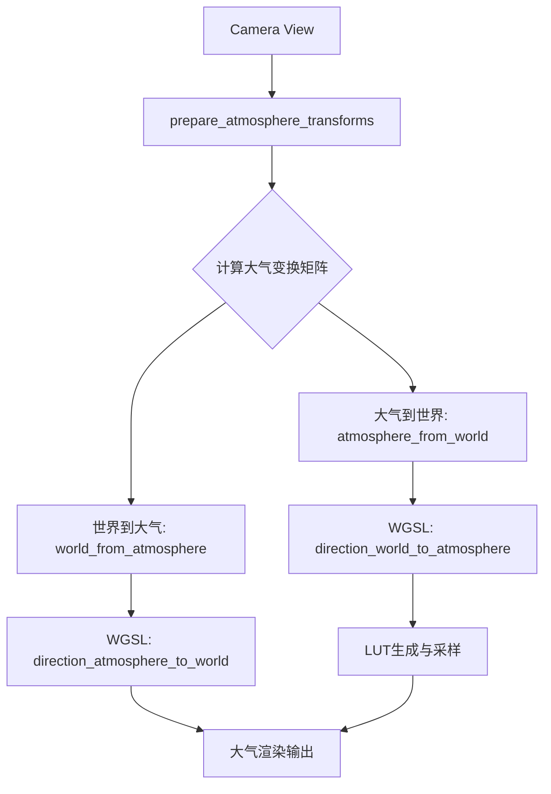

+++
title = "#22938 Fix atmosphere space view for LUT rendering"
date = "2026-03-04T00:00:00"
draft = false
template = "pull_request_page.html"
in_search_index = false

[extra]
current_language = "zh-cn"
available_languages = {"en" = { name = "English", url = "/pull_request/bevy/2026-03/pr-22938-en-20260304" }, "zh-cn" = { name = "中文", url = "/pull_request/bevy/2026-03/pr-22938-zh-cn-20260304" }}
labels = ["C-Bug", "A-Rendering"]
+++

# Fix atmosphere space view for LUT rendering

## Basic Information
- **Title**: Fix atmosphere space view for LUT rendering
- **PR Link**: https://github.com/bevyengine/bevy/pull/22938
- **Author**: mate-h
- **Status**: MERGED
- **Labels**: C-Bug, A-Rendering, S-Ready-For-Final-Review
- **Created**: 2026-02-13T07:49:39Z
- **Merged**: 2026-03-04T22:49:13Z
- **Merged By**: alice-i-cecile

## Description Translation

# 目标

自从在 PR #20766 中为 Bevy 的大气系统引入了球坐标系和空间视图后，基于 LUT（查找表）的渲染存在一个遗留问题：当倾斜相机并从太空观察地球时，明暗交界线（白天与黑夜的分界线）会随着视角旋转而不是保持固定。光线步进渲染是正确的，只有 LUT 路径受到影响。本 PR 通过使用一种大气坐标系来解决这个问题，该坐标系在保持明暗交界线稳定的同时，仍按照 Hillaire 论文中的方法将纹理像素密度集中在水平线附近。

以下是 main 分支上 bug 重现的情况：

https://github.com/user-attachments/assets/e3488e41-d663-4b19-90c5-65b1fdb77b4c

通过此更改，现在正式支持从太空视角使用基于 LUT 的方法进行大气渲染。这可以在低端设备或性能预算紧张时发挥作用。

## 解决方案

- 使用局部上方向作为天顶（zenith）和世界固定的方位角（azimuth）来计算大气坐标系
- 通过 `direction_world_to_atmosphere` 使用大气变换进行 LUT 生成和采样，实际上将此代码块恢复到 PR #20766 之前的状态
- 从实际相机位置对天空视图 LUT 进行光线步进

## 测试

- 通过增大场景比例运行大气示例
```rs
AtmosphereSettings {
    scene_units_to_m: 10e4,
    aerial_view_lut_max_distance: 3.2e4 * 128.0,
    ..default()
},
```

---

## 展示

新的基于 LUT 的渲染：


作为参考"地面真相"的光线步进渲染：


## The Story of This Pull Request

这个 PR 解决了一个大气渲染中的特定 bug，该 bug 出现在使用 LUT（查找表）方法从太空视角渲染大气时。问题表现为当相机倾斜时，地球上的明暗交界线会错误地随着视角旋转，而不是保持在世界空间中固定。

问题的根源在于 PR #20766 中引入的坐标系变换逻辑。在之前的 PR 中，为了实现更好的太空视图，系统引入了基于球坐标系的大气渲染。然而，在实现 LUT 路径时，使用的坐标系变换存在问题：大气空间的方位角（azimuth）依赖于相机的前向向量，而不是使用世界固定的参考方向。这意味着当相机旋转时，整个大气坐标系也会旋转，导致明暗交界线随之旋转。

开发者面临的挑战是重新设计大气坐标系，需要满足两个关键要求：第一，必须保持天顶方向为局部上方向（从相机位置指向地心的方向），这样才能保持 Hillaire 论文中描述的纹理像素密度分布，即将更多细节集中在水平线附近；第二，必须使用世界固定的方位角参考，确保明暗交界线在相机倾斜时保持稳定。

解决方案的核心在 `resources.rs` 中的 `prepare_atmosphere_transforms` 函数。原来的实现使用相机的前向向量计算大气坐标系，现在改为基于固定的世界参考方向。具体来说：

```rust
// 之前：基于相机朝向
let camera_z = world_from_view.matrix3.z_axis;
let camera_y = world_from_view.matrix3.y_axis;
let atmo_z = camera_z
    .with_y(0.0)
    .try_normalize()
    .unwrap_or_else(|| camera_y.with_y(0.0).normalize());
let atmo_y = Vec3A::Y;

// 之后：基于世界固定参考
let cam_pos = Vec3A::from(
    view.world_from_view.translation() * settings.scene_units_to_m
        + Vec3::new(0.0, atmosphere.bottom_radius, 0.0),
);
let atmo_y = cam_pos.try_normalize().unwrap_or(Vec3A::Y);
let world_ref = Vec3A::NEG_Z;
let ref_horizontal = world_ref - atmo_y * atmo_y.dot(world_ref);
let atmo_z = ref_horizontal.normalize();
```

这种设计确保了天顶方向始终指向局部上方向（`atmo_y`），而方位角基于世界固定的参考方向（`Vec3A::NEG_Z`），投影到与天顶方向正交的平面上。这样，当相机倾斜时，坐标系不会完全跟随相机旋转，而是保持与世界空间一致的方向参考。

在着色器层面，这个改变使得 `direction_world_to_atmosphere` 函数可以简化，不再需要传入 `up` 参数：

```wgsl
// 之前：需要额外的 up 参数并动态计算基向量
fn direction_world_to_atmosphere(dir_ws: vec3<f32>, up: vec3<f32>) -> vec3<f32> {
    let forward_ws = (view.world_from_view * vec4(0.0, 0.0, -1.0, 0.0)).xyz;
    let tangent_z = normalize(up * dot(forward_ws, up) - forward_ws);
    let tangent_x = cross(up, tangent_z);
    return vec3(
        dot(dir_ws, tangent_x),
        dot(dir_ws, up),
        dot(dir_ws, tangent_z),
    );
}

// 之后：直接使用预计算的大气变换矩阵
fn direction_world_to_atmosphere(dir_ws: vec3<f32>) -> vec3<f32> {
    let dir_as = atmosphere_transforms.atmosphere_from_world * vec4(dir_ws, 0.0);
    return dir_as.xyz;
}
```

这个简化很重要，因为现在变换矩阵在 CPU 端预计算并上传到 GPU，着色器中只需要进行简单的矩阵乘法。在 CPU 端，由于变换矩阵是正交的（基向量是单位向量且相互垂直），逆矩阵就是转置矩阵，计算成本很低：

```rust
// 只需要转置，因为正交矩阵的逆等于转置
let atmosphere_from_world = world_from_atmosphere.transpose();
```

另一个重要的修复是在天空视图 LUT 生成时，现在从实际相机位置进行光线步进，而不是从假设的位置 `(0.0, r, 0.0)`：

```wgsl
// 之前：假设相机在特定位置
let world_pos = vec3(0.0, r, 0.0);

// 之后：使用实际相机位置
let world_pos = cam_pos;
```

这个改变确保了 LUT 准确地反映了从实际观察点看到的大气效果。

从架构角度来看，这个修复保持了向后兼容性。LUT 路径现在与光线步进路径表现一致，为开发者在性能敏感场景（如移动设备或需要高帧率的应用）中提供了可行的替代方案。

性能影响是积极的：简化后的着色器函数减少了计算量，而 CPU 端的预计算矩阵转置比完整的矩阵求逆更高效。同时，这个修复使基于 LUT 的大气渲染在太空视角下变得可用，扩展了该技术的适用范围。

## Visual Representation



## Key Files Changed

### 1. `crates/bevy_pbr/src/atmosphere/resources.rs` (+40/-13)
**变更描述**: 重新设计大气坐标系的生成逻辑，使用世界固定的方位角参考
```rust
// 关键变更：新的坐标系计算
let cam_pos = Vec3A::from(
    view.world_from_view.translation() * settings.scene_units_to_m
        + Vec3::new(0.0, atmosphere.bottom_radius, 0.0),
);
let atmo_y = cam_pos.try_normalize().unwrap_or(Vec3A::Y);
let world_ref = Vec3A::NEG_Z;
let ref_horizontal = world_ref - atmo_y * atmo_y.dot(world_ref);
let atmo_z = ref_horizontal.normalize();
let atmo_x = atmo_y.cross(atmo_z).normalize();

// 新增：计算转置作为逆矩阵
let atmosphere_from_world = world_from_atmosphere.transpose();
```

### 2. `crates/bevy_pbr/src/atmosphere/functions.wgsl` (+3/-10)
**变更描述**: 简化方向转换函数，使用预计算的大气变换矩阵
```wgsl
// 之前：
fn direction_world_to_atmosphere(dir_ws: vec3<f32>, up: vec3<f32>) -> vec3<f32>

// 之后：
fn direction_world_to_atmosphere(dir_ws: vec3<f32>) -> vec3<f32> {
    let dir_as = atmosphere_transforms.atmosphere_from_world * vec4(dir_ws, 0.0);
    return dir_as.xyz;
}
```

### 3. `crates/bevy_pbr/src/atmosphere/types.wgsl` (+4/-2)
**变更描述**: 扩展大气变换数据结构以包含逆变换矩阵
```wgsl
// 之前：
struct AtmosphereTransforms {
    world_from_atmosphere: mat4x4<f32>,
}

// 之后：
struct AtmosphereTransforms {
    world_from_atmosphere: mat4x4<f32>,
    atmosphere_from_world: mat4x4<f32>,
}
```

### 4. `crates/bevy_pbr/src/atmosphere/environment.wgsl` (+1/-2)
**变更描述**: 更新函数调用以移除 `up` 参数
```wgsl
// 之前：
let ray_dir_as = direction_world_to_atmosphere(ray_dir_ws.xyz, up);

// 之后：
let ray_dir_as = direction_world_to_atmosphere(ray_dir_ws.xyz);
```

### 5. `crates/bevy_pbr/src/atmosphere/sky_view_lut.wgsl` (+1/-1)
**变更描述**: 使用实际相机位置而不是假设位置
```wgsl
// 之前：
let world_pos = vec3(0.0, r, 0.0);

// 之后：
let world_pos = cam_pos;
```

## Further Reading

1. **Hillaire 大气渲染论文** - Sébastien Hillaire 的原始论文 "A Scalable and Production Ready Sky and Atmosphere Rendering Technique" 详细描述了大气渲染中的坐标系和 LUT 技术。

2. **球坐标系与大气渲染** - 了解如何在实时渲染中使用球坐标系处理大气效果。

3. **Bevy 渲染架构** - Bevy 的 ECS 架构和渲染管线如何整合自定义渲染特性如大气效果。

4. **WGSL 着色语言规范** - WebGPU Shading Language 的矩阵运算和坐标变换功能。

5. **PR #20766** - 原始引入球坐标系和空间视图的 PR，了解问题的历史背景。