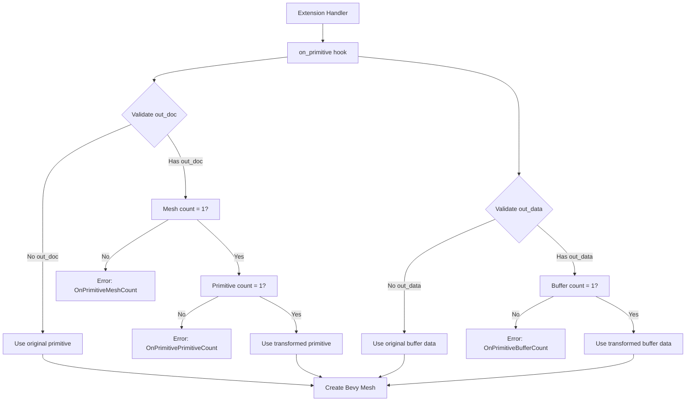

+++
title = "#23130 docs and tests for on_primitive"
date = "2026-03-02T00:00:00"
draft = false
template = "pull_request_page.html"
in_search_index = true

[taxonomies]
list_display = ["show"]

[extra]
current_language = "en"
available_languages = {"en" = { name = "English", url = "/pull_request/bevy/2026-03/pr-23130-en-20260302" }, "zh-cn" = { name = "中文", url = "/pull_request/bevy/2026-03/pr-23130-zh-cn-20260302" }}
labels = ["D-Trivial", "A-Assets", "A-glTF"]
+++

# Title

## Basic Information
- **Title**: docs and tests for on_primitive
- **PR Link**: https://github.com/bevyengine/bevy/pull/23130
- **Author**: ChristopherBiscardi
- **Status**: MERGED
- **Labels**: D-Trivial, A-Assets, S-Ready-For-Final-Review, A-glTF
- **Created**: 2026-02-24T06:23:47Z
- **Merged**: 2026-03-02T19:34:32Z
- **Merged By**: alice-i-cecile

## Description Translation
# Objective

Add additional tests and docs for the `on_primitive` hook introduced in #22907

## Solution

Tests currently only test failure conditions such as

- 0, 2, or more Meshes
- 0, 2, or more Primitives
- 0, 2, or more buffers

Which is the most important place to notify users early, considering the additional complexity incurred by following the `gltf` crate's types here.

## Testing

```
cargo test -p bevy_gltf
```

## The Story of This Pull Request

This pull request addresses the need for improved documentation and testing around the `on_primitive` hook that was introduced in a previous PR (#22907). The hook is part of Bevy's glTF loading system, specifically within the `GltfExtensionHandler` trait, and allows extension authors to intercept and modify individual glTF primitives during loading.

The core issue was that while the hook provided powerful capabilities for handling compressed or transformed geometry data, its documentation was insufficient and it lacked proper validation for edge cases. This created a situation where extension developers could easily misuse the API without clear feedback, particularly when dealing with the complex type structures from the `gltf` crate.

The solution implemented in this PR follows a straightforward engineering approach: strengthen error handling and provide comprehensive documentation. Instead of silently handling incorrect usage with warnings and fallbacks, the implementation now returns specific error types that clearly indicate what went wrong. This fail-fast approach is particularly important when dealing with low-level geometry data processing, where incorrect assumptions can lead to subtle bugs or crashes later in the rendering pipeline.

The implementation changes are focused on two main areas: documentation clarification in the trait definition itself, and error handling logic in the loader. The documentation updates provide crucial context about the expected structure of the modified glTF documents and buffer data that extensions can return. Specifically, the docs now clearly state that:
- `out_doc` must contain exactly one mesh with exactly one primitive
- `out_data` must contain exactly one buffer (a single `Vec<u8>` inside the outer `Vec`)
- `buffer_data` contains all buffers from the glTF document and shouldn't be assumed to contain only vertex data

The error handling changes convert what were previously warning messages into proper error returns. Previously, if an extension returned a document with zero or multiple meshes, the system would log a warning and fall back to the original primitive. Now, it returns a `GltfError::OnPrimitiveMeshCount` error. Similarly, incorrect primitive counts trigger `GltfError::OnPrimitivePrimitiveCount`, and incorrect buffer counts trigger `GltfError::OnPrimitiveBufferCount`.

The testing strategy is pragmatic - it focuses on the failure cases that are most likely to occur due to developer error. By testing the boundaries (0, 2, or more items) rather than success cases, the tests verify that the validation logic works correctly and provides clear error messages. This approach makes sense because the success path would typically involve complex geometry processing that's better tested at the integration level by specific extension implementations.

One important technical consideration is the helper function `load_gltf_into_app_with_extension` added to the test module. This function abstracts away the boilerplate of setting up a Bevy app, loading a glTF asset with a custom extension, and running the app until the asset loads. This pattern demonstrates good test architecture by reducing code duplication and making the actual test cases more readable.

The PR also includes a sample glTF triangle model (`TRIANGLE_GLTF_DATA`) used in the tests. This is a minimal, self-contained glTF model that includes geometry data encoded in a base64 data URI. Using this approach means the tests don't need external files and can run in any environment.

From an architectural perspective, this change aligns with Bevy's philosophy of providing clear, actionable error messages. By failing early with descriptive errors, extension developers can quickly identify and fix issues in their implementations. The change also demonstrates good API design practice by adding validation logic that enforces the documented contracts of the interface.

## Visual Representation



## Key Files Changed

### `crates/bevy_gltf/src/loader/extensions/mod.rs` (+19/-11)
1. **What changed and why**: Updated documentation for the `on_gltf_primitive` method to provide clearer guidance on parameter usage and expectations.
2. **Key modifications**:
```rust
// Before: Minimal documentation
/// Called when an individual glTF primitive is processed
/// glTF primitives are what become a Bevy `Mesh`
///
/// `buffer_data` is the raw buffer data from the glTF file...
/// `out_doc` allows extensions to provide a modified or
/// replacement glTF document...
/// `out_data` allows extensions to provide modified or
/// replacement buffer data...

// After: Detailed documentation with specific constraints
/// Called when an individual glTF primitive is processed
/// glTF primitives are what become a Bevy `Mesh`
/// This hook is useful for extensions that need to
/// decompress or transform primitives and their associated
/// glTF data.
///
/// `buffer_data` is a reference to all of the buffers from the
/// glTF document, in order, after it has been loaded by Bevy...
/// `out_doc` is an optional `gltf::Document` which, if set,
/// must contain a single `gltf::Mesh` with a single
/// `gltf::Primitive`...
/// `out_data` is a single buffer wrapped in a `Vec`, which mirrors
/// the buffer structure of a loaded `gltf::Document`'s buffers...
/// The outer `Vec` must contain a single `Vec<u8>` of data...
```
3. **Relation to overall purpose**: The documentation updates provide essential context for extension developers about the expected structure of transformed data, preventing misuse of the API.

### `crates/bevy_gltf/src/loader/mod.rs` (+255/-23)
1. **What changed and why**: Added error variants for validation failures and implemented strict validation logic for the `on_primitive` hook outputs. Added comprehensive tests for failure cases.
2. **Key modifications**:
```rust
// Added error variants to GltfError enum
OnPrimitiveMeshCount(usize),
OnPrimitivePrimitiveCount(usize),
OnPrimitiveBufferCount(usize),

// Updated validation logic in load_primitive method
// Before: Warn and fall back
let meshes_len = doc.meshes().len();
if meshes_len != 1 {
    warn!("Extension returned {} meshes...", meshes_len);
    primitive
}

// After: Return error
let mesh_count = doc.meshes().len();
if mesh_count != 1 {
    return Err(GltfError::OnPrimitiveMeshCount(mesh_count));
}

// Added test helper function
fn load_gltf_into_app_with_extension(...) -> App {
    // Sets up test environment with custom extension
}

// Added test cases
#[test]
#[should_panic(expected = "...expected exactly one Mesh...")]
fn on_gltf_primitive_doc_fail() {
    // Tests document with no mesh
}

#[test]
#[should_panic(expected = "...expected exactly one Primitive...")]
fn on_gltf_primitive_prim_fail() {
    // Tests mesh with no primitive
}

#[test]
#[should_panic(expected = "...expected exactly one Vec<u8>...")]
fn on_gltf_buffer_count_fail() {
    // Tests empty buffer data
}
```
3. **Relation to overall purpose**: The validation ensures extensions follow the documented API contract, and the tests verify that validation works correctly for edge cases.

## Further Reading

- [glTF 2.0 Specification](https://www.khronos.org/gltf/) - Official specification for glTF file format
- [Bevy glTF Loader Documentation](https://docs.rs/bevy_gltf/latest/bevy_gltf/) - API documentation for Bevy's glTF implementation
- [Rust glTF Crate](https://docs.rs/gltf/latest/gltf/) - Documentation for the underlying glTF parsing library
- [PR #22907](https://github.com/bevyengine/bevy/pull/22907) - Original PR that introduced the `on_primitive` hook
- [Bevy Asset System](https://bevyengine.org/learn/book/next/assets/) - Overview of Bevy's asset loading architecture