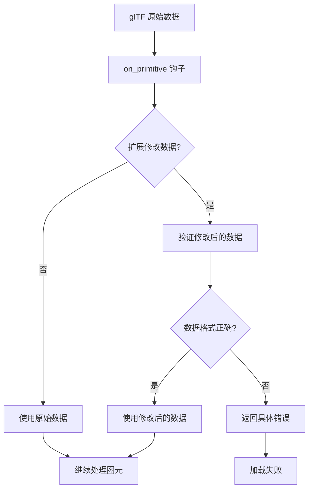

+++
title = "#23130 docs and tests for on_primitive"
date = "2026-03-02T00:00:00"
draft = false
template = "pull_request_page.html"
in_search_index = false

[extra]
current_language = "zh-cn"
available_languages = {"en" = { name = "English", url = "/pull_request/bevy/2026-03/pr-23130-en-20260302" }, "zh-cn" = { name = "中文", url = "/pull_request/bevy/2026-03/pr-23130-zh-cn-20260302" }}
+++

# Title

## 基本信息
- **标题**: docs and tests for on_primitive
- **PR 链接**: https://github.com/bevyengine/bevy/pull/23130
- **作者**: ChristopherBiscardi
- **状态**: 已合并
- **标签**: D-Trivial, A-Assets, S-Ready-For-Final-Review, A-glTF
- **创建时间**: 2026-02-24T06:23:47Z
- **合并时间**: 2026-03-02T19:34:32Z
- **合并人**: alice-i-cecile

## 描述翻译

# Objective（目标）

为 #22907 中引入的 `on_primitive` 钩子添加额外的测试和文档。

## Solution（解决方案）

当前的测试仅针对失败条件，例如：

- 0、2 或更多的 Meshes
- 0、2 或更多的 Primitives  
- 0、2 或更多的 buffers

考虑到遵循 `gltf` crate 的类型在这里带来的额外复杂性，这是最需要尽早通知用户的重要位置。

## Testing（测试）

```
cargo test -p bevy_gltf
```

## 这个 Pull Request 的故事

这个 PR 是对 glTF 加载器扩展系统中 `on_primitive` 钩子的功能强化。在 #22907 中，这个钩子被引入用于处理 glTF 图元（primitive）级别的数据转换和解压缩，但当时缺乏足够的文档和边界条件测试。现在这个 PR 填补了这一空白。

### 问题背景

`on_primitive` 钩子允许 glTF 扩展在加载过程中修改图元数据，典型的用例包括解压缩几何数据或转换顶点属性。然而，钩子的接口设计相对复杂：它接收原始的 glTF 文档和缓冲区数据，并能输出一个修改后的 glTF 文档和缓冲区数据。这种复杂性意味着用户很容易在实现时犯错。

原始实现中存在一个问题：当扩展返回的 glTF 文档包含不正确数量的网格（Mesh）或图元时，系统只会输出警告（warn）并回退到原始数据。这种静默回退会掩盖扩展实现中的错误，使得调试困难，也不符合 Rust 的错误处理习惯。

### 解决方案

这个 PR 采取了两步走的解决方案：

1. **加强文档**：为 `on_primitive` 钩子的参数提供更清晰的文档说明，明确每个参数的用途和约束条件。

2. **强化错误处理**：将原来的警告升级为明确的错误，当扩展返回的数据不符合预期时，立即中止加载过程并返回清晰的错误信息。

具体来说，原来的代码在处理扩展返回的 glTF 文档时是这样的：

```rust
let primitive = if let Some(doc) = &out_doc {
    let meshes_len = doc.meshes().len();
    if meshes_len != 1 {
        warn!(
            "Extension returned {} meshes, expected exactly 1. Using original primitive.",
            meshes_len
        );
        primitive
    } else if let Some(mesh) = doc.meshes().next() {
        // ... 类似的处理 ...
    } else {
        primitive
    }
} else {
    primitive
};
```

改进后的代码直接返回错误：

```rust
let primitive = if let Some(doc) = &out_doc {
    let mesh_count = doc.meshes().len();
    if mesh_count != 1 {
        return Err(GltfError::OnPrimitiveMeshCount(mesh_count));
    }
    let mesh = doc.meshes().next().unwrap();
    let primitive_count = mesh.primitives().len();
    if primitive_count != 1 {
        return Err(GltfError::OnPrimitivePrimitiveCount(primitive_count));
    }
    mesh.primitives().next().unwrap()
} else {
    primitive
};
```

这种改变使得错误能够在加载过程的早期被发现，避免了使用损坏或意外的数据进行后续处理。

### 技术实现细节

新的错误类型在 `GltfError` 枚举中添加：

```rust
/// Zero or 2+ `gltf::Mesh`s were returned in a `gltf::Document` from the `on_primitive` hook
#[error(
    "expected exactly one Mesh in Document returned from on_gltf_primitive hook, got: {0}"
)]
OnPrimitiveMeshCount(usize),

/// Zero or 2+ `gltf::Primitive`s were returned in a `gltf::Document` from the `on_primitive` hook  
#[error(
    "expected exactly one Primitive in Mesh returned from on_gltf_primitive hook, got: {0}"
)]
OnPrimitivePrimitiveCount(usize),

/// Zero or 2+ `Vec<u8>`s were returned in the `Vec<Vec<u8>>` from the `on_primitive` hook
#[error(
    "expected exactly one Vec<u8> in buffers returned from on_gltf_primitive hook, got: {0}"
)]
OnPrimitiveBufferCount(usize),
```

这些错误类型都有清晰的自描述信息，当触发时会显示具体的错误数量。

文档方面，`on_gltf_primitive` 方法的注释被大大扩展，现在更清楚地解释了：

- `buffer_data` 不一定是顶点数据，glTF 扩展可以添加任意缓冲区
- `out_doc` 只能包含单个网格和单个图元，且只影响当前图元的处理
- `out_data` 必须是包含单个 `Vec<u8>` 的 `Vec`，因为只有第一个生成的缓冲区会被使用

### 测试策略

测试集中在失败条件上，这正是错误处理代码最需要验证的部分。测试使用了三个自定义的 glTF 扩展实现：

1. **返回空文档**：测试当扩展返回没有网格的文档时，是否抛出 `OnPrimitiveMeshCount` 错误
2. **返回无图元的网格**：测试当扩展返回没有图元的网格时，是否抛出 `OnPrimitivePrimitiveCount` 错误  
3. **返回空缓冲区列表**：测试当扩展返回空缓冲区列表时，是否抛出 `OnPrimitiveBufferCount` 错误

每个测试都使用了相同的三角形 glTF 模型，但通过不同的扩展实现来触发特定的错误路径。这种测试策略很有效，因为它验证了系统对错误输入的反应，而不是验证正确路径（这通常由 glTF 标准测试覆盖）。

### 影响与思考

这个 PR 的主要影响是提高了 glTF 加载器的健壮性。通过将静默回退改为显式错误，系统现在能够：

1. **更早发现问题**：扩展实现中的错误会在加载时立即被发现，而不是在后续处理中产生难以追踪的问题
2. **提供更好的调试体验**：清晰的错误信息帮助开发者快速定位问题
3. **保持一致性**：这与 Rust 的错误处理模式保持一致，避免了使用 `Result` 但实际进行静默回退的不一致做法

从工程角度看，这个改变体现了防御性编程的原则：系统应该在接收到意外输入时明确失败，而不是尝试继续运行可能产生未定义行为的状态。对于像 Bevy 这样的游戏引擎，这种健壮性尤其重要，因为渲染问题可能难以调试。

一个有趣的技术细节是，这个 PR 保持了向后兼容性：现有正确实现的扩展不会受到影响，只有那些返回无效数据的扩展才会遇到新的错误。这使得升级路径平滑，不会破坏现有的工作代码。

## 视觉表示



## 关键文件变更

### `crates/bevy_gltf/src/loader/mod.rs` (+255/-23)

**主要变更**：添加了新的错误类型和相应的错误处理逻辑，以及全面的测试套件。

**关键代码片段**：

```rust
// 新的错误类型
/// Zero or 2+ `gltf::Mesh`s were returned in a `gltf::Document` from the `on_primitive` hook
#[error(
    "expected exactly one Mesh in Document returned from on_gltf_primitive hook, got: {0}"
)]
OnPrimitiveMeshCount(usize),

// 错误处理逻辑改进
let primitive = if let Some(doc) = &out_doc {
    let mesh_count = doc.meshes().len();
    if mesh_count != 1 {
        return Err(GltfError::OnPrimitiveMeshCount(mesh_count));
    }
    let mesh = doc.meshes().next().unwrap();
    let primitive_count = mesh.primitives().len();
    if primitive_count != 1 {
        return Err(GltfError::OnPrimitivePrimitiveCount(primitive_count));
    }
    mesh.primitives().next().unwrap()
} else {
    primitive
};
```

**测试代码片段**：

```rust
// 测试返回空文档的情况
#[test]
#[should_panic(
    expected = "Failed to load asset 'test.gltf' with asset loader 'bevy_gltf::loader::GltfLoader': expected exactly one Mesh in Document returned from on_gltf_primitive hook, got: 0"
)]
fn on_gltf_primitive_doc_fail() {
    // ... 测试实现
}
```

**变更关系**：这些变更直接实现了 PR 的目标——为 `on_primitive` 钩子添加严格的错误处理，确保扩展返回的数据符合预期格式。

### `crates/bevy_gltf/src/loader/extensions/mod.rs` (+19/-11)

**主要变更**：更新了 `on_gltf_primitive` 方法的文档，更清晰地解释了参数的含义和约束。

**关键代码片段**：

```rust
/// Called when an individual glTF primitive is processed
/// glTF primitives are what become a Bevy `Mesh`
/// This hook is useful for extensions that need to
/// decompress or transform primitives and their associated
/// glTF data.
///
/// `buffer_data` is a reference to all of the buffers from the
/// glTF document, in order, after it has been loaded by Bevy. Extensions
/// in glTF are allowed to add arbitrary buffers, so while this
/// data is often vertex data, it can not be assumed to be
/// vertex data.
```

**变更关系**：这些文档更新帮助开发者正确理解和使用 `on_primitive` 钩子，与错误处理变更相辅相成——清晰的文档可以减少错误，而严格的错误处理可以捕获剩余的误解。

## 延伸阅读

1. **glTF 扩展规范**：了解 glTF 扩展系统的工作原理有助于更好地理解这个钩子的设计意图
   - [glTF 2.0 扩展](https://github.com/KhronosGroup/glTF/tree/main/extensions)

2. **Bevy 资产系统**：理解 Bevy 的资产加载管道对于实现自定义扩展很重要
   - [Bevy 资产系统文档](https://docs.rs/bevy_asset/latest/bevy_asset/)

3. **Rust 错误处理最佳实践**：这个 PR 体现了 Rust 的错误处理哲学
   - [Rust 错误处理指南](https://doc.rust-lang.org/book/ch09-00-error-handling.html)

4. **测试驱动开发**：这个 PR 的测试策略展示了如何针对边界条件编写有效的测试
   - [《有效的 Rust 测试》](https://doc.rust-lang.org/rust-by-example/testing.html)