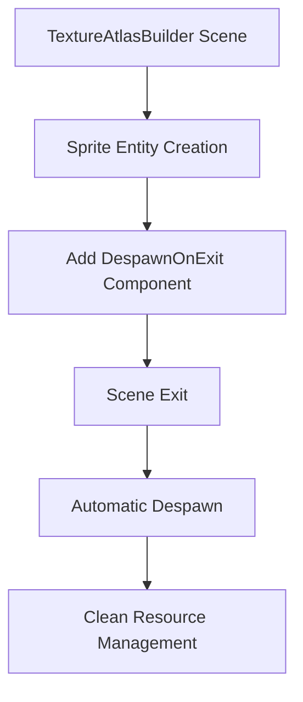

+++
title = "#23133 Despawn atlas sprites on scene exit in `testbed_2d`"
date = "2026-03-02T00:00:00"
draft = false
template = "pull_request_page.html"
in_search_index = true

[taxonomies]
list_display = ["show"]

[extra]
current_language = "en"
available_languages = {"en" = { name = "English", url = "/pull_request/bevy/2026-03/pr-23133-en-20260302" }, "zh-cn" = { name = "中文", url = "/pull_request/bevy/2026-03/pr-23133-zh-cn-20260302" }}
labels = ["C-Bug", "D-Trivial", "C-Examples"]
+++

# Title
Despawn atlas sprites on scene exit in `testbed_2d`

## Basic Information
- **Title**: Despawn atlas sprites on scene exit in `testbed_2d`
- **PR Link**: https://github.com/bevyengine/bevy/pull/23133
- **Author**: ickshonpe
- **Status**: MERGED
- **Labels**: C-Bug, D-Trivial, C-Examples, S-Ready-For-Final-Review
- **Created**: 2026-02-24T14:28:43Z
- **Merged**: 2026-03-02T19:33:04Z
- **Merged By**: alice-i-cecile

## Description Translation
# Objective

Some cleanup is missing from the 2d testbed's `TextureAtlasBuilder` scene.

## Solution

Add `DespawnOnExit(super::Scene::TextureAtlasBuilder)` to the atlas sprites.

# The Story of This Pull Request

The PR addresses a resource cleanup issue in Bevy's 2D testbed example. The `testbed_2d` example serves as a testing ground for 2D features and includes multiple scenes that users can switch between. Each scene typically manages its own entities and resources, and proper cleanup is necessary when switching scenes to avoid resource leaks and unexpected behavior.

In the `TextureAtlasBuilder` scene, when the example generates atlas sprites, it wasn't properly cleaning them up when exiting the scene. This meant that when users switched away from the `TextureAtlasBuilder` scene to another scene, the atlas sprites would persist in the world, potentially causing visual artifacts or performance issues.

The fix is straightforward and follows the pattern established in other parts of the codebase. The developer added a `DespawnOnExit` component to each atlas sprite entity. This component is part of Bevy's state management system and automatically despawns entities when exiting a specific game state or scene.

The implementation involves modifying the sprite spawning logic in the `texture_atlas_builder` module. When creating each sprite entity, the code now includes `DespawnOnExit(super::Scene::TextureAtlasBuilder)` in the bundle. This ensures that when the example transitions out of the `TextureAtlasBuilder` scene, all sprites created in that scene are automatically removed.

This change demonstrates proper use of Bevy's entity lifecycle management. The `DespawnOnExit` component is a clean, declarative way to handle entity cleanup that aligns with Bevy's ECS architecture. It's more maintainable than manual cleanup systems because it centralizes the cleanup logic with the entity creation code.

The impact of this fix is that the `testbed_2d` example now properly cleans up resources when switching scenes, preventing memory leaks and ensuring each scene starts with a clean slate. While this is a small change in an example, it serves as a good practice for developers learning how to manage entity lifecycles in Bevy applications.

## Visual Representation



## Key Files Changed

- `examples/testbed/2d.rs` (+1/-0)

### Changes to `examples/testbed/2d.rs`:

The change adds the `DespawnOnExit` component to the sprite entities created in the `TextureAtlasBuilder` scene. This ensures proper cleanup when exiting the scene.

**Code context (showing the relevant section):**
```rust
mod texture_atlas_builder {
    // ... existing code ...
    
    for (i, anchor) in anchors.iter().enumerate() {
        commands.spawn((
            Sprite::from_atlas_image(atlas_handle.clone(), i),
            Transform::from_translation(
                Vec3::X * IMAGE_SIZE.x as f32 * i as f32
                    + (Vec3::Y * IMAGE_SIZE.y as f32 + anchor.as_vec().extend(0.)),
            ),
            anchor,
            DespawnOnExit(super::Scene::TextureAtlasBuilder),  // This line was added
        ));
    }
    
    // ... existing code ...
}
```

The `DespawnOnExit` component takes a state type as a generic parameter. In this case, it's `super::Scene::TextureAtlasBuilder`, which is the enum variant representing the `TextureAtlasBuilder` scene. When the application state changes away from this scene, all entities with this component will be despawned.

## Further Reading

- [Bevy States Documentation](https://docs.rs/bevy/latest/bevy/ecs/schedule/struct.States.html) - Understanding Bevy's state management system
- [Bevy Component Documentation](https://docs.rs/bevy/latest/bevy/ecs/component/trait.Component.html) - Working with components in Bevy's ECS
- [Bevy Examples Repository](https://github.com/bevyengine/bevy/tree/main/examples) - More examples of proper resource management patterns
- [Entity Lifecycle Management in ECS](https://en.wikipedia.org/wiki/Entity_component_system#Entity_lifecycle) - General concepts of entity lifecycle management in ECS architectures

# Full Code Diff
```diff
diff --git a/examples/testbed/2d.rs b/examples/testbed/2d.rs
index 1247ee07e0ac9..bd3da01189268 100644
--- a/examples/testbed/2d.rs
+++ b/examples/testbed/2d.rs
@@ -535,6 +535,7 @@ mod texture_atlas_builder {
                                 * (Vec3::Y * IMAGE_SIZE.y as f32 + anchor.as_vec().extend(0.)),
                     ),
                     anchor,
+                    DespawnOnExit(super::Scene::TextureAtlasBuilder),
                 ));
             }
         }
```