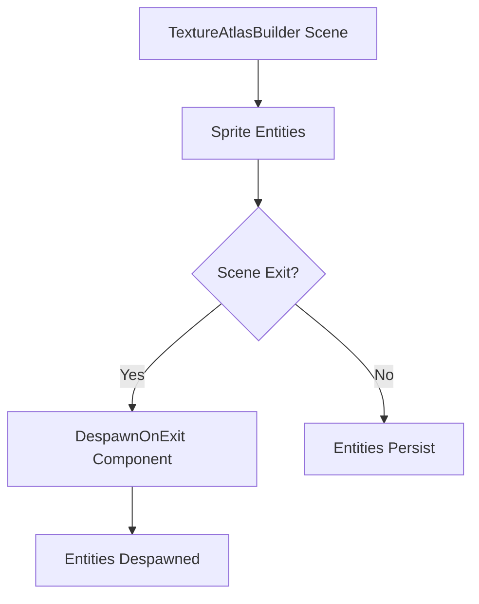

+++
title = "#23133 Despawn atlas sprites on scene exit in `testbed_2d`"
date = "2026-03-02T00:00:00"
draft = false
template = "pull_request_page.html"
in_search_index = false

[extra]
current_language = "zh-cn"
available_languages = {"en" = { name = "English", url = "/pull_request/bevy/2026-03/pr-23133-en-20260302" }, "zh-cn" = { name = "中文", url = "/pull_request/bevy/2026-03/pr-23133-zh-cn-20260302" }}
labels = ["C-Bug", "D-Trivial", "C-Examples"]
+++

# Title

## Basic Information
- **Title**: Despawn atlas sprites on scene exit in `testbed_2d` 
- **PR Link**: https://github.com/bevyengine/bevy/pull/23133
- **Author**: ickshonpe
- **Status**: MERGED
- **Labels**: C-Bug, D-Trivial, C-Examples, S-Ready-For-Final-Review
- **Created**: 2026-02-24T14:28:43Z
- **Merged**: 2026-03-02T19:33:04Z
- **Merged By**: alice-i-cecile

## Description Translation
在2D测试平台的`TextureAtlasBuilder`场景中，缺少一些清理工作。

## 解决方案
为图集精灵添加`DespawnOnExit(super::Scene::TextureAtlasBuilder)`。

## The Story of This Pull Request

这个PR解决了一个简单但重要的问题：在Bevy引擎的2D测试平台示例中，当用户离开`TextureAtlasBuilder`场景时，之前生成的图集精灵没有被正确清理。这会导致内存泄漏和意外的视觉残留。

问题出现在`examples/testbed/2d.rs`文件的`texture_atlas_builder`模块中。该模块负责构建并显示一个纹理图集，用于演示如何将多个小图像打包成一个大图集。在之前的实现中，系统会为每个小图像创建一个精灵实体，但当场景切换时，这些实体没有被自动销毁。

作者识别到这是一个资源清理问题。在Bevy的ECS架构中，实体通常需要显式管理其生命周期。虽然测试平台示例主要用于演示目的，但保持资源的正确清理对于避免内存泄漏和确保示例的健壮性仍然很重要。

解决方案采用了Bevy现有的`DespawnOnExit`组件。这是一个标记组件（marker component），当添加到实体时，会在指定的场景退出时自动销毁该实体。这种模式在测试平台的其他场景中已有使用，保持了代码的一致性。

具体实现非常简单：只需在创建精灵实体的`spawn`调用中添加`DespawnOnExit(super::Scene::TextureAtlasBuilder)`组件。这个改动确保了当用户从`TextureAtlasBuilder`场景切换到其他测试场景时，所有为该场景创建的精灵实体都会被自动清理。

从技术角度看，这个修复展示了Bevy中场景管理和实体生命周期管理的一个良好实践。`DespawnOnExit`组件是一个声明式解决方案，它通过组件系统将清理逻辑与实体创建点绑定在一起，而不是依赖独立的清理系统。这种模式使得代码更易于理解和维护，因为实体的销毁条件与其创建条件在同一位置定义。

这个改动虽然很小，但它完善了测试平台示例的健壮性，确保示例代码不会因为未清理的资源而误导用户。对于学习Bevy的开发者来说，这个示例现在正确地展示了如何在场景切换时管理实体生命周期。

## Visual Representation



## Key Files Changed

### `examples/testbed/2d.rs` (+1/-0)

这个文件包含了2D测试平台的所有示例场景。`texture_atlas_builder`模块是其中之一，它演示了如何动态构建纹理图集。

**关键修改**：
在创建图集精灵的循环中，为每个精灵实体添加了`DespawnOnExit`组件。

```rust
// File: examples/testbed/2d.rs
// Before（简化版，显示关键部分）：
commands.spawn((
    Sprite::from_atlas_image(atlas_texture, texture_index),
    Transform::from_translation(/* ... */),
    anchor,
));

// After：
commands.spawn((
    Sprite::from_atlas_image(atlas_texture, texture_index),
    Transform::from_translation(/* ... */),
    anchor,
    DespawnOnExit(super::Scene::TextureAtlasBuilder), // 新增的行
));
```

这个修改确保了当场景切换时，所有在图集构建场景中创建的精灵实体都会被自动销毁，防止了内存泄漏和视觉残留。

## Further Reading

1. [Bevy官方文档：场景和状态管理](https://docs.rs/bevy/latest/bevy/prelude/struct.App.html#method.add_state)
2. [Bevy官方示例：状态管理](https://github.com/bevyengine/bevy/tree/main/examples/ecs/state)
3. [Bevy组件系统文档](https://docs.rs/bevy/latest/bevy/ecs/system/trait.IntoSystem.html)
4. [ECS模式中的实体生命周期管理](https://en.wikipedia.org/wiki/Entity_component_system#Implementation)

# Full Code Diff
diff --git a/examples/testbed/2d.rs b/examples/testbed/2d.rs
index 1247ee07e0ac9..bd3da01189268 100644
--- a/examples/testbed/2d.rs
+++ b/examples/testbed/2d.rs
@@ -535,6 +535,7 @@ mod texture_atlas_builder {
                                 * (Vec3::Y * IMAGE_SIZE.y as f32 + anchor.as_vec().extend(0.)),
                     ),
                     anchor,
+                    DespawnOnExit(super::Scene::TextureAtlasBuilder),
                 ));
             }
         }