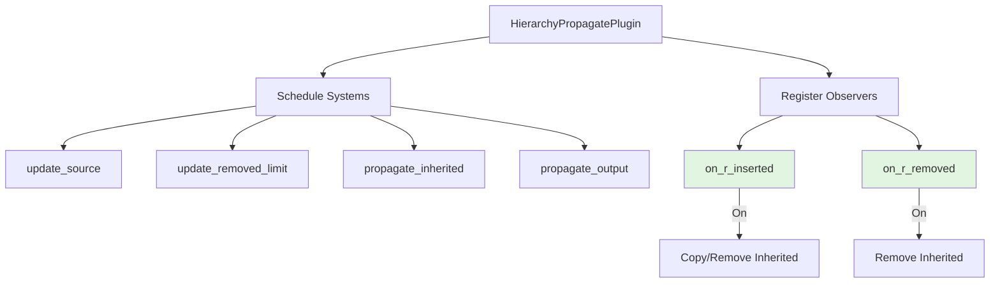

+++
title = "#23156 Optimizing Hierarchy Propagation Through Event-Driven Observers"
date = "2026-03-02T00:00:00"
draft = false
template = "pull_request_page.html"
in_search_index = true

[taxonomies]
list_display = ["show"]

[extra]
current_language = "en"
available_languages = {"en" = { name = "English", url = "/pull_request/bevy/2026-03/pr-23156-en-20260302" }, "zh-cn" = { name = "中文", url = "/pull_request/bevy/2026-03/pr-23156-zh-cn-20260302" }}
labels = ["C-Performance", "A-App", "D-Straightforward"]
+++

# Title: Optimizing Hierarchy Propagation Through Event-Driven Observers

## Basic Information
- **Title**: fix: reparenting perf
- **PR Link**: https://github.com/bevyengine/bevy/pull/23156
- **Author**: aevyrie
- **Status**: MERGED
- **Labels**: C-Performance, S-Ready-For-Final-Review, A-App, X-Uncontroversial, D-Straightforward
- **Created**: 2026-02-26T07:52:32Z
- **Merged**: 2026-03-02T00:07:00Z
- **Merged By**: alice-i-cecile

## Description Translation

# Objective

`HierarchyPropagatePlugin` contains a system `update_reparented` that scans every entity with the relationship component `R` every frame to test for `Changed<R>`. This means iterating over every child entity every frame, even when nothing has changed. This is a significant per-frame cost that scales linearly with child entity population.

Fixes #23155 

# Solution

Replace the `update_reparented` system and its `Changed<R>` query with two reactive lifecycle observers:

- **`on_r_inserted`**: registered on `On<Insert, R>`, fires only when `R` is actually inserted onto an entity. Copies `Inherited<C>` from the new parent if it has one, otherwise removes it from the entity.
- **`on_r_removed`**: registered on `On<Remove, R>`, fires only when `R` is actually removed from an entity. Removes `Inherited<C>` if the entity had inherited one.

This replaces an O(n) per-frame scan with O(1) per-event reactions.

## What about mutations?

`Changed<R>` also detects direct mutations to `R`, while `On<Insert, R>` does not. 

From what I can tell, this is safe to drop; **please review this logic for correctness!**

Relationship components like `ChildOf` must only be changed via `insert`, never by direct mutation. This is because `R` carries bookkeeping semantics enforced by component hooks. Inserting a new value triggers hooks that remove the entity from the old parent's `RelationshipTarget` and add it to the new one. Direct mutation via `Mut<R>` bypasses these hooks entirely, leaving the `RelationshipTarget` of both the old and new parent in an inconsistent state. Any app doing this already has a bug. `On<Insert, R>` fires for **both** first-time additions and replacements (re-inserts with a new value), which covers every valid way a relationship can change:

| Case | Old (`Changed<R>`) | New (`On<Insert, R>` / `On<Remove, R>`) |
|---|---|---|
| New child spawned with `R` | ✅ | ✅ via `On<Insert, R>` |
| Entity reparented (`insert(R)`) | ✅ | ✅ via `On<Insert, R>` |
| `R` removed (entity orphaned) | ✅ via `orphaned` query | ✅ via `On<Remove, R>` |
| `R` mutated directly via `Mut<R>` | ✅ | ❌ unsupported: breaks relationship invariants |

# Testing

All existing propagation tests pass, including:
- `test_reparented`: entity moved to a non-propagating parent loses `Inherited<C>`
- `test_reparented_with_prior`: entity moved between two propagating parents picks up the new value
- `test_remove_orphan`: entity with `R` removed loses `Inherited<C>`


## The Story of This Pull Request

This PR addresses a performance issue in Bevy's hierarchy propagation system. The `HierarchyPropagatePlugin` was using an inefficient approach that scanned every entity with a relationship component each frame, regardless of whether any changes had occurred. This O(n) per-frame cost became problematic in scenes with many child entities, as it required iterating over all of them every frame just to check for changes.

The core problem was in the `update_reparented` system, which used a `Changed<R>` query to detect when relationship components like `ChildOf` were modified. While `Changed<R>` is a useful filter for detecting component changes, it has a hidden cost: the ECS still needs to evaluate every entity with component `R` to determine if it changed. This meant that in a scene with 10,000 child entities, the system would process 10,000 entities every frame, even if no reparenting occurred.

The solution replaces this polling-based approach with an event-driven model using Bevy's observer system. Instead of scanning all entities each frame, we now register two observers that only execute when specific events occur:

1. `on_r_inserted`: triggered when a relationship component is inserted (or replaced via re-insertion)
2. `on_r_removed`: triggered when a relationship component is removed

This transition from O(n) to O(1) per-frame performance is significant. With the old system, processing time scaled linearly with the number of child entities. With the new system, processing only occurs when actual reparenting events happen, which is typically a small fraction of the total entities per frame.

A key consideration in this change was handling edge cases around component mutations. The `Changed<R>` query detects both insertions and direct mutations (via `Mut<R>`), while `On<Insert, R>` only detects insertions. After analysis, the PR author determined this was acceptable because relationship components should never be directly mutated. These components have associated hooks that maintain internal bookkeeping in `RelationshipTarget` components. Direct mutation bypasses these hooks, leaving the relationship system in an inconsistent state. Any code doing direct mutation is already broken, so not supporting this case in the new observers is actually correct behavior.

The implementation shows careful attention to the existing API contracts. The `on_r_inserted` function checks if the new parent has an `Inherited<C>` component and either copies it to the child or removes the inherited component if the parent doesn't propagate. The `on_r_removed` function simply removes the `Inherited<C>` component when the relationship is severed.

```rust
pub fn on_r_inserted<
    C: Component + Clone + PartialEq,
    F: QueryFilter + 'static,
    R: Relationship,
>(
    event: On<Insert, R>,
    mut commands: Commands,
    query: Query<(&R, Has<Inherited<C>>), (Without<Propagate<C>>, F)>,
    relations: Query<&Inherited<C>, Without<PropagateStop<C>>>,
) {
    let Ok((relation, has_inherited)) = query.get(event.entity) else {
        return;
    };
    if let Ok(inherited) = relations.get(relation.get()) {
        commands.entity(event.entity).try_insert(inherited.clone());
    } else if has_inherited {
        commands.entity(event.entity).try_remove::<Inherited<C>>();
    }
}
```

The PR also includes a minor cleanup in the `propagate_output` system, renaming variables for clarity and adjusting the query logic to better match the new approach. The change from checking `skip.get(removed).is_err()` to `without_propagation_components.contains(inherited_removed)` is more semantically clear about what conditions should prevent component removal.

All existing tests continue to pass, validating that the new event-driven approach maintains the same behavior for valid reparenting operations while eliminating the performance overhead of scanning unchanged entities each frame.

## Visual Representation



## Key Files Changed

### `crates/bevy_app/src/propagate.rs` (+35/-20)

This is the only file modified in the PR. The changes replace the polling-based `update_reparented` system with two event-driven observers and clean up related code.

1. **Removal of the `update_reparented` system from the schedule:**
   ```rust
   // Before:
   (
       update_source::<C, F, R>,
       update_reparented::<C, F, R>,  // Removed
       update_removed_limit::<C, F, R>,
       propagate_inherited::<C, F, R>,
       propagate_output::<C, F>,
   )
   
   // After:
   (
       update_source::<C, F, R>,
       update_removed_limit::<C, F, R>,
       propagate_inherited::<C, F, R>,
       propagate_output::<C, F>,
   )
   ```

2. **Addition of observer registrations:**
   ```rust
   // After:
   app.add_observer(on_r_inserted::<C, F, R>);
   app.add_observer(on_r_removed::<C, F, R>);
   ```

3. **Implementation of the new observer functions:**
   ```rust
   // New observer for R insertion
   pub fn on_r_inserted<...>(
       event: On<Insert, R>,
       mut commands: Commands,
       query: Query<(&R, Has<Inherited<C>>), (Without<Propagate<C>>, F)>,
       relations: Query<&Inherited<C>, Without<PropagateStop<C>>>,
   ) {
       let Ok((relation, has_inherited)) = query.get(event.entity) else {
           return;
       };
       if let Ok(inherited) = relations.get(relation.get()) {
           commands.entity(event.entity).try_insert(inherited.clone());
       } else if has_inherited {
           commands.entity(event.entity).try_remove::<Inherited<C>>();
       }
   }
   
   // New observer for R removal
   pub fn on_r_removed<...>(
       event: On<Remove, R>,
       mut commands: Commands,
       query: Query<(), (With<Inherited<C>>, Without<Propagate<C>>, F)>,
   ) {
       if query.contains(event.entity) {
           commands.entity(event.entity).try_remove::<Inherited<C>>();
       }
   }
   ```

4. **Cleanup in `propagate_output`:**
   ```rust
   // Before:
   mut removed: RemovedComponents<Inherited<C>>,
   skip: Query<(), With<PropagateOver<C>>>,
   // ...
   for removed in removed.read() {
       if skip.get(removed).is_err() {
           commands.entity(removed).try_remove::<C>();
       }
   }
   
   // After:
   mut inherited_removed: RemovedComponents<Inherited<C>>,
   without_propagation_components: Query<(), (Without<PropagateOver<C>>, Without<Inherited<C>>)>,
   // ...
   for inherited_removed in inherited_removed.read() {
       // Skip removal if propagation components were re-added this update
       if without_propagation_components.contains(inherited_removed) {
           commands.entity(inherited_removed).try_remove::<C>();
       }
   }
   ```

These changes collectively transform the hierarchy propagation system from a polling model to an event-driven one, eliminating unnecessary per-frame work while maintaining correct behavior for all valid use cases.

## Further Reading

1. **Bevy Observer System**: The PR uses Bevy's `On<Insert, T>` and `On<Remove, T>` observers. For more on this pattern, see the [Bevy Observer Documentation](https://docs.rs/bevy/latest/bevy/ecs/observer/index.html).

2. **ECS Performance Patterns**: This PR demonstrates the common optimization pattern of moving from polling to event-driven systems in entity component systems. The book "Game Programming Patterns" by Robert Nystrom has a useful chapter on Event Queues.

3. **Relationship Components in Bevy**: For background on how relationship components work in Bevy, see the [Bevy Relationship Documentation](https://docs.rs/bevy/latest/bevy/ecs/relationship/index.html), which explains the hooks and invariants mentioned in the PR.

4. **Component Lifecycle Events**: The PR leverages Bevy's component lifecycle events. More details can be found in the [Bevy Component Lifecycle Documentation](https://docs.rs/bevy/latest/bevy/ecs/lifecycle/index.html).