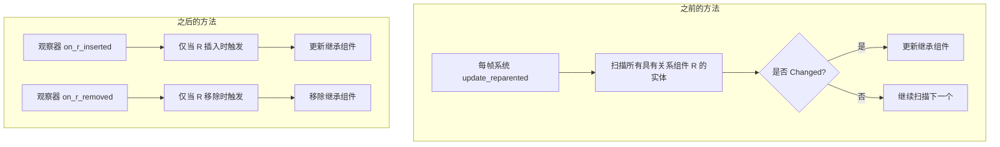

+++
title = "#23156 fix: reparenting perf"
date = "2026-03-02T00:00:00"
draft = false
template = "pull_request_page.html"
in_search_index = false

[extra]
current_language = "zh-cn"
available_languages = {"en" = { name = "English", url = "/pull_request/bevy/2026-03/pr-23156-en-20260302" }, "zh-cn" = { name = "中文", url = "/pull_request/bevy/2026-03/pr-23156-zh-cn-20260302" }}
+++

# fix: reparenting perf

## 基本信息
- **标题**: fix: reparenting perf
- **PR链接**: https://github.com/bevyengine/bevy/pull/23156
- **作者**: aevyrie
- **状态**: 已合并
- **标签**: C-性能优化, S-准备最终评审, A-应用, X-无争议, D-直接明了
- **创建时间**: 2026-02-26T07:52:32Z
- **合并时间**: 2026-03-02T00:07:00Z
- **合并者**: alice-i-cecile

## 描述翻译

### 目标

`HierarchyPropagatePlugin` 包含一个系统 `update_reparented`，它每一帧都会扫描每个具有关系组件 `R` 的实体，以检测 `Changed<R>`。这意味着即使没有任何变化，每一帧也需要迭代所有子实体。这是一个显著的每帧开销，且随着子实体数量的增加而线性增长。

修复 #23155

### 解决方案

将 `update_reparented` 系统及其 `Changed<R>` 查询替换为两个反应式生命周期观察器（reactive lifecycle observers）：

- **`on_r_inserted`**: 注册在 `On<Insert, R>` 上，仅当 `R` 实际被插入到实体上时触发。如果新的父实体有 `Inherited<C>`，则将其复制到实体上，否则从实体中移除。
- **`on_r_removed`**: 注册在 `On<Remove, R>` 上，仅当 `R` 实际从实体中移除时触发。如果实体继承了 `Inherited<C>`，则移除它。

这将 O(n) 的每帧扫描替换为 O(1) 的按事件反应。

### 关于变更（mutations）的说明

`Changed<R>` 也能检测到对 `R` 的直接变更（mutation），而 `On<Insert, R>` 则不能。

据我所知，这是可以安全忽略的；**请审查此逻辑的正确性！**

像 `ChildOf` 这样的关系组件必须只能通过 `insert` 来更改，绝不能通过直接变更（direct mutation）。这是因为 `R` 带有通过组件钩子（component hooks）强制执行的簿记语义。插入一个新值会触发钩子，将实体从旧父实体的 `RelationshipTarget` 中移除，并添加到新的父实体中。通过 `Mut<R>` 直接变更会完全绕过这些钩子，使得旧父实体和新父实体的 `RelationshipTarget` 处于不一致状态。任何这样做的应用程序都已经存在一个 bug。`On<Insert, R>` 对于**首次添加**和替换（使用新值重新插入）都会触发，这涵盖了关系可能变化的每一种有效方式：

| 情况 | 旧方法（`Changed<R>`） | 新方法（`On<Insert, R>` / `On<Remove, R>`） |
|---|---|---|
| 带有 `R` 的新子实体生成（spawn） | ✅ | ✅ 通过 `On<Insert, R>` |
| 实体重新分配父级（`insert(R)`） | ✅ | ✅ 通过 `On<Insert, R>` |
| `R` 被移除（实体成为孤儿） | ✅ 通过 `orphaned` 查询 | ✅ 通过 `On<Remove, R>` |
| 通过 `Mut<R>` 直接变更 `R` | ✅ | ❌ 不支持：破坏关系不变性 |

### 测试

所有现有的传播测试都通过了，包括：
- `test_reparented`：移动到不传播的父实体的实体会丢失 `Inherited<C>`
- `test_reparented_with_prior`：在两个传播父实体之间移动的实体会获取新值
- `test_remove_orphan`：移除了 `R` 的实体会丢失 `Inherited<C>`

## 关于此次PR的故事

### 问题和背景

`HierarchyPropagatePlugin` 是 Bevy 引擎中用于组件继承的核心插件，它允许组件值在实体层次结构中自动传播。在 #23155 中，开发者识别到了一个性能问题：`update_reparented` 系统每一帧都会扫描所有带有特定关系组件（例如 `ChildOf`）的实体，检查它们的关系是否发生了变化（使用 `Changed<R>` 查询）。这导致了 O(n) 的每帧开销，其中 n 是子实体的数量，即使场景中没有任何变化。

这种设计的问题是显而易见的：为了检测少数可能的变化，系统需要遍历所有相关实体。在一个大型场景中，可能有成千上万的子实体，这种开销会迅速累积，影响整体性能。

### 解决方案途径

开发者采用了一种事件驱动（event-driven）的解决方案，利用 Bevy 新增的观察器（observer）系统。其核心思路是：与其每一帧主动扫描检查变化，不如监听实际发生的事件（插入或移除关系组件）。这样，只有真正发生变化时才会执行相应逻辑。

技术上，他们用两个观察器（`On<Insert, R>` 和 `On<Remove, R>`）替换了原来的 `Changed<R>` 查询。这涉及到一个关键的设计决策：是否要放弃对直接组件变更（`Mut<R>`）的检测。经过分析，开发者认为关系组件（如 `ChildOf`）不应该通过 `Mut` 直接修改，因为这会绕过必要的簿记钩子，导致数据不一致。因此，放弃对这种"非法"操作的支持是合理的。

### 具体实现

实现主要集中在 `propagate.rs` 文件中。原来的 `update_reparented` 系统被移除，代之以两个新的观察器函数：

```rust
/// Add/remove [`Inherited::<C>`] when an entity gains or changes its `R` relationship
pub fn on_r_inserted<
    C: Component + Clone + PartialEq,
    F: QueryFilter + 'static,
    R: Relationship,
>(
    event: On<Insert, R>,
    mut commands: Commands,
    query: Query<(&R, Has<Inherited<C>>), (Without<Propagate<C>>, F)>,
    relations: Query<&Inherited<C>, Without<PropagateStop<C>>>,
) {
    let Ok((relation, has_inherited)) = query.get(event.entity) else {
        return;
    };
    if let Ok(inherited) = relations.get(relation.get()) {
        commands.entity(event.entity).try_insert(inherited.clone());
    } else if has_inherited {
        commands.entity(event.entity).try_remove::<Inherited<C>>();
    }
}
```

这个函数只在关系组件 `R` 被插入时触发。它检查新父实体是否拥有 `Inherited<C>` 组件：如果有，则将其复制到当前实体；如果当前实体原本有 `Inherited<C>` 但新父实体没有，则移除它。

```rust
/// Remove [`Inherited::<C>`] when an entity loses its `R` relationship
pub fn on_r_removed<C: Component + Clone + PartialEq, F: QueryFilter + 'static, R: Relationship>(
    event: On<Remove, R>,
    mut commands: Commands,
    query: Query<(), (With<Inherited<C>>, Without<Propagate<C>>, F)>,
) {
    if query.contains(event.entity) {
        commands.entity(event.entity).try_remove::<Inherited<C>>();
    }
}
```

这个函数处理关系组件被移除的情况。如果实体失去了关系组件并且本身有 `Inherited<C>`，则将其移除。

这两个观察器函数通过 `app.add_observer()` 注册，而不是作为常规系统添加到调度中。这意味着它们仅在相应事件发生时执行，而不是每一帧都执行。

### 技术洞察

这个 PR 展示了几个重要的工程模式：

1. **从轮询（polling）到事件驱动（event-driven）的转变**：这是性能优化的经典模式。当变化频率远低于检查频率时，事件驱动方法能显著减少不必要的计算。

2. **利用框架新特性**：这次修改依赖于 Bevy 的观察器系统，这是一个相对较新的特性。它允许开发者编写只在特定事件（如组件插入、移除）发生时触发的系统。

3. **有意识地放弃对边缘情况的支持**：开发者明确决定不支持通过 `Mut` 直接修改关系组件，因为这种用法本身会导致不一致状态。这是一个合理的权衡：优化了常见路径（合法使用）的性能，同时明确标示出不受支持的用法。

4. **向后兼容性**：所有现有测试都通过，表明这次重构保持了原有功能的正确性。

### 影响

这次修改的直接影响是显著减少了处理实体重新分配父级（reparenting）时的 CPU 开销。特别是对于大型场景，性能提升会更加明显。从架构角度看，这次修改使代码更加简洁且意图更明确：每个函数只处理一个特定的事件，而不是在一个复杂的查询中混合多种情况。

需要注意的是，这种方法假设关系组件不会被直接变更（mutation）。如果确实有代码通过 `Mut<R>` 修改关系组件，那么这些代码现在会表现出不同的行为：继承的组件可能不会正确更新。开发者应该将这些用法迁移到正确的 `insert` 操作。

## 可视化表示



## 关键文件更改

### `crates/bevy_app/src/propagate.rs` (+35/-20)

这是本次 PR 中唯一修改的文件。主要变化包括：

1. **移除每帧扫描系统**：`update_reparented` 系统被完全移除，不再每帧扫描所有实体。
2. **添加事件驱动的观察器**：添加了两个新的观察器函数 `on_r_inserted` 和 `on_r_removed`，它们只在特定事件发生时执行。
3. **插件注册更新**：在 `HierarchyPropagatePlugin` 中，不再将 `update_reparented` 添加到调度中，而是注册两个观察器。

主要代码变化：

```rust
// 之前：在调度系统中包含 update_reparented
self.schedule,
    (
        update_source::<C, F, R>,
        update_reparented::<C, F, R>,  // 每帧执行的系统
        update_removed_limit::<C, F, R>,
        propagate_inherited::<C, F, R>,
        propagate_output::<C, F>,
    )
    .chain()
    .in_set(PropagateSet::<C>::default()),

// 之后：移除 update_reparented，添加观察器
self.schedule,
    (
        update_source::<C, F, R>,
        // update_reparented 被移除
        update_removed_limit::<C, F, R>,
        propagate_inherited::<C, F, R>,
        propagate_output::<C, F>,
    )
    .chain()
    .in_set(PropagateSet::<C>::default()),
);
app.add_observer(on_r_inserted::<C, F, R>);  // 添加观察器
app.add_observer(on_r_removed::<C, F, R>);
```

```rust
// 之前：update_reparented 函数（完整查询每帧执行）
pub fn update_reparented<C: Component + Clone + PartialEq, F: QueryFilter, R: Relationship>(
    mut commands: Commands,
    moved: Query<(Entity, &R, Option<&Inherited<C>>), (Changed<R>, Without<Propagate<C>>, F)>,
    relations: Query<&Inherited<C>, Without<PropagateStop<C>>>,
    orphaned: Query<Entity, (With<Inherited<C>>, Without<Propagate<C>>, Without<R>, F)>,
) {
    for (entity, relation, maybe_inherited) in &moved {
        if let Ok(inherited) = relations.get(relation.get()) {
            commands.entity(entity).try_insert(inherited.clone());
        } else if maybe_inherited.is_some() {
            commands.entity(entity).try_remove::<Inherited<C>>();
        }
    }

    for orphan in &orphaned {
        commands.entity(orphan).try_remove::<Inherited<C>>();
    }
}

// 之后：on_r_inserted 观察器（仅在插入事件时触发）
pub fn on_r_inserted<
    C: Component + Clone + PartialEq,
    F: QueryFilter + 'static,
    R: Relationship,
>(
    event: On<Insert, R>,  // 事件参数
    mut commands: Commands,
    query: Query<(&R, Has<Inherited<C>>), (Without<Propagate<C>>, F)>,
    relations: Query<&Inherited<C>, Without<PropagateStop<C>>>,
) {
    let Ok((relation, has_inherited)) = query.get(event.entity) else {
        return;
    };
    if let Ok(inherited) = relations.get(relation.get()) {
        commands.entity(event.entity).try_insert(inherited.clone());
    } else if has_inherited {
        commands.entity(event.entity).try_remove::<Inherited<C>>();
    }
}
```

## 进一步阅读

1. **Bevy 观察器系统**：了解 Bevy 的事件观察器模式，这是本次优化依赖的核心机制。
   - [Bevy 观察器文档](https://docs.rs/bevy/latest/bevy/ecs/observer/index.html)
   
2. **实体组件系统（ECS）模式**：理解 ECS 架构中组件、系统和实体之间的关系。
   - [ECS 模式概述](https://en.wikipedia.org/wiki/Entity_component_system)

3. **性能优化模式：从轮询到事件驱动**：深入探讨这种架构转变的性能优势和使用场景。
   - [事件驱动架构](https://en.wikipedia.org/wiki/Event-driven_architecture)

4. **Bevy 中的层次结构和继承**：了解 Bevy 如何处理实体间的父子关系和组件传播。
   - [Bevy Hierarchy 模块](https://docs.rs/bevy/latest/bevy/hierarchy/index.html)