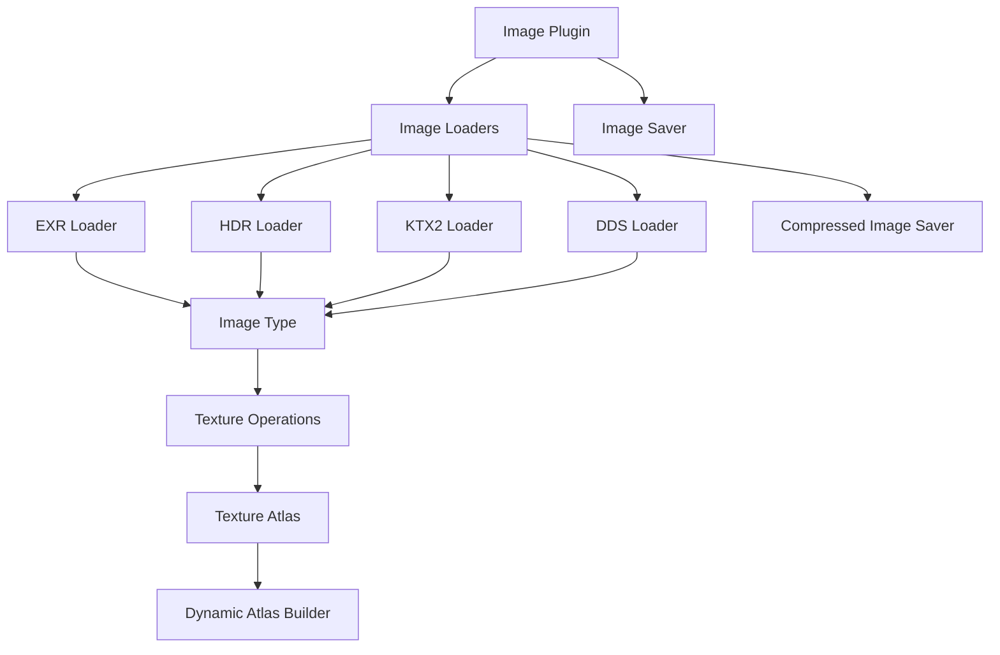

+++
title = "#23160 deny missing docs for `bevy_image`"
date = "2026-03-03T00:00:00"
draft = false
template = "pull_request_page.html"
in_search_index = true

[taxonomies]
list_display = ["show"]

[extra]
current_language = "en"
available_languages = {"en" = { name = "English", url = "/pull_request/bevy/2026-03/pr-23160-en-20260303" }, "zh-cn" = { name = "中文", url = "/pull_request/bevy/2026-03/pr-23160-zh-cn-20260303" }}
labels = ["C-Docs", "A-Rendering", "D-Modest"]
+++

# Title

## Basic Information
- **Title**: deny missing docs for `bevy_image`
- **PR Link**: https://github.com/bevyengine/bevy/pull/23160
- **Author**: grind086
- **Status**: MERGED
- **Labels**: C-Docs, A-Rendering, S-Ready-For-Final-Review, D-Modest
- **Created**: 2026-02-27T00:00:33Z
- **Merged**: 2026-03-03T00:49:33Z
- **Merged By**: alice-i-cecile

## Description Translation

# Objective

`bevy_image` is missing docs (related: #3492)

## Solution

Remove `#![expect(missing_docs)]` and add docs til clippy is happy.

I also removed the `SAMPLER_ASSET_INDEX` and `TEXTURE_ASSET_INDEX` constants because they were undocumented, and appear to be unused across the entire repo (unless both vscode and github search have failed me).

## The Story of This Pull Request

The `bevy_image` crate, responsible for Bevy's image asset handling and texture operations, had been living with an explicit `#![expect(missing_docs)]` attribute for some time. This was a temporary workaround documented in issue #3492, acknowledging that comprehensive documentation was still pending. The expectation attribute served as a reminder that documentation work was needed while allowing the code to compile without warnings.

This PR addresses that technical debt by systematically adding documentation across the entire crate. The developer took a straightforward approach: first removing the `expect` attribute, then running clippy to identify all undocumented public items, and finally writing documentation for each until clippy reported no issues. This methodical process ensured complete coverage of the public API.

During the documentation process, the developer discovered two undocumented constants: `TEXTURE_ASSET_INDEX` and `SAMPLER_ASSET_INDEX`. After verifying through both VSCode and GitHub search that these constants were unused anywhere in the codebase, they were removed. This is a good practice—removing dead code reduces cognitive load and prevents potential confusion for future developers.

The documentation added follows Bevy's established patterns. For enums, each variant receives a brief description. For structs, fields are documented, often with cross-references to related types. Error types include explanations for each error case. Complex concepts like `DataFormat` and `CompressedImageFormats` receive detailed explanations with links to external specifications when relevant.

One notable technical improvement came in the error handling code. In `exr_texture_loader.rs` and `hdr_texture_loader.rs`, the code was calling `format.pixel_size()` and handling the potential `TextureAccessError`. However, `Rgba32Float` format always has a valid pixel size (16 bytes), so the error case was unreachable. The PR changes these calls to use `unwrap()` instead, simplifying the code and removing unnecessary error variants from the loader error types. This is a sensible optimization since it eliminates error cases that could never occur in practice.

The documentation also clarifies several design decisions. For example, `RenderAssetUsages` fields in loader settings now explicitly state they control "where the asset will be used," pointing developers to the relevant documentation. The `Image` struct's `asset_usage` field receives similar clarification, helping developers understand when image data might be moved to the GPU and become inaccessible on the CPU.

## Visual Representation



## Key Files Changed

### `crates/bevy_image/src/image.rs` (+117/-8)
This is the main file for the image module, containing core types like `Image`, `ImageFormat`, and various enums. The changes add comprehensive documentation to all public items and remove two unused constants.

**Key changes:**
1. Added documentation for the `ImageFormat` enum and all its variants
2. Documented methods like `from_mime_type()`, `from_extension()`, and `as_image_crate_format()`
3. Added documentation for `DataFormat` and `TranscodeFormat` enums
4. Enhanced error enums with detailed field documentation
5. Removed unused `TEXTURE_ASSET_INDEX` and `SAMPLER_ASSET_INDEX` constants

**Example of improved documentation:**
```rust
// Before:
pub enum ImageFormat {
    #[cfg(feature = "basis-universal")]
    Basis,
    // ... other variants without docs
}

// After:
/// The format of an on-disk image asset.
#[derive(Debug, Serialize, Deserialize, Copy, Clone)]
pub enum ImageFormat {
    /// An image in basis universal format.
    #[cfg(feature = "basis-universal")]
    Basis,
    /// An image in BMP format.
    #[cfg(feature = "bmp")]
    Bmp,
    // ... other variants with clear documentation
}
```

### `crates/bevy_image/src/ktx2.rs` (+23/-0)
This file handles KTX2 texture format loading. The changes add documentation to public functions explaining their purpose and error conditions.

**Key changes:**
1. Added documentation for `ktx2_buffer_to_image()` function
2. Documented `get_transcoded_formats()` helper function
3. Added docs for format conversion functions

**Example:**
```rust
/// Converts KTX2 bytes to a bevy [`Image`] using the given compressed format support.
///
/// # Errors
///
/// Returns an error if the provided buffer contained invalid data, decompression fails, or transcoding
/// of unsupported data formats fails.
#[cfg(feature = "ktx2")]
pub fn ktx2_buffer_to_image(
    buffer: &[u8],
    supported_compressed_formats: CompressedImageFormats,
    is_srgb: bool,
) -> Result<Image, TextureError> {
```

### `crates/bevy_image/src/hdr_texture_loader.rs` (+8/-4)
This file handles HDR image loading. The changes add documentation and simplify error handling.

**Key changes:**
1. Added `HdrTextureLoaderSettings` struct documentation
2. Added error enum documentation
3. Simplified `pixel_size()` call by using `unwrap()` since `Rgba32Float` always has valid size
4. Removed unnecessary `TextureAccessError` variant

**Example of error handling simplification:**
```rust
// Before:
let pixel_size = format.pixel_size()?;

// After:
// `Rgba32Float` will always return a valid pixel size
let pixel_size = format.pixel_size().unwrap();
```

### `crates/bevy_image/src/dds.rs` (+11/-0)
This file handles DDS texture format loading. The changes add function documentation.

**Key changes:**
1. Added documentation for `dds_buffer_to_image()` function
2. Documented `dds_format_to_texture_format()` function

### `crates/bevy_image/src/exr_texture_loader.rs` (+7/-4)
This file handles EXR image loading. The changes parallel those in the HDR loader.

**Key changes:**
1. Added `ExrTextureLoaderSettings` struct documentation
2. Added error enum documentation
3. Simplified `pixel_size()` call with `unwrap()`
4. Removed unnecessary `TextureAccessError` variant

### `crates/bevy_image/src/lib.rs` (+2/-1)
This is the crate root. The changes remove the expect attribute and add a crate-level doc comment.

**Key changes:**
```rust
// Before:
#![expect(missing_docs, reason = "Not all docs are written yet, see #3492.")]

// After:
//! The Bevy game engine's GPU-oriented image type.
```

## Further Reading

1. [Bevy's Documentation Guidelines](https://github.com/bevyengine/bevy/blob/main/docs/plugins_guidelines.md#documentation) - Official guidelines for Bevy documentation
2. [Rust API Guidelines](https://rust-lang.github.io/api-guidelines/documentation.html) - General Rust documentation best practices
3. [Texture Compression Formats](https://registry.khronos.org/DataFormat/specs/1.3/dataformat.1.3.html) - Technical specifications for ASTC, BC, ETC2 formats referenced in the documentation
4. [Basis Universal Texture Specification](https://github.com/BinomialLLC/basis_universal/wiki/UASTC-Texture-Specification) - Details on UASTC format referenced in `DataFormat` documentation