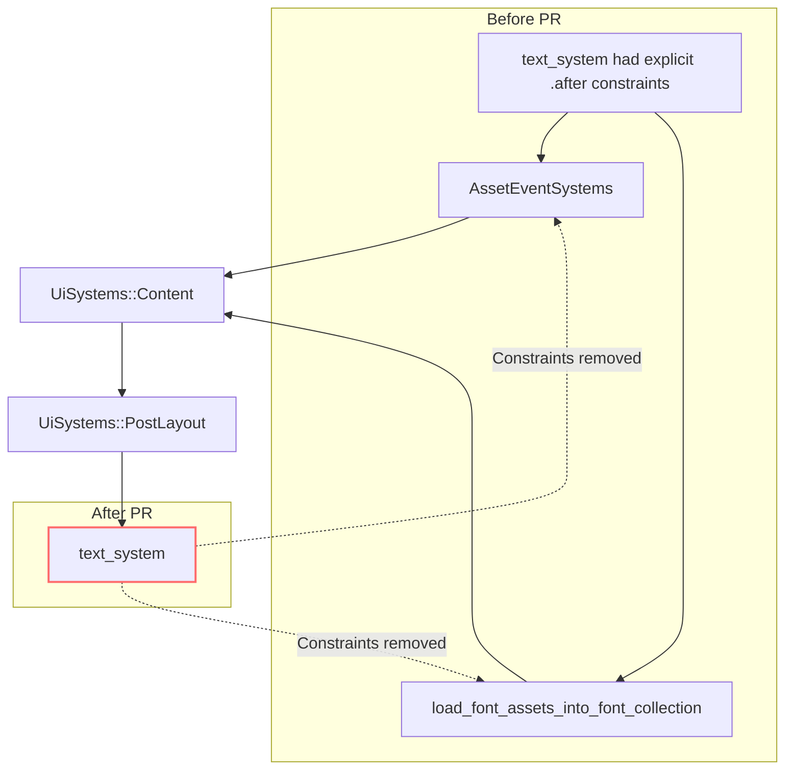

+++
title = "#23165 Remove redundant `after` ordering from `build_text_interop`"
date = "2026-03-02T00:00:00"
draft = false
template = "pull_request_page.html"
in_search_index = true

[taxonomies]
list_display = ["show"]

[extra]
current_language = "en"
available_languages = {"en" = { name = "English", url = "/pull_request/bevy/2026-03/pr-23165-en-20260302" }, "zh-cn" = { name = "中文", url = "/pull_request/bevy/2026-03/pr-23165-zh-cn-20260302" }}
labels = ["D-Trivial", "A-UI", "C-Code-Quality", "A-Text"]
+++

# Title
Remove redundant `after` ordering from `build_text_interop`

## Basic Information
- **Title**: Remove redundant `after` ordering from `build_text_interop`
- **PR Link**: https://github.com/bevyengine/bevy/pull/23165
- **Author**: ickshonpe
- **Status**: MERGED
- **Labels**: D-Trivial, A-UI, C-Code-Quality, S-Ready-For-Final-Review, A-Text
- **Created**: 2026-02-27T10:51:29Z
- **Merged**: 2026-03-02T19:29:47Z
- **Merged By**: alice-i-cecile

## Description Translation
This PR description is already in English, so it's included exactly as-is:

# Objective

Remove these `after` constraints on `text_system` from `build_text_interop`:

```
.after(bevy_text::load_font_assets_into_font_collection)
.after(bevy_asset::AssetEventSystems)
```

They are redundant because `text_system` runs in `UiSystems::PostLayout`, which is already ordered after `load_font_assets_into_font_collection` and `AssetEventSystems` through `UiSystems::Content`.

## Solution

Remove them.

## The Story of This Pull Request

This PR addresses a straightforward code quality issue in the Bevy UI module. The developer noticed redundant system ordering constraints in the text rendering pipeline and removed them to simplify the codebase while maintaining the same execution order guarantees.

**The Problem and Context:** In Bevy's ECS (Entity Component System), systems need to execute in a specific order when they have dependencies on each other. The engine provides several mechanisms to enforce these ordering constraints, including `.before()`, `.after()`, and system set hierarchies. The `build_text_interop` function was configuring the `text_system` with explicit `.after()` constraints for two other systems: `load_font_assets_into_font_collection` and `AssetEventSystems`. However, these constraints were unnecessary because the system's placement in the `UiSystems::PostLayout` set already guaranteed this ordering through the broader system set hierarchy.

The issue represents a form of code duplication in system ordering logic. Having redundant constraints doesn't cause functional problems—the system would still execute in the correct order—but it creates maintenance overhead. If the hierarchy changes in the future, developers would need to update both the system set ordering and the individual system constraints, increasing the risk of inconsistencies.

**The Solution Approach:** The developer identified that the explicit `.after()` constraints were redundant and could be safely removed. This approach follows the principle of keeping system ordering logic centralized in the system set hierarchy rather than scattering it across individual system configurations. The solution is minimal and focused—it removes only what's unnecessary without changing any functional behavior.

**The Implementation:** The change is implemented in a single file with a two-line deletion. The `text_system` is configured to run in the `UiSystems::PostLayout` system set, which is already ordered after the relevant systems through the `UiSystems::Content` hierarchy. By removing the explicit `.after()` constraints, the code becomes cleaner and more maintainable.

The technical insight here is understanding how Bevy's system ordering works at multiple levels. System sets provide a way to group systems and define ordering between groups, while individual systems can have additional constraints when needed. When a system's set membership already provides the necessary ordering, adding explicit constraints at the system level is redundant. This is similar to how in programming we might remove redundant condition checks when we know they're already guaranteed by earlier logic.

**The Impact:** The change improves code quality by eliminating redundant constraints. It makes the system configuration easier to understand and maintain because the ordering logic is now centralized in the system set hierarchy. From a performance perspective, there's no impact—the systems still execute in the same order. From a maintenance perspective, the change reduces the surface area for potential bugs if the ordering hierarchy changes in the future.

The PR demonstrates good attention to detail in system configuration and an understanding of Bevy's ECS architecture. It's a small but meaningful improvement that follows established software engineering practices of eliminating redundancy and centralizing configuration logic.

## Visual Representation



## Key Files Changed

**File: `crates/bevy_ui/src/lib.rs`**

This file contains the `build_text_interop` function which sets up the text rendering systems for the UI. The change removes two redundant `.after()` constraints from the `text_system` configuration.

**Before:**
```rust
widget::text_system
    .in_set(UiSystems::PostLayout)
    .after(bevy_text::load_font_assets_into_font_collection)
    .after(bevy_asset::AssetEventSystems)
    // Text2d and bevy_ui text are entirely on separate entities
    .ambiguous_with(bevy_text::detect_text_needs_rerender::<bevy_sprite::Text2d>)
    .ambiguous_with(bevy_sprite::update_text2d_layout)
```

**After:**
```rust
widget::text_system
    .in_set(UiSystems::PostLayout)
    // Text2d and bevy_ui text are entirely on separate entities
    .ambiguous_with(bevy_text::detect_text_needs_rerender::<bevy_sprite::Text2d>)
    .ambiguous_with(bevy_sprite::update_text2d_layout)
```

The changes:
1. Removed `.after(bevy_text::load_font_assets_into_font_collection)` - redundant because `UiSystems::PostLayout` is already ordered after this system through `UiSystems::Content`
2. Removed `.after(bevy_asset::AssetEventSystems)` - redundant for the same reason

The `.ambiguous_with()` constraints remain unchanged as they serve a different purpose—preventing these systems from running concurrently when they shouldn't, which isn't related to execution order.

## Further Reading

1. **Bevy ECS System Ordering Documentation**: The official Bevy book covers system ordering and system sets in detail, explaining the different ways to control execution order.
2. **System Sets in Bevy**: Understanding how system sets work and how they can be nested and ordered relative to each other.
3. **Code Quality Best Practices**: Resources on identifying and removing redundant code, particularly in configuration and setup logic.
4. **Bevy UI Architecture**: Documentation on how the UI systems are structured, including the `UiSystems` hierarchy and how text rendering integrates with the overall UI system.