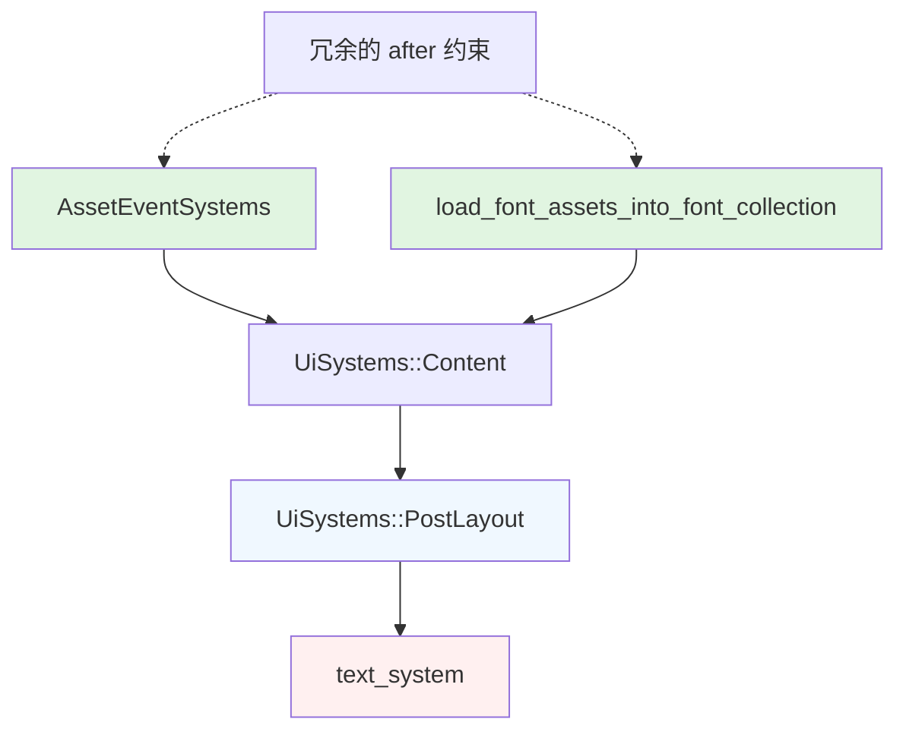

+++
title = "#23165 Remove redundant `after` ordering from `build_text_interop`"
date = "2026-03-02T00:00:00"
draft = false
template = "pull_request_page.html"
in_search_index = false

[extra]
current_language = "zh-cn"
available_languages = {"en" = { name = "English", url = "/pull_request/bevy/2026-03/pr-23165-en-20260302" }, "zh-cn" = { name = "中文", url = "/pull_request/bevy/2026-03/pr-23165-zh-cn-20260302" }}
labels = ["D-Trivial", "A-UI", "C-Code-Quality", "A-Text"]
+++

# Title

## Basic Information
- **Title**: Remove redundant `after` ordering from `build_text_interop`
- **PR Link**: https://github.com/bevyengine/bevy/pull/23165
- **Author**: ickshonpe
- **Status**: MERGED
- **Labels**: D-Trivial, A-UI, C-Code-Quality, S-Ready-For-Final-Review, A-Text
- **Created**: 2026-02-27T10:51:29Z
- **Merged**: 2026-03-02T19:29:47Z
- **Merged By**: alice-i-cecile

## Description Translation
翻译PR描述如下：

# 目标

从`build_text_interop`中移除这些对`text_system`的`after`约束：

```
.after(bevy_text::load_font_assets_into_font_collection)
.after(bevy_asset::AssetEventSystems)
```

它们是冗余的，因为`text_system`在`UiSystems::PostLayout`中运行，而`UiSystems::PostLayout`已经通过`UiSystems::Content`在`load_font_assets_into_font_collection`和`AssetEventSystems`之后排序。

## 解决方案

移除它们。

## The Story of This Pull Request

这个PR处理了一个关于系统(system)排序冗余的代码质量问题。在Bevy引擎的调度系统(scheduling system)中，开发者可以通过`after`约束来明确指定某些系统(system)必须在其他系统(system)之后运行，以确保正确的执行顺序和数据依赖关系。

问题起源于`build_text_interop`函数中对`text_system`的设置。开发人员发现，这个系统(system)已经被添加了两个显式的`after`约束：
1. 在`bevy_text::load_font_assets_into_font_collection`之后
2. 在`bevy_asset::AssetEventSystems`之后

然而，经过分析发现这些约束是多余的。这是因为`text_system`被分配到了`UiSystems::PostLayout`系统集(system set)中，而`UiSystems::PostLayout`本身已经通过系统集(system set)层次结构确保了正确的执行顺序。

具体来说，Bevy的UI模块使用了层级化的系统集(system set)组织方式：
- `UiSystems::Content`系统集(system set)包含了多个子系统集(system set)
- `UiSystems::PostLayout`是`UiSystems::Content`的一部分
- `load_font_assets_into_font_collection`和`AssetEventSystems`系统(system)在系统集(system set)层次结构中已经位于`UiSystems::PostLayout`之前

这意味着系统(system)调度器(scheduler)已经通过系统集(system set)的配置保证了正确的执行顺序，不需要额外的显式约束。

从代码维护的角度来看，移除这些冗余约束有几个好处：
1. **减少认知负担**：代码阅读者不需要理解为什么这些约束存在
2. **简化调度配置**：系统(system)调度配置更清晰，不会有过多的重复声明
3. **避免潜在冲突**：当系统集(system set)的配置发生变化时，冗余约束可能导致意外的调度冲突

这个修改属于典型的代码清理工作，它不会改变系统的运行时行为，但提高了代码的可读性和可维护性。这类清理工作对于大型项目如Bevy引擎尤为重要，因为清晰的代码结构有助于后续的开发和维护工作。

## Visual Representation



## Key Files Changed

### crates/bevy_ui/src/lib.rs
**修改内容**：移除了两个冗余的`after`约束，简化了`build_text_interop`函数中`text_system`的调度配置。

**修改详情**：
```rust
// Before:
widget::text_system
    .in_set(UiSystems::PostLayout)
    .after(bevy_text::load_font_assets_into_font_collection)
    .after(bevy_asset::AssetEventSystems)
    // Text2d and bevy_ui text are entirely on separate entities
    .ambiguous_with(bevy_text::detect_text_needs_rerender::<bevy_sprite::Text2d>)
    .ambiguous_with(bevy_sprite::update_text2d_layout)

// After:
widget::text_system
    .in_set(UiSystems::PostLayout)
    // Text2d and bevy_ui text are entirely on separate entities
    .ambiguous_with(bevy_text::detect_text_needs_rerender::<bevy_sprite::Text2d>)
    .ambiguous_with(bevy_sprite::update_text2d_layout)
```

**影响分析**：
这个修改移除了第244-245行的两个`after`约束。移除这些约束不会改变系统的执行顺序，因为`text_system`通过`UiSystems::PostLayout`系统集(system set)已经确保了在`load_font_assets_into_font_collection`和`AssetEventSystems`之后执行。这个清理使代码更简洁，减少了不必要的调度声明。

## Further Reading

1. **Bevy 系统调度文档**：了解Bevy引擎中系统(system)调度和排序机制
   - https://bevyengine.org/learn/book/getting-started/ecs/#system-ordering

2. **系统集(System Sets)使用方法**：学习如何使用系统集(system set)来组织和管理系统(system)执行顺序
   - https://bevy-cheatbook.github.io/programming/system-sets.html

3. **Bevy UI模块架构**：深入了解Bevy UI模块的系统(system)组织方式
   - https://github.com/bevyengine/bevy/tree/main/crates/bevy_ui

4. **代码重构最佳实践**：学习识别和移除冗余代码的技术
   - 《重构：改善既有代码的设计》- Martin Fowler

---

# Full Code Diff
diff --git a/crates/bevy_ui/src/lib.rs b/crates/bevy_ui/src/lib.rs
index 66a8d8eb8107c..f8b7b838711f3 100644
--- a/crates/bevy_ui/src/lib.rs
+++ b/crates/bevy_ui/src/lib.rs
@@ -244,8 +244,6 @@ fn build_text_interop(app: &mut App) {
                 .ambiguous_with(widget::update_image_content_size_system),
             widget::text_system
                 .in_set(UiSystems::PostLayout)
-                .after(bevy_text::load_font_assets_into_font_collection)
-                .after(bevy_asset::AssetEventSystems)
                 // Text2d and bevy_ui text are entirely on separate entities
                 .ambiguous_with(bevy_text::detect_text_needs_rerender::<bevy_sprite::Text2d>)
                 .ambiguous_with(bevy_sprite::update_text2d_layout)