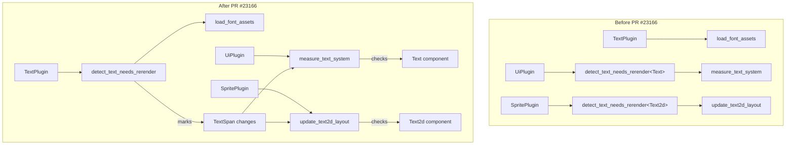

+++
title = "#23166 single `detect_text_needs_rerender` system"
date = "2026-03-03T00:00:00"
draft = false
template = "pull_request_page.html"
in_search_index = true

[taxonomies]
list_display = ["show"]

[extra]
current_language = "en"
available_languages = {"en" = { name = "English", url = "/pull_request/bevy/2026-03/pr-23166-en-20260303" }, "zh-cn" = { name = "中文", url = "/pull_request/bevy/2026-03/pr-23166-zh-cn-20260303" }}
labels = ["C-Bug", "C-Code-Quality", "A-Text", "D-Modest"]
+++

# Title: single `detect_text_needs_rerender` system

## Basic Information
- **Title**: single `detect_text_needs_rerender` system
- **PR Link**: https://github.com/bevyengine/bevy/pull/23166
- **Author**: ickshonpe
- **Status**: MERGED
- **Labels**: C-Bug, C-Code-Quality, S-Ready-For-Final-Review, A-Text, X-Uncontroversial, D-Modest
- **Created**: 2026-02-27T13:05:15Z
- **Merged**: 2026-03-03T17:50:40Z
- **Merged By**: alice-i-cecile

## Description Translation
# Objective

`detect_text_needs_rerender` should only handle change detection for `TextSpan` entities.

Fixes #19437

## Solution

* Remove the generic type parameter from `detect_text_needs_rerender`. 
* Add `detect_text_needs_rerender` to `PostUpdate` in `TextPlugin`'s builder.
* Remove the scheduling of `detect_text_needs_rerender` from the `Text` and `Text2d` plugin builders.
* Check `Text` for changes in `measure_text` and `Text2d` for changes in `update_text2d_layout`.

This doesn't improve performance, the cost of doing the change detection in the text implementation specific systems balances out the savings by only runing `detect_text_needs_rerender` once. But combined with #23188, we should see a significant improvement.

## Testing

Text examples and tests still okay.

## The Story of This Pull Request

This PR addresses a design issue in Bevy's text rendering system where change detection was implemented inconsistently across different text types. The core problem was that the `detect_text_needs_rerender` system used a generic type parameter and was being scheduled multiple times for different text components, which created unnecessary complexity and potential bugs.

The issue stemmed from how text rendering works in Bevy. There are two main text components: `Text` for UI text and `Text2d` for 2D sprite text. Both can contain `TextSpan` components that represent individual spans of text with specific styling. The system responsible for detecting when text needs to be re-rendered was generic and was being run separately for each text type, even though it was fundamentally doing the same job for both.

The fix involved several key changes. First, the generic type parameter was removed from `detect_text_needs_rerender`, making it a single system that handles all `TextSpan` entities regardless of whether they belong to UI text or 2D text. This simplification is important because `TextSpan` entities don't care about their parent's type - they just need to trigger re-renders when their properties change.

```rust
// Before: Generic system with type parameter
pub fn detect_text_needs_rerender<Root: Component>(...)

// After: Non-generic system
pub fn detect_text_needs_rerender(...)
```

Second, the scheduling logic was restructured. Instead of having the `Text` and `Text2d` plugins each schedule their own instance of the detection system, the system is now scheduled once in the `TextPlugin`. This centralizes the change detection logic for text spans.

```rust
// In TextPlugin build method
.add_systems(
    PostUpdate,
    (
        detect_text_needs_rerender,
        load_font_assets_into_font_collection,
    )
        .chain(),
)
```

Third, to compensate for the removal of root component detection from the generic system, the individual text systems (`measure_text_system` for UI text and `update_text2d_layout` for 2D text) now explicitly check if their respective root text components have changed. This is more efficient because these systems were already running and could perform the check without additional overhead.

```rust
// In update_text2d_layout
let text_changed = scale_factor != text_layout_info.scale_factor
    || text2d.is_changed()  // Added: Check Text2d component for changes
    || block.is_changed()
    || computed.needs_rerender(viewport_size_changed, rem_size.is_changed())
    || (!reprocess_queue.is_empty() && reprocess_queue.remove(&entity));
```

The technical insight here is that change detection for root text components (`Text` and `Text2d`) is better handled in the systems that already process those components, rather than in a generic system that would need to query for multiple component types. This follows the principle of keeping related logic together and reduces the complexity of the change detection system.

The PR also required updating system ordering constraints. Since `detect_text_needs_rerender` now runs only once and handles all text spans, the text layout systems need to run after it to ensure they see the updated change detection flags.

```rust
// In bevy_ui text integration
.add_systems(
    PostUpdate,
    (
        widget::measure_text_system
            .chain()
            .after(detect_text_needs_rerender)  // Added ordering constraint
            .after(bevy_text::load_font_assets_into_font_collection)
    )
)
```

This refactoring fixes issue #19437 by eliminating the duplicate scheduling of the change detection system. While the performance impact is neutral in isolation (the cost of checking root components in individual systems balances the savings from running the detection system once), it sets up the codebase for future optimizations like #23188. More importantly, it improves code quality by reducing complexity and making the system boundaries clearer.

The changes demonstrate good software engineering practices: removing unnecessary abstractions (the generic type parameter), centralizing shared logic, and keeping related functionality together. The warning messages in the detection system were also updated to remove references to the generic type, making them more maintainable.

## Visual Representation



## Key Files Changed

### `crates/bevy_text/src/text.rs` (+10/-15)
This file contains the main change detection system. The generic type parameter was removed, and the system now only handles `TextSpan` change detection.

```rust
// Before:
pub fn detect_text_needs_rerender<Root: Component>(
    changed_roots: Query<
        Entity,
        (
            Or<(
                Changed<Root>,  // Checking root component
                Changed<TextFont>,
                Changed<TextLayout>,
                Changed<LineHeight>,
                Changed<Children>,
            )>,
            With<Root>,  // Filter by root component type
            With<TextFont>,
            With<TextLayout>,
        ),
    >,
    ...
)

// After:
pub fn detect_text_needs_rerender(
    changed_roots: Query<
        Entity,
        (
            Or<(
                // Removed: Changed<Root>
                Changed<TextFont>,
                Changed<TextLayout>,
                Changed<LineHeight>,
                Changed<Children>,
            )>,
            // Removed: With<Root>
            With<TextFont>,
            With<TextLayout>,
        ),
    >,
    ...
)
```

### `crates/bevy_sprite/src/text2d.rs` (+13/-3)
The 2D text layout system now explicitly checks for `Text2d` component changes.

```rust
// In update_text2d_layout function
// Added Text2d to the query
for (
    entity,
    text2d,  // Added: Ref<Text2d>
    maybe_entity_mask,
    block,
    bounds,
    mut text_layout_info,
    mut computed,
    hinting,
) in &mut text_query

// Added text2d.is_changed() to change detection
let text_changed = scale_factor != text_layout_info.scale_factor
    || text2d.is_changed()  // New change detection
    || block.is_changed()
    || computed.needs_rerender(viewport_size_changed, rem_size.is_changed())
    || (!reprocess_queue.is_empty() && reprocess_queue.remove(&entity));
```

### `crates/bevy_ui/src/widget/text.rs` (+?/-?)
The UI text measurement system now checks for `Text` component changes.

```rust
// In measure_text_system function
// Added Text to the query
for (
    entity,
    text,  // Added: Ref<Text>
    block,
    mut content_size,
    mut text_flags,
    mut computed_node,
    mut computed,
    rem_size,
) in &mut text_query

// Added text.is_changed() to the condition
if !(1e-5
    < (computed_target.scale_factor() - computed_node.inverse_scale_factor.recip()).abs()
    || computed.needs_rerender(computed_target.is_changed(), rem_size.is_changed())
    || text.is_changed()  // New change detection
    || text_flags.needs_measure_fn
    || content_size.is_added())
```

### `crates/bevy_ui/src/lib.rs` (+4/-10)
Updated system scheduling to remove the generic detection system and add proper ordering.

```rust
// Before:
.add_systems(
    PostUpdate,
    (
        bevy_text::detect_text_needs_rerender::<Text>,
        widget::measure_text_system,
    )
    .chain()
)

// After:
.add_systems(
    PostUpdate,
    (
        widget::measure_text_system
            .chain()
            .after(detect_text_needs_rerender)  // Run after the shared detection system
    )
)
```

### `crates/bevy_sprite/src/lib.rs` (+6/-6)
Updated the SpritePlugin to remove the generic detection system and update system ordering.

```rust
// Before:
app.add_systems(
    PostUpdate,
    (
        bevy_text::detect_text_needs_rerender::<Text2d>,
        update_text2d_layout.after(bevy_camera::CameraUpdateSystems),
    )
    .chain()
)

// After:
app.add_systems(
    PostUpdate,
    (update_text2d_layout.after(bevy_camera::CameraUpdateSystems),)
        .chain()
        .after(detect_text_needs_rerender)  // Run after the shared detection system
)
```

## Further Reading

1. [Bevy ECS Change Detection Documentation](https://docs.rs/bevy_ecs/latest/bevy_ecs/change_detection/index.html) - Understanding how change detection works in Bevy's ECS
2. [System Ordering in Bevy](https://bevy-cheatbook.github.io/programming/systems.html#system-ordering) - How to control system execution order
3. [Text Rendering in Bevy](https://bevyengine.org/learn/quick-start/ui/text/) - Official documentation on working with text in Bevy
4. [Issue #19437](https://github.com/bevyengine/bevy/issues/19437) - The original issue this PR fixes
5. [PR #23188](https://github.com/bevyengine/bevy/pull/23188) - Related performance optimization PR mentioned in the description