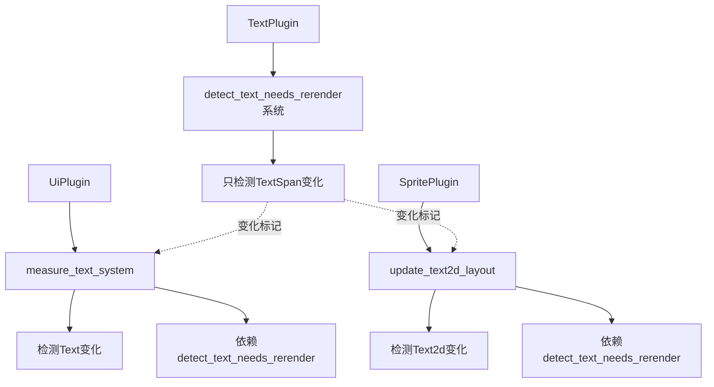

+++
title = "#23166 single `detect_text_needs_rerender` system"
date = "2026-03-03T00:00:00"
draft = false
template = "pull_request_page.html"
in_search_index = false

[extra]
current_language = "zh-cn"
available_languages = {"en" = { name = "English", url = "/pull_request/bevy/2026-03/pr-23166-en-20260303" }, "zh-cn" = { name = "中文", url = "/pull_request/bevy/2026-03/pr-23166-zh-cn-20260303" }}
+++

# Title: single `detect_text_needs_rerender` system

## Basic Information
- **标题**: single `detect_text_needs_rerender` system
- **PR链接**: https://github.com/bevyengine/bevy/pull/23166
- **作者**: ickshonpe
- **状态**: 已合并
- **标签**: C-Bug, C-Code-Quality, S-Ready-For-Final-Review, A-Text, X-Uncontroversial, D-Modest
- **创建时间**: 2026-02-27T13:05:15Z
- **合并时间**: 2026-03-03T17:50:40Z
- **合并者**: alice-i-cecile

## 描述翻译

# 目标

`detect_text_needs_rerender` 应该只处理 `TextSpan` 实体的变化检测。

修复 #19437

## 解决方案

* 从 `detect_text_needs_rerender` 中移除泛型类型参数。
* 在 `TextPlugin` 的构建器中将 `detect_text_needs_rerender` 添加到 `PostUpdate`。
* 从 `Text` 和 `Text2d` 插件构建器中移除 `detect_text_needs_rerender` 的调度安排。
* 在 `measure_text` 中检查 `Text` 的变化，在 `update_text2d_layout` 中检查 `Text2d` 的变化。

这不会提高性能，在特定文本实现系统中进行变化检测的成本与只运行一次 `detect_text_needs_rerender` 的节省相互抵消。但与 #23188 结合后，我们应该能看到显著的性能提升。

## 测试

文本示例和测试仍然正常。

## 本PR的故事

这个PR解决了一个设计上的问题：文本变化检测系统的职责划分不清晰。在Bevy引擎中，文本渲染涉及两个主要类型：UI文本（`Text`组件）和2D精灵文本（`Text2d`组件）。它们共享一个通用的变化检测系统 `detect_text_needs_rerender`，但这个系统的设计存在耦合问题。

### 问题与背景

在原始实现中，`detect_text_needs_rerender` 是一个泛型系统，接受 `Root` 类型参数，用于同时检测两种文本类型的变化。这种设计导致了几个问题：

1. **职责不清晰**：该系统既检测根文本组件（`Text`/`Text2d`）的变化，也检测文本跨度（`TextSpan`）的变化，违反了单一职责原则。
2. **重复调度**：需要在UI和Sprite两个插件中分别调度相同的系统，只是类型参数不同。
3. **性能问题**：虽然没有显著性能影响，但设计上的冗余可能导致未来的维护问题。

问题的核心是 #19437 中提到的：`detect_text_needs_rerender` 应该专注于处理 `TextSpan` 实体的变化检测，而根文本组件的变化检测应该在各自的专用系统中处理。

### 解决方案方法

开发者采用了职责分离的设计模式。主要思路是将变化检测的职责明确划分：

1. `detect_text_needs_rerender` 专门处理 `TextSpan` 实体的变化
2. UI文本系统 `measure_text_system` 自己处理 `Text` 组件的变化
3. 2D文本系统 `update_text2d_layout` 自己处理 `Text2d` 组件的变化

这种方法消除了泛型参数的需要，简化了系统依赖关系，并使得每个系统的职责更加明确。

### 实现细节

首先，从 `detect_text_needs_rerender` 中移除了泛型参数。这是通过修改查询条件实现的：

```rust
// 之前：
pub fn detect_text_needs_rerender<Root: Component>(
    changed_roots: Query<
        Entity,
        (
            Or<(
                Changed<Root>,  // 检查根组件
                Changed<TextFont>,
                Changed<TextLayout>,
                Changed<LineHeight>,
                Changed<Children>,
            )>,
            With<Root>,  // 要求有根组件
            With<TextFont>,
            With<TextLayout>,
        ),
    >,
    // ...
)

// 之后：
pub fn detect_text_needs_rerender(
    changed_roots: Query<
        Entity,
        (
            Or<(
                // 移除了 Changed<Root>
                Changed<TextFont>,
                Changed<TextLayout>,
                Changed<LineHeight>,
                Changed<Children>,
            )>,
            // 移除了 With<Root>
            With<TextFont>,
            With<TextLayout>,
        ),
    >,
    // ...
)
```

这样修改后，系统不再依赖特定的根组件类型，而是通过 `TextFont` 和 `TextLayout` 组件来识别文本根实体。

其次，在UI文本系统中添加了对 `Text` 组件变化的检测：

```rust
// 在 measure_text_system 中：
for (
    entity,
    text,  // 新增：Ref<Text>
    block,
    mut content_size,
    mut text_flags,
    computed,
    mut text_layout_info,
    maybe_entity_mask,
    hinting,
) in &mut text_query
{
    // ...
    || text.is_changed()  // 新增变化检测
    // ...
}
```

同样，在2D文本系统中添加了对 `Text2d` 组件变化的检测：

```rust
// 在 update_text2d_layout 中：
for (
    entity,
    text2d,  // 新增：Ref<Text2d>
    maybe_entity_mask,
    block,
    bounds,
    mut text_layout_info,
    mut computed,
    hinting,
) in &mut text_query
{
    // ...
    || text2d.is_changed()  // 新增变化检测
    // ...
}
```

第三，重新组织了系统的调度顺序。现在 `detect_text_needs_rerender` 只在 `TextPlugin` 中调度一次：

```rust
// 在 TextPlugin 中：
.add_systems(
    PostUpdate,
    (
        detect_text_needs_rerender,  // 只在这里调度一次
        load_font_assets_into_font_collection,
    )
        .chain(),
)
```

UI和Sprite插件中的相关系统都需要在这个系统之后运行：

```rust
// 在 UI 插件中：
.after(detect_text_needs_rerender)

// 在 Sprite 插件中：
.after(detect_text_needs_rerender)
```

### 技术洞察

这个重构展示了几个重要的设计原则：

1. **单一职责原则**：每个系统现在都有明确的职责范围。`detect_text_needs_rerender` 只处理 `TextSpan` 的变化，而特定文本类型的系统处理各自根组件的变化。

2. **依赖注入的替代方案**：通过移除泛型参数，系统不再需要外部指定类型，而是通过组件存在性来识别实体。这简化了系统间的依赖关系。

3. **调度优化**：通过集中调度 `detect_text_needs_rerender`，避免了重复的系统实例，减少了调度器的复杂度。

4. **变化检测的本地化**：将根组件的变化检测移到使用这些组件的系统中，使得变化检测更接近实际使用点，提高了代码的可维护性。

### 影响

这次重构的主要影响是代码质量的提升而非性能改善。如作者所述，性能方面大致平衡：减少了 `detect_text_needs_rerender` 的调用次数，但增加了特定系统中的变化检测。真正的性能提升需要结合 #23188 来实现。

从架构角度看，这次修改：
1. 解决了 #19437 中报告的问题
2. 使系统职责更加清晰
3. 减少了代码重复
4. 为未来的性能优化奠定了基础

重要的是，这次重构保持了向后兼容性，所有现有的文本示例和测试都能正常工作。

## 视觉表示



## 关键文件变更

### 1. `crates/bevy_text/src/text.rs` (+10/-15)

**变更描述**：移除了 `detect_text_needs_rerender` 系统的泛型参数，使其专门处理 `TextSpan` 实体的变化检测。

**关键代码片段**：
```rust
// 变更前：
pub fn detect_text_needs_rerender<Root: Component>(
    changed_roots: Query<
        Entity,
        (
            Or<(
                Changed<Root>,  // 检查根组件
                Changed<TextFont>,
                Changed<TextLayout>,
                Changed<LineHeight>,
                Changed<Children>,
            )>,
            With<Root>,  // 要求有根组件
            With<TextFont>,
            With<TextLayout>,
        ),
    >,
    // ...
)

// 变更后：
pub fn detect_text_needs_rerender(
    changed_roots: Query<
        Entity,
        (
            Or<(
                // 移除了 Changed<Root>
                Changed<TextFont>,
                Changed<TextLayout>,
                Changed<LineHeight>,
                Changed<Children>,
            )>,
            // 移除了 With<Root>
            With<TextFont>,
            With<TextLayout>,
        ),
    >,
    // ...
)
```

### 2. `crates/bevy_sprite/src/text2d.rs` (+13/-3)

**变更描述**：在 `update_text2d_layout` 系统中添加了对 `Text2d` 组件的变化检测。

**关键代码片段**：
```rust
// 变更后查询包含 Ref<Text2d>：
for (
    entity,
    text2d,  // 新增
    maybe_entity_mask,
    block,
    bounds,
    mut text_layout_info,
    mut computed,
    hinting,
) in &mut text_query
{
    // ...
    let text_changed = scale_factor != text_layout_info.scale_factor
        || text2d.is_changed()  // 新增变化检测
        || block.is_changed()
        // ...
}
```

### 3. `crates/bevy_ui/src/lib.rs` (+4/-10)

**变更描述**：移除了对泛型 `detect_text_needs_rerender` 的调度，调整了系统间的依赖关系。

**关键代码片段**：
```rust
// 变更前：
(
    bevy_text::detect_text_needs_rerender::<Text>,
    widget::measure_text_system,
)
    .chain()

// 变更后：
widget::measure_text_system
    .chain()
    .after(detect_text_needs_rerender)  // 添加依赖关系
```

### 4. `crates/bevy_sprite/src/lib.rs` (+6/-6)

**变更描述**：移除了 `detect_text_needs_rerender` 的调度，调整了系统执行顺序。

**关键代码片段**：
```rust
// 变更前：
(
    bevy_text::detect_text_needs_rerender::<Text2d>,
    update_text2d_layout.after(bevy_camera::CameraUpdateSystems),
)

// 变更后：
(update_text2d_layout.after(bevy_camera::CameraUpdateSystems),)
    .chain()
    .after(detect_text_needs_rerender)  // 添加依赖关系
```

### 5. `crates/bevy_text/src/lib.rs` (+8/-1)

**变更描述**：在 `TextPlugin` 中统一调度 `detect_text_needs_rerender` 系统。

**关键代码片段**：
```rust
// 新增调度：
.add_systems(
    PostUpdate,
    (
        detect_text_needs_rerender,  // 统一调度
        load_font_assets_into_font_collection,
    )
        .chain(),
)
```

## 进一步阅读

1. **Bevy ECS系统调度**：了解Bevy如何管理系统执行顺序和依赖关系
2. **实体组件系统模式**：深入理解ECS架构模式
3. **变化检测机制**：学习Bevy中的高效变化检测实现
4. **系统职责划分原则**：软件架构中的单一职责原则应用
5. **泛型编程在游戏引擎中的应用**：了解何时使用泛型，何时避免