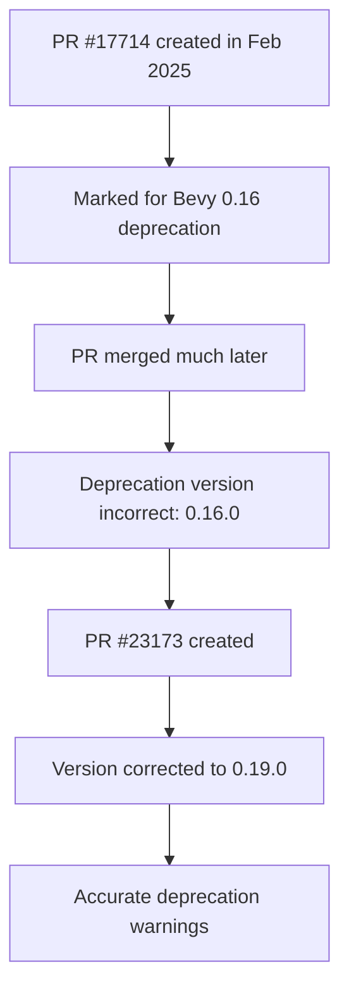

+++
title = "#23173 fix incorrect bevy version in generate_view_layouts deprecation"
date = "2026-03-01T00:00:00"
draft = false
template = "pull_request_page.html"
in_search_index = true

[taxonomies]
list_display = ["show"]

[extra]
current_language = "en"
available_languages = {"en" = { name = "English", url = "/pull_request/bevy/2026-03/pr-23173-en-20260301" }, "zh-cn" = { name = "中文", url = "/pull_request/bevy/2026-03/pr-23173-zh-cn-20260301" }}
+++

# Title
fix incorrect bevy version in generate_view_layouts deprecation

## Basic Information
- **Title**: fix incorrect bevy version in generate_view_layouts deprecation
- **PR Link**: https://github.com/bevyengine/bevy/pull/23173
- **Author**: arovge
- **Status**: MERGED
- **Labels**: None
- **Created**: 2026-02-28T23:03:15Z
- **Merged**: 2026-02-28T23:57:41Z
- **Merged By**: alice-i-cecile

## Description Translation
# Objective

PR https://github.com/bevyengine/bevy/pull/17714 was created in Feb 2025 with the intention that the deprecation warning would be introduced in Bevy 0.16.

The PR was recently merged but a comment for updating the deprecation version was never addressed: https://github.com/bevyengine/bevy/pull/17714#discussion_r2766404523.

## Solution

Adjust deprecation warning to use 0.19 instead of 0.16 as this change will be included in 0.19.

## Testing

CI

## The Story of This Pull Request

This PR addresses a straightforward but important issue with version accuracy in deprecation warnings. The problem originated with PR #17714, which was initially created in February 2025 with the intention of introducing a deprecation warning for the `generate_view_layouts` function in Bevy 0.16. However, that PR took significantly longer to merge than anticipated - it was only recently merged, well after Bevy 0.16 had been released.

During the review of PR #17714, a comment was made asking to update the deprecation version, but this task was never completed before the PR was merged. As a result, the codebase ended up with an incorrect deprecation notice that claimed the function was deprecated in version 0.16.0, when in reality this deprecation would only take effect in version 0.19.0.

The solution is technically simple but has important implications for user experience. The PR changes a single line in the `#[deprecated]` attribute, updating the `since` parameter from "0.16.0" to "0.19.0". This ensures that when users see the deprecation warning in their builds, they receive accurate information about which version introduced the deprecation.

```rust
// Before the fix:
#[deprecated(since = "0.16.0", note = "Use `layout_entries` instead")]

// After the fix:
#[deprecated(since = "0.19.0", note = "Use `layout_entries` instead")]
```

Accurate version information in deprecation warnings is crucial for several reasons. First, it helps users understand when they need to start migrating their code. If they're using an older version of Bevy, they need to know whether a deprecation applies to their current version or only to future versions. Second, it maintains the project's credibility - incorrect version information can confuse users and erode trust in the project's documentation.

The technical approach here demonstrates good practice in maintaining deprecation notices. When a feature is marked for deprecation, the `since` field should always reflect the actual version where the deprecation was introduced, not the version where it was initially planned to be introduced. This becomes especially important in large projects like Bevy where PRs can take significant time to review, test, and merge.

The impact of this change is primarily about communication accuracy rather than functional behavior. The `generate_view_layouts` function remains deprecated in favor of `layout_entries`, but now users will see the correct version information. This helps prevent confusion for developers who might be checking if they need to update their code based on the version they're currently using.

This PR also highlights an important aspect of open source maintenance: following up on review comments. The original PR #17714 had a review comment specifically asking for this version update, but it was overlooked. This serves as a reminder for both contributors and maintainers to ensure all review feedback is addressed before merging, or to create follow-up issues for any outstanding items.

## Visual Representation



## Key Files Changed

**File:** `crates/bevy_pbr/src/render/mesh_view_bindings.rs` (+1/-1)

This file contains the `generate_view_layouts` function that was deprecated in PR #17714. The change corrects the version number in the deprecation attribute to reflect when the deprecation will actually be released.

**Change details:**
```rust
// Before:
#[deprecated(since = "0.16.0", note = "Use `layout_entries` instead")]

// After:
#[deprecated(since = "0.19.0", note = "Use `layout_entries` instead")]
```

The function `generate_view_layouts` generates all possible view layouts for the mesh pipeline based on combinations of `MeshPipelineViewLayoutKey` flags. It was deprecated in favor of the `layout_entries` method, which presumably provides a more efficient or flexible approach. The single-character change from '6' to '9' in the version string ensures that the deprecation warning displays the correct Bevy version.

## Further Reading

1. **Rust Deprecation Attributes**: The official Rust documentation on the `#[deprecated]` attribute provides details on how to properly mark items as deprecated: https://doc.rust-lang.org/reference/attributes/diagnostics.html#the-deprecated-attribute

2. **Bevy's Deprecation Policy**: Understanding how Bevy handles API stability and deprecations can help contributors write better deprecation notices: https://bevyengine.org/learn/book/getting-started/contributing/#api-stability

3. **Semantic Versioning**: The Semantic Versioning specification explains how version numbers should be structured and what they communicate about API changes: https://semver.org/

4. **PR #17714**: The original PR that introduced the deprecation, providing context for why `generate_view_layouts` was deprecated in favor of `layout_entries`: https://github.com/bevyengine/bevy/pull/17714

# Full Code Diff
```
diff --git a/crates/bevy_pbr/src/render/mesh_view_bindings.rs b/crates/bevy_pbr/src/render/mesh_view_bindings.rs
index b91fbf17e566f..ed747b028efb0 100644
--- a/crates/bevy_pbr/src/render/mesh_view_bindings.rs
+++ b/crates/bevy_pbr/src/render/mesh_view_bindings.rs
@@ -544,7 +544,7 @@ impl MeshPipelineViewLayouts {
 
 /// Generates all possible view layouts for the mesh pipeline, based on all combinations of
 /// [`MeshPipelineViewLayoutKey`] flags.
-#[deprecated(since = "0.16.0", note = "Use `layout_entries` instead")]
+#[deprecated(since = "0.19.0", note = "Use `layout_entries` instead")]
 pub fn generate_view_layouts(
     render_device: &RenderDevice,
     render_adapter: &RenderAdapter,
```