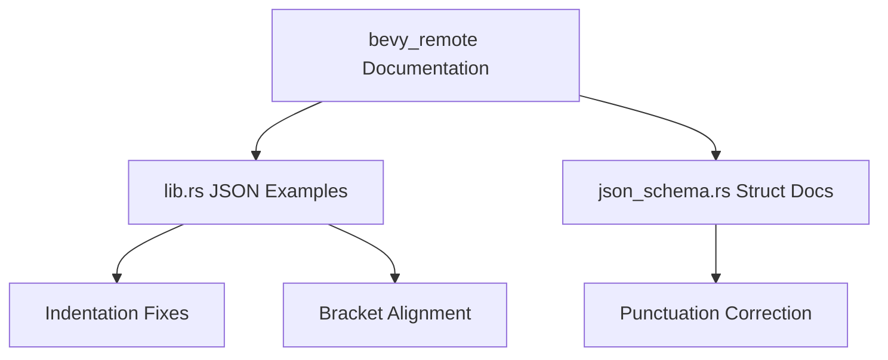

+++
title = "#23176 Tiny bevy_remote doc format fix"
date = "2026-03-01T00:00:00"
draft = false
template = "pull_request_page.html"
in_search_index = true

[taxonomies]
list_display = ["show"]

[extra]
current_language = "en"
available_languages = {"en" = { name = "English", url = "/pull_request/bevy/2026-03/pr-23176-en-20260301" }, "zh-cn" = { name = "中文", url = "/pull_request/bevy/2026-03/pr-23176-zh-cn-20260301" }}
labels = ["C-Docs", "D-Trivial", "A-Dev-Tools"]
+++

# Title: Tiny bevy_remote doc format fix

## Basic Information
- **Title**: Tiny bevy_remote doc format fix
- **PR Link**: https://github.com/bevyengine/bevy/pull/23176
- **Author**: SpecificProtagonist
- **Status**: MERGED
- **Labels**: C-Docs, D-Trivial, S-Ready-For-Final-Review, A-Dev-Tools
- **Created**: 2026-03-01T00:04:34Z
- **Merged**: 2026-03-01T04:39:07Z
- **Merged By**: alice-i-cecile

## Description Translation
The PR description is already in English and consists only of a title. The actual changes are in the documentation within the code files.

## The Story of This Pull Request

This pull request addresses a minor but important documentation formatting issue in the Bevy Remote crate. The problem was straightforward: JSON examples in the Rust documentation comments had inconsistent indentation and formatting that made them harder to read and potentially confusing for developers trying to understand the API.

The issue was discovered in the `bevy_remote` crate, which provides functionality for remotely accessing and manipulating Bevy ECS worlds. Good documentation is particularly important for this crate because it deals with serialization formats and network protocols where precise structure matters. The JSON examples in the docs serve as both documentation and implicit specifications for the expected data formats.

The developer took a direct approach: systematically fixing the indentation throughout a large JSON example in the main library documentation. The changes were purely cosmetic but followed consistent patterns - adjusting indentation levels, fixing misaligned braces and brackets, and ensuring proper nesting was visually apparent. This is a classic example of a documentation hygiene fix that improves developer experience without changing any functional code.

One interesting aspect of this fix is that it touches two different types of documentation: example JSON in Rust doc comments and a standalone documentation comment for a struct. Both serve different purposes but benefit from consistent formatting standards.

The implementation shows attention to detail in several areas:
1. Fixed inconsistent indentation in nested JSON structures
2. Corrected misaligned closing braces and brackets
3. Added proper punctuation to a struct documentation comment

These changes make the documentation more professional and easier to parse visually. When developers are working with serialization formats, having clean, well-formatted examples reduces cognitive load and prevents misunderstandings about the expected data structure.

The impact of this PR is subtle but meaningful. While it doesn't change any runtime behavior, it improves the developer experience for anyone reading the `bevy_remote` documentation. This is especially valuable for a crate dealing with data serialization, where the exact structure of JSON payloads matters. Clean documentation examples reduce the chance of integration errors and make the API more approachable.

This type of maintenance work, while small, contributes to the overall quality of the codebase. It demonstrates good software engineering practices: paying attention to details, maintaining consistency, and valuing documentation as a first-class concern alongside functional code.

## Visual Representation



## Key Files Changed

### 1. `crates/bevy_remote/src/lib.rs` (+85/-85)

This file contains the main documentation for the `bevy_remote` crate, including extensive JSON examples showing the expected format for remote queries and responses. The changes fix indentation issues in a large JSON example block.

**Key Changes:**
- Fixed inconsistent indentation throughout a 100+ line JSON example
- Corrected misaligned closing braces and brackets
- Ensured consistent 2-space indentation for nested structures

**Example of formatting fix:**
```rust
// Before (excerpt with inconsistent indentation):
//!        "filter": {
//!          "with": [],
//!          "without": []
//!        },

// After (consistent 2-space indentation):
//!         "filter": {
//!           "with": [],
//!           "without": []
//!         },
```

### 2. `crates/bevy_remote/src/schemas/json_schema.rs` (+1/-1)

This file contains schema generation code for JSON serialization. The change adds a missing period to a documentation comment.

**Key Change:**
- Added a period to complete the sentence in a struct documentation comment

**Example:**
```rust
// Before:
/// JSON Schema type for Bevy Registry Types

// After:
/// JSON Schema type for Bevy Registry Types.
```

## Further Reading

1. [Rust Documentation Guidelines](https://rust-lang.github.io/rfcs/1574-more-api-documentation-conventions.html) - Best practices for Rust documentation
2. [JSON Schema Specification](https://json-schema.org/specification) - The standard referenced in the documentation
3. [Bevy Remote Documentation](https://docs.rs/bevy_remote) - Current documentation for the bevy_remote crate
4. [Rustdoc Book](https://doc.rust-lang.org/rustdoc/) - Comprehensive guide to Rust documentation system

# Full Code Diff
```
diff --git a/crates/bevy_remote/src/lib.rs b/crates/bevy_remote/src/lib.rs
index 921ab1ff148dd..d96cbb8c38a0a 100644
--- a/crates/bevy_remote/src/lib.rs
+++ b/crates/bevy_remote/src/lib.rs
@@ -167,8 +167,8 @@
 //!             "components": ["bevy_transform::components::transform::Transform"]
 //!             "option": [],
 //!             "has": []
-//!        },
-//!        "filter": {
+//!         },
+//!         "filter": {
 //!           "with": [],
 //!           "without": []
 //!         },
@@ -189,8 +189,8 @@
 //!             "components": []
 //!             "option": "all",
 //!             "has": []
-//!        },
-//!        "filter": {
+//!         },
+//!         "filter": {
 //!            "with": [],
 //!           "without": []
 //!         },
@@ -202,88 +202,88 @@
 //! This should return you something like the below (in a larger list):
 //! ```json
 //! {
-//!      "components": {
-//!        "bevy_camera::Camera3d": {
-//!          "depth_load_op": {
-//!            "Clear": 0.0
-//!          },
-//!          "depth_texture_usages": 16,
-//!        },
-//!        "bevy_core_pipeline::tonemapping::DebandDither": "Enabled",
-//!        "bevy_core_pipeline::tonemapping::Tonemapping": "TonyMcMapface",
-//!        "bevy_light::cluster::ClusterConfig": {
-//!          "FixedZ": {
-//!         "dynamic_resizing": true,
-//!            "total": 4096,
-//!            "z_config": {
-//!              "far_z_mode": "MaxClusterableObjectRange",
-//!              "first_slice_depth": 5.0
-//!            },
-//!            "z_slices": 24
-//!          }
-//!        },
-//!        "bevy_camera::Camera": {
-//!          "clear_color": "Default",
-//!          "is_active": true,
-//!          "msaa_writeback": true,
-//!          "order": 0,
-//!          "sub_camera_view": null,
-//!          "target": {
-//!            "Window": "Primary"
-//!          },
-//!       "viewport": null
-//!        },
-//!        "bevy_camera::Projection": {
-//!          "Perspective": {
-//!            "aspect_ratio": 1.7777777910232544,
-//!            "far": 1000.0,
-//!            "fov": 0.7853981852531433,
-//!            "near": 0.10000000149011612
-//!          }
-//!        },
-//!        "bevy_camera::primitives::Frustum": {},
-//!     "bevy_render::sync_world::RenderEntity": 4294967291,
-//!        "bevy_render::sync_world::SyncToRenderWorld": {},
-//!        "bevy_render::view::Msaa": "Sample4",
-//!        "bevy_camera::visibility::InheritedVisibility": true,
-//!        "bevy_camera::visibility::ViewVisibility": false,
-//!        "bevy_camera::visibility::Visibility": "Inherited",
-//!        "bevy_camera::visibility::VisibleEntities": {},
-//!        "bevy_transform::components::global_transform::GlobalTransform": [
-//!          0.9635179042816162,
-//!          -3.725290298461914e-9,
-//!          0.26764383912086487,
-//!          0.11616238951683044,
-//!          0.9009039402008056,
-//!          -0.4181846082210541,
-//!          -0.24112138152122495,
-//!          0.4340185225009918,
-//!          0.8680371046066284,
-//!          -2.5,
-//!          4.5,
-//!          9.0
-//!        ],
-//!        "bevy_transform::components::transform::Transform": {
-//!       "rotation": [
-//!            -0.22055435180664065,
-//!            -0.13167093694210052,
-//!            -0.03006339818239212,
-//!            0.9659786224365234
-//!          ],
-//!          "scale": [
-//!            1.0,
-//!            1.0,
-//!            1.0
+//!   "components": {
+//!     "bevy_camera::Camera3d": {
+//!       "depth_load_op": {
+//!         "Clear": 0.0
+//!       },
+//!       "depth_texture_usages": 16,
+//!     },
+//!     "bevy_core_pipeline::tonemapping::DebandDither": "Enabled",
+//!     "bevy_core_pipeline::tonemapping::Tonemapping": "TonyMcMapface",
+//!     "bevy_light::cluster::ClusterConfig": {
+//!       "FixedZ": {
+//!      "dynamic_resizing": true,
+//!         "total": 4096,
+//!         "z_config": {
+//!           "far_z_mode": "MaxClusterableObjectRange",
+//!           "first_slice_depth": 5.0
+//!         },
+//!         "z_slices": 24
+//!       }
+//!     },
+//!     "bevy_camera::Camera": {
+//!       "clear_color": "Default",
+//!       "is_active": true,
+//!       "msaa_writeback": true,
+//!       "order": 0,
+//!       "sub_camera_view": null,
+//!       "target": {
+//!         "Window": "Primary"
+//!       },
+//!    "viewport": null
+//!     },
+//!     "bevy_camera::Projection": {
+//!       "Perspective": {
+//!         "aspect_ratio": 1.7777777910232544,
+//!         "far": 1000.0,
+//!         "fov": 0.7853981852531433,
+//!         "near": 0.10000000149011612
+//!       }
+//!     },
+//!     "bevy_camera::primitives::Frustum": {},
+//!  "bevy_render::sync_world::RenderEntity": 4294967291,
+//!     "bevy_render::sync_world::SyncToRenderWorld": {},
+//!     "bevy_render::view::Msaa": "Sample4",
+//!     "bevy_camera::visibility::InheritedVisibility": true,
+//!     "bevy_camera::visibility::ViewVisibility": false,
+//!     "bevy_camera::visibility::Visibility": "Inherited",
+//!     "bevy_camera::visibility::VisibleEntities": {},
+//!     "bevy_transform::components::global_transform::GlobalTransform": [
+//!       0.9635179042816162,
+//!       -3.725290298461914e-9,
+//!       0.26764383912086487,
+//!       0.11616238951683044,
+//!       0.9009039402008056,
+//!       -0.4181846082210541,
+//!       -0.24112138152122495,
+//!       0.4340185225009918,
+//!       0.8680371046066284,
+//!       -2.5,
+//!       4.5,
+//!       9.0
+//!     ],
+//!     "bevy_transform::components::transform::Transform": {
+//!    "rotation": [
+//!         -0.22055435180664065,
+//!         -0.13167093694210052,
+//!         -0.03006339818239212,
+//!         0.9659786224365234
 //!       ],
-//!          "translation": [
-//!            -2.5,
-//!          4.5,
-//!            9.0
-//!          ]
-//!        },
-//!        "bevy_transform::components::transform::TransformTreeChanged": null
-//!      },
-//!      "entity": 4294967261
+//!       "scale": [
+//!         1.0,
+//!         1.0,
+//!         1.0
+//!    ],
+//!       "translation": [
+//!         -2.5,
+//!       4.5,
+//!         9.0
+//!       ]
+//!     },
+//!     "bevy_transform::components::transform::TransformTreeChanged": null
+//!   },
+//!   "entity": 4294967261
 //!},
 //! ```
 //!
diff --git a/crates/bevy_remote/src/schemas/json_schema.rs b/crates/bevy_remote/src/schemas/json_schema.rs
index 0dd7c900dfc80..ff24af260d6cc 100644
--- a/crates/bevy_remote/src/schemas/json_schema.rs
+++ b/crates/bevy_remote/src/schemas/json_schema.rs
@@ -182,7 +182,7 @@ impl From<(&TypeRegistration, &SchemaTypesMetadata)> for JsonSchemaBevyType {
     }
 }
 
-/// JSON Schema type for Bevy Registry Types
+/// JSON Schema type for Bevy Registry Types.
 /// It tries to follow this standard: <https://json-schema.org/specification>
 ///
 /// To take the full advantage from info provided by Bevy registry it provides extra fields
```