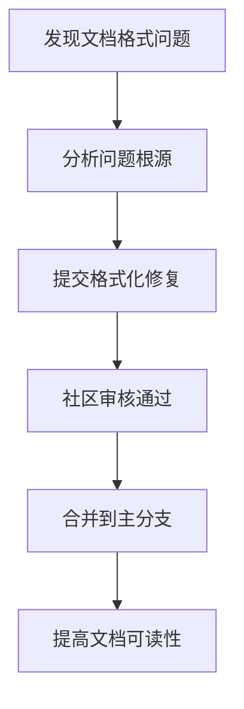

+++
title = "#23176 Tiny bevy_remote doc format fix"
date = "2026-03-01T00:00:00"
draft = false
template = "pull_request_page.html"
in_search_index = false

[extra]
current_language = "zh-cn"
available_languages = {"en" = { name = "English", url = "/pull_request/bevy/2026-03/pr-23176-en-20260301" }, "zh-cn" = { name = "中文", url = "/pull_request/bevy/2026-03/pr-23176-zh-cn-20260301" }}
+++

# Tiny bevy_remote doc format fix

## 基本资料
- **标题**: Tiny bevy_remote doc format fix
- **PR链接**: https://github.com/bevyengine/bevy/pull/23176
- **作者**: SpecificProtagonist
- **状态**: 已合并
- **标签**: C-Docs, D-Trivial, S-Ready-For-Final-Review, A-Dev-Tools
- **创建时间**: 2026-03-01T00:04:34Z
- **合并时间**: 2026-03-01T04:39:07Z
- **合并者**: alice-i-cecile

## 描述翻译
这是一个非常小的修复，用于修正 `bevy_remote` 中 JSON 示例的格式。修复了示例代码的缩进不一致问题，使其更易阅读。

## 这个Pull Request的故事

这个PR处理了一个非常具体的问题：文档中的代码示例格式不一致。虽然这看起来是个小问题，但在实际开发中，格式不一致的文档会降低可读性，特别是当其他开发者需要参考这些示例来理解API用法时。

### 问题与背景

在 `bevy_remote` 模块的文档中，有一个详细的JSON示例，展示了如何通过远程接口查询实体数据。这个示例的缩进存在不一致的问题：某些行使用了3个空格缩进，而其他行使用了4个空格。这种不一致虽然不影响代码功能，但会影响文档的专业性和可读性。

`bevy_remote` 是一个用于远程调试和监控Bevy应用的工具模块。它的文档包含了大量的代码示例，这些示例对于开发者理解如何使用这个模块至关重要。格式整齐的示例可以帮助开发者更快地理解数据结构，而格式混乱的示例则会增加认知负担。

### 解决方案

开发者SpecificProtagonist注意到这个问题并决定修复它。解决方案很简单：调整整个JSON示例的缩进，使其保持一致。这个修复不需要修改任何实际代码逻辑，只涉及文档字符串的格式化。

### 实现细节

PR主要修改了两个文件：

1. **`crates/bevy_remote/src/lib.rs`**：这是主要的修改文件，包含了一个大型的JSON示例。原来的示例中，缩进层级不一致，有些地方多了一个空格，有些地方少了一个空格。修复后，整个JSON结构使用统一的缩进，使得嵌套关系更加清晰。

2. **`crates/bevy_remote/src/schemas/json_schema.rs`**：这个文件只修改了一行，在一个文档注释的句子末尾添加了句号，使其符合Rust文档注释的规范。

下面是具体的修改示例：

在 `lib.rs` 文件中，JSON示例的格式被重新整理。例如，修改前的：
```json
//!        "filter": {
//!          "with": [],
//!          "without": []
//!        },
```

修改后变为：
```json
//!         "filter": {
//!           "with": [],
//!           "without": []
//!         },
```

这种修改贯穿整个JSON示例，确保所有层级的缩进都保持一致。

### 技术洞察

这个PR虽然简单，但体现了几个重要的工程实践：

1. **文档质量的重要性**：格式一致的文档可以提高代码库的整体质量。当开发者阅读文档时，整洁的格式可以帮助他们更快地理解内容。

2. **细节的关注**：即使是非常小的格式问题，也值得修复。这种对细节的关注有助于维护项目的专业形象。

3. **非功能性修改的安全性**：由于这个PR只修改了文档注释，没有任何代码逻辑的更改，因此风险极低，可以快速合并。

### 影响

这个PR的影响主要体现在：
- 提高了 `bevy_remote` 模块文档的可读性
- 为其他贡献者树立了良好的榜样，展示了即使是小问题也值得修复
- 保持了Bevy项目代码库的高质量标准

从工程角度看，这种修复虽然简单，但对于维护大型开源项目的文档质量是必要的。格式一致的文档可以减少开发者的认知负担，让他们更专注于理解API本身，而不是解析混乱的格式。

## 视觉表示



## 关键文件更改

### 1. `crates/bevy_remote/src/lib.rs` (+85/-85)

**修改内容**：修复了文档中大型JSON示例的缩进格式问题。

**修改原因**：原来的JSON示例缩进不一致，有些行使用了3个空格，有些使用了4个空格。这种不一致降低了文档的可读性。

**关键代码片段**：
```rust
// 修改前：
//!        "filter": {
//!          "with": [],
//!          "without": []
//!        },

// 修改后：
//!         "filter": {
//!           "with": [],
//!           "without": []
//!         },
```

整个JSON示例的缩进都被重新调整，确保所有层级都使用一致的缩进。

### 2. `crates/bevy_remote/src/schemas/json_schema.rs` (+1/-1)

**修改内容**：在文档注释的句子末尾添加了句号。

**修改原因**：使文档注释符合Rust的文档规范，完整的句子应该以句号结束。

**关键代码片段**：
```rust
// 修改前：
/// JSON Schema type for Bevy Registry Types

// 修改后：
/// JSON Schema type for Bevy Registry Types.
```

## 进一步阅读

- [Rust文档注释指南](https://doc.rust-lang.org/rustdoc/how-to-write-documentation.html) - 了解如何编写符合规范的Rust文档注释
- [Bevy远程模块文档](https://docs.rs/bevy_remote) - `bevy_remote`模块的完整文档
- [JSON Schema规范](https://json-schema.org/specification) - `bevy_remote`使用的JSON Schema标准