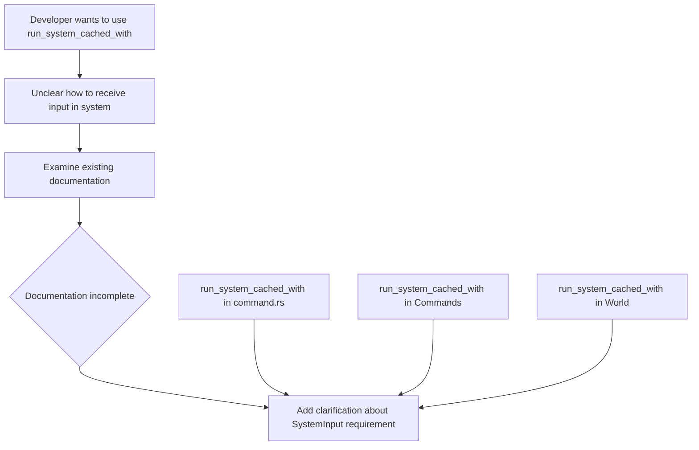

+++
title = "#23186 Add documentation to run_system_cached_with"
date = "2026-03-03T00:00:00"
draft = false
template = "pull_request_page.html"
in_search_index = true

[taxonomies]
list_display = ["show"]

[extra]
current_language = "en"
available_languages = {"en" = { name = "English", url = "/pull_request/bevy/2026-03/pr-23186-en-20260303" }, "zh-cn" = { name = "中文", url = "/pull_request/bevy/2026-03/pr-23186-zh-cn-20260303" }}
labels = ["C-Docs", "D-Trivial", "A-ECS"]
+++

# Title

## Basic Information
- **Title**: Add documentation to run_system_cached_with
- **PR Link**: https://github.com/bevyengine/bevy/pull/23186
- **Author**: Lyndon-Mackay
- **Status**: MERGED
- **Labels**: C-Docs, D-Trivial, A-ECS, S-Ready-For-Final-Review
- **Created**: 2026-03-02T08:16:45Z
- **Merged**: 2026-03-03T17:59:02Z
- **Merged By**: alice-i-cecile

## Description Translation

# Objective

I recently wanted to use `run_system_cached_with` but I didn't know how to read in the input from my system

## Solution

Added some documentation, I also added advice to consider events I am not 100% this is correct.
Good opportunity for me to confirm this

## Testing
Only documentation changes

## The Story of This Pull Request

This PR addresses a specific documentation gap in Bevy's ECS (Entity Component System) that the author encountered while working with the `run_system_cached_with` API. The core issue was straightforward: when trying to use this function, the author wasn't sure how to properly structure their system to receive and use the input parameter. This is a common problem in API design where the usage pattern isn't immediately clear from the function signature alone.

The `run_system_cached_with` function is part of Bevy's system scheduling infrastructure, specifically dealing with systems that can be cached and reused with different inputs. The caching mechanism is important for performance optimization, as it avoids re-registering the same system multiple times. However, the relationship between the input passed to `run_system_cached_with` and how that input is received by the system wasn't documented.

The solution implemented here is minimal but effective: adding consistent documentation across three related locations in the codebase that explains the required system signature. The key insight documented is that to use the supplied input, the system must have a `SystemInput` as its first parameter. This clarifies an implicit contract that wasn't previously documented.

What's interesting about this change is that it touches three different layers of the API:
1. The low-level `Command` implementation
2. The intermediate `Commands` builder API
3. The core `World` system registry

Each of these exposes `run_system_cached_with` with slightly different interfaces but shares the same underlying requirement for system structure. By adding the same documentation in all three places, the PR ensures that users will encounter this guidance regardless of which API layer they're working with.

The author mentions adding "advice to consider events" but notes they're not 100% certain this is correct. However, looking at the actual diff, this advice doesn't appear in the final changes. This suggests the author either reconsidered or was referring to a different aspect of their exploration. What actually landed is the more straightforward and unambiguous documentation about `SystemInput`.

This type of documentation improvement is valuable because it addresses a specific point of confusion that blocked the author from using the API effectively. It's also the kind of documentation that benefits from being written by someone who recently experienced the confusion - they know exactly what information was missing when they first encountered the API.

The changes are purely additive documentation with no code modifications, which means there's zero risk of introducing bugs or breaking changes. The documentation follows Rust conventions by using intra-doc links (`[SystemInput]`) which will be automatically resolved to the appropriate documentation page, providing users with an easy path to learn more about the required type.

## Visual Representation



## Key Files Changed

### `crates/bevy_ecs/src/system/commands/command.rs` (+2/-0)
This file contains the low-level `Command` implementation of `run_system_cached_with`. The documentation added here clarifies that systems using this command must have `SystemInput` as their first parameter to receive the supplied input.

**Key change:**
```rust
/// A [`Command`] that runs the given system with the given input value,
/// caching its [`SystemId`] in a [`CachedSystemId`](crate::system::CachedSystemId) resource.
///
/// To use the supplied input, the system should have a [`SystemInput`] as the first parameter.
pub fn run_system_cached_with<I, M, S>(system: S, input: I::Inner<'static>) -> impl Command<Result>
where
    I: SystemInput<Inner<'static>: Send> + Send + 'static,
```

### `crates/bevy_ecs/src/system/commands/mod.rs` (+2/-0)
This file contains the `Commands` builder API, which provides a more ergonomic interface for queueing commands. The same documentation is added to the `run_system_cached_with` method here.

**Key change:**
```rust
    ///
    /// Unlike [`Commands::run_system_with`], this method does not require manual registration.
    ///
    /// To use the supplied input, the system should have a [`SystemInput`] as the first parameter.
    ///
    /// The first time this method is called for a particular system,
    /// it will register the system and store its [`SystemId`] in a
    /// [`CachedSystemId`](crate::system::CachedSystemId) resource for later.
```

### `crates/bevy_ecs/src/system/system_registry.rs` (+2/-0)
This file contains the `World` methods for running systems, including the direct `run_system_cached_with` method. The documentation is added in two places in this file: the main `run_system_cached_with` method and also in the related `run_system_with` method for consistency.

**Key changes:**
```rust
    /// Before running a system, it must first be registered.
    /// The method [`World::register_system`] stores a given system and returns a [`SystemId`].
    ///
    /// To use the supplied input, the system should have a [`SystemInput`] as the first parameter.
    /// Also runs any queued-up commands.
```

```rust
    /// Runs a cached system with an input, registering it if necessary.
    ///
    /// To use the supplied input, the system should have a [`SystemInput`] as the first parameter.
    /// See [`World::register_system_cached`] for more information.
    pub fn run_system_cached_with<I, O, M, S>(
```

## Further Reading

1. [Bevy ECS Documentation](https://docs.rs/bevy_ecs/latest/bevy_ecs/) - Comprehensive documentation for Bevy's Entity Component System
2. [SystemInput Trait Documentation](https://docs.rs/bevy_ecs/latest/bevy_ecs/system/trait.SystemInput.html) - Details on the `SystemInput` trait and its usage
3. [Bevy Commands System](https://bevy-cheatbook.github.io/programming/commands.html) - Guide to Bevy's command pattern for deferred world modifications
4. [Rust Documentation Guidelines](https://rust-lang.github.io/rfcs/1574-more-api-documentation-conventions.html) - Best practices for Rust documentation