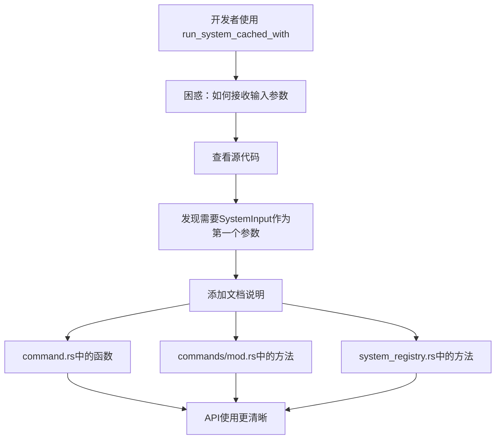

+++
title = "#23186 Add documentation to run_system_cached_with"
date = "2026-03-03T00:00:00"
draft = false
template = "pull_request_page.html"
in_search_index = false

[extra]
current_language = "zh-cn"
available_languages = {"en" = { name = "English", url = "/pull_request/bevy/2026-03/pr-23186-en-20260303" }, "zh-cn" = { name = "中文", url = "/pull_request/bevy/2026-03/pr-23186-zh-cn-20260303" }}
labels = ["C-Docs", "D-Trivial", "A-ECS"]
+++

# Add documentation to run_system_cached_with

## Basic Information
- **Title**: Add documentation to run_system_cached_with
- **PR Link**: https://github.com/bevyengine/bevy/pull/23186
- **Author**: Lyndon-Mackay
- **Status**: MERGED
- **Labels**: C-Docs, D-Trivial, A-ECS, S-Ready-For-Final-Review
- **Created**: 2026-03-02T08:16:45Z
- **Merged**: 2026-03-03T17:59:02Z
- **Merged By**: alice-i-cecile

## Description Translation
# 目标

我最近想使用 `run_system_cached_with`，但我不知道如何从我的系统中读取输入。

## 解决方案

添加了一些文档，我还添加了考虑使用事件的建议，我不完全确定这是否正确。这是一个让我确认的好机会。

## 测试
仅文档更改。

## The Story of This Pull Request

这个PR源于开发者在实际使用Bevy引擎时遇到的一个具体问题。开发者Lyndon-Mackay在使用`run_system_cached_with`函数时，不清楚如何让系统接收传入的输入参数。在Bevy的ECS架构中，系统通常通过函数参数来访问数据，但`run_system_cached_with`的用法并不直观，特别是对于初次使用的开发者。

问题的核心在于API的设计和使用模式不匹配。Bevy的ECS系统有多种运行方式：可以直接注册后通过SystemId调用，也可以通过Commands系统间接运行。`run_system_cached_with`属于后者，它允许开发者通过命令队列运行一个系统并缓存其SystemId，避免重复注册。然而，文档没有明确说明系统函数应该如何声明才能接收这个输入参数。

开发者通过查看源代码发现，要使系统接收`run_system_cached_with`传递的输入，系统函数的第一个参数必须是`SystemInput`类型。这是一个关键的实现细节，但原本的文档中没有提及，导致API使用起来不够直观。

解决方案简单而有效：在三处相关的位置添加相同的文档说明："To use the supplied input, the system should have a [`SystemInput`] as the first parameter." 这三处分别是：
1. `command.rs`中的`run_system_cached_with`函数
2. `commands/mod.rs`中的`Commands::run_system_cached_with`方法
3. `system_registry.rs`中的两个相关方法

这个修改虽然只是几行文档，但解决了实际开发中的困惑。从技术角度看，这体现了良好的API设计原则：当API的使用方式不明显时，清晰的文档是弥补这种差距的关键。特别是对于泛型函数，类型约束和参数要求往往需要明确的说明。

值得注意的是，PR作者在描述中提到"also added advice to consider events I am not 100% this is correct"，但实际代码修改中并没有添加关于事件的建议。这可能意味着作者最初考虑添加更多内容，但最终决定保持修改的简洁性，只解决最核心的问题。

从工程实践的角度看，这个PR展示了开源社区中常见的贡献模式：开发者在使用过程中发现问题，通过最小的修改解决问题，然后贡献给上游。这种文档改进虽然看似微小，但对项目的可维护性和开发者体验有显著的正面影响。

## Visual Representation



## Key Files Changed

### 1. `crates/bevy_ecs/src/system/commands/command.rs`
- **修改内容**：在`run_system_cached_with`函数的文档注释中添加了一行说明
- **原因**：这是该函数的直接定义位置，添加文档帮助开发者理解如何使用
- **代码片段**：
```rust
/// A [`Command`] that runs the given system with the given input value,
/// caching its [`SystemId`] in a [`CachedSystemId`](crate::system::CachedSystemId) resource.
///
/// To use the supplied input, the system should have a [`SystemInput`] as the first parameter.
pub fn run_system_cached_with<I, M, S>(system: S, input: I::Inner<'static>) -> impl Command<Result>
where
    I: SystemInput<Inner<'static>: Send> + Send + 'static,
    M: 'static,
    S: System<I, M> + Send + 'static,
    I::Inner<'static>: 'static,
{
```

### 2. `crates/bevy_ecs/src/system/commands/mod.rs`
- **修改内容**：在`Commands::run_system_cached_with`方法的文档注释中添加同样的说明
- **原因**：这是通过Commands系统调用该方法的主要入口点
- **代码片段**：
```rust
///
/// Unlike [`Commands::run_system_with`], this method does not require manual registration.
///
/// To use the supplied input, the system should have a [`SystemInput`] as the first parameter.
///
/// The first time this method is called for a particular system,
/// it will register the system and store its [`SystemId`] in a
/// [`CachedSystemId`](crate::system::CachedSystemId) resource for later.
pub fn run_system_cached_with<I, O, M, S>(&mut self, system: S, input: I::Inner<'static>) -> &mut Self
where
    I: SystemInput<Inner<'static>: Send> + Send + 'static,
    M: 'static,
    S: System<I, M, Out = O> + Send + 'static,
    I::Inner<'static>: 'static,
{
```

### 3. `crates/bevy_ecs/src/system/system_registry.rs`
- **修改内容**：在两个相关方法`run_system_with`和`run_system_cached_with`的文档中添加说明
- **原因**：这是直接通过World运行系统的底层API，同样需要明确的文档
- **代码片段**：
```rust
/// Before running a system, it must first be registered.
/// The method [`World::register_system`] stores a given system and returns a [`SystemId`].
///
/// To use the supplied input, the system should have a [`SystemInput`] as the first parameter.
/// Also runs any queued-up commands.
///
/// # Examples
/// ...
pub fn run_system_with<I, O, M, S>(&mut self, id: SystemId<I, M, O>, input: I::Inner<'_>) -> SystemResult<O>
where
    I: SystemInput,
    M: 'static,
    S: System<I, M, Out = O> + 'static,
{
```

```rust
/// Runs a cached system with an input, registering it if necessary.
///
/// To use the supplied input, the system should have a [`SystemInput`] as the first parameter.
/// See [`World::register_system_cached`] for more information.
pub fn run_system_cached_with<I, O, M, S>(
    &mut self,
    system: S,
    input: I::Inner<'static>,
) -> SystemResult<O>
where
    I: SystemInput<Inner<'static>: Send> + Send + 'static,
    M: 'static,
    S: System<I, M, Out = O> + Send + 'static,
    I::Inner<'static>: 'static,
{
```

## Further Reading

1. **Bevy ECS系统文档**：了解Bevy ECS中系统的基本概念和使用方法
2. **SystemInput trait文档**：深入理解SystemInput的工作原理和实现方式
3. **Bevy命令系统**：学习Commands在Bevy中的工作机制和最佳实践
4. **Rust文档注释指南**：了解如何编写有效的文档注释，特别是对于复杂的泛型函数
5. **Bevy官方示例**：查看实际项目中如何使用`run_system_cached_with`和相关API