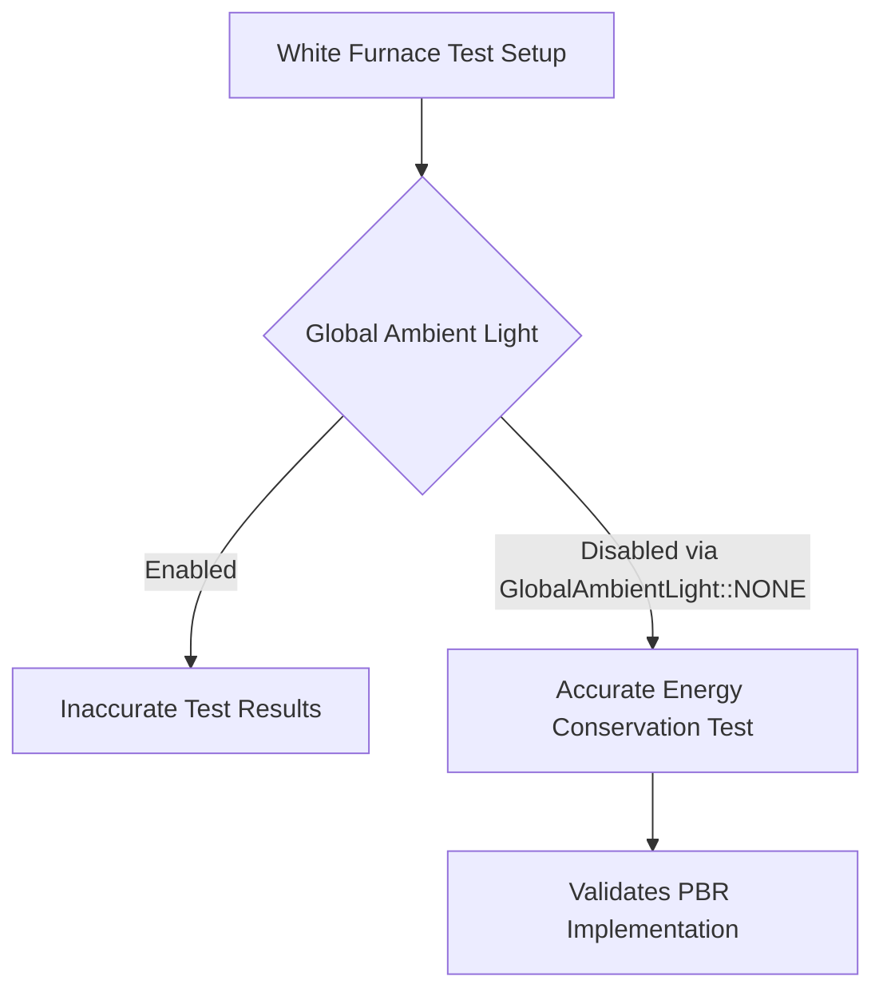

+++
title = "#23189 Disable global ambient light in white furnace test"
date = "2026-03-02T00:00:00"
draft = false
template = "pull_request_page.html"
in_search_index = true

[taxonomies]
list_display = ["show"]

[extra]
current_language = "en"
available_languages = {"en" = { name = "English", url = "/pull_request/bevy/2026-03/pr-23189-en-20260302" }, "zh-cn" = { name = "中文", url = "/pull_request/bevy/2026-03/pr-23189-zh-cn-20260302" }}
labels = ["D-Trivial", "A-Rendering", "C-Examples", "C-Testing", "M-Deliberate-Rendering-Change"]
+++

# Title

## Basic Information
- **Title**: Disable global ambient light in white furnace test
- **PR Link**: https://github.com/bevyengine/bevy/pull/23189
- **Author**: dylansechet
- **Status**: MERGED
- **Labels**: D-Trivial, A-Rendering, C-Examples, C-Testing, M-Deliberate-Rendering-Change, S-Ready-For-Final-Review
- **Created**: 2026-03-02T10:59:46Z
- **Merged**: 2026-03-02T21:12:23Z
- **Merged By**: alice-i-cecile

## Description Translation

# Objective
The recently added white furnace test doesn't disable global ambient lighting, which makes the results appear brighter than they should be.

## Solution
Disable global ambient lighting in the white furnace test.

## Testing

- Tested by running `cargo run --example testbed_white_furnace`

The PBR renderer still loses energy for partially metallic materials, but it appears to work fine for pure dielectrics or metals when using a solid color light.

---

## Showcase


## The Story of This Pull Request

The white furnace test is a standard graphics technique used to validate energy conservation in physically-based rendering (PBR) systems. When this test was initially added to Bevy, it inadvertently included global ambient lighting, which compromised the accuracy of the test results.

The core issue was that global ambient light adds constant illumination to the entire scene, independent of the environment map. In a white furnace test, the environment map should be the sole light source. When global ambient light is active, materials appear brighter than they should be, making it difficult to verify whether the PBR implementation correctly conserves energy.

The developer identified this oversight and implemented a straightforward fix. In the test setup function, they added a single line to disable global ambient lighting by setting `GlobalAmbientLight::NONE` as a resource. This ensures that only the environment map contributes to scene illumination, providing accurate test conditions.

This change doesn't modify the underlying PBR implementation or fix any bugs in the renderer itself. Instead, it corrects the test environment to properly validate the existing PBR system. The PR description notes that the PBR renderer still exhibits energy loss for partially metallic materials, but correctly handles pure dielectrics and metals under these controlled conditions.

The implementation approach is minimal and targeted. By inserting the ambient light configuration directly in the setup function, the change integrates cleanly with Bevy's ECS architecture. The `commands.insert_resource(GlobalAmbientLight::NONE)` call follows established Bevy patterns for resource management, ensuring consistency with the existing codebase.

From an engineering perspective, this fix demonstrates the importance of proper test setup in graphics validation. Small configuration details like ambient lighting can significantly impact test results, leading to incorrect conclusions about rendering behavior. The change also highlights the value of visual testing in graphics development, where both code-based assertions and visual inspection are necessary for validation.

## Visual Representation



## Key Files Changed

### `examples/testbed/white_furnace.rs` (+4/-0)

This file contains the white furnace test example that validates energy conservation in Bevy's PBR renderer. The change adds a single line to disable global ambient lighting during test setup.

**Key Modification:**
```rust
// Before (in setup function):
fn setup(
    mut commands: Commands,
    mut meshes: ResMut<Assets<Mesh>>,
    mut materials: ResMut<Assets<StandardMaterial>>,
    mut images: ResMut<Assets<Image>>,
) {
    let sphere_mesh = meshes.add(Sphere::new(0.45));
    // No ambient light configuration - uses default ambient light
    // ... rest of setup code
}

// After:
fn setup(
    mut commands: Commands,
    mut meshes: ResMut<Assets<Mesh>>,
    mut materials: ResMut<Assets<StandardMaterial>>,
    mut images: ResMut<Assets<Image>>,
) {
    let sphere_mesh = meshes.add(Sphere::new(0.45));

    // Light should come from the environment map only
    commands.insert_resource(GlobalAmbientLight::NONE);

    // ... rest of setup code remains unchanged
}
```

The addition of `commands.insert_resource(GlobalAmbientLight::NONE)` ensures that only the environment map contributes illumination during the test. This creates proper testing conditions for evaluating energy conservation in the PBR system.

## Further Reading

- [Physically Based Rendering: From Theory to Implementation](https://pbrt.org/) - Comprehensive reference on PBR techniques and theory
- [Bevy Engine Documentation: Lighting](https://docs.rs/bevy/latest/bevy/pbr/index.html) - Bevy's PBR implementation details
- [Energy Conservation in Real-Time Rendering](https://jcgt.org/published/0003/02/03/) - Academic paper on energy conservation techniques
- [Graphics Testing: White Furnace Test Explained](https://learnopengl.com/PBR/Theory) - Practical explanation of white furnace testing methodology