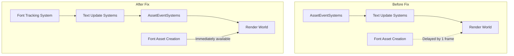

+++
title = "#23190 1-frame text update delay fix"
date = "2026-03-03T00:00:00"
draft = false
template = "pull_request_page.html"
in_search_index = true

[taxonomies]
list_display = ["show"]

[extra]
current_language = "en"
available_languages = {"en" = { name = "English", url = "/pull_request/bevy/2026-03/pr-23190-en-20260303" }, "zh-cn" = { name = "中文", url = "/pull_request/bevy/2026-03/pr-23190-zh-cn-20260303" }}
labels = ["C-Bug", "A-Text", "D-Straightforward"]
+++

# Title
1-frame text update delay fix

## Basic Information
- **Title**: 1-frame text update delay fix
- **PR Link**: https://github.com/bevyengine/bevy/pull/23190
- **Author**: ickshonpe
- **Status**: MERGED
- **Labels**: C-Bug, S-Ready-For-Final-Review, A-Text, D-Straightforward
- **Created**: 2026-03-02T11:34:49Z
- **Merged**: 2026-03-03T00:43:32Z
- **Merged By**: alice-i-cecile

## Description Translation
### Objective

The text systems run after the asset systems, so when they create new glyph atlas assets those assets aren't available to the renderworld.

Fixes #23004

### Solution

* Schedule all the text update systems to run before `AssetEventSystems`.
* `load_font_assets_into_font_collection` no longer reacts to asset events but instead tracks currently loaded fonts with a local hashset.

## Testing

```cargo run --example text```

The "hello bevy" text should no longer disappear if you drag to change the window height.

## The Story of This Pull Request

This PR addresses a subtle but important timing issue in Bevy's text rendering pipeline. The core problem is a race condition between text layout systems and asset processing that manifests as a one-frame visual glitch when text updates.

The issue occurs when text systems generate new glyph atlas assets during layout calculations. In the existing architecture, text update systems run in the `PostUpdate` schedule, but they were scheduled *after* `AssetEventSystems`. This meant that when text systems created new atlas assets, those assets wouldn't be available to the render world until the next frame, causing text to temporarily disappear during operations like window resizing.

The solution involves two coordinated changes to the system ordering and asset tracking logic.

First, the PR reorders text-related systems to ensure they execute before `AssetEventSystems`. This is implemented in both the sprite and UI modules. For 2D text rendering in `bevy_sprite`, the `detect_text_needs_rerender` and `update_text2d_layout` systems are moved to run before `AssetEventSystems` instead of in the `Text2dUpdateSystems` set. The bounds calculation is separated into its own system that runs later in `PostUpdate` to maintain correct dependencies.

For UI text in `bevy_ui`, the `text_system` now explicitly runs after `load_font_assets_into_font_collection` and before `AssetEventSystems`. This ensures consistent ordering across both text rendering pathways.

The second change addresses a dependency issue with the font loading system itself. Previously, `load_font_assets_into_font_collection` used Bevy's event system to react to `AssetEvent::Added` events. However, this created a circular dependency problem when text systems needed to run before asset events but also needed fonts to be loaded. The PR refactors this system to use a local hashset tracking approach instead.

The new implementation maintains a `Local<HashSet<AssetId<Font>>>` resource that tracks which font assets have already been processed. Each frame, the system:
1. Retains only the fonts that still exist in the `Assets<Font>` resource (cleaning up removed assets)
2. Iterates through all currently loaded fonts
3. Processes any fonts not already in the tracking set

This approach eliminates the dependency on asset events while maintaining the same functionality. The system can now run at any point in the frame, providing flexibility for scheduling.

The technical insight here is that asset event processing creates a fixed point in the frame execution that constrains system ordering. By moving to a polling-based approach for font tracking, we decouple the font loading system from this constraint while maintaining correctness through idempotent operations.

These changes resolve the visual artifact where text would disappear for one frame during window resizing. The fix is minimal and focused, addressing the root cause without major architectural changes.

## Visual Representation



## Key Files Changed

### `crates/bevy_text/src/font.rs` (+8/-7)
**What changed**: The `load_font_assets_into_font_collection` system was refactored to use local hashset tracking instead of reacting to asset events.

**Key modifications**:
```rust
// Before: Using AssetEvent reader
pub fn load_font_assets_into_font_collection(
    fonts: Res<Assets<Font>>,
    mut events: MessageReader<AssetEvent<Font>>,
    mut font_cx: ResMut<FontCx>,
    mut text_block_query: Query<&mut ComputedTextBlock>,
) {
    let mut new_fonts_added = false;

    for event in events.read() {
        if let AssetEvent::Added { id } = event
            && let Some(font) = fonts.get(*id)
        {
            // Process font...
        }
    }
}

// After: Using local hashset tracking
pub fn load_font_assets_into_font_collection(
    fonts: Res<Assets<Font>>,
    mut loaded_fonts: Local<HashSet<AssetId<Font>>>,
    mut font_cx: ResMut<FontCx>,
    mut text_block_query: Query<&mut ComputedTextBlock>,
) {
    let mut new_fonts_added = false;

    loaded_fonts.retain(|id| fonts.contains(*id));

    for (id, font) in fonts.iter() {
        if loaded_fonts.insert(id) {
            // Process font...
        }
    }
}
```

**Why this matters**: This change removes the dependency on `AssetEventSystems`, allowing the system to run at any point in the frame execution.

### `crates/bevy_sprite/src/lib.rs` (+7/-2)
**What changed**: Reordered text update systems to run before `AssetEventSystems` and separated bounds calculation.

**Key modifications**:
```rust
// Before: Systems chained and running in Text2dUpdateSystems set
.add_systems(
    PostUpdate,
    (
        bevy_text::detect_text_needs_rerender::<Text2d>,
        update_text2d_layout.after(bevy_camera::CameraUpdateSystems),
        calculate_bounds_text2d.in_set(VisibilitySystems::CalculateBounds),
    )
        .chain()
        .after(bevy_text::load_font_assets_into_font_collection)
        .in_set(bevy_text::Text2dUpdateSystems)
        .after(bevy_app::AnimationSystems),
)

// After: Text update systems run before AssetEventSystems, bounds calculation separate
.add_systems(
    PostUpdate,
    (
        bevy_text::detect_text_needs_rerender::<Text2d>,
        update_text2d_layout.after(bevy_camera::CameraUpdateSystems),
    )
        .chain()
        .after(bevy_text::load_font_assets_into_font_collection)
        .before(bevy_asset::AssetEventSystems)
        .after(bevy_app::AnimationSystems),
)
.add_systems(
    PostUpdate,
    calculate_bounds_text2d
        .in_set(VisibilitySystems::CalculateBounds)
        .after(update_text2d_layout),
)
```

**Why this matters**: Ensures text layout updates and glyph atlas creation happen before asset events are processed.

### `crates/bevy_text/src/lib.rs` (+1/-5)
**What changed**: Removed the ordering constraint that made `load_font_assets_into_font_collection` run after `AssetEventSystems`.

**Key modifications**:
```rust
// Before: System explicitly ordered after AssetEventSystems
.add_systems(
    PostUpdate,
    load_font_assets_into_font_collection.after(AssetEventSystems),
)

// After: No ordering constraint relative to AssetEventSystems
.add_systems(PostUpdate, load_font_assets_into_font_collection)
```

**Why this matters**: The system no longer needs to wait for asset events, giving flexibility in scheduling.

### `crates/bevy_ui/src/lib.rs` (+2/-0)
**What changed**: Added explicit ordering for UI text system to run after font loading and before asset events.

**Key modifications**:
```rust
// Added explicit ordering constraints
widget::text_system
    .in_set(UiSystems::PostLayout)
    .after(bevy_text::load_font_assets_into_font_collection)
    .before(bevy_asset::AssetEventSystems)
```

**Why this matters**: Ensures UI text rendering follows the same timing pattern as 2D text rendering.

## Further Reading

1. [Bevy System Scheduling Documentation](https://bevyengine.org/learn/book/next/programming/schedules/) - Understanding Bevy's system execution order
2. [Asset System in Bevy](https://bevyengine.org/learn/book/next/assets/) - How Bevy handles asset loading and events
3. [ECS Local Resources](https://bevyengine.org/learn/book/next/programming/ecs/local-resources/) - Using local resources for system-specific state
4. [PR #23004](https://github.com/bevyengine/bevy/issues/23004) - The original issue report with reproduction details
5. [Bevy Text Rendering Architecture](https://github.com/bevyengine/bevy/tree/main/crates/bevy_text) - Code structure for text rendering systems