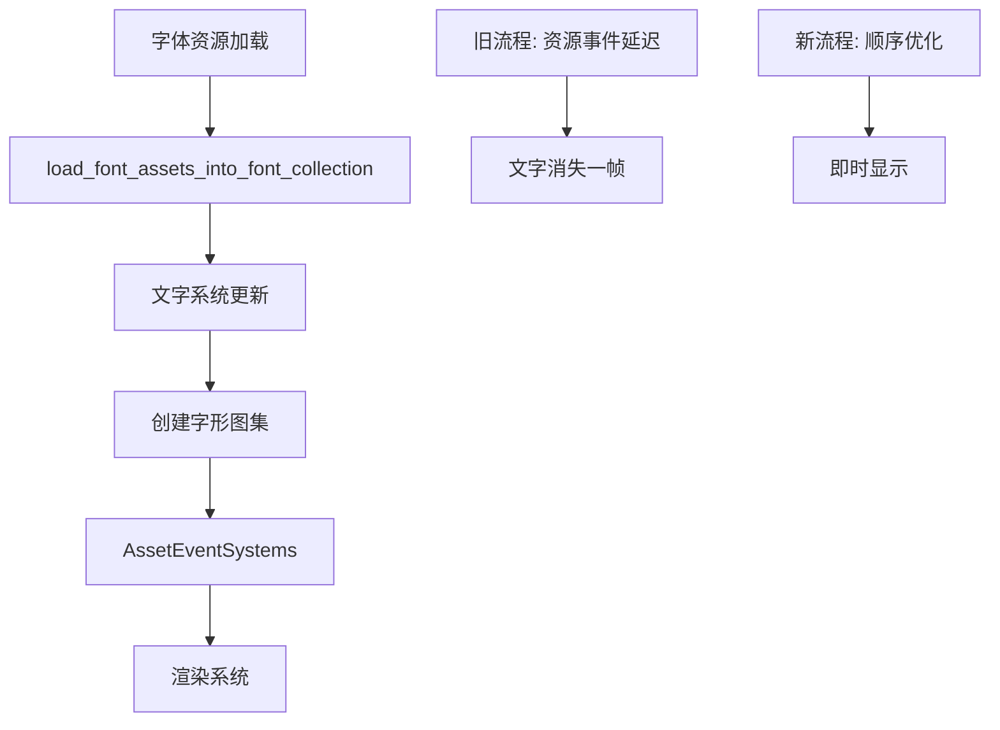

+++
title = "#23190 1-frame text update delay fix"
date = "2026-03-03T00:00:00"
draft = false
template = "pull_request_page.html"
in_search_index = false

[extra]
current_language = "zh-cn"
available_languages = {"en" = { name = "English", url = "/pull_request/bevy/2026-03/pr-23190-en-20260303" }, "zh-cn" = { name = "中文", url = "/pull_request/bevy/2026-03/pr-23190-zh-cn-20260303" }}
+++

# 1-frame text update delay fix

## 基本信息
- **标题**: 1-frame text update delay fix
- **PR链接**: https://github.com/bevyengine/bevy/pull/23190
- **作者**: ickshonpe
- **状态**: 已合并
- **标签**: C-Bug, S-Ready-For-Final-Review, A-Text, D-Straightforward
- **创建时间**: 2026-03-02T11:34:49Z
- **合并时间**: 2026-03-03T00:43:32Z
- **合并者**: alice-i-cecile

## 描述翻译

**目标**

文字系统在资源系统之后运行，因此当它们创建新的字形图集资源时，这些资源对渲染世界不可用。

修复 #23004

**解决方案**

* 安排所有文字更新系统在 `AssetEventSystems` 之前运行。
* `load_font_assets_into_font_collection` 不再响应资源事件，而是使用本地哈希集跟踪当前加载的字体。

**测试**

```cargo run --example text```

如果拖动窗口改变高度，"hello bevy" 文字不应再消失。

## 本PR的故事

这个PR解决了一个关于文字渲染延迟的问题。核心问题在于系统调度顺序：文字系统在资源系统之后运行，导致新创建的字形图集资源无法在同一帧内被渲染世界使用，造成文字显示延迟一帧。

问题的技术背景是Bevy的调度系统。`AssetEventSystems` 处理资源加载完成的事件，但文字系统（特别是创建新字形图集的逻辑）需要在这些事件处理之前完成工作，这样渲染系统才能在同一帧内访问到新资源。

开发者的解决方案集中在两个关键点上。首先，调整系统调度顺序，确保文字更新系统在 `AssetEventSystems` 之前运行。其次，修改字体加载逻辑，不再依赖资源事件，而是主动检查已加载的字体。

在 `bevy_sprite/src/lib.rs` 中，改动体现在系统调度顺序的调整上。`detect_text_needs_rerender` 和 `update_text2d_layout` 系统现在被明确安排在 `AssetEventSystems` 之前运行，而 `calculate_bounds_text2d` 被移到单独的调度组中，确保在布局更新后执行。

字体加载系统 `load_font_assets_into_font_collection` 的改造是另一个关键点。原来的实现依赖 `AssetEvent` 来检测新加载的字体，但这种方式要求系统在 `AssetEventSystems` 之后运行。新实现使用本地状态 `Local<HashSet<AssetId<Font>>>` 来跟踪已注册的字体，通过遍历当前所有字体资源并检查是否已在集合中来确定是否需要注册新字体。

这种改变带来了架构上的优势：系统不再依赖特定的事件顺序，而是通过状态管理来确保正确性。代码从事件驱动模式转变为数据驱动模式，这在复杂调度场景下更可靠。

`bevy_ui/src/lib.rs` 中的改动确保了UI文字系统也遵循相同的调度顺序。`widget::text_system` 现在明确在字体加载系统之后、资源事件系统之前运行。

从性能角度看，新的字体加载实现需要遍历所有字体资源，但通过哈希集查找保持了O(n)的时间复杂度，并且只在新字体加载时执行注册操作，避免了不必要的开销。

这个修复展示了在游戏引擎中处理资源加载和渲染顺序的重要性。文字渲染作为一个常见的UI元素，对用户体验影响显著。一帧的延迟虽然短暂，但在快速交互中可能被用户察觉。

## 视觉表示



## 关键文件变更

### `crates/bevy_sprite/src/lib.rs` (+7/-2)

**改动说明**：调整了2D文字系统的调度顺序，确保它们在资源事件系统之前运行。

**关键代码片段**：
```rust
// 之前：
(
    bevy_text::detect_text_needs_rerender::<Text2d>,
    update_text2d_layout.after(bevy_camera::CameraUpdateSystems),
    calculate_bounds_text2d.in_set(VisibilitySystems::CalculateBounds),
)
    .chain()
    .after(bevy_text::load_font_assets_into_font_collection)
    .in_set(bevy_text::Text2dUpdateSystems)
    .after(bevy_app::AnimationSystems),

// 之后：
(
    bevy_text::detect_text_needs_rerender::<Text2d>,
    update_text2d_layout.after(bevy_camera::CameraUpdateSystems),
)
    .chain()
    .after(bevy_text::load_font_assets_into_font_collection)
    .before(bevy_asset::AssetEventSystems)
    .after(bevy_app::AnimationSystems),
)
.add_systems(
    PostUpdate,
    calculate_bounds_text2d
        .in_set(VisibilitySystems::CalculateBounds)
        .after(update_text2d_layout),
);
```

**相关分析**：将边界计算系统分离出来，确保它仍然在布局更新后执行，同时让文字检测和布局系统在资源事件处理前完成。

### `crates/bevy_text/src/font.rs` (+8/-7)

**改动说明**：重构字体加载系统，从事件驱动改为状态驱动。

**关键代码片段**：
```rust
// 之前：
pub fn load_font_assets_into_font_collection(
    fonts: Res<Assets<Font>>,
    mut events: MessageReader<AssetEvent<Font>>,
    mut font_cx: ResMut<FontCx>,
    mut text_block_query: Query<&mut ComputedTextBlock>,
) {
    let mut new_fonts_added = false;

    for event in events.read() {
        if let AssetEvent::Added { id } = event
            && let Some(font) = fonts.get(*id)
        {
            // 注册字体
            new_fonts_added = true;
        }
    }

// 之后：
pub fn load_font_assets_into_font_collection(
    fonts: Res<Assets<Font>>,
    mut loaded_fonts: Local<HashSet<AssetId<Font>>>,
    mut font_cx: ResMut<FontCx>,
    mut text_block_query: Query<&mut ComputedTextBlock>,
) {
    let mut new_fonts_added = false;

    loaded_fonts.retain(|id| fonts.contains(*id));

    for (id, font) in fonts.iter() {
        if loaded_fonts.insert(id) {
            // 注册字体
            new_fonts_added = true;
        }
    }
```

**相关分析**：使用本地哈希集跟踪已加载字体，避免依赖资源事件。`retain`调用清理已移除的资源引用，`insert`操作检查并注册新字体。

### `crates/bevy_text/src/lib.rs` (+1/-5)

**改动说明**：移除字体加载系统对`AssetEventSystems`的依赖。

**关键代码片段**：
```rust
// 之前：
.add_systems(
    PostUpdate,
    load_font_assets_into_font_collection.after(AssetEventSystems),
)

// 之后：
.add_systems(PostUpdate, load_font_assets_into_font_collection)
```

**相关分析**：系统不再需要等待资源事件处理，可以更早执行。

### `crates/bevy_ui/src/lib.rs` (+2/-0)

**改动说明**：为UI文字系统添加调度约束。

**关键代码片段**：
```rust
widget::text_system
    .in_set(UiSystems::PostLayout)
    .after(bevy_text::load_font_assets_into_font_collection)
    .before(bevy_asset::AssetEventSystems)
```

**相关分析**：确保UI文字系统在字体加载后、资源事件处理前运行，保持与2D文字系统一致的行为。

## 进一步阅读

- [Bevy系统调度文档](https://bevyengine.org/learn/book/getting-started/systems/)
- [ECS架构中的事件处理](https://en.wikipedia.org/wiki/Entity_component_system#Event_systems)
- [资源管理最佳实践](https://gameprogrammingpatterns.com/resource-manager.html)
- [状态管理vs事件驱动设计](https://en.wikipedia.org/wiki/State_pattern)