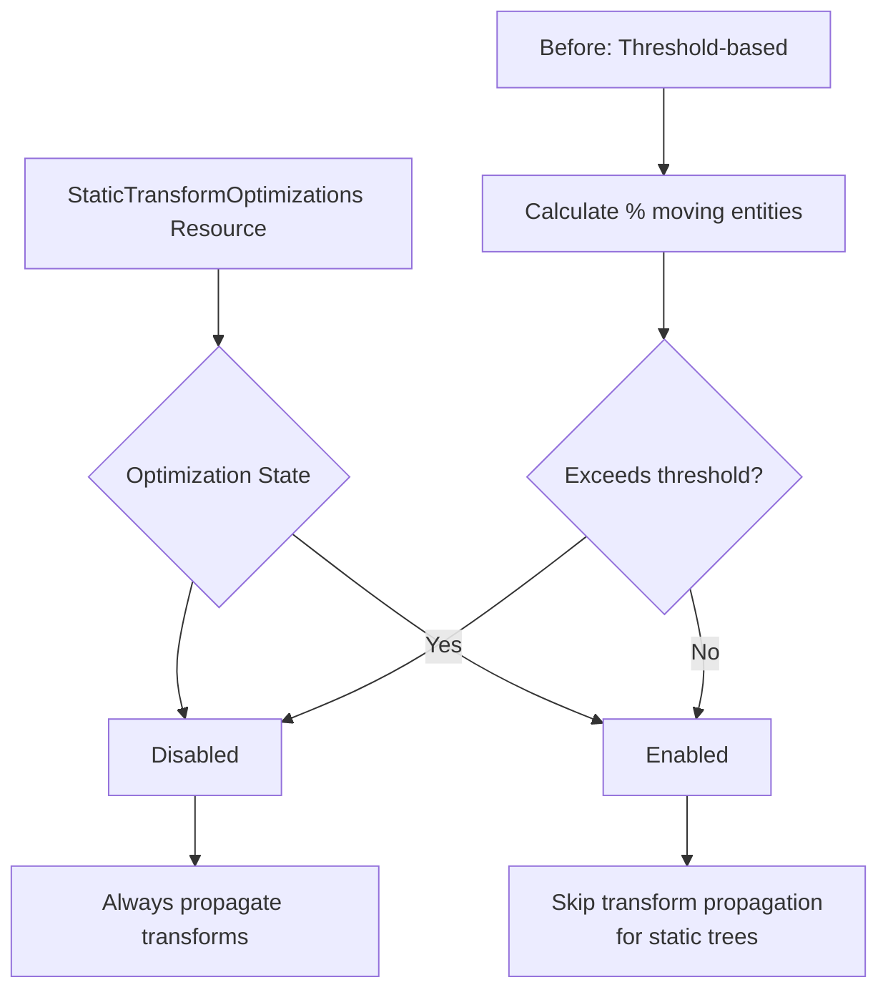

+++
title = "#23193 refactor: remove threshold configuration from StaticTransformOptimizations…"
date = "2026-03-05T00:00:00"
draft = false
template = "pull_request_page.html"
in_search_index = true

[taxonomies]
list_display = ["show"]

[extra]
current_language = "en"
available_languages = {"en" = { name = "English", url = "/pull_request/bevy/2026-03/pr-23193-en-20260305" }, "zh-cn" = { name = "中文", url = "/pull_request/bevy/2026-03/pr-23193-zh-cn-20260305" }}
labels = ["C-Usability", "A-Transform", "M-Migration-Guide", "D-Straightforward"]
+++

# Title
refactor: remove threshold configuration from StaticTransformOptimizations…

## Basic Information
- **Title**: refactor: remove threshold configuration from StaticTransformOptimizations…
- **PR Link**: https://github.com/bevyengine/bevy/pull/23193
- **Author**: andristarr
- **Status**: MERGED
- **Labels**: C-Usability, S-Ready-For-Final-Review, A-Transform, M-Migration-Guide, X-Uncontroversial, D-Straightforward
- **Created**: 2026-03-02T19:48:03Z
- **Merged**: 2026-03-05T00:14:28Z
- **Merged By**: alice-i-cecile

## Description Translation
# Objective

- Fixes #23192 by removing the threshold from the associated functions

## Solution

- We are removing the threshold all together, so the optimization is either enabled or disabled now.

## Migration guide
- Don't rely on from_threshold calls, either have the optimizations enabled or disabled.

## The Story of This Pull Request

This PR simplifies the static transform optimization system by removing a dynamic threshold mechanism that was causing complexity without clear benefits.

The core issue was in how Bevy handled static transform optimizations. When you have many entities with transforms that don't change (static entities), Bevy can skip expensive transform propagation calculations for entire trees of entities. However, the previous implementation tried to be clever about this by automatically disabling the optimization when too many entities were moving.

The `StaticTransformOptimizations` struct previously had a threshold configuration (defaulting to 0.3 or 30%). Each frame, the system would calculate what percentage of entities had changed transforms, and if this exceeded the threshold, it would disable the static optimization for that frame. This approach created several problems:

1. **Unnecessary complexity**: The system had to track and calculate percentages every frame
2. **Performance overhead**: Counting changed transforms and calculating ratios added computational cost
3. **Unpredictable behavior**: Developers couldn't reliably know whether optimizations would be active in any given frame
4. **Configuration confusion**: The threshold-based API (`from_threshold()`) was conceptually complex

The solution was straightforward: replace the threshold-based configuration with a simple boolean choice. Now, developers explicitly choose whether static transform optimizations are enabled or disabled, and the system respects that choice without any runtime calculations.

The implementation changes are focused and clean. The `StaticTransformOptimizations` struct becomes a simple enum:

```rust
// Before: Complex struct with internal state
#[derive(Resource, Debug)]
pub struct StaticTransformOptimizations {
    threshold: f32,
    enabled: bool,
}

// After: Simple enum with clear states
#[derive(Resource, Debug, Default, PartialEq, Eq)]
pub enum StaticTransformOptimizations {
    #[default]
    Enabled,
    Disabled,
}
```

This simplification ripples through the codebase. The `mark_dirty_trees` system no longer needs to calculate moving object percentages:

```rust
// Before: Complex threshold logic
let threshold = static_optimizations.threshold.clamp(0.0, 1.0);
match threshold {
    0.0 => static_optimizations.enabled = false,
    1.0 => static_optimizations.enabled = true,
    _ => {
        static_optimizations.enabled = true;
        let n_dyn = changed_transforms.count() as f32;
        let total = transforms.count() as f32;
        if n_dyn / total > threshold {
            static_optimizations.enabled = false;
        }
    }
}

// After: Simple check
if !static_optimizations.is_enabled() {
    return;
}
```

The parallel and serial transform propagation systems also simplify their checks from `static_optimizations.enabled` to `static_optimizations.is_enabled()`.

This change improves code clarity and reduces runtime overhead. Developers now have predictable behavior: if they enable the optimization, it's always active. If they need dynamic behavior (enabling/disabling based on scene dynamics), they can implement their own system to toggle the resource, though the migration guide cautions against doing this every frame due to performance costs.

The PR also updates two stress test examples that previously disabled the optimization. Instead of calling `StaticTransformOptimizations::disabled()`, they now use `StaticTransformOptimizations::Disabled`. This is a minor but necessary API change that reflects the shift from constructor functions to enum variants.

## Visual Representation



## Key Files Changed

### `crates/bevy_transform/src/systems.rs` (+16/-64)
This is the main file containing the transform system logic. The changes completely rework the `StaticTransformOptimizations` type and simplify the optimization logic.

**Key changes:**
1. The struct definition changes to an enum:
```rust
// Before:
pub struct StaticTransformOptimizations {
    threshold: f32,
    enabled: bool,
}

// After:
pub enum StaticTransformOptimizations {
    Enabled,
    Disabled,
}
```

2. Removal of threshold-based constructors and methods:
```rust
// Before: Multiple constructor methods
impl StaticTransformOptimizations {
    pub fn from_threshold(threshold: f32) -> Self { /* ... */ }
    pub fn disabled() -> Self { /* ... */ }
    pub fn enabled() -> Self { /* ... */ }
}

// After: Simple enum with inline method
impl StaticTransformOptimizations {
    pub fn is_enabled(&self) -> bool {
        *self == StaticTransformOptimizations::Enabled
    }
}
```

3. Simplified logic in `mark_dirty_trees` system:
```rust
// Before: Complex threshold calculation
let threshold = static_optimizations.threshold.clamp(0.0, 1.0);
// ... calculation of moving percentage ...

// After: Simple check
if !static_optimizations.is_enabled() {
    return;
}
```

### `release-content/migration-guides/remove_threshold_StaticTransformOptimizations.md` (+9/-0)
This new file provides migration guidance for users of the old API.

**Content:**
```markdown
---
title: "`StaticTransformOptimizations` no longer stores a threshold for dynamic toggling"
pull_requests: [23193]
---

The threshold has been removed completely from `StaticTransformOptimizations`: the optimization is always either enabled or disabled. As a result this is now a simple `enum`, and some method calls will need to be updated.

If you want to toggle this dynamically, you can count the entities in a system and dynamically enable or disable this.
Performing this check can be slow however, so you probably should not perform this check each frame.
```

### `examples/stress_tests/bevymark.rs` (+1/-1) and `examples/stress_tests/many_foxes.rs` (+1/-1)
These example files are updated to use the new enum variant instead of the old constructor method.

**Change pattern:**
```rust
// Before:
.insert_resource(StaticTransformOptimizations::disabled())

// After:
.insert_resource(StaticTransformOptimizations::Disabled)
```

## Further Reading

1. **Bevy ECS Resources**: Understanding how resources work in Bevy's ECS is fundamental to using `StaticTransformOptimizations`. The [Bevy Cheatbook](https://bevy-cheatbook.github.io/programming/res.html) provides a good introduction.

2. **Transform Propagation**: For background on why transform optimization matters, see Bevy's [transform system documentation](https://docs.rs/bevy_transform/latest/bevy_transform/) which explains how parent-child transform relationships work.

3. **Enum Patterns in Rust**: The change from a struct with state to an enum follows Rust best practices for representing mutually exclusive states. The [Rust Book chapter on enums](https://doc.rust-lang.org/book/ch06-00-enums.html) covers this pattern.

4. **Performance Optimization Patterns**: This PR demonstrates a common optimization pattern: removing runtime calculations in favor of configuration-time decisions. The book ["Data-Oriented Design" by Richard Fabian](https://www.dataorienteddesign.com/dodbook/) discusses similar trade-offs.