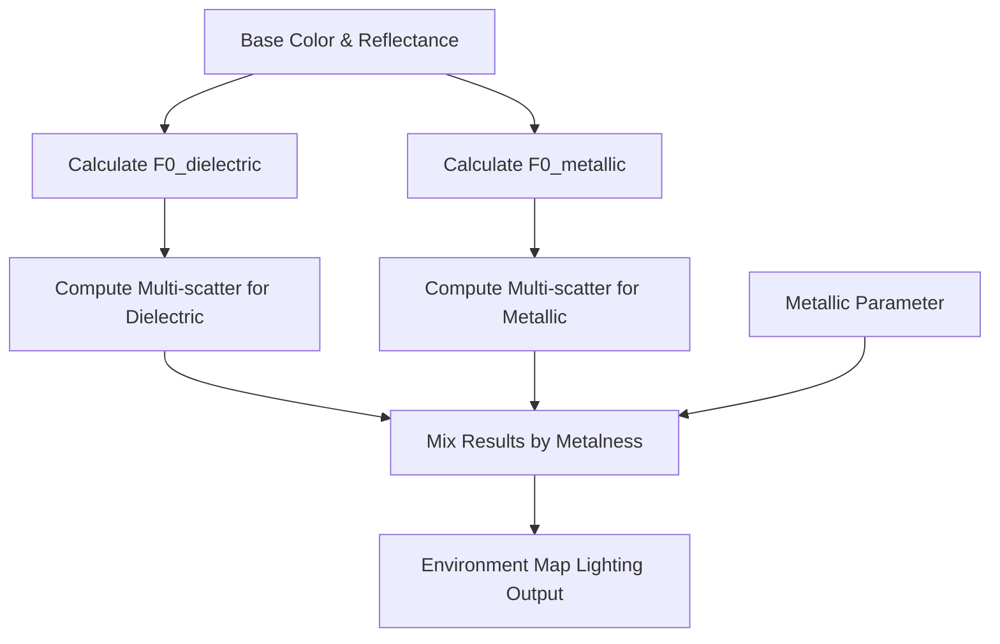

+++
title = "#23203 Fix energy loss in multi-scattering term"
date = "2026-03-05T00:00:00"
draft = false
template = "pull_request_page.html"
in_search_index = true

[taxonomies]
list_display = ["show"]

[extra]
current_language = "en"
available_languages = {"en" = { name = "English", url = "/pull_request/bevy/2026-03/pr-23203-en-20260305" }, "zh-cn" = { name = "中文", url = "/pull_request/bevy/2026-03/pr-23203-zh-cn-20260305" }}
labels = ["A-Rendering", "M-Release-Note", "D-Modest", "M-Deliberate-Rendering-Change", "C-Refinement"]
+++

# Title

## Basic Information
- **Title**: Fix energy loss in multi-scattering term
- **PR Link**: https://github.com/bevyengine/bevy/pull/23203
- **Author**: dylansechet
- **Status**: MERGED
- **Labels**: A-Rendering, S-Ready-For-Final-Review, M-Release-Note, D-Modest, M-Deliberate-Rendering-Change, C-Refinement
- **Created**: 2026-03-03T17:26:24Z
- **Merged**: 2026-03-05T02:17:11Z
- **Merged By**: alice-i-cecile

## Description Translation

# Objective

With #23194 applied, the white furnace test passes for pure metals and dielectrics, but fails for anything in between.

## Solution

The issue seems to be the multi-scattering term used in `environment_map_light`.
The current code computes `FmsEms(mix(F0_dielectric, F0_metal, metalness))` when it should be computing `mix(FmsEms(F0_dielectric), FmsEms(F0_metal), metalness)`, which causes an issue as FmsEms is non-linear in F0.

The bug is also present in the [blogpost](https://bruop.github.io/ibl/) that was used as inspiration for the implementation, where the author mentions that the results with multi-scattering are darker than they should be.

## Testing

- Ran `cargo run --example testbed_white_furnace`. I've never been so happy to see a gray image :)
- Ran `cargo run --example pbr`.
---

## Showcase

White furnace test (with #23194 also applied):

**Before:**


**After:**


PBR test [also on imgsli](https://imgsli.com/NDUzNjU2)

**Before:**


**After:**


## The Story of This Pull Request

This PR addresses an energy conservation issue in Bevy's physically-based rendering (PBR) system that was discovered during white furnace testing. The white furnace test is a standard validation technique in rendering where a perfectly reflective object is placed in a uniform white environment. If the rendering system is energy-conserving, the object should be indistinguishable from the background. The fact that Bevy was failing this test for partially metallic materials indicated a mathematical error in how light energy was being calculated.

The core problem was in the multi-scattering term calculation within the environment map lighting code. In PBR, materials can have both dielectric (non-metallic) and metallic components, with the metalness parameter controlling the blend between them. The Fresnel reflectance at normal incidence (F0) represents how much light reflects at different angles, and it differs between dielectric and metallic materials.

The previous implementation was incorrectly applying the multi-scattering function to a linearly mixed F0 value:

```
FmsEms(mix(F0_dielectric, F0_metal, metalness))
```

This approach was mathematically incorrect because the `FmsEms` function is non-linear with respect to F0. The correct approach is to compute the multi-scattering separately for dielectric and metallic components, then mix the results:

```
mix(FmsEms(F0_dielectric), FmsEms(F0_metal), metalness)
```

The difference between these approaches is subtle but significant. When you have a non-linear function, you can't simply apply the function to a linear combination of inputs and expect the same result as linearly combining the function outputs. This mathematical error was causing energy loss in partially metallic materials, making them appear darker than they should.

The implementation required changes across multiple shader files to separate the dielectric and metallic F0 calculations and pass them through the lighting pipeline. A new `compute_multiscatter` function was extracted to handle the multi-scattering calculation, and the data structures were updated to carry both F0 values separately rather than a single mixed value.

Interestingly, this bug wasn't unique to Bevy - it was also present in the original blog post that inspired the implementation, where the author noted that results with multi-scattering were darker than expected. This demonstrates the importance of validating reference implementations and understanding the underlying mathematics.

The fix ensures that Bevy's PBR system correctly conserves energy, which is essential for physically plausible rendering. Materials now behave correctly under image-based lighting, and the white furnace test passes for all material types.

## Visual Representation



## Key Files Changed

### 1. `crates/bevy_pbr/src/light_probe/environment_map.wgsl` (+38/-11)

This file contains the core environment map lighting calculations. The main change was refactoring the multi-scattering computation to handle dielectric and metallic components separately.

**Key modifications:**
- Added a `MultiscatterResult` struct to organize the multi-scattering outputs
- Created a reusable `compute_multiscatter` function
- Changed from computing multi-scattering on mixed F0 to computing separately then mixing

**Code snippet showing the new function:**
```wgsl
struct MultiscatterResult {
    FssEss: vec3<f32>,
    FmsEms: vec3<f32>,
    Edss: vec3<f32>,
}

fn compute_multiscatter(
    F0: vec3<f32>,
    F_ab: vec2<f32>,
    Ems: f32,
    specular_occlusion: f32,
) -> MultiscatterResult {
    let FssEss = (F0 * F_ab.x + F_ab.y) * specular_occlusion;
    let Favg = F0 + (1.0 - F0) / 21.0;
    let FmsEms = FssEss * Favg / (1.0 - Ems * Favg) * Ems;
    let Edss = 1.0 - (FssEss + FmsEms);

    return MultiscatterResult(FssEss, FmsEms, Edss);
}
```

### 2. `crates/bevy_pbr/src/render/pbr_functions.wgsl` (+16/-5)

This file contains PBR utility functions. The main change was separating the F0 calculation for dielectrics and metals.

**Key modifications:**
- Added `calculate_F0_dielectric` function specifically for dielectric materials
- Modified `calculate_F0` to mix dielectric and metallic F0 values instead of calculating a single mixed F0
- Updated lighting input structures to carry both F0 values

**Code snippet showing the new dielectric F0 function:**
```wgsl
// Remapping [0,1] reflectance to F0 for dielectrics
fn calculate_F0_dielectric(reflectance: vec3<f32>) -> vec3<f32> {
    return 0.16 * reflectance * reflectance;
}
```

### 3. `crates/bevy_pbr/src/render/pbr_lighting.wgsl` (+8/-5)

This file defines the lighting input structures and functions. The structure was updated to carry dielectric and metallic F0 separately.

**Key modifications:**
- Added `metallic` field to `LightingInput` struct
- Replaced single `F0_` field with `F0_dielectric` and `F0_metallic` fields
- Updated specular functions to mix F0 values at usage time

**Code snippet showing the updated struct:**
```wgsl
struct LightingInput {
    // ... other fields
    diffuse_color: vec3<f32>,
    metallic: f32,
    F0_dielectric: vec3<f32>,
    F0_metallic: vec3<f32>,
    // ... other fields
}
```

### 4. `crates/bevy_pbr/src/ssr/ssr.wgsl` (+4/-2)

This file handles screen space reflections and needed to be updated to use the new F0 calculation approach.

**Key modifications:**
- Updated to use `calculate_F0_dielectric` instead of the old `calculate_F0`
- Set up lighting input with separate dielectric and metallic F0 values

### 5. `release-content/release-notes/white_furnace.md` (+15/-0)

This new file documents the white furnace test achievement for the release notes, explaining what the test is and why passing it matters.

## Further Reading

- [The White Furnace Test](https://lousodrome.net/blog/light/2023/10/21/the-white-furnace-test/) - Explains the white furnace test and its importance in PBR validation
- [Filament Documentation](https://google.github.io/filament/Filament.html) - Comprehensive PBR guide that covers energy conservation and multi-scattering
- [Multi-scattering approximation paper](https://www.jcgt.org/published/0008/01/03/paper.pdf) - The original paper on the multi-scattering approximation used in the implementation
- [Physically Based Rendering: From Theory to Implementation](https://pbrt.org/) - Comprehensive textbook on PBR principles