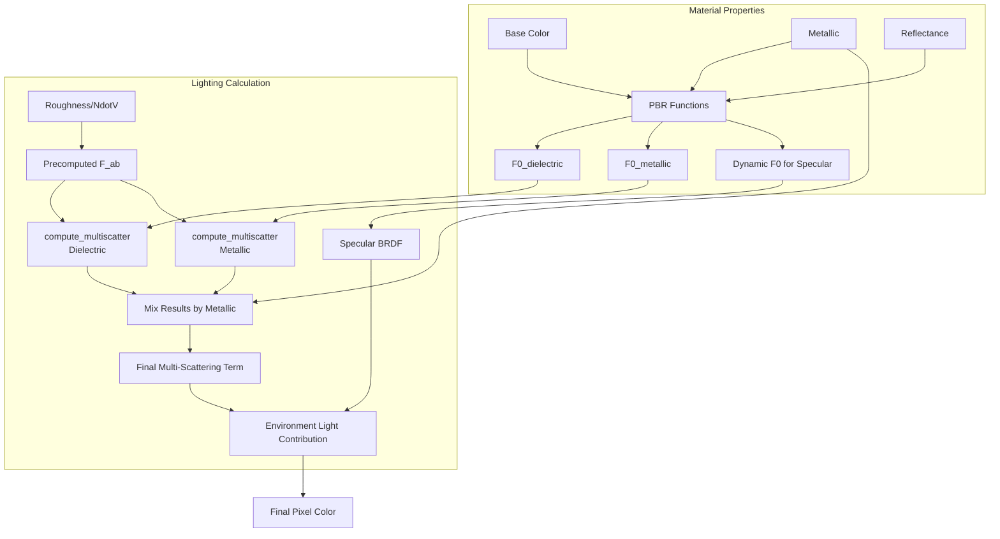

+++
title = "#23203 Fix energy loss in multi-scattering term"
date = "2026-03-05T00:00:00"
draft = false
template = "pull_request_page.html"
in_search_index = false

[extra]
current_language = "zh-cn"
available_languages = {"en" = { name = "English", url = "/pull_request/bevy/2026-03/pr-23203-en-20260305" }, "zh-cn" = { name = "中文", url = "/pull_request/bevy/2026-03/pr-23203-zh-cn-20260305" }}
labels = ["A-Rendering", "M-Release-Note", "D-Modest", "M-Deliberate-Rendering-Change", "C-Refinement"]
+++

# Title

## Basic Information
- **Title**: Fix energy loss in multi-scattering term
- **PR Link**: https://github.com/bevyengine/bevy/pull/23203
- **Author**: dylansechet
- **Status**: MERGED
- **Labels**: A-Rendering, S-Ready-For-Final-Review, M-Release-Note, D-Modest, M-Deliberate-Rendering-Change, C-Refinement
- **Created**: 2026-03-03T17:26:24Z
- **Merged**: 2026-03-05T02:17:11Z
- **Merged By**: alice-i-cecile

## Description Translation

**目标**
应用了 #23194 后，白炉测试（white furnace test）对于纯金属和纯电介质（dielectric）材质通过了，但对于介于两者之间的材质（例如非金属导体或混合材质）却失败了。

**解决方案**
问题似乎出在 `environment_map_light` 中使用的多重散射项（multi-scattering term）。当前的代码计算的是 `FmsEms(mix(F0_dielectric, F0_metal, metalness))`，但它应该计算 `mix(FmsEms(F0_dielectric), FmsEms(F0_metal), metalness)`。这导致了一个问题，因为 `FmsEms` 对 `F0` 是非线性的。

这个错误也存在于作为实现灵感来源的[博客文章](https://bruop.github.io/ibl/)中，作者提到使用多重散射的结果比它们应有的要暗。

**测试**
- 运行了 `cargo run --example testbed_white_furnace`。我从未如此高兴地看到一张灰色图像 :)
- 运行了 `cargo run --example pbr`。

**展示**
白炉测试（同样应用了 #23194）：
**修复前：**

**修复后：**


PBR 测试 [另见 imgsli](https://imgsli.com/NDUzNjU2)
**修复前：**

**修复后：**


## The Story of This Pull Request

这个 Pull Request 的故事始于一个未通过的关键物理测试。在之前的 PR #23194 解决了使用 `GeneratedEnvironmentMapLight` 时在某些表面朝向出现的接缝问题后，Bevy 的 PBR（基于物理的渲染）系统在白炉测试中有了部分改善：纯金属和纯电介质材质现在能正确反射环境光，表现为均匀的白色。然而，当一个材质的 `metallic` 属性介于 0 和 1 之间时——即材质同时具有金属和非金属属性——测试失败了。物体在白色环境中显得更暗，这意味着渲染器正在错误地“吸收”能量，违反了物理能量守恒定律。

问题的根源在于多重散射项的计算方法。在基于图像的环境光照中，表面粗糙度会导致光线在微表面间多次反射，这种现象称为多重散射。为了高效近似这种复杂效应，Bevy 实现了一个来自学术论文的公式。核心问题是一个简单的数学错误：代码将电介质的 `F0_dielectric` 和金属的 `F0_metallic` 先按金属度（`metallic`）线性混合，然后将这个混合后的 `F0` 值代入非线性函数 `FmsEms` 进行计算。然而，正确的做法应该是分别将电介质的 `F0_dielectric` 和金属的 `F0_metallic` 代入 `FmsEms` 函数得到各自的散射结果，然后再根据金属度对这两个结果进行线性混合。

简单来说，就是 `f(mix(a, b, t))` 与 `mix(f(a), f(b), t)` 的区别。由于 `FmsEms` 函数是非线性的，对于大部分 `t` 值，这两个表达式的结果并不相等。使用错误的顺序会导致能量损失，表现为混合材质比预期更暗。

解决方案直接明了。开发者首先在 `environment_map.wgsl` 中引入了一个新的辅助函数 `compute_multiscatter`，封装了多重散射的计算逻辑。这个函数接受一个 `F0` 值作为参数，并返回包含 `FssEss`、`FmsEms` 和 `Edss` 的结构体 `MultiscatterResult`。

修复的核心逻辑在 `environment_map_light` 函数中：
```wgsl
// 修复前：错误地先混合F0，再进行非线性计算
let F0_surface = mix(F0_dielectric, F0_metallic, metallic);
// ... 然后使用 F0_surface 计算 FmsEms

// 修复后：分别对电介质和金属进行计算，然后混合结果
let ms_dielectric = compute_multiscatter(F0_dielectric, F_ab, Ems, specular_occlusion);
let ms_metallic = compute_multiscatter(F0_metallic, F_ab, Ems, specular_occlusion);

let FssEss = mix(ms_dielectric.FssEss, ms_metallic.FssEss, metallic);
let FmsEms = mix(ms_dielectric.FmsEms, ms_metallic.FmsEms, metallic);
let kD = diffuse_color * ms_dielectric.Edss;
```
这个改变确保了非线性变换在混合之前应用于每个独立项，从而保持了物理上的能量守恒。

然而，这个修复触发了更广泛的代码结构调整。为了清晰地分离电介质和金属的 `F0`，需要修改多个着色器文件中的数据结构。`LightingInput` 结构体被扩展：移除了单一的 `F0_` 字段，取而代之的是 `metallic`、`F0_dielectric` 和 `F0_metallic` 三个字段。这要求所有使用 `LightingInput` 的地方都进行相应更新，包括 `pbr_functions.wgsl`、`pbr_lighting.wgsl` 和 `ssr.wgsl`。

例如，在 `pbr_functions.wgsl` 中，`calculate_F0` 函数被重构以体现这种分离：
```wgsl
// 新增：专门计算电介质F0
fn calculate_F0_dielectric(reflectance: vec3<f32>) -> vec3<f32> {
    return 0.16 * reflectance * reflectance;
}

// 修改后的主函数：现在它调用 mix，清晰地分离了逻辑
fn calculate_F0(base_color: vec3<f32>, metallic: f32, reflectance: vec3<f32>) -> vec3<f32> {
    return mix(calculate_F0_dielectric(reflectance), base_color, metallic);
}
```
这个重构不仅支持了本次修复，也使代码意图更加清晰，将电介质和金属的 `F0` 计算逻辑明确分开。

此外，`specular` 和 `specular_anisotropy` 函数也进行了更新，它们现在需要从传入的 `LightingInput` 中动态混合 `F0_dielectric` 和 `F0_metallic` 来获取当前片段使用的 `F0`。

这个 PR 的成果通过白炉测试得到了验证：修复后，无论材质金属度和粗糙度如何，物体都能完全融入均匀的白色背景中。在更实际的 PBR 示例中，这种变化表现为部分金属材质在环境光照下显得更加明亮和自然，因为它们现在正确地反射了更多的光能，而不是错误地吸收掉。这是一个典型案例，说明了在物理渲染中，即使是看似微小的数学顺序错误，也会导致视觉上明显的能量不守恒，而通过严谨的公式分解和正确计算可以解决这类问题。

## Visual Representation



## Key Files Changed

### 1. `crates/bevy_pbr/src/light_probe/environment_map.wgsl` (+38/-11)
这是修复的核心文件。修改引入了新的 `MultiscatterResult` 结构体和 `compute_multiscatter` 函数，并重写了 `environment_map_light` 函数中的多重散射计算逻辑。

**关键修改：**
```wgsl
// 新增：封装多重散射计算结果
struct MultiscatterResult {
    FssEss: vec3<f32>,
    FmsEms: vec3<f32>,
    Edss: vec3<f32>,
}

// 新增：计算多重散射的辅助函数
fn compute_multiscatter(
    F0: vec3<f32>,
    F_ab: vec2<f32>,
    Ems: f32,
    specular_occlusion: f32,
) -> MultiscatterResult {
    let FssEss = (F0 * F_ab.x + F_ab.y) * specular_occlusion;
    let Favg = F0 + (1.0 - F0) / 21.0;
    let FmsEms = FssEss * Favg / (1.0 - Ems * Favg) * Ems;
    let Edss = 1.0 - (FssEss + FmsEms);

    return MultiscatterResult(FssEss, FmsEms, Edss);
}
```

```wgsl
// 在 environment_map_light 函数内：
// 修复前：内联的、错误的计算
// let FssEss = (F0 * F_ab.x + F_ab.y) * specular_occlusion;
// let Ems = 1.0 - (F_ab.x + F_ab.y);
// let Favg = F0 + (1.0 - F0) / 21.0;
// let Fms = FssEss * Favg / (1.0 - Ems * Favg);
// let FmsEms = Fms * Ems;
// let Edss = 1.0 - (FssEss + FmsEms);
// let kD = diffuse_color * Edss;

// 修复后：分别计算再混合
let ms_dielectric = compute_multiscatter(F0_dielectric, F_ab, Ems, specular_occlusion);
let ms_metallic = compute_multiscatter(F0_metallic, F_ab, Ems, specular_occlusion);

let FssEss = mix(ms_dielectric.FssEss, ms_metallic.FssEss, metallic);
let FmsEms = mix(ms_dielectric.FmsEms, ms_metallic.FmsEms, metallic);
let kD = diffuse_color * ms_dielectric.Edss;
```

### 2. `crates/bevy_pbr/src/render/pbr_functions.wgsl` (+16/-5)
这个文件重构了 `F0` 的计算逻辑，以支持分离的电介质和金属 `F0` 值。它为 `LightingInput` 结构体设置新的字段。

**关键修改：**
```wgsl
// 新增：专门计算电介质 F0 的函数
fn calculate_F0_dielectric(reflectance: vec3<f32>) -> vec3<f32> {
    return 0.16 * reflectance * reflectance;
}

// 修改主计算函数，清晰体现混合逻辑
fn calculate_F0(base_color: vec3<f32>, metallic: f32, reflectance: vec3<f32>) -> vec3<f32> {
    return mix(calculate_F0_dielectric(reflectance), base_color, metallic);
}
```

```wgsl
// 在 apply_pbr_lighting 函数中，为 lighting_input 设置新字段：
lighting_input.metallic = metallic;
lighting_input.F0_dielectric = calculate_F0_dielectric(reflectance);
lighting_input.F0_metallic = output_color.rgb; // base_color 作为金属的 F0
```

### 3. `crates/bevy_pbr/src/render/pbr_lighting.wgsl` (+8/-5)
这个文件更新了 `LightingInput` 结构体定义以及使用 `F0` 的镜面反射计算函数。

**关键修改：**
```wgsl
// 修改 LightingInput 结构体：
struct LightingInput {
    ...
    metallic: f32, // 新增
    F0_dielectric: vec3<f32>, // 替换原来的 F0_
    F0_metallic: vec3<f32>, // 新增
    ...
}
```

```wgsl
// 在 specular 函数中，动态计算当前使用的 F0：
let F0 = mix((*input).F0_dielectric, (*input).F0_metallic, (*input).metallic);
// `specular_anisotropy` 函数中也做了同样的修改
```

### 4. `crates/bevy_pbr/src/ssr/ssr.wgsl` (+4/-2)
这个文件更新了屏幕空间反射（SSR）的代码，使其与新的 `LightingInput` 接口保持一致。

**关键修改：**
```wgsl
// 之前：
// let F0_env = pbr_functions::calculate_F0(base_color, metallic, reflectance);
// lighting_input.F0_ = F0_env;

// 之后：
let F0_dielectric = pbr_functions::calculate_F0_dielectric(reflectance);
lighting_input.metallic = metallic;
lighting_input.F0_dielectric = F0_dielectric;
lighting_input.F0_metallic = base_color;
```

### 5. `release-content/release-notes/white_furnace.md` (+15/-0)
新增的发布说明文档，解释了白炉测试的重要性以及本次修复所解决的两个问题（包括 PR #23194 和 #23203）。

## Further Reading

1.  **白炉测试 (White Furnace Test)**: [这篇博客文章](https://lousodrome.net/blog/light/2023/10/21/the-white-furnace-test/)详细解释了白炉测试的原理及其在验证 PBR 渲染器正确性方面的作用。
2.  **多重散射 (Multi-Scattering)**: 本次修复中引用的论文 ["Real-Time Polygonal-Light Shading with Linearly Transformed Cosines"](https://www.jcgt.org/published/0008/01/03/paper.pdf) 是理解多重散射近似算法的关键。论文的附录 B 专门讨论了能量补偿（energy compensation），与本次修复相关。
3.  **Filament PBR 指南**: Google 的 [Filament 文档](https://google.github.io/filament/Filament.html) 是关于基于物理渲染的权威参考。其中的 "Image based lighting" 和 "Material model" 章节详细解释了 F0、能量守恒和多重散射等概念。
4.  **Bevy PR #23194**: 了解与本 PR 共同作用、解决了白炉测试中接缝问题的前序修复。