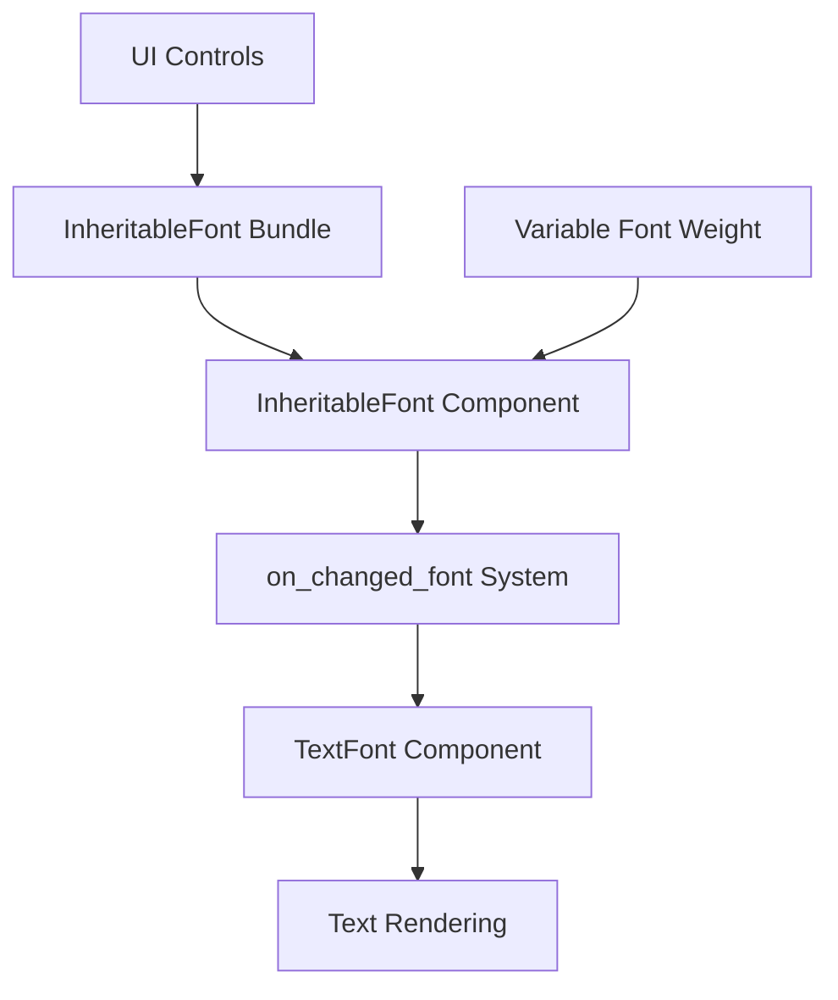

+++
title = "#23205 Add font weight to `InheritableFont`"
date = "2026-03-04T00:00:00"
draft = false
template = "pull_request_page.html"
in_search_index = true

[taxonomies]
list_display = ["show"]

[extra]
current_language = "en"
available_languages = {"en" = { name = "English", url = "/pull_request/bevy/2026-03/pr-23205-en-20260304" }, "zh-cn" = { name = "中文", url = "/pull_request/bevy/2026-03/pr-23205-zh-cn-20260304" }}
labels = ["C-Feature", "A-Text", "D-Straightforward"]
+++

# Title
Add font weight to `InheritableFont`

## Basic Information
- **Title**: Add font weight to `InheritableFont`
- **PR Link**: https://github.com/bevyengine/bevy/pull/23205
- **Author**: nic96
- **Status**: MERGED
- **Labels**: C-Feature, S-Ready-For-Final-Review, A-Text, X-Uncontroversial, D-Straightforward
- **Created**: 2026-03-03T18:52:28Z
- **Merged**: 2026-03-04T22:54:17Z
- **Merged By**: alice-i-cecile

## Description Translation

# Objective

When using a variable font it would be nice to be able to propagate the font weight using `InheritableFont`.

## Solution

- Add `weight` field to `InheritableFont`

## Testing

I tested that it works propagating font weight with a variable font:

```rust
commands.spawn((
    InheritableFont {
        font_size: 14.,
        font: font_handle.into(),
        weight: FontWeight::EXTRA_LIGHT,
    },
    children![(Text::new("Hello world"), ThemedText)],
));
```

## The Story of This Pull Request

This PR addresses a specific limitation in Bevy's UI text styling system when working with variable fonts. Variable fonts allow multiple stylistic variations (like weight, width, slant) within a single font file, which can be controlled dynamically. Prior to this change, the `InheritableFont` component could propagate font family and size through the UI hierarchy, but not font weight, which made it impossible to use variable font weight features within Bevy's theme system.

The problem is straightforward: when building UI components with text labels, developers want consistent font weight styling that follows the same inheritance pattern as other font properties. Without this capability, each text element would need explicit weight settings, defeating the purpose of the theme system and making UI styling more verbose.

The solution implements a minimal, backward-compatible change. The developer added a `weight` field to the `InheritableFont` struct with type `FontWeight` from the `bevy_text` module. This field is initialized with `FontWeight::NORMAL` in all existing constructors to maintain backward compatibility. The field is then used in the `on_changed_font` system where `InheritableFont` properties are propagated to the actual `TextFont` components used for rendering.

Here's the key change in `font_styles.rs`:

```rust
// Before:
pub struct InheritableFont {
    /// The desired font.
    pub font: HandleOrPath<Font>,
    /// The desired font size.
    pub font_size: FontSize,
}

// After:
pub struct InheritableFont {
    /// The desired font.
    pub font: HandleOrPath<Font>,
    /// The desired font size.
    pub font_size: FontSize,
    /// The desired font weight.
    pub weight: FontWeight,
}
```

The propagation system in `on_changed_font` was updated to include the weight:

```rust
// Before:
commands.entity(insert.entity).insert(Propagate(TextFont {
    font: font.into(),
    font_size: style.font_size,
    ..Default::default()
}));

// After:
commands.entity(insert.entity).insert(Propagate(TextFont {
    font: font.into(),
    font_size: style.font_size,
    weight: style.weight,
    ..Default::default()
}));
```

Four UI control files (button, checkbox, radio, slider) were updated to include the default weight when constructing `InheritableFont`. This ensures existing UI components continue to work with normal font weight, while allowing developers to override it when needed.

The implementation follows Bevy's existing patterns for font inheritance. The `InheritableFont` component is part of Bevy's Feathers UI system, which provides theming and styling capabilities. By adding weight to this component, it becomes possible to define font weight at any level of the UI hierarchy and have it propagate downward to child text elements, just like font family and size.

This change is particularly useful for modern UI design where typographic hierarchy often uses weight variations (regular, medium, bold) to establish visual importance. With variable fonts becoming more common, this change enables more efficient use of font resources and more dynamic typography in Bevy applications.

## Visual Representation



## Key Files Changed

### `crates/bevy_feathers/src/font_styles.rs` (+6/-1)
This is the core change that adds font weight support to the inheritance system. The `InheritableFont` struct now includes a `weight` field, and the propagation system passes this weight to the `TextFont` component.

Key changes:
```rust
// Added field to the struct
pub struct InheritableFont {
    pub font: HandleOrPath<Font>,
    pub font_size: FontSize,
    pub weight: FontWeight,  // New field
}

// Updated constructor methods to include default weight
impl InheritableFont {
    pub fn from_handle(handle: Handle<Font>) -> Self {
        Self {
            font: HandleOrPath::Handle(handle),
            font_size: FontSize::Px(16.0),
            weight: FontWeight::NORMAL,  // Added
        }
    }
    
    pub fn from_path(path: &str) -> Self {
        Self {
            font: HandleOrPath::Path(path.to_string()),
            font_size: FontSize::Px(16.0),
            weight: FontWeight::NORMAL,  // Added
        }
    }
}

// Updated propagation system
commands.entity(insert.entity).insert(Propagate(TextFont {
    font: font.into(),
    font_size: style.font_size,
    weight: style.weight,  // Added
    ..Default::default()
}));
```

### `crates/bevy_feathers/src/controls/button.rs` (+2/-1)
Updated the button control to include default font weight in its `InheritableFont` bundle.

```rust
// Before:
InheritableFont {
    font: HandleOrPath::Path(fonts::REGULAR.to_owned()),
    font_size: FontSize::Px(14.0),
},

// After:
InheritableFont {
    font: HandleOrPath::Path(fonts::REGULAR.to_owned()),
    font_size: FontSize::Px(14.0),
    weight: FontWeight::NORMAL,  // Added
},
```

### `crates/bevy_feathers/src/controls/checkbox.rs` (+2/-1)
Updated the checkbox control similarly.

### `crates/bevy_feathers/src/controls/radio.rs` (+2/-1)
Updated the radio button control similarly.

### `crates/bevy_feathers/src/controls/slider.rs` (+2/-1)
Updated the slider control similarly. The slider uses a monospace font but still needs the weight field for consistency.

## Further Reading

1. [Bevy Text Documentation](https://docs.rs/bevy_text/latest/bevy_text/) - For understanding Bevy's text rendering system
2. [Variable Fonts Guide](https://developer.mozilla.org/en-US/docs/Web/CSS/CSS_fonts/Variable_fonts_guide) - Background on variable fonts and their capabilities
3. [Bevy Feathers UI](https://github.com/bevyengine/bevy/tree/main/crates/bevy_feathers) - The UI system where these changes were made
4. [Inheritance in ECS](https://bevy-cheatbook.github.io/programming/ecs-intro.html) - How component propagation works in Bevy's Entity Component System

# Full Code Diff
```diff
diff --git a/crates/bevy_feathers/src/controls/button.rs b/crates/bevy_feathers/src/controls/button.rs
index a4352be5a41d3..ae011be5c8980 100644
--- a/crates/bevy_feathers/src/controls/button.rs
+++ b/crates/bevy_feathers/src/controls/button.rs
@@ -14,7 +14,7 @@ use bevy_ecs::{
 use bevy_input_focus::tab_navigation::TabIndex;
 use bevy_picking::{hover::Hovered, PickingSystems};
 use bevy_reflect::{prelude::ReflectDefault, Reflect};
-use bevy_text::FontSize;
+use bevy_text::{FontSize, FontWeight};
 use bevy_ui::{AlignItems, InteractionDisabled, JustifyContent, Node, Pressed, UiRect, Val};
 use bevy_ui_widgets::Button;
 
@@ -88,6 +88,7 @@ pub fn button<C: SpawnableList<ChildOf> + Send + Sync + 'static, B: Bundle>(
         InheritableFont {
             font: HandleOrPath::Path(fonts::REGULAR.to_owned()),
             font_size: FontSize::Px(14.0),
+            weight: FontWeight::NORMAL,
         },
         overrides,
         Children::spawn(children),
diff --git a/crates/bevy_feathers/src/controls/checkbox.rs b/crates/bevy_feathers/src/controls/checkbox.rs
index 4bab24faf9b26..0eac6ac3de617 100644
--- a/crates/bevy_feathers/src/controls/checkbox.rs
+++ b/crates/bevy_feathers/src/controls/checkbox.rs
@@ -17,7 +17,7 @@ use bevy_input_focus::tab_navigation::TabIndex;
 use bevy_math::Rot2;
 use bevy_picking::{hover::Hovered, PickingSystems};
 use bevy_reflect::{prelude::ReflectDefault, Reflect};
-use bevy_text::FontSize;
+use bevy_text::{FontSize, FontWeight};
 use bevy_ui::{
     AlignItems, BorderRadius, Checked, Display, FlexDirection, InteractionDisabled, JustifyContent,
     Node, PositionType, UiRect, UiTransform, Val,
@@ -81,6 +81,7 @@ pub fn checkbox<C: SpawnableList<ChildOf> + Send + Sync + 'static, B: Bundle>(
         InheritableFont {
             font: HandleOrPath::Path(fonts::REGULAR.to_owned()),
             font_size: FontSize::Px(14.0),
+            weight: FontWeight::NORMAL,
         },
         overrides,
         Children::spawn((
diff --git a/crates/bevy_feathers/src/controls/radio.rs b/crates/bevy_feathers/src/controls/radio.rs
index 56b98e352d682..130d331d38c23 100644
--- a/crates/bevy_feathers/src/controls/radio.rs
+++ b/crates/bevy_feathers/src/controls/radio.rs
@@ -16,7 +16,7 @@ use bevy_ecs::{
 use bevy_input_focus::tab_navigation::TabIndex;
 use bevy_picking::{hover::Hovered, PickingSystems};
 use bevy_reflect::{prelude::ReflectDefault, Reflect};
-use bevy_text::FontSize;
+use bevy_text::{FontSize, FontWeight};
 use bevy_ui::{
     AlignItems, BorderRadius, Checked, Display, FlexDirection, InteractionDisabled, JustifyContent,
     Node, UiRect, Val,
@@ -75,6 +75,7 @@ pub fn radio<C: SpawnableList<ChildOf> + Send + Sync + 'static, B: Bundle>(
         InheritableFont {
             font: HandleOrPath::Path(fonts::REGULAR.to_owned()),
             font_size: FontSize::Px(14.0),
+            weight: FontWeight::NORMAL,
         },
         overrides,
         Children::spawn((
diff --git a/crates/bevy_feathers/src/controls/slider.rs b/crates/bevy_feathers/src/controls/slider.rs
index 9bb7dff11f6a1..045c806a7b3e0 100644
--- a/crates/bevy_feathers/src/controls/slider.rs
+++ b/crates/bevy_feathers/src/controls/slider.rs
@@ -17,7 +17,7 @@ use bevy_ecs::{
 use bevy_input_focus::tab_navigation::TabIndex;
 use bevy_picking::PickingSystems;
 use bevy_reflect::{prelude::ReflectDefault, Reflect};
-use bevy_text::FontSize;
+use bevy_text::{FontSize, FontWeight};
 use bevy_ui::{
     widget::Text, AlignItems, BackgroundGradient, ColorStop, Display, FlexDirection, Gradient,
     InteractionDisabled, InterpolationColorSpace, JustifyContent, LinearGradient, Node,
@@ -123,6 +123,7 @@ pub fn slider<B: Bundle>(props: SliderProps, overrides: B) -> impl Bundle {
             InheritableFont {
                 font: HandleOrPath::Path(fonts::MONO.to_owned()),
                 font_size: FontSize::Px(12.0),
+                weight: FontWeight::NORMAL,
             },
             children![(Text::new("10.0"), ThemedText, SliderValueText,)],
         )],
diff --git a/crates/bevy_feathers/src/font_styles.rs b/crates/bevy_feathers/src/font_styles.rs
index a46841e433ad6..0a6b67f1da03a 100644
--- a/crates/bevy_feathers/src/font_styles.rs
+++ b/crates/bevy_feathers/src/font_styles.rs
@@ -9,7 +9,7 @@ use bevy_ecs::{
     system::{Commands, Query, Res},
 };
 use bevy_reflect::{prelude::ReflectDefault, Reflect};
-use bevy_text::{Font, FontSize, TextFont};
+use bevy_text::{Font, FontSize, FontWeight, TextFont};
 
 use crate::{handle_or_path::HandleOrPath, theme::ThemedText};
 
@@ -23,6 +23,8 @@ pub struct InheritableFont {
     pub font: HandleOrPath<Font>,
     /// The desired font size.
     pub font_size: FontSize,
+    /// The desired font weight.
+    pub weight: FontWeight,
 }
 
 impl InheritableFont {
@@ -31,6 +33,7 @@ impl InheritableFont {
         Self {
             font: HandleOrPath::Handle(handle),
             font_size: FontSize::Px(16.0),
+            weight: FontWeight::NORMAL,
         }
     }
 
@@ -39,6 +42,7 @@ impl InheritableFont {
         Self {
             font: HandleOrPath::Path(path.to_string()),
             font_size: FontSize::Px(16.0),
+            weight: FontWeight::NORMAL,
         }
     }
 }
@@ -60,6 +64,7 @@ pub(crate) fn on_changed_font(
         commands.entity(insert.entity).insert(Propagate(TextFont {
             font: font.into(),
             font_size: style.font_size,
+            weight: style.weight,
             ..Default::default()
         }));
     }
```