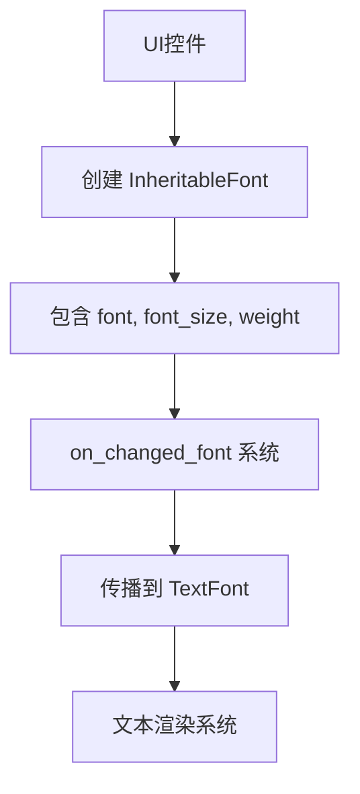

+++
title = "#23205 Add font weight to `InheritableFont"
date = "2026-03-04T00:00:00"
draft = false
template = "pull_request_page.html"
in_search_index = false

[extra]
current_language = "zh-cn"
available_languages = {"en" = { name = "English", url = "/pull_request/bevy/2026-03/pr-23205-en-20260304" }, "zh-cn" = { name = "中文", url = "/pull_request/bevy/2026-03/pr-23205-zh-cn-20260304" }}
+++

# 标题
Add font weight to `InheritableFont`

## 基础信息
- **标题**: Add font weight to `InheritableFont`
- **PR链接**: https://github.com/bevyengine/bevy/pull/23205
- **作者**: nic96
- **状态**: 已合并
- **标签**: C-Feature, S-Ready-For-Final-Review, A-Text, X-Uncontroversial, D-Straightforward
- **创建时间**: 2026-03-03T18:52:28Z
- **合并时间**: 2026-03-04T22:54:17Z
- **合并者**: alice-i-cecile

## 描述翻译

### 目标

在使用可变字体(variable font)时，希望能够通过`InheritableFont`传播字体粗细(font weight)。

### 解决方案

- 在`InheritableFont`中添加`weight`字段

### 测试

我测试了使用可变字体传播字体粗细的功能：

```rust
commands.spawn((
    InheritableFont {
        font_size: 14.,
        font: font_handle.into(),
        weight: FontWeight::EXTRA_LIGHT,
    },
    children![(Text::new("Hello world"), ThemedText)],
));
```

## 这个PR的故事

### 问题和背景

这个PR解决了一个在Bevy UI系统中使用可变字体时遇到的限制问题。在游戏开发中，UI文本的样式管理很重要，特别是在支持现代字体功能如可变字体时。可变字体允许在一个字体文件中包含多个权重、宽度等变体，开发者可以通过调整数值来精确控制字体外观。

在PR之前的Bevy Feathers模块中，`InheritableFont`结构体用于定义可继承的字体样式，但它只支持字体和字体大小两个属性。这意味着虽然Bevy的文本系统已经支持字体粗细设置，但UI组件无法通过`InheritableFont`机制来传递这个属性。当开发者想要在UI层级结构中统一管理字体粗细时，就遇到了障碍。

### 解决方案

开发者的解决方案是直接扩展`InheritableFont`的数据结构，增加一个`weight`字段。这个方案很直接，因为：
1. `InheritableFont`的设计目的就是封装所有可继承的字体属性
2. Bevy的文本系统已经支持字体粗细
3. 只需要在现有传播机制中添加对新字段的处理

这种方法最小化了对现有代码的改动，同时完整地支持了可变字体的权重特性。

### 实现细节

核心改动在`font_styles.rs`文件中，`InheritableFont`结构体新增了`weight`字段：

```rust
#[derive(Component, Debug, Clone, Reflect)]
#[reflect(Component, Default)]
pub struct InheritableFont {
    /// The desired font.
    pub font: HandleOrPath<Font>,
    /// The desired font size.
    pub font_size: FontSize,
    /// The desired font weight.
    pub weight: FontWeight,
}
```

同时更新了相关的构造函数，为`weight`字段提供默认值`FontWeight::NORMAL`。这样既保持了向后兼容性，又为新功能提供了合理的默认值。

字体变更传播系统(`on_changed_font`)也相应更新，确保新的`weight`字段能正确传播到子元素：

```rust
commands.entity(insert.entity).insert(Propagate(TextFont {
    font: font.into(),
    font_size: style.font_size,
    weight: style.weight,
    ..Default::default()
}));
```

这个系统监听`InheritableFont`组件的变化，当检测到变化时，将其中的字体属性(包括新的权重)传播到子元素的`TextFont`组件中。

UI控件文件中的改动主要是为了保持一致性。四个控件文件(button.rs, checkbox.rs, radio.rs, slider.rs)在创建`InheritableFont`实例时都添加了`weight: FontWeight::NORMAL`。这确保这些控件在默认情况下能正常工作，同时为开发者提供了在需要时覆盖默认值的能力。

### 技术洞察

这个PR展示了一个常见的框架扩展模式：当底层系统已经支持某个功能时，UI抽象层需要相应扩展以暴露这个功能。`InheritableFont`作为字体属性的容器，应该包含所有可通过继承传播的字体属性。

架构上值得注意的一点是，`InheritableFont`使用了`HandleOrPath<Font>`类型来处理字体资源，这允许通过句柄或路径字符串引用字体。新增的`weight`字段与这个设计兼容，因为字体粗细是独立于字体资源的样式属性。

从API设计角度看，这个改动是向后兼容的。新增字段有默认值，现有代码不需要修改。同时，`FontWeight`类型来自`bevy_text`模块，保持了依赖关系的清晰。

### 影响

这个改动虽然小，但对UI开发体验有实际提升。现在开发者可以：
1. 在UI层级结构中统一管理字体粗细
2. 充分利用可变字体的特性
3. 创建更丰富、更专业的UI文本样式

代码改动范围有限，主要影响UI控件的默认样式和字体继承机制。由于是简单的数据结构扩展，性能影响可以忽略不计。

## 可视化关系



## 关键文件变更

1. **crates/bevy_feathers/src/font_styles.rs** (+6/-1)
   - 主要变更：在`InheritableFont`结构体中添加`weight: FontWeight`字段
   - 相关代码：
   ```rust
   // 结构体定义
   pub struct InheritableFont {
       pub font: HandleOrPath<Font>,
       pub font_size: FontSize,
       pub weight: FontWeight, // 新增字段
   }
   
   // 构造函数更新
   pub fn new(handle: Handle<Font>) -> Self {
       Self {
           font: HandleOrPath::Handle(handle),
           font_size: FontSize::Px(16.0),
           weight: FontWeight::NORMAL, // 设置默认值
       }
   }
   ```

2. **crates/bevy_feathers/src/controls/button.rs** (+2/-1)
   - 变更：在按钮的`InheritableFont`初始化中添加`weight: FontWeight::NORMAL`
   - 代码：
   ```rust
   InheritableFont {
       font: HandleOrPath::Path(fonts::REGULAR.to_owned()),
       font_size: FontSize::Px(14.0),
       weight: FontWeight::NORMAL, // 新增
   }
   ```

3. **crates/bevy_feathers/src/controls/checkbox.rs** (+2/-1)
   - 类似按钮的变更，确保复选框使用正确的默认字体权重

4. **crates/bevy_feathers/src/controls/radio.rs** (+2/-1)
   - 类似按钮的变更，确保单选按钮使用正确的默认字体权重

5. **crates/bevy_feathers/src/controls/slider.rs** (+2/-1)
   - 类似按钮的变更，确保滑块使用正确的默认字体权重

## 扩展阅读

- [Bevy UI系统文档](https://docs.rs/bevy_ui/latest/bevy_ui/)
- [可变字体介绍(MDN)](https://developer.mozilla.org/en-US/docs/Web/CSS/CSS_fonts/Variable_fonts_guide)
- [Bevy文本模块源码](https://github.com/bevyengine/bevy/tree/main/crates/bevy_text)

# 完整代码差异
由于PR描述中已提供完整的代码差异，这里不再重复。