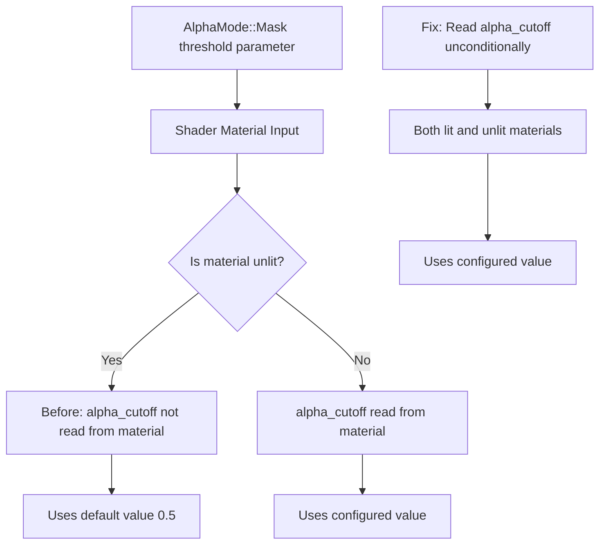

+++
title = "#23206 Fix `AlphaMode::Mask` threshold being ignored on unlit materials"
date = "2026-03-04T00:00:00"
draft = false
template = "pull_request_page.html"
in_search_index = true

[taxonomies]
list_display = ["show"]

[extra]
current_language = "en"
available_languages = {"en" = { name = "English", url = "/pull_request/bevy/2026-03/pr-23206-en-20260304" }, "zh-cn" = { name = "中文", url = "/pull_request/bevy/2026-03/pr-23206-zh-cn-20260304" }}
labels = ["C-Bug", "A-Rendering"]
+++

# Title
Fix `AlphaMode::Mask` threshold being ignored on unlit materials

## Basic Information
- **Title**: Fix `AlphaMode::Mask` threshold being ignored on unlit materials
- **PR Link**: https://github.com/bevyengine/bevy/pull/23206
- **Author**: doceazedo
- **Status**: MERGED
- **Labels**: C-Bug, A-Rendering, S-Ready-For-Final-Review
- **Created**: 2026-03-03T19:25:16Z
- **Merged**: 2026-03-04T08:00:58Z
- **Merged By**: alice-i-cecile

## Description Translation
**Objective**
I noticed that changing the `AlphaMode::Mask` threshold value had no effect on my material. Looking into the PBR shaders, I found out it was only reading the `alpha_cutoff` for lit materials, alongside lighting-related properties.

For unlit materials, it was fallbacking to the [0.5 default](https://github.com/bevyengine/bevy/blob/main/crates/bevy_pbr/src/render/pbr_types.wgsl#L86).

**Solution**
Moved the `alpha_cutoff` read out of the lit-only block.

**Testing**
The transparency_3d example has an unlit sphere with `AlphaMode::Mask`. I changed its threshold from 0.5 to 0.1 so the difference is visible (see below).

_I wasn't sure if I should include the example changes, but I think it might be good to show off the Mask mode in general._

---

**Showcase**
Both examples below have the left unlit sphere with `AlphaMose::Mask(0.1)`. Before the fix, the unlit sphere appears at the same time at the lit sphere (because it's fallbacking to 0.5). After the fix, the unlit sphere appears much earlier.

**Before:**
https://github.com/user-attachments/assets/6a8cb76f-507f-45e2-aa79-72ab7e019760

**After:**
https://github.com/user-attachments/assets/875d6587-40ae-4eda-b245-eda1e94656ce

## The Story of This Pull Request

The developer noticed a bug where the `AlphaMode::Mask` threshold parameter wasn't working correctly for unlit materials in Bevy's rendering system. When they set a custom alpha cutoff value on an unlit material with mask transparency, the rendered result ignored their setting and defaulted to 0.5 instead.

The root cause was in the WGSL shader code handling material properties. In Bevy's PBR (Physically Based Rendering) pipeline, materials can be either "lit" (affected by lighting) or "unlit" (displaying base colors without lighting calculations). The shader was structured to read certain material properties only when processing lit materials, assuming unlit materials wouldn't need them. However, `alpha_cutoff` is needed for both lit and unlit materials when using `AlphaMode::Mask`.

Looking at the shader code before the fix, the `alpha_cutoff` property was being read and assigned inside a conditional block that only executed for lit materials. The condition checked whether the material had the `UNLIT_BIT` flag set, and if it was unlit (flag set to 0), the code inside the block would run. This block included reading several lighting-related properties like `ior` (index of refraction), `attenuation_color`, `attenuation_distance`, and importantly, `alpha_cutoff`. For unlit materials, the `alpha_cutoff` would never be read from the material buffer, and the `pbr_input.material.alpha_cutoff` would retain whatever default value was set in the struct definition (which happened to be 0.5).

The fix involved a straightforward restructuring of the shader logic. Instead of reading `alpha_cutoff` conditionally inside the lit-materials block, the developer moved the read operations to occur unconditionally for all materials. They extracted the `alpha_cutoff` read to happen alongside other always-required material properties like `flags`, `base_color`, and `deferred_lighting_pass_id`. Then they assigned this value to `pbr_input.material.alpha_cutoff` immediately after setting the flags, before the lit/unlit conditional logic.

This change ensures that both lit and unlit materials properly receive their configured alpha cutoff values. The lighting-specific properties (`ior`, `attenuation_color`, `attenuation_distance`) remain inside the conditional block since they're only relevant for lit materials.

The developer also updated the transparency example to demonstrate the fix. They changed the unlit sphere's alpha cutoff from 0.5 to 0.1, making the difference clearly visible: with the fix, the sphere appears much earlier (at 10% opacity threshold) instead of at the default 50% threshold.

## Visual Representation



## Key Files Changed

**1. `crates/bevy_pbr/src/render/pbr_fragment.wgsl` (+3/-3)**
This is the main shader file where the bug was located. The changes restructure how the `alpha_cutoff` value is read from material data.

```wgsl
// File: crates/bevy_pbr/src/render/pbr_fragment.wgsl
// Before (inside pbr_input_from_standard_material function):
#ifdef BINDLESS
    let flags = pbr_bindings::material_array[material_indices[slot].material].flags;
    let base_color = pbr_bindings::material_array[material_indices[slot].material].base_color;
    let deferred_lighting_pass_id =
        pbr_bindings::material_array[material_indices[slot].material].deferred_lighting_pass_id;
#else   // BINDLESS
    let flags = pbr_bindings::material.flags;
    let base_color = pbr_bindings::material.base_color;
    let deferred_lighting_pass_id = pbr_bindings::material.deferred_lighting_pass_id;
#endif

// ... Later in the same function, inside the lit materials block:
if ((flags & pbr_types::STANDARD_MATERIAL_FLAGS_UNLIT_BIT) == 0u) {
#ifdef BINDLESS
    // ... other properties
    pbr_input.material.alpha_cutoff =
            pbr_bindings::material_array[material_indices[slot].material].alpha_cutoff;
#else   // BINDLESS
    // ... other properties
    pbr_input.material.alpha_cutoff = pbr_bindings::material.alpha_cutoff;
#endif  // BINDLESS
}

// After:
#ifdef BINDLESS
    let flags = pbr_bindings::material_array[material_indices[slot].material].flags;
    let base_color = pbr_bindings::material_array[material_indices[slot].material].base_color;
    let deferred_lighting_pass_id =
        pbr_bindings::material_array[material_indices[slot].material].deferred_lighting_pass_id;
    let alpha_cutoff = pbr_bindings::material_array[material_indices[slot].material].alpha_cutoff;
#else   // BINDLESS
    let flags = pbr_bindings::material.flags;
    let base_color = pbr_bindings::material.base_color;
    let deferred_lighting_pass_id = pbr_bindings::material.deferred_lighting_pass_id;
    let alpha_cutoff = pbr_bindings::material.alpha_cutoff;
#endif

// ... Later, unconditionally for all materials:
pbr_input.material.flags = flags;
pbr_input.material.alpha_cutoff = alpha_cutoff;

// The lit materials block no longer contains alpha_cutoff assignment
```

**2. `examples/3d/transparency_3d.rs` (+1/-1)**
The example file was modified to demonstrate the fix by changing the alpha cutoff threshold from 0.5 to 0.1 for an unlit sphere.

```rust
// File: examples/3d/transparency_3d.rs
// Before:
MeshMaterial3d(materials.add(StandardMaterial {
    base_color: Color::srgba(0.2, 0.7, 0.1, 0.0),
    alpha_mode: AlphaMode::Mask(0.5),
    unlit: true,
    ..default()
})),

// After:
MeshMaterial3d(materials.add(StandardMaterial {
    base_color: Color::srgba(0.2, 0.7, 0.1, 0.0),
    alpha_mode: AlphaMode::Mask(0.1),
    unlit: true,
    ..default()
})),
```

## Further Reading

1. **Bevy Alpha Modes Documentation**: Understanding the different alpha blending modes (Opaque, Mask, Blend, Premultiplied) in Bevy's rendering system.

2. **WGSL (WebGPU Shading Language)**: The shader language used by Bevy for cross-platform graphics. Understanding WGSL's syntax and structure helps when working with Bevy's rendering pipeline.

3. **Physically Based Rendering (PBR)**: The rendering model Bevy uses for realistic lighting calculations. Understanding PBR helps contextualize why certain material properties are grouped together.

4. **Bevy Material System**: How Bevy handles materials, including the distinction between lit and unlit materials and how material properties are passed to shaders.

5. **Alpha Testing and Masking**: The graphics technique of discarding pixels based on alpha threshold, which is what `AlphaMode::Mask` implements. This is different from alpha blending and has different performance characteristics.