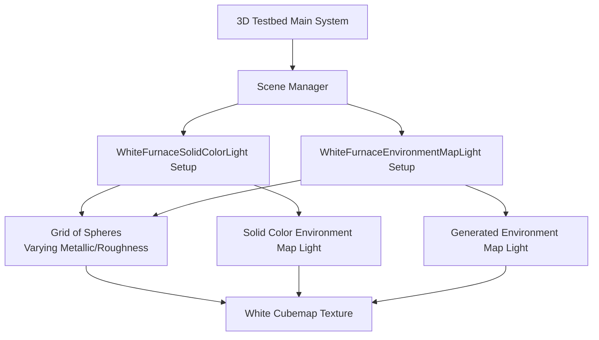

+++
title = "#23207 move white furnace to the 3d testbed"
date = "2026-03-04T00:00:00"
draft = false
template = "pull_request_page.html"
in_search_index = true

[taxonomies]
list_display = ["show"]

[extra]
current_language = "en"
available_languages = {"en" = { name = "English", url = "/pull_request/bevy/2026-03/pr-23207-en-20260304" }, "zh-cn" = { name = "中文", url = "/pull_request/bevy/2026-03/pr-23207-zh-cn-20260304" }}
labels = ["A-Rendering", "C-Testing"]
+++

# Title

## Basic Information
- **Title**: move white furnace to the 3d testbed
- **PR Link**: https://github.com/bevyengine/bevy/pull/23207
- **Author**: mockersf
- **Status**: MERGED
- **Labels**: A-Rendering, S-Ready-For-Final-Review, C-Testing
- **Created**: 2026-03-03T19:26:11Z
- **Merged**: 2026-03-04T04:21:59Z
- **Merged By**: alice-i-cecile

## Description Translation
**Objective**

- https://github.com/bevyengine/bevy/pull/22584 added a white furnace test, but it was not setup as a testbed
- Fixes #23202

**Solution**

- Add it to the 3d testbed

## The Story of This Pull Request

This PR addresses a straightforward organizational issue in the Bevy game engine's example codebase. The white furnace test, which had been introduced in a previous PR (#22584), existed as a standalone example rather than being integrated into the 3D testbed system. This created a maintenance burden and inconsistent user experience.

The problem was that developers working with Bevy's Physically Based Rendering (PBR) system needed a way to validate material energy conservation using a white furnace test, but this test wasn't easily discoverable or comparable with other rendering examples. The white furnace test is a standard graphics technique where materials are rendered under pure white uniform lighting - if the materials are physically correct, they should appear white regardless of their roughness or metallic properties.

The solution involved refactoring the existing standalone white furnace example into the established 3D testbed architecture. Instead of maintaining a separate application with its own build configuration and input handling, the functionality was split into two discrete testbed scenes that follow the same patterns as existing examples.

The implementation required several coordinated changes. First, the testbed's scene enumeration was extended with two new variants: `WhiteFurnaceSolidColorLight` and `WhiteFurnaceEnvironmentMapLight`. These represent the two lighting methods the original example allowed users to toggle between. The scene cycling logic was updated to include these new scenes in the navigation order.

The core technical work involved extracting the setup code from the original example and adapting it to the testbed's pattern. Each scene gets its own module with a `setup` function that's called when entering that scene. The key difference from the original implementation is that instead of using keyboard input to toggle between lighting methods at runtime, each lighting method now has its own dedicated scene that users navigate to using the testbed's scene switching mechanism.

Both modules share the same fundamental structure: they create a grid of spheres with varying metallic and roughness values, set up a white environment map, configure the camera with appropriate projection and tonemapping settings, and ensure proper cleanup using the `DespawnOnExit` component. The main difference between the two scenes is the type of environment map light used - one uses a solid color light approximation, while the other uses a generated environment map from the white cubemap texture.

This refactoring demonstrates good software engineering practices in action. By consolidating related examples into a unified testbed structure, the Bevy team reduces code duplication, ensures consistent user experience, and simplifies maintenance. The testbed architecture provides built-in navigation, consistent camera controls, and automatic cleanup, which would otherwise need to be reimplemented in every standalone example.

From a technical perspective, the PR shows how to properly integrate complex rendering examples into Bevy's ECS (Entity Component System) architecture. The use of `DespawnOnExit` ensures that resources are properly cleaned up when switching scenes, preventing memory leaks and state pollution. The separation of concerns between scene setup and runtime systems follows Bevy's recommended patterns.

The impact of this change is primarily organizational, but it has practical benefits for both developers and users. Developers now have one less standalone example to maintain, and the white furnace test is more discoverable alongside other rendering examples. Users can easily compare the behavior of materials under different lighting conditions by navigating through the testbed scenes.

## Visual Representation



## Key Files Changed

### `examples/testbed/3d.rs` (+240/-1)
This file was modified to integrate the white furnace test into the existing 3D testbed system. The changes include adding two new scene types to the enum, updating the scene navigation order, and adding two new modules that handle the setup for each white furnace variant.

Key modifications:
```rust
// Added to the Scene enum
enum Scene {
    Light,
    Gltf,
    Animation,
    Gizmos,
    GltfCoordinateConversion,
    WhiteFurnaceSolidColorLight,  // New
    WhiteFurnaceEnvironmentMapLight,  // New
}

// Updated Next implementation to include the new scenes
impl Next for Scene {
    fn next(&self) -> Self {
        match self {
            Scene::Light => Scene::Gltf,
            Scene::Gltf => Scene::Animation,
            Scene::Animation => Scene::Gizmos,
            Scene::Gizmos => Scene::GltfCoordinateConversion,
            Scene::GltfCoordinateConversion => Scene::WhiteFurnaceSolidColorLight,
            Scene::WhiteFurnaceSolidColorLight => Scene::WhiteFurnaceEnvironmentMapLight,
            Scene::WhiteFurnaceEnvironmentMapLight => Scene::Light,
        }
    }
}

// Added setup system registrations
.add_systems(
    OnEnter(Scene::WhiteFurnaceSolidColorLight),
    white_furnace_solid_color_light::setup,
)
.add_systems(
    OnEnter(Scene::WhiteFurnaceEnvironmentMapLight),
    white_furnace_environment_map_light::setup,
)
```

### `examples/testbed/white_furnace.rs` (+0/-213)
This file was completely removed since its functionality was integrated into the 3D testbed. The original standalone example had keyboard-based toggling between lighting modes, which was refactored into separate testbed scenes.

### `Cargo.toml` (+0/-8)
The example configuration for the standalone white furnace test was removed since it's no longer needed as a separate executable.

## Further Reading

1. **Physically Based Rendering (PBR) Theory**: Understanding the energy conservation principles that white furnace tests validate
2. **Bevy Testbed Architecture**: How Bevy organizes examples into testbeds for better developer experience
3. **Environment Mapping Techniques**: Difference between solid color environment lights and generated environment map lights
4. **High Dynamic Range (HDR) Rendering**: Why the example uses `Hdr` camera component and `Tonemapping::None`
5. **Bevy ECS Patterns**: Best practices for scene management and resource cleanup using components like `DespawnOnExit`