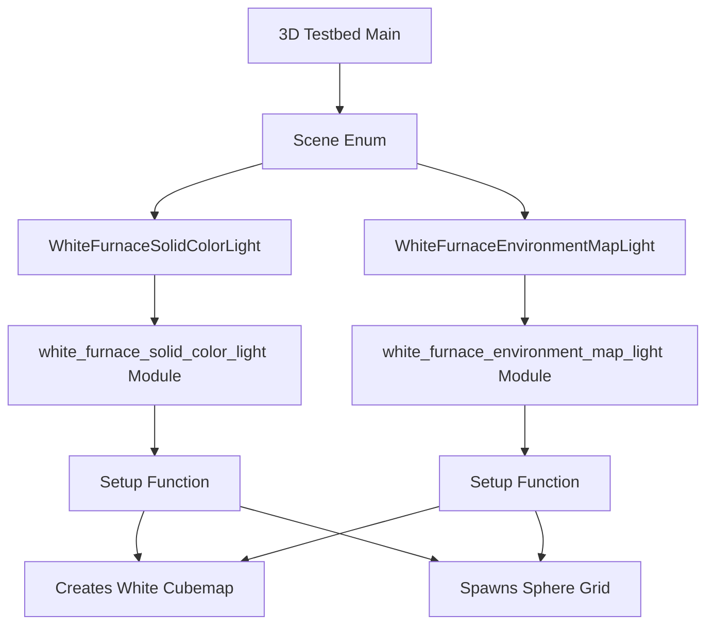

+++
title = "#23207 move white furnace to the 3d testbed"
date = "2026-03-04T00:00:00"
draft = false
template = "pull_request_page.html"
in_search_index = false

[extra]
current_language = "zh-cn"
available_languages = {"en" = { name = "English", url = "/pull_request/bevy/2026-03/pr-23207-en-20260304" }, "zh-cn" = { name = "中文", url = "/pull_request/bevy/2026-03/pr-23207-zh-cn-20260304" }}
labels = ["A-Rendering", "C-Testing"]
+++

# Title
move white furnace to the 3d testbed

## Basic Information
- **Title**: move white furnace to the 3d testbed
- **PR Link**: https://github.com/bevyengine/bevy/pull/23207
- **Author**: mockersf
- **Status**: MERGED
- **Labels**: A-Rendering, S-Ready-For-Final-Review, C-Testing
- **Created**: 2026-03-03T19:26:11Z
- **Merged**: 2026-03-04T04:21:59Z
- **Merged By**: alice-i-cecile

## Description Translation
目标

- https://github.com/bevyengine/bevy/pull/22584 添加了一个白色炉测试，但它没有设置为测试台
- 修复 #23202

解决方案

- 将其添加到3D测试台

## The Story of This Pull Request

这是一个关于代码组织重构的技术变更，主要目的是将独立的白色炉测试示例整合到BeV引擎的3D测试台框架中。

问题始于之前的PR #22584，该PR添加了一个白色炉测试用于验证PBR（Physically Based Rendering）材质在纯白环境光下的表现。白色炉测试是图形渲染中的一个标准测试方法，用于确保材质在不同光照条件下能正确保持能量守恒（energy conservation）。然而，这个测试当时被实现为一个独立的示例，而不是集成到现有的3D测试台系统中。

这种做法存在几个实际问题。首先，维护独立的测试示例会增加代码重复和管理成本。在BeV中，3D测试台已经提供了一个统一的场景切换和测试框架，包含Gizmos、灯光、动画等多个场景。其次，用户需要通过不同的命令行参数来运行不同的测试示例，而不是在一个统一的界面中浏览所有相关测试。最后，独立的示例可能缺乏测试台提供的某些标准化功能。

开发者面临的技术约束是需要在保持原有功能完整性的同时，将代码无缝集成到现有架构中。这需要理解3D测试台的工作机制，特别是它的场景管理系统和组件生命周期管理。

解决方案采取了直接的代码迁移和重构策略。开发者决定将原有的`white_furnace.rs`示例拆分为两个独立的场景：`WhiteFurnaceSolidColorLight`和`WhiteFurnaceEnvironmentMapLight`，并将它们添加到3D测试台的场景枚举中。这种拆分符合测试台的设计模式，每个场景对应一个特定的测试用例。

从实现角度看，开发者创建了两个新的模块：`white_furnace_solid_color_light`和`white_furnace_environment_map_light`，每个模块都导出一个`setup`函数。这些函数与测试台的其他场景设置函数采用相同的模式。关键的工程决策包括：

1. 移除了原始的键盘切换功能，改为使用测试台的标准场景切换机制（通过箭头键遍历所有场景）
2. 保持原有的材质参数变化网格不变，在X轴变化perceptual roughness，在Y轴变化metallic
3. 使用相同的纯白立方体贴图生成逻辑
4. 为每个场景添加`DespawnOnExit`组件以确保正确的资源清理

在技术细节上，`create_white_cubemap`函数展示了如何手动创建纯白的环境贴图。它使用16位浮点纹理格式（TextureFormat::Rgba16Float），并生成6个面的立方体贴图数据。这种方法避免了从文件加载，直接在内存中创建测试所需的环境贴图。

```rust
const WHITE_F16: [u8; 2] = [0, 60];
const WHITE_PIXEL: [u8; 8] = [
    WHITE_F16[0], WHITE_F16[1], // R
    WHITE_F16[0], WHITE_F16[1], // G
    WHITE_F16[0], WHITE_F16[1], // B
    WHITE_F16[0], WHITE_F16[1], // A
];
```

这段代码显示了16位浮点数1.0的二进制表示（小端序）。在f16格式中，[0, 60]对应十六进制的0x3C00，即十进制1.0。

集成的另一个重要方面是更新场景切换逻辑。在`Scene`枚举中添加了两个新变体，并在`Next` trait实现中更新了场景顺序，确保用户可以通过测试台的导航功能访问这些新场景。

从架构角度看，这个变化强化了BeV测试框架的一致性原则。所有3D测试现在都通过同一个入口点运行，共享相同的UI控件和场景管理逻辑。这降低了新贡献者的学习曲线，因为他们只需要了解一个测试框架而不是多个独立的示例。

值得注意的是，原来的独立示例包含了通过按1和2键在两种光照模式间切换的功能。在新的集成版本中，这个功能被移除了，因为测试台的设计是每个场景代表一个特定的测试配置。如果需要在不同光照条件下比较效果，用户可以在两个独立的场景间切换。

这种重构带来的主要技术效益包括：
1. 减少了代码重复：移除了独立的示例文件和相关Cargo.toml配置
2. 提高了可发现性：所有3D测试现在都在同一个测试台中
3. 统一了资源管理：使用测试台的标准`DespawnOnExit`机制清理场景实体
4. 简化了构建系统：减少了需要编译的独立示例数量

从测试方法论角度看，将白色炉测试整合到标准测试台中，使得它更容易被纳入自动化测试流程。测试台框架提供了更结构化的方式来运行和验证渲染测试。

这个PR展示了良好的代码重构实践：保持功能不变，改进代码组织结构，遵循现有的设计模式，并简化系统架构。它解决了技术债（technical debt）问题，使代码库更加一致和可维护。

## Visual Representation



## Key Files Changed

### `examples/testbed/3d.rs` (+240/-1)

这个文件是3D测试台的主文件，主要变化是添加了两个新的白色炉测试场景。

**关键修改1：场景枚举扩展**
```rust
enum Scene {
    Light,
    Shadow,
    Pbr,
    Gltf,
    Animation,
    Gizmos,
    GltfCoordinateConversion,
    WhiteFurnaceSolidColorLight,      // 新增
    WhiteFurnaceEnvironmentMapLight,  // 新增
}
```

**关键修改2：场景切换顺序更新**
```rust
impl Next for Scene {
    fn next(&self) -> Self {
        match self {
            Scene::Light => Scene::Shadow,
            // ... 其他场景
            Scene::GltfCoordinateConversion => Scene::WhiteFurnaceSolidColorLight,
            Scene::WhiteFurnaceSolidColorLight => Scene::WhiteFurnaceEnvironmentMapLight,
            Scene::WhiteFurnaceEnvironmentMapLight => Scene::Light,
        }
    }
}
```

**关键修改3：场景设置系统注册**
```rust
.add_systems(
    OnEnter(Scene::WhiteFurnaceSolidColorLight),
    white_furnace_solid_color_light::setup,
)
.add_systems(
    OnEnter(Scene::WhiteFurnaceEnvironmentMapLight),
    white_furnace_environment_map_light::setup,
)
```

**关键修改4：新增白色炉测试模块**
添加了两个完整的新模块，每个约100行代码，包含创建白色立方体贴图和生成测试球体网格的逻辑。

### `examples/testbed/white_furnace.rs` (+0/-213)

这个文件被完全删除，因为它的功能已经被整合到`3d.rs`中。

**删除的内容包括：**
- 独立的main函数和应用设置
- 键盘切换光照模式的功能
- UI标签和说明文本
- 独立的环境配置结构体

### `Cargo.toml` (+0/-8)

从Cargo.toml中移除了独立示例的配置：
```toml
# 删除的配置
[[example]]
name = "testbed_white_furnace"
path = "examples/testbed/white_furnace.rs"
doc-scrape-examples = true

[package.metadata.example.testbed_white_furnace]
hidden = true
```

## Further Reading

1. **Physically Based Rendering (PBR)**: 了解PBR渲染理论和能量守恒原理
2. **White Furnace Test**: 图形渲染中用于验证材质正确性的标准测试方法
3. **Bevy ECS and Scene Management**: Bevy引擎的实体组件系统架构和场景管理机制
4. **Environment Mapping**: 环境贴图技术及其在实时渲染中的应用
5. **HDR Rendering**: 高动态范围渲染和色调映射技术