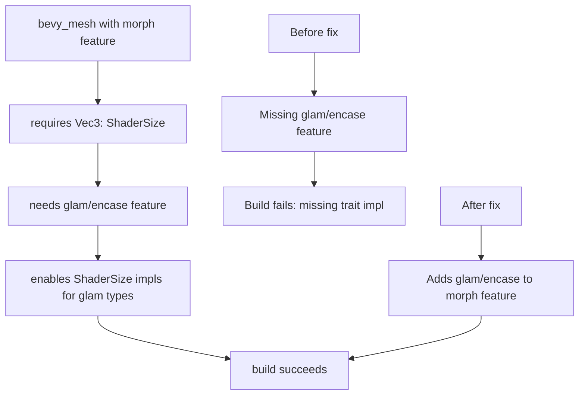

+++
title = "#23209 enable glam/encase when building bevy_mesh/morph"
date = "2026-03-04T00:00:00"
draft = false
template = "pull_request_page.html"
in_search_index = true

[taxonomies]
list_display = ["show"]

[extra]
current_language = "en"
available_languages = {"en" = { name = "English", url = "/pull_request/bevy/2026-03/pr-23209-en-20260304" }, "zh-cn" = { name = "中文", url = "/pull_request/bevy/2026-03/pr-23209-zh-cn-20260304" }}
labels = ["C-Bug", "D-Trivial", "A-Rendering"]
+++

# enable glam/encase when building bevy_mesh/morph

## Basic Information
- **Title**: enable glam/encase when building bevy_mesh/morph
- **PR Link**: https://github.com/bevyengine/bevy/pull/23209
- **Author**: mockersf
- **Status**: MERGED
- **Labels**: C-Bug, D-Trivial, A-Rendering, S-Ready-For-Final-Review
- **Created**: 2026-03-03T22:03:30Z
- **Merged**: 2026-03-04T04:20:23Z
- **Merged By**: alice-i-cecile

## Description Translation
**Objective**

- bevy_mesh fails to build with feature morph
```
error[E0277]: the trait bound `bevy_math::Vec3: ShaderSize` is not satisfied
   --> crates/bevy_mesh/src/morph.rs:142:17
    |
142 |     pub normal: Vec3,
    |                 ^^^^ the trait `ShaderSize` is not implemented for `bevy_math::Vec3`
    |
    = help: the following other types implement trait `ShaderSize`:
              &T
              &mut T
              Arc<T>
              ArrayLength
              AtomicI32
              AtomicU32
              Box<T>
              Cell<T>
            and 12 others
note: required by a bound in `morph::_::{closure#0}::check::assert_impl`
```

**Solution**

- add glam/encase as a dependency to the morph feature

**Testing**

- `cargo build --package bevy_mesh --features morph`

## The Story of This Pull Request

This pull request addresses a straightforward but critical build failure in the Bevy engine's mesh system. The issue manifested when attempting to build the `bevy_mesh` crate with the `morph` feature enabled. The Rust compiler reported that `bevy_math::Vec3` did not implement the `ShaderSize` trait, which is required for certain operations in the morph system.

The problem occurred because the `morph` module within `bevy_mesh` uses `Vec3` types that need to implement the `ShaderSize` trait from the `encase` crate. However, the `glam` crate's `encase` feature was not being activated when the `morph` feature was enabled, even though the `encase` crate itself was already a dependency of `bevy_mesh`.

The solution was simple and direct: modify the Cargo.toml file to ensure that when the `morph` feature is enabled, it also activates the `encase` feature on the `glam` dependency. This ensures that the `ShaderSize` trait implementations for `glam` types (including `Vec3`) are compiled and available.

The technical context here involves Rust's feature system and how it interacts with trait implementations. The `encase` crate provides the `ShaderSize` trait, and `glam` provides implementations of this trait for its vector types, but only when the `encase` feature is enabled on the `glam` crate. Without this feature flag, the trait implementations are not compiled, leading to the build error.

The fix demonstrates a common pattern in Rust ecosystem development: when a crate depends on certain trait implementations from another crate, it must ensure the appropriate feature flags are activated to make those implementations available. This is particularly important in Bevy's architecture, where various subsystems may have different dependency requirements based on which features are enabled.

The change is minimal and focused, addressing exactly the issue at hand without introducing unnecessary dependencies or complexity. The testing approach is equally straightforward: verifying that the build succeeds with the previously failing configuration.

## Visual Representation



## Key Files Changed

**crates/bevy_mesh/Cargo.toml** (+2/-1)

This file defines the dependencies and features for the `bevy_mesh` crate. The change ensures that when the `morph` feature is enabled, the `encase` feature is also enabled on the `glam` dependency.

1. **What changed**: The `glam` dependency was added with the `optional` flag, and the `morph` feature was updated to include `glam/encase`.

2. **Code changes**:

```toml
# File: crates/bevy_mesh/Cargo.toml
# Before:
[features]
default = []
morph = ["dep:bevy_image"]

# After:
[features]
default = []
morph = ["dep:bevy_image", "glam/encase"]

# Also added to dependencies:
glam = { version = "0.32.0", default-features = false, optional = true }
```

3. **How it relates to the PR purpose**: The build failure occurred because the `morph` feature code required `ShaderSize` implementations for `glam` types, which are only available when `glam` is compiled with the `encase` feature. By adding `glam/encase` to the `morph` feature, we ensure these implementations are present when needed.

## Further Reading

1. **Rust Features Documentation**: https://doc.rust-lang.org/cargo/reference/features.html
2. **Encase crate documentation**: https://docs.rs/encase/latest/encase/
3. **Glam crate features**: https://docs.rs/glam/latest/glam/#features
4. **Bevy's Feature Flags**: https://bevyengine.org/learn/book/getting-started/features/