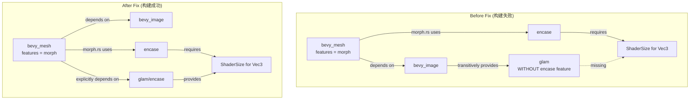

+++
title = "#23209 enable glam/encase when building bevy_mesh/morph"
date = "2026-03-04T00:00:00"
draft = false
template = "pull_request_page.html"
in_search_index = false

[extra]
current_language = "zh-cn"
available_languages = {"en" = { name = "English", url = "/pull_request/bevy/2026-03/pr-23209-en-20260304" }, "zh-cn" = { name = "中文", url = "/pull_request/bevy/2026-03/pr-23209-zh-cn-20260304" }}
labels = ["C-Bug", "D-Trivial", "A-Rendering"]
+++

# Title

## Basic Information
- **Title**: enable glam/encase when building bevy_mesh/morph
- **PR Link**: https://github.com/bevyengine/bevy/pull/23209
- **Author**: mockersf
- **Status**: MERGED
- **Labels**: C-Bug, D-Trivial, A-Rendering, S-Ready-For-Final-Review
- **Created**: 2026-03-03T22:03:30Z
- **Merged**: 2026-03-04T04:20:23Z
- **Merged By**: alice-i-cecile

## Description Translation

# Objective（目标）

- 在启用 `morph` 特性时，`bevy_mesh` 构建失败。
```
error[E0277]: the trait bound `bevy_math::Vec3: ShaderSize` is not satisfied
   --> crates/bevy_mesh/src/morph.rs:142:17
    |
142 |     pub normal: Vec3,
    |                 ^^^^ the trait `ShaderSize` is not implemented for `bevy_math::Vec3`
    |
    = help: the following other types implement trait `ShaderSize`:
              &T
              &mut T
              Arc<T>
              ArrayLength
              AtomicI32
              AtomicU32
              Box<T>
              Cell<T>
            and 12 others
note: required by a bound in `morph::_::{closure#0}::check::assert_impl`
```

## Solution（解决方案）

- 将 `glam/encase` 作为依赖添加到 `morph` 特性中。

## Testing（测试）

- 执行 `cargo build --package bevy_mesh --features morph`

## The Story of This Pull Request

这个PR解决了一个由条件编译和特性依赖导致的直接编译错误。问题出现在 `bevy_mesh` crate 的 `morph` 模块中。该模块使用 `encase` 库为GLSL着色器接口块（Shader Interface Block）生成数据，这需要其内部结构体成员（例如 `Vec3`）实现 `ShaderSize` 这个 trait。

在Rust的 `glam` 数学库中，`encase` 相关的实现（包括 `ShaderSize`）是通过一个可选的 Cargo feature 启用的，通常命名为 `encase`。`bevy_math` crate 在依赖 `glam` 时，已经正确地启用了这个 `encase` 特性，确保在主要代码路径中 `bevy_math::Vec3` 拥有所需的 trait 实现。

然而，`bevy_mesh` crate 的 `morph` 特性配置出现了疏漏。当用户通过 `--features morph` 单独构建 `bevy_mesh` 时，构建系统会激活 `morph` 特性。根据 `Cargo.toml` 的原有配置，这个特性只声明了 `dep:bevy_image` 依赖。这意味着，在此构建场景下，代码所依赖的 `glam` 类型（如 `Vec3`）并非来自已正确配置的 `bevy_math` 的重新导出，而是可能来自其他传递依赖引入的一个 *未启用 `encase` 特性* 的 `glam` 版本。因此，`encase` 库无法为这个“纯净版”的 `Vec3` 找到 `ShaderSize` 实现，导致了上述编译错误。

解决方案直截了当，符合Rust Cargo特性依赖的常见模式。它需要在两个层面进行修正：
1.  **声明依赖**：首先，需要在 `[dependencies]` 部分将 `glam` 添加为一个可选的（`optional = true`）依赖项。这是控制特性激活的基础。
2.  **关联特性**：然后，在 `[features]` 部分修改 `morph` 特性的定义，使其在激活时，不仅引入 `bevy_image`，同时也要引入 `glam` 依赖，并且特别指明要启用 `glam` 自己的 `encase` 特性。语法 `"glam/encase"` 正是用来表达这种“依赖项+特性”的激活关系。

这个修改确保了在任何启用 `morph` 特性的构建场景下，所使用的 `glam` 库都必定启用了其 `encase` 特性，从而为 `Vec3` 等类型提供了 `ShaderSize` 实现，编译错误得以解决。这是一个典型的修复“隐式特性依赖”问题的例子，强调了在声明Cargo特性时，需要显式、完整地列出所有必要的依赖及其特定特性，即使某些依赖在默认构建或通过其他crate引入时看似可用。

## Visual Representation

该PR主要修复了 `Cargo.toml` 中的特性依赖关系。下图展示了修复前后，`bevy_mesh` crate 在激活 `morph` 特性时的依赖关系变化：



## Key Files Changed

**1. `crates/bevy_mesh/Cargo.toml`**

这是此PR中唯一修改的文件，修改内容精确地解决了特性依赖缺失的问题。

**修改1：添加 `glam` 为可选依赖**
```toml
# 在 [dependencies] 部分添加：
glam = { version = "0.32.0", default-features = false, optional = true }
```
*   **原因**：为了在 `morph` 特性中引用 `glam` 并激活其特定特性，首先必须将其声明为一个依赖。`optional = true` 使其成为一个可选依赖，只有在相关特性（这里是 `morph`）被启用时才会被引入，避免了在不需要时增加编译负担。

**修改2：在 `morph` 特性中激活 `glam/encase`**
```toml
# [features] 部分修改前：
morph = ["dep:bevy_image"]

# 修改后：
morph = ["dep:bevy_image", "glam/encase"]
```
*   **原因**：这是修复的核心。它明确声明：当 `morph` 特性启用时，必须同时引入 `glam` 依赖 **并** 启用其 `encase` 特性。`glam/encase` 的语法确保了传递进来的 `glam` 类型具备了 `encase` 库所需的 trait 实现（如 `ShaderSize`），从而满足 `morph.rs` 中代码的编译要求。

## Further Reading

1.  **Cargo Features Guide**: Rust官方文档中关于[特性](https://doc.rust-lang.org/cargo/reference/features.html)的章节，特别是关于“特性依赖”和“依赖项特性”的部分，是理解此类问题的基础。
2.  **`encase` Crate**: `encase` 库的[文档](https://docs.rs/encase)和其提供的派生宏（如 `#[derive(ShaderType)]`），解释了它如何用于生成与着色器匹配的内存布局。
3.  **Conditional Compilation in Rust**: 关于如何使用 `#[cfg(feature = "...")]` 进行条件编译的实践，这在大型项目（如游戏引擎）中管理可选功能时至关重要。
4.  **glam crate features**: 查看 `glam` 库的 [Cargo.toml](https://github.com/bitshifter/glam-rs/blob/main/Cargo.toml) 或其文档，可以了解它提供的各种可选特性（如 `serde`, `libm`, `rand` 以及本例中的 `encase`），这是理解第三方库特性配置的好例子。

# Full Code Diff
diff --git a/crates/bevy_mesh/Cargo.toml b/crates/bevy_mesh/Cargo.toml
index 23a2db39dbceb..54f02095622c9 100644
--- a/crates/bevy_mesh/Cargo.toml
+++ b/crates/bevy_mesh/Cargo.toml
@@ -37,6 +37,7 @@ thiserror = { version = "2", default-features = false }
 tracing = { version = "0.1", default-features = false, features = ["std"] }
 derive_more = { version = "2", default-features = false, features = ["from"] }
 encase = "0.12"
+glam = { version = "0.32.0", default-features = false, optional = true }
 
 [dev-dependencies]
 approx = "0.5"
@@ -46,7 +47,7 @@ serde_json = "1.0.140"
 default = []
 ## Adds serialization support through `serde`.
 serialize = ["dep:serde", "wgpu-types/serde"]
-morph = ["dep:bevy_image"]
+morph = ["dep:bevy_image", "glam/encase"]
 
 [lints]
 workspace = true