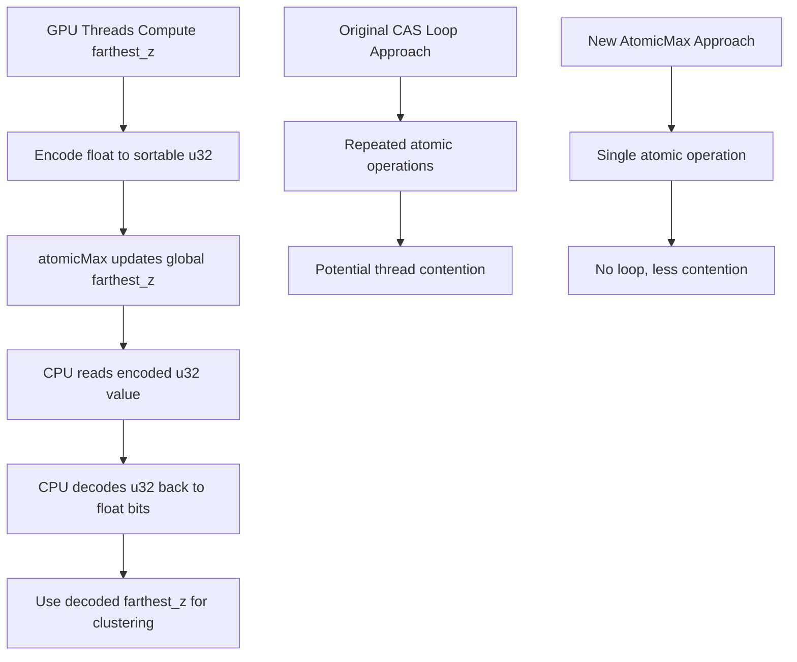

+++
title = "#23212 Don't use a CAS loop in gpu clustering"
date = "2026-03-04T00:00:00"
draft = false
template = "pull_request_page.html"
in_search_index = true

[taxonomies]
list_display = ["show"]

[extra]
current_language = "en"
available_languages = {"en" = { name = "English", url = "/pull_request/bevy/2026-03/pr-23212-en-20260304" }, "zh-cn" = { name = "中文", url = "/pull_request/bevy/2026-03/pr-23212-zh-cn-20260304" }}
labels = ["A-Rendering"]
+++

# Title

## Basic Information
- **Title**: Don't use a CAS loop in gpu clustering
- **PR Link**: https://github.com/bevyengine/bevy/pull/23212
- **Author**: atlv24
- **Status**: MERGED
- **Labels**: A-Rendering, S-Needs-Review
- **Created**: 2026-03-04T06:35:57Z
- **Merged**: 2026-03-04T08:49:27Z
- **Merged By**: mockersf

## Description Translation

# Objective

- CAS loop ugly, spotted this during review but held off to address it myself in a followup

## Solution

- encode into a u32 which preserves ordering before atomicMax, decode on cpu.

## Testing

- ran a few examples, they look fine.

## The Story of This Pull Request

This PR addresses a performance issue in Bevy's GPU clustering system by replacing a compare-and-swap (CAS) loop with a more efficient atomic maximum operation using bit manipulation. The problem was identified during code review but intentionally deferred for separate implementation to avoid disrupting the original PR.

The core issue involves updating a global `farthest_z` value across multiple GPU threads. WGSL, the shader language used in WebGPU, doesn't provide an `atomicMax` operation for floating-point values, only for integers. The original implementation worked around this limitation with a CAS loop:

```wgsl
var that_farthest_z = bitcast<f32>(atomicLoad(&cluster_metadata.farthest_z));
while (this_farthest_z > that_farthest_z) {
    let exchange_result = atomicCompareExchangeWeak(
        &cluster_metadata.farthest_z,
        bitcast<u32>(that_farthest_z),
        bitcast<u32>(this_farthest_z)
    );
    if (exchange_result.exchanged) {
        break;
    }
    that_farthest_z = bitcast<f32>(exchange_result.old_value);
}
```

While functional, this approach has several drawbacks. CAS loops can lead to thread contention, especially when many threads attempt to update the same value simultaneously. The loop structure also introduces control flow complexity and potential performance overhead from repeated atomic operations and branching.

The solution implements a clever bit manipulation technique to encode floating-point values into unsigned integers while preserving their total ordering. This allows using WGSL's `atomicMax` operation on the encoded integer values. The encoding function works by:

1. For positive floats: Setting the sign bit so they sort above negative floats
2. For negative floats: Flipping all bits to reverse their ordering (more negative values become smaller u32 values)

On the CPU side, a complementary decoding function reconstructs the original float bits from the encoded integer. This approach eliminates the CAS loop entirely, replacing it with a single atomic operation:

```wgsl
atomicMax(&cluster_metadata.farthest_z, f32_bits_to_sortable_u32(bitcast<u32>(shared_farthest_z[0u])));
```

The implementation required coordinated changes in both the shader code and the Rust host code. The `ClusterMetadata` struct needed to change its `farthest_z` field from `f32` to `u32` to store the encoded value. The CPU-side decoding function uses similar bit manipulation to reverse the encoding process.

This change demonstrates a common pattern in GPU programming: adapting algorithms to work within the constraints of GPU hardware and shader languages. By understanding both the mathematical properties of floating-point representation and the available atomic operations, the developer found an elegant solution that improves both code clarity and potential performance.

## Visual Representation



## Key Files Changed

### `crates/bevy_pbr/src/cluster/cluster_z_slice.wgsl` (+14/-16)

This shader file contains the GPU-side implementation of the farthest-z computation for clustering. The main change replaces a CAS loop with a single atomicMax operation using encoded float values.

**Key modifications:**
```wgsl
// Before: CAS loop for floating-point atomic maximum
let this_farthest_z = shared_farthest_z[0u];
var that_farthest_z = bitcast<f32>(atomicLoad(&cluster_metadata.farthest_z));
while (this_farthest_z > that_farthest_z) {
    let exchange_result = atomicCompareExchangeWeak(
        &cluster_metadata.farthest_z,
        bitcast<u32>(that_farthest_z),
        bitcast<u32>(this_farthest_z)
    );
    if (exchange_result.exchanged) {
        break;
    }
    that_farthest_z = bitcast<f32>(exchange_result.old_value);
}

// After: Single atomicMax with encoded integer
atomicMax(&cluster_metadata.farthest_z, f32_bits_to_sortable_u32(bitcast<u32>(shared_farthest_z[0u])));

// New helper function for float encoding
fn f32_bits_to_sortable_u32(bits: u32) -> u32 {
    let mask = bitcast<u32>(bitcast<i32>(bits) >> 31) | 0x80000000u;
    return bits ^ mask;
}
```

### `crates/bevy_pbr/src/cluster/gpu.rs` (+19/-3)

This Rust file handles the CPU-side coordination of GPU clustering, including reading back results from the GPU. Changes include updating the data structure to store encoded u32 values and adding the decoding function.

**Key modifications:**
```rust
// Before: farthest_z stored as f32
pub struct ClusterMetadata {
    farthest_z: f32,
}

// After: farthest_z stored as encoded u32
pub struct ClusterMetadata {
    /// This is a float encoded by `f32_bits_to_sortable_u32`. Decode with `sortable_u32_to_f32_bits`.
    farthest_z: u32,
}

// New decoding function
fn sortable_u32_to_f32_bits(bits: u32) -> u32 {
    let mask = (!((bits as i32) >> 31)) as u32 | 0x80000000;
    bits ^ mask
}

// Updated readback code
farthest_z: f32::from_bits(sortable_u32_to_f32_bits(
    gpu_clustering_metadata.farthest_z,
)),
```

## Further Reading

1. **WebGPU Shading Language (WGSL) Specification** - For understanding available atomic operations and their limitations: https://www.w3.org/TR/WGSL/

2. **IEEE 754 Floating-Point Standard** - For understanding floating-point bit representation: https://en.wikipedia.org/wiki/IEEE_754

3. **Atomic Operations in GPU Programming** - For context on GPU synchronization patterns: https://developer.nvidia.com/blog/gpu-pro-tip-cuda-7-atomic-operations/

4. **Bit Manipulation Techniques** - For understanding the encoding/decoding approach used: https://graphics.stanford.edu/~seander/bithacks.html

5. **Bevy Rendering Architecture** - For context on how clustering fits into Bevy's rendering pipeline: https://bevyengine.org/learn/book/getting-started/rendering/