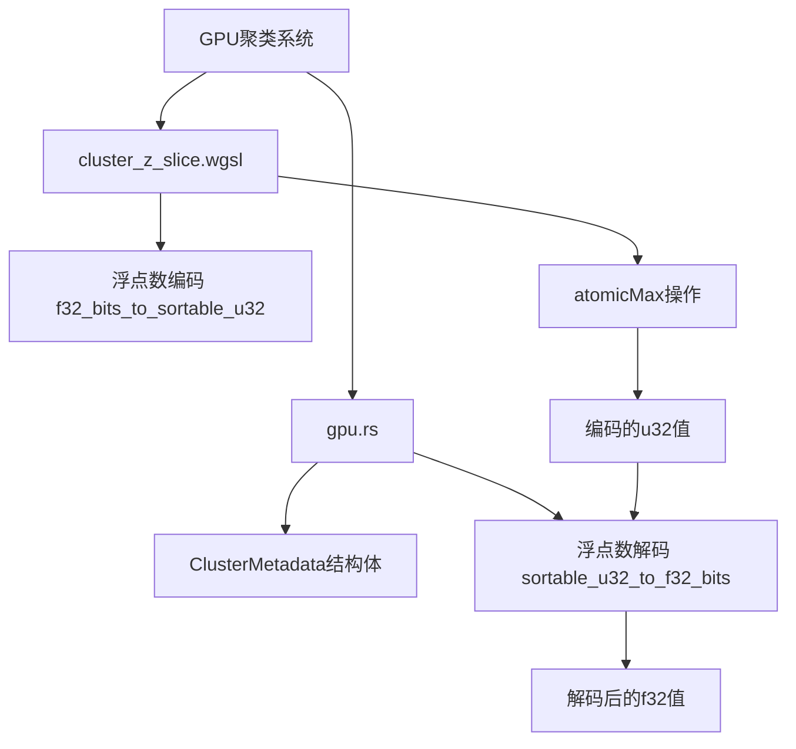

+++
title = "#23212 Don't use a CAS loop in gpu clustering"
date = "2026-03-04T00:00:00"
draft = false
template = "pull_request_page.html"
in_search_index = false

[extra]
current_language = "zh-cn"
available_languages = {"en" = { name = "English", url = "/pull_request/bevy/2026-03/pr-23212-en-20260304" }, "zh-cn" = { name = "中文", url = "/pull_request/bevy/2026-03/pr-23212-zh-cn-20260304" }}
+++

# Title

## Basic Information
- **Title**: Don't use a CAS loop in gpu clustering
- **PR Link**: https://github.com/bevyengine/bevy/pull/23212
- **作者**: atlv24
- **状态**: 已合并
- **标签**: A-Rendering, S-Needs-Review
- **创建时间**: 2026-03-04T06:35:57Z
- **合并时间**: 2026-03-04T08:49:27Z
- **合并者**: mockersf

## 描述翻译

### 目标
- CAS循环不太优雅，在review过程中发现了这个问题，但我决定后续自己解决

### 解决方案
- 将f32编码为保持顺序的u32，然后使用atomicMax，最后在CPU端解码

### 测试
- 运行了几个示例，看起来正常

## 这个Pull Request的故事

这个PR解决了一个GPU聚类（clustering）系统中原子操作的技术问题。在处理3D渲染中的光照聚类时，需要追踪每个视图（view）中最远的Z值，这个值在GPU上由多个工作组（workgroup）并行计算并需要原子更新。

在原始的WGSL实现中，开发者遇到了一个技术限制：WGSL没有针对浮点数的`atomicMax`原子操作。当时的解决方案是使用CAS（Compare-And-Swap）循环来模拟`atomicMax`的功能。代码中的注释说明了这一点："We don't have `atomicMax` for floats in WGSL, so we use CAS instead." 同时提到工作组数量不多，所以性能影响不会太大。

然而，CAS循环在代码中显得不够优雅，并且在理论上存在性能风险，因为多个线程可能反复尝试更新同一个值。开发者atlv24在review过程中注意到了这个问题，决定在后续提交中优化它。

解决方案的核心思路是：既然WGSL不支持浮点数的原子最大值操作，但支持整数的`atomicMax`，那么我们可以将浮点数编码为整数，使得整数的顺序与浮点数的顺序一致。具体来说，使用一种转换方法，让f32的位表示转换为u32，并且转换后的u32的排序与原始f32的排序保持一致。这样就能用整数的`atomicMax`来实现浮点数的原子最大值操作。

这种编码转换的关键在于处理浮点数的符号位。对于正浮点数，设置符号位为1（使其在u32表示中处于高位）；对于负浮点数，将所有位取反。这样编码后，u32的无符号排序就与f32的总序（total order）匹配了。

在CPU端，需要相应的解码函数将编码后的u32转换回原始的f32位表示。解码函数需要检查编码后的符号位（与原符号位相反），然后应用互补的掩码。

这个方案比CAS循环更简洁，减少了GPU上的原子操作竞争，理论上性能更好。代码的修改主要集中在两个文件：WGSL着色器文件中的原子操作实现和Rust代码中的数据结构定义和解码逻辑。

从实现角度看，这个PR展示了在GPU编程中处理硬件限制的常见模式：当缺少直接的原语支持时，通过巧妙的编码/解码方案来间接实现所需功能。这种模式在图形编程中很常见，特别是在处理不同精度或不同数据类型的原子操作时。

## 视觉表示



## 关键文件更改

### 1. `crates/bevy_pbr/src/cluster/cluster_z_slice.wgsl` (+14/-16)

**更改描述**: 移除了CAS循环，添加了浮点数到可排序u32的编码函数，并使用`atomicMax`代替原来的循环

**关键代码片段**:
```wgsl
// 之前:
// We don't have `atomicMax` for floats in WGSL, so we use CAS instead.
// Thankfully, we only have a few workgroups, so this shouldn't be terribly
// slow.
let this_farthest_z = shared_farthest_z[0u];
var that_farthest_z = bitcast<f32>(atomicLoad(&cluster_metadata.farthest_z));
while (this_farthest_z > that_farthest_z) {
    let exchange_result = atomicCompareExchangeWeak(
        &cluster_metadata.farthest_z,
        bitcast<u32>(that_farthest_z),
        bitcast<u32>(this_farthest_z)
    );
    if (exchange_result.exchanged) {
        break;
    }
    that_farthest_z = bitcast<f32>(exchange_result.old_value);
}

// 之后:
// WGSL has no `atomicMax` for floats, so we encode into a u32 that
// preserves float ordering and use integer `atomicMax` instead.
atomicMax(&cluster_metadata.farthest_z, f32_bits_to_sortable_u32(bitcast<u32>(shared_farthest_z[0u])));

// 新增的编码函数:
// Encodes f32 bits into a u32 whose unsigned ordering matches
// the float's total order. Positive floats get the sign bit set so they
// sort above negative floats; negative floats get all bits flipped so
// their ordering is reversed (more negative -> smaller u32).
//
// The CPU decodes with `sortable_u32_to_f32_bits` in `gpu.rs`.
fn f32_bits_to_sortable_u32(bits: u32) -> u32 {
    let mask = bitcast<u32>(bitcast<i32>(bits) >> 31) | 0x80000000u;
    return bits ^ mask;
}
```

**与PR目的的关系**: 这是实现的核心部分，将复杂的CAS循环替换为简单的`atomicMax`调用，通过编码函数解决了WGSL缺少浮点数原子最大值操作的问题。

### 2. `crates/bevy_pbr/src/cluster/gpu.rs` (+19/-3)

**更改描述**: 更新了数据结构中`farthest_z`字段的类型，添加了解码函数，并更新了读取该值的代码

**关键代码片段**:
```rust
// ClusterMetadata结构体字段类型变更:
// 之前:
farthest_z: f32,

// 之后:
/// This is a float encoded by `f32_bits_to_sortable_u32`. Decode with `sortable_u32_to_f32_bits`.
farthest_z: u32,

// 新增的解码函数:
/// Decodes a u32 produced by `f32_bits_to_sortable_u32` (in
/// `cluster_z_slice.wgsl`) back into f32 bits.
///
/// The encode flips the sign bit for positive floats and all bits for
/// negative floats, so the decode must inspect the *encoded* sign bit
/// (which is inverted relative to the original) and apply the
/// complementary mask.
fn sortable_u32_to_f32_bits(bits: u32) -> u32 {
    let mask = (!((bits as i32) >> 31)) as u32 | 0x80000000;
    bits ^ mask
}

// 读取farthest_z时的解码:
// 之前:
farthest_z: gpu_clustering_metadata.farthest_z,

// 之后:
farthest_z: f32::from_bits(sortable_u32_to_f32_bits(
    gpu_clustering_metadata.farthest_z,
)),
```

**与PR目的的关系**: 这些更改支持了WGSL端的编码方案，确保CPU端能正确解码GPU计算的结果，同时更新了数据结构的文档说明。

## 延伸阅读

1. **WGSL原子操作规范**: [WebGPU Shading Language - Atomic Operations](https://www.w3.org/TR/WGSL/#atomic-operations)
2. **浮点数编码技巧**: [Bit Twiddling Hacks - IEEE浮点数位操作](https://graphics.stanford.edu/~seander/bithacks.html)
3. **GPU原子操作最佳实践**: [GPU原子操作性能考虑](https://developer.nvidia.com/gpugems/gpugems3/part-vi-gpu-computing/chapter-39-parallel-prefix-sum-scan-cuda)
4. **Bevy渲染系统架构**: [Bevy渲染管线文档](https://bevyengine.org/learn/book/getting-started/rendering/)